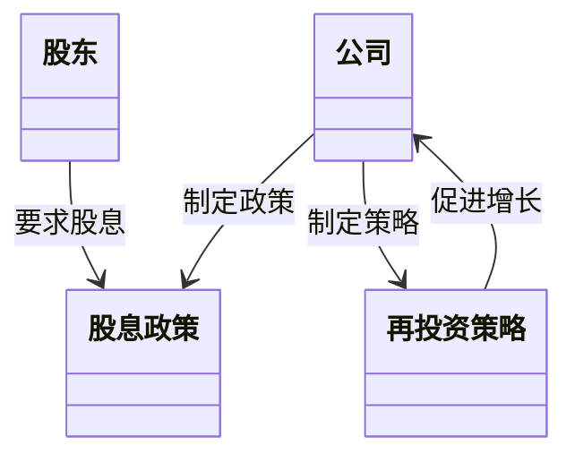

                 


# 彼得林奇如何看待公司的股息政策与再投资平衡

## 关键词：彼得·林奇、股息政策、再投资策略、股息与再投资平衡、投资理念

## 摘要：本文深入分析了彼得·林奇对股息政策与再投资平衡的看法，探讨了股息政策的核心概念、再投资策略的重要性，以及如何在两者之间找到平衡点。通过具体案例分析，结合彼得·林奇的投资理念，本文提出了在股息分配与再投资之间实现最优平衡的策略，为投资者和企业管理者提供了实用的指导。

---

# 引言：彼得·林奇与股息政策与再投资平衡的背景

## 1.1 股息政策与再投资的基本概念

- **股息政策**：公司如何分配利润给股东，通常以股息形式发放。
- **再投资**：公司将利润用于扩大生产、研发或其他增长项目。
- **两者的关系**：股息政策与再投资是公司财务决策的两个重要方面，需权衡利弊。

## 1.2 彼得·林奇的背景与投资理念

- **彼得·林奇的生平简介**：美国著名投资家，管理过麦哲伦基金，以稳健的投资风格著称。
- **投资理念**：注重基本面分析，偏好高成长性股票，强调长期投资。

## 1.3 股息政策与再投资的背景分析

- **股权投资的基本概念**：股东通过投资获得公司的一部分股权。
- **股息政策的演变**：从固定股息到增长股息政策的演变。
- **再投资在企业增长中的作用**：再投资有助于企业扩张和利润增长。

---

# 第二部分：股息政策的核心概念与分析

## 2.1 股息政策的类型与特点

- **固定股息政策**：公司承诺每年支付固定股息，适合稳定的现金流。
- **增长股息政策**：股息随公司利润增长而增长，适合高成长企业。
- **稳定股息政策**：股息保持稳定，适合成熟企业。

## 2.2 彼得·林奇对股息政策的评价

- **股息政策的重要性**：高股息率股票通常具有较高的分红能力。
- **彼得·林奇对高股息率股票的看法**：倾向于选择高成长性股票，而非单纯高股息率股票。
- **股息政策与股票价值的关系**：股息是股票价值的一部分，但成长性更重要。

## 2.3 股息政策的优缺点分析

- **优点**：股东获得稳定收益，增强股东信心。
- **缺点**：过多分配股息可能影响公司发展，分配不足可能影响股东利益。

---

# 第三部分：再投资策略的核心概念与分析

## 3.1 再投资的基本概念

- **再投资的定义**：公司将利润用于扩张、研发或其他项目。
- **再投资的类型**：内部投资、外部投资等。
- **再投资的优缺点**：再投资能促进增长，但也存在风险。

## 3.2 彼得·林奇对再投资的看法

- **再投资的重要性**：再投资是企业增长的关键。
- **彼得·林奇的再投资策略**：注重企业核心竞争力，选择具有增长潜力的公司。
- **再投资与企业增长的关系**：合理的再投资能推动企业可持续发展。

## 3.3 再投资策略的优缺点分析

- **优点**：促进企业扩张，提高市场竞争力。
- **缺点**：再投资风险高，可能影响短期利润。

---

# 第四部分：彼得·林奇的股息政策与再投资平衡策略

## 4.1 彼得·林奇的股息政策与再投资平衡理论

- **股息政策与再投资的平衡点**：合理分配利润，平衡股息与再投资。
- **彼得·林奇的平衡策略**：在股息分配与再投资之间找到最优平衡，考虑企业的成长性和股东的收益。

## 4.2 彼得·林奇平衡策略的实际应用

- **案例分析**：以苹果公司为例，分析其股息政策与再投资策略。
- **如何实现平衡**：根据企业实际情况，制定合理的股息分配和再投资计划。

---

# 第五部分：系统分析与架构设计方案

## 5.1 问题场景介绍

- **股息政策与再投资的系统性分析**：如何从系统角度理解两者的关系。
- **项目介绍**：分析公司股息政策与再投资的平衡。

## 5.2 系统功能设计（领域模型）



## 5.3 系统架构设计


---

# 第六部分：项目实战

## 6.1 环境安装

- **工具安装**：安装必要的分析工具，如Excel、数据分析软件等。
- **数据准备**：收集公司财务数据，包括利润、股息分配、再投资情况。

## 6.2 核心实现源代码

```python
def calculate_dividend_policy(profits, dividend_rate):
    return profits * dividend_rate

def calculate_reinvestment(profits, dividend):
    return profits - dividend

# 示例计算
profits = 1000000
dividend_rate = 0.3
dividend = calculate_dividend_policy(profits, dividend_rate)
reinvestment = calculate_reinvestment(profits, dividend)
print(f"股息：{dividend}, 再投资：{reinvestment}")
```

## 6.3 实际案例分析

- **案例分析**：某公司过去五年的股息政策与再投资情况。
- **数据分析**：通过公式分析，找到最佳平衡点。

---

# 结论：最佳实践与展望

## 7.1 最佳实践 tips

- **股息政策**：根据公司实际情况制定合理政策。
- **再投资策略**：注重长期增长，合理分配资源。
- **平衡点**：在股息分配与再投资之间找到最优平衡。

## 7.2 项目小结

- **总结**：股息政策与再投资的平衡是企业财务管理的重要部分，合理分配利润有助于企业成长和股东利益。

## 7.3 展望

- **未来趋势**：随着市场变化，股息政策与再投资策略将不断创新。
- **进一步研究**：探索更多平衡策略，适应不同行业和经济环境。

---

# 作者：AI天才研究院 & 禅与计算机程序设计艺术

---

通过本文的详细分析，我们可以看到彼得·林奇如何在股息政策与再投资之间找到平衡，为投资者和企业管理者提供了宝贵的指导。希望本文能帮助读者更好地理解这一复杂的财务决策过程。

