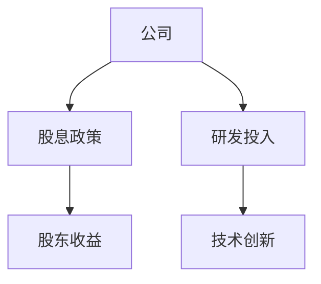
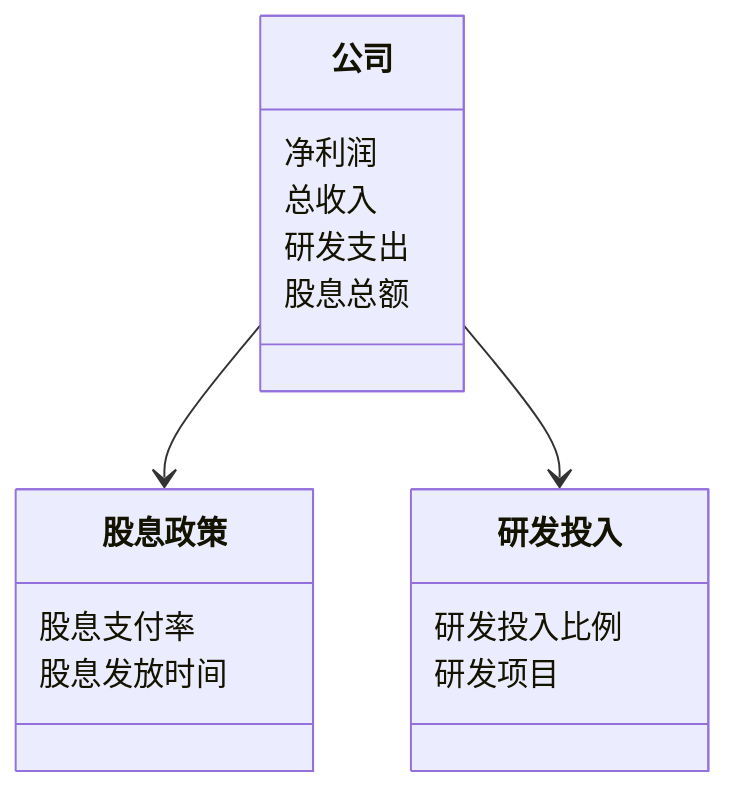
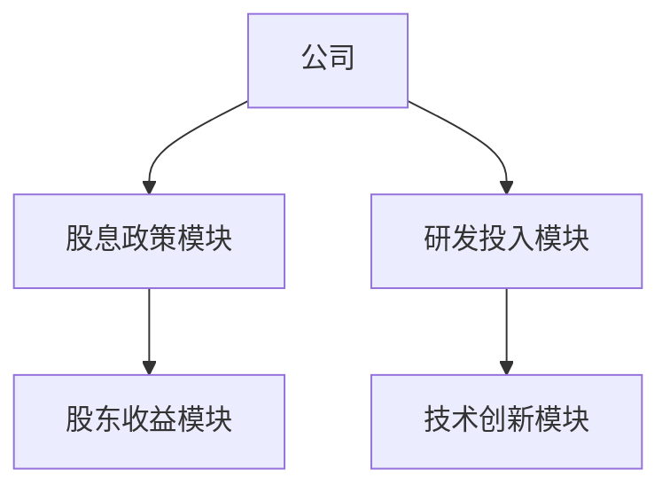
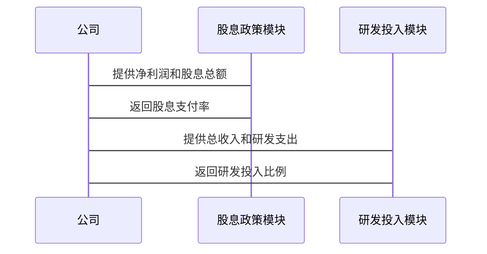

                 


# 彼得林奇如何看待公司的股息政策与研发投入的平衡

## 关键词：彼得·林奇、股息政策、研发投入、投资策略、风险管理、企业成长

## 摘要：本文探讨彼得·林奇的投资理念，分析股息政策与研发投入的平衡策略，为企业制定财务决策提供参考。通过构建数学模型和系统架构，结合实际案例，深入解读两者之间的关系，并总结最佳实践。

---

# 第一部分: 股息政策与研发投入的平衡概述

## 第1章: 股息政策与研发投入的背景介绍

### 1.1 股息政策的核心概念

#### 1.1.1 股息政策的定义
股息政策是指公司董事会制定的分配股息的策略，包括股息的发放比例、时间、形式等。股息政策直接关系到股东的收益和公司的财务健康状况。

#### 1.1.2 股息政策的核心要素
- 股息支付率：公司净利润中用于支付股息的比例。
- 股息发放时间：通常为季度、半年或年度。
- 股息形式：现金股息、股票股息或其他形式。

#### 1.1.3 股息政策的分类与特征
- 稳定增长型：股息逐年稳定增长，适合成熟企业。
- 高股息型：股息支付率高，适合现金流充足的公司。
- 低股息型：股息支付率低，注重 reinvestment。

### 1.2 研发投入的核心概念

#### 1.2.1 研发投入的定义
研发投入是指公司在产品开发、技术创新和技术升级等方面的支出，通常包括 salaries、设备采购、试验费用等。

#### 1.2.2 研发投入的主要形式
- 研发人员薪资
- 设备采购与维护
- 试验与测试费用
- 知识产权申请费用

#### 1.2.3 研发投入的周期性与风险性
- 研发投入具有较长的周期性，通常需要数年才能看到回报。
- 高风险性，研发投入可能无法转化为实际收益。

### 1.3 股息政策与研发投入的关联性

#### 1.3.1 股息政策与研发投入的相互影响
- 股息支付率高可能减少可用于研发的资金。
- 研发投入高可能降低股息支付率，影响股东短期收益。

#### 1.3.2 股息政策与研发投入的平衡点
- 在保证股东收益的同时，保持足够的研发资金，确保企业的长期竞争力。

#### 1.3.3 股息政策与研发投入的长期与短期效应
- 短期：高股息可能影响研发投入，降低企业创新能力。
- 长期：合理分配股息和研发投入，促进企业可持续发展。

### 1.4 彼得·林奇的投资理念概述

#### 1.4.1 彼得·林奇的投资哲学
彼得·林奇强调长期投资，关注企业的基本面，尤其是企业的盈利能力和成长性。

#### 1.4.2 彼得·林奇对股息政策的重视
林奇认为，稳定的股息支付是企业财务健康的重要标志，也是股东收益的重要来源。

#### 1.4.3 彼得·林奇对研发投入的关注
林奇认识到，研发投入是企业技术创新和产品升级的关键，决定企业的长期竞争力。

### 1.5 本章小结
本章介绍了股息政策和研发投入的核心概念及其相互关系，强调了彼得·林奇的投资理念中，股息政策与研发投入的平衡对于企业长期发展的关键作用。

---

## 第2章: 股息政策与研发投入的核心概念与联系

### 2.1 股息政策的核心原理

#### 2.1.1 股息政策的决策依据
- 公司的盈利状况
- 财务状况
- 未来投资需求

#### 2.1.2 股息政策的数学模型
股息支付率（ DPR）= 股息总额 / 净利润

#### 2.1.3 股息政策的优缺点对比
| 优点 | 缺点 |
|------|------|
| 提高股东收益 | 可能减少研发资金 |
| 增强投资者信心 | 过高股息可能导致财务风险 |
| 提高股价稳定性 | 可能限制企业 reinvestment |

### 2.2 研发投入的核心原理

#### 2.2.1 研发投入的决策依据
- 企业战略目标
- 市场竞争状况
- 财务承受能力

#### 2.2.2 研发投入的数学模型
研发投入比例（ RDP）= 研发支出 / 总收入

#### 2.2.3 研发投入的优缺点对比
| 优点 | 缺点 |
|------|------|
| 提升产品竞争力 | 需要大量资金投入 |
| 促进技术创新 | 投资周期长，回报不确定 |
| 增强企业长期盈利能力 | 可能影响短期利润 |

### 2.3 股息政策与研发投入的联系

#### 2.3.1 股息政策与研发投入的协同效应
- 合理分配股息和研发投入，既能满足股东收益，又能保障企业的创新能力。

#### 2.3.2 股息政策与研发投入的权衡分析
- 在资金有限的情况下，需要在股息和研发之间找到最佳平衡点。

#### 2.3.3 股息政策与研发投入的动态平衡
- 根据企业的盈利状况和市场环境，动态调整股息支付率和研发投入比例。

### 2.4 核心概念对比表格

表2.1 股息政策与研发投入的核心要素对比

| 比较维度 | 股息政策 | 研发投入 |
|----------|----------|----------|
| 目标 | 提高股东收益 | 提升企业竞争力 |
| 资金来源 | 净利润 | 自有资金或融资 |
| 决策周期 | 短期 | 长期 |
| 风险 | 低 | 高 |

### 2.5 ER实体关系图



### 2.6 本章小结
本章通过对比股息政策和研发投入的核心概念，分析了它们的相互关系和权衡点，为后续的平衡模型构建奠定了基础。

---

## 第3章: 股息政策与研发投入的平衡模型

### 3.1 平衡模型的构建原理

#### 3.1.1 模型的输入变量
- 股息支付率（ DPR）
- 研发投入比例（ RDP）
- 净利润（ Net Income）
- 总收入（ Total Revenue）

#### 3.1.2 模型的输出变量
- 股息与研发投入的平衡点
- 企业的综合收益评估

#### 3.1.3 模型的假设条件
- 股东和企业的利益最大化为目标
- 资金分配不影响企业的偿债能力
- 短期和长期目标的均衡

### 3.2 平衡模型的算法流程

#### 3.2.1 数据输入与清洗
1. 收集企业的财务数据，包括净利润、总收入、研发投入、股息支付率等。
2. 清洗数据，确保数据的准确性和完整性。

#### 3.2.2 股息政策与研发投入的权重计算
- 根据企业的具体情况，确定股息政策和研发投入的权重（ w1 和 w2）。

#### 3.2.3 平衡点的确定
通过加权平均公式，计算股息政策和研发投入的平衡点：
$$ \text{平衡点} = \frac{w_1 \cdot d + w_2 \cdot r}{w_1 + w_2} $$
其中，$w_1$ 和 $w_2$ 分别为股息政策和研发投入的权重，$d$ 和 $r$ 分别为股息政策和研发投入的指标值。

### 3.3 平衡模型的数学公式

#### 3.3.1 加权平均公式
$$ \text{平衡点} = \frac{w_1 \cdot d + w_2 \cdot r}{w_1 + w_2} $$

### 3.4 平衡模型的实现步骤

#### 3.4.1 数据收集与预处理
```python
import pandas as pd

# 假设df是包含财务数据的DataFrame
df = pd.read_csv('financial_data.csv')
df['净利润'] = df['净利润'].fillna(0)
df['总收入'] = df['总收入'].fillna(0)
```

#### 3.4.2 股息支付率计算
```python
df['股息支付率'] = df['股息总额'] / df['净利润']
```

#### 3.4.3 研发投入比例计算
```python
df['研发投入比例'] = df['研发支出'] / df['总收入']
```

#### 3.4.4 加权平均计算
```python
# 假设权重分别为0.4和0.6
weights = [0.4, 0.6]
df['平衡点'] = (weights[0] * df['股息支付率'] + weights[1] * df['研发投入比例'])
```

### 3.5 本章小结
本章通过构建股息政策与研发投入的平衡模型，利用数学公式和算法，帮助企业找到股息与研发投入的最佳平衡点。

---

## 第4章: 股息政策与研发投入的系统分析

### 4.1 系统分析的背景介绍

#### 4.1.1 问题场景介绍
企业在制定股息政策和研发投入时，常常面临资金分配的难题，如何在两者之间找到平衡点，是企业财务决策的重要内容。

### 4.2 系统分析的核心内容

#### 4.2.1 系统功能设计（领域模型）



#### 4.2.2 系统架构设计



#### 4.2.3 系统接口设计
- 股息政策模块接口
  - 输入：净利润、股息总额
  - 输出：股息支付率
- 研发投入模块接口
  - 输入：总收入、研发支出
  - 输出：研发投入比例

#### 4.2.4 系统交互设计



### 4.3 系统分析的总结
本章通过系统分析，展示了股息政策与研发投入在企业管理系统中的重要性，并通过领域模型和架构图，帮助企业更好地理解两者的相互关系。

---

## 第5章: 股息政策与研发投入的项目实战

### 5.1 项目背景介绍

#### 5.1.1 项目目标
通过具体案例，分析一家科技公司如何在股息政策和研发投入之间找到平衡点。

### 5.2 项目环境配置

```python
import pandas as pd
import numpy as np
```

### 5.3 核心代码实现

#### 5.3.1 数据收集与处理
```python
df = pd.read_csv('financial_data.csv')
df['净利润'] = df['净利润'].fillna(0)
df['总收入'] = df['总收入'].fillna(0)
df['研发支出'] = df['研发支出'].fillna(0)
df['股息总额'] = df['股息总额'].fillna(0)
```

#### 5.3.2 股息政策计算
```python
df['股息支付率'] = df['股息总额'] / df['净利润']
```

#### 5.3.3 研发投入比例计算
```python
df['研发投入比例'] = df['研发支出'] / df['总收入']
```

#### 5.3.4 加权平均计算
```python
# 假设权重分别为0.4和0.6
df['平衡点'] = 0.4 * df['股息支付率'] + 0.6 * df['研发投入比例']
```

### 5.4 项目案例分析

#### 5.4.1 案例分析
以某科技公司为例，计算其股息支付率和研发投入比例的平衡点。

#### 5.4.2 实际案例结果解读
通过计算，得出最佳平衡点，为企业制定财务策略提供参考。

### 5.5 项目总结
本章通过实际案例，展示了如何利用平衡模型，帮助企业找到股息政策与研发投入的最佳平衡点，确保企业的可持续发展。

---

## 第6章: 股息政策与研发投入的平衡策略与最佳实践

### 6.1 平衡策略的核心要点

#### 6.1.1 优化股息政策与研发投入的协同效应
- 根据企业实际情况，动态调整股息支付率和研发投入比例。

#### 6.1.2 通过风险管理工具，降低资金分配的风险

#### 6.1.3 定期评估和调整平衡点

### 6.2 最佳实践 tips

#### 6.2.1 确保股息政策与研发投入的动态平衡
- 根据市场环境和企业盈利状况，定期评估和调整股息支付率和研发投入比例。

#### 6.2.2 建立风险管理机制
- 通过财务模型和风险评估，确保资金分配的合理性。

#### 6.2.3 注重长期与短期目标的均衡
- 在满足股东短期收益的同时，注重企业的技术创新和长期发展。

### 6.3 本章小结
本章总结了股息政策与研发投入平衡的策略，并提出了最佳实践建议，为企业制定财务决策提供了参考。

---

## 第7章: 总结与展望

### 7.1 总结
本文从彼得·林奇的投资理念出发，分析了股息政策与研发投入的平衡策略，构建了数学模型，并通过实际案例进行了验证。帮助企业找到股息政策与研发投入的最佳平衡点，实现股东收益与企业成长的双重目标。

### 7.2 展望
未来，随着企业面临的市场环境和财务需求的变化，股息政策与研发投入的平衡策略也将不断发展和优化。企业需要根据自身情况，灵活调整策略，确保可持续发展。

---

## 作者：AI天才研究院/AI Genius Institute & 禅与计算机程序设计艺术 /Zen And The Art of Computer Programming

