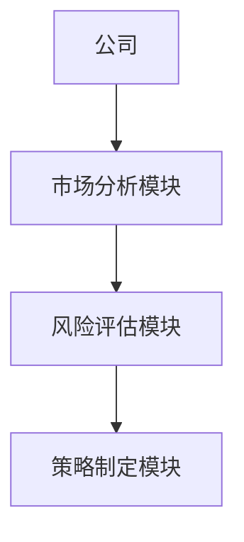

                 


# 彼得林奇如何看待公司的跨国经营风险

## 关键词：彼得林奇，跨国经营，经营风险，风险管理，投资策略，风险评估，彼得·林奇模型

## 摘要：  
本文从彼得林奇的视角出发，分析公司跨国经营的风险，探讨如何通过系统性分析和管理来降低风险，确保跨国经营的稳健发展。文章结合实际案例，深入解析跨国经营中的各类风险，并提出切实可行的应对策略。

---

# 引言

跨国经营是企业在全球化进程中拓展市场、优化资源配置的重要手段。然而，跨国经营也伴随着复杂的经营风险，包括市场风险、法律风险、汇率风险等。本文将从彼得林奇的视角，分析这些风险的成因、影响及应对策略，为企业制定有效的风险管理计划提供参考。

---

# 第一部分：跨国经营风险的核心概念与联系

## 第1章：跨国经营的基本概念

### 1.1 跨国經營的定義與特點

#### 1.1.1 跨国經營的定義  
跨国经营是指企业在多个国家或地区进行投资、生产和销售活动，以实现全球化布局和资源优化配置。  

#### 1.1.2 跨国經營的核心要素  
- 市场分析：了解目标市场的经济、政治、文化环境。  
- 资源配置：在全球范围内优化人力资源、资金和原材料的分配。  
- 战略制定：制定符合当地市场特点的经营策略。  

#### 1.1.3 跨国經營的優勢與挑戰  
- **優勢**：拓展市场、降低成本、提高竞争力。  
- **挑戰**：汇率波动、法律差异、文化冲突。  

### 1.2 跨国經營風險的定義與類型

#### 1.2.1 跨国經營風險的定義  
跨国经营风险是指企业在跨国经营过程中，由于内外部环境的不确定性而导致的损失可能性。  

#### 1.2.2 跨国經營風險的類型  
- **市場風險**：市场需求波动、竞争加剧。  
- **貨幣風險**：汇率波动影响企业利润。  
- **法律風險**：税收政策变化、贸易壁垒。  
- **政治風險**：政局不穩、政策变化。  

---

# 第二部分：跨国經營風險的核心原理

## 第2章：跨国經營風險的影響因素

### 2.1 跨国經營風險的影響因素

#### 2.1.1 經濟環境因素  
- 通貨膨脹：影响当地市场的购买力。  
- 利率變動：影响企业的融资成本。  

#### 2.1.2 政治法律因素  
- 外匯管制：限制资金流动。  
- 稅法變化：增加税务负担。  

#### 2.1.3 市場因素  
- 竞争狀況：本地企业的竞争压力。  
- 消費者行為：市场需求的变化。  

## 第2章：跨国經營風險的評估模型

### 2.2 跨国經營風險的評估模型

#### 2.2.1 經濟影響模型  
通过分析GDP增长率、通货膨胀率等经济指标，评估经济环境对企业的影响。  

#### 2.2.2 法律影響模型  
通过分析目标市场的法律环境，评估政策变化对企业的影响。  

#### 2.2.3 綜合風險評估模型  
结合经济、法律、市场等多种因素，进行全面风险评估。  

---

# 第三部分：跨国經營風險的算法原理與數學模型

## 第3章：跨国經營風險的算法原理

### 3.1 跨国經營風險的數學模型

#### 3.1.1 汇率風險模型  
假设某公司以美元计价的收入为 $X$，当地货币为 $Y$，汇率为 $R$，则收入转换为当地货币的值为 $X \times R$。若汇率波动 $\Delta R$，则收入变化为 $X \times \Delta R$。  

公式：$$ \Delta \text{收入} = X \times \Delta R $$  

#### 3.1.2 法律風險模型  
法律风险可以通过概率加权法进行评估。设法律风险发生的概率为 $P$，损失金额为 $L$，则期望损失为：$$ \text{期望损失} = P \times L $$  

---

## 第4章：跨国經營風險的系统分析

### 4.1 跨国經營風險的分析框架

#### 4.1.1 系統功能設計  
- **需求分析**：了解目标市场的需求特点。  
- **風險評估**：识别和评估各类风险。  
- **策略制定**：制定应对风险的策略。  

#### 4.1.2 系統架構設計  
使用Mermaid图展示系统架构：  


---

## 第5章：跨国經營風險的项目实战

### 5.1 環境安裝

#### 5.1.1 工具選擇  
- 数据分析工具：Python、Excel。  
- 可视化工具：Matplotlib、Tableau。  

### 5.2 核心實現

#### 5.2.1 货币風險計算  
编写Python代码计算汇率波动对企业利润的影响：  
```python
import pandas as pd
import numpy as np

# 汇率数据
exchange_rates = pd.DataFrame({'year': [2020, 2021, 2022], 'rate': [1.2, 1.18, 1.15]})

# 计算汇率波动
exchange_rates['change'] = exchange_rates['rate'].diff()
print(exchange_rates)
```

#### 5.2.2 法律風險評估  
通过法律专家团队分析目标市场的法律环境，评估潜在风险。  

### 5.3 案例分析

#### 5.3.1 案例選擇  
选择一家跨国制造企业，分析其在某国的经营风险。  

#### 5.3.2 分析與總結  
通过案例分析，验证风险评估模型的有效性，并提出改进建议。  

---

## 第6章：总结与展望

### 6.1 总结

跨国经营风险是企业在全球化进程中必须面对的挑战。通过系统性分析和管理，企业可以有效降低风险，实现稳健发展。

### 6.2 注意事项

- **數據更新**：定期更新市场和法律数据。  
- **團隊培訓**：加强员工的跨文化管理和风险管理能力。  

### 6.3 拓展閱讀

- 彼得林奇的《投资学基础》。  
- 全球化经营的经典案例分析。  

---

## 附錄

### 附錄A：術語表  
- 跨国經營：指企业在多个国家进行投资和运营。  
- 汇率風險：指汇率波动对企业财务的影响。  

### 附錄B：數據來源  
- 国内生产总值数据：来源于各国统计局。  
- 汇率数据：来源于央行和外汇市场。  

### 附錄C：工具推薦  
- 数据分析工具：Python、R。  
- 可视化工具：Tableau、Power BI。  

---

## 作者：AI天才研究院/AI Genius Institute & 禪與计算机程序设计藝術 /Zen And The Art of Computer Programming

---

以上是关于《彼得林奇如何看待公司的跨国经营风险》的技术博客文章的完整目录大纲和内容概要。希望对您有所帮助！

