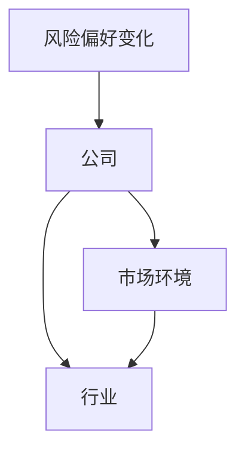

                 

# 彼得·林奇如何看待公司的风险偏好变化

> **关键词**: 彼得·林奇, 风险偏好, 投资决策, 公司战略, 风险管理

> **摘要**: 本文深入分析了彼得·林奇如何看待公司的风险偏好变化，探讨了风险偏好对投资决策的影响，结合实例分析和系统设计，展示了如何通过算法和系统架构来应对风险偏好的变化。文章从背景介绍、核心概念、算法原理、系统架构设计、项目实战到最佳实践，层层递进，全面解析了这一主题。

---

## 第一部分: 风险偏好与投资决策的背景介绍

### 第1章: 风险偏好的定义与重要性

#### 1.1 风险偏好的核心概念
- **风险偏好的定义**: 风险偏好是指投资者或企业在面对不确定性时，愿意承担风险的程度。它反映了个体或组织在追求收益与规避损失之间的平衡点。
- **风险偏好与投资决策的关系**: 风险偏好是投资决策的核心因素。不同的风险偏好会导致不同的投资策略，例如激进型投资者可能倾向于高风险高回报的投资，而保守型投资者则更注重本金安全。
- **风险偏好的重要性**: 正确理解风险偏好有助于投资者制定合理的投资策略，避免盲目追求高收益而忽视潜在风险。

#### 1.2 彼得·林奇的背景介绍
- **彼得·林奇的生平简介**: 彼得·林奇是美国著名投资家，曾担任富达麦哲伦基金的经理，管理资产规模曾高达1400亿美元。他以选股能力强著称，被誉为“最伟大的股票基金经理”之一。
- **彼得·林奇的投资风格**: 林奇注重基本面分析，善于挖掘被市场低估的股票。他强调长期投资和价值发现，反对短期投机。
- **彼得·林奇的投资哲学**: 林奇认为，投资的核心在于选择那些具有持续竞争优势和良好管理的公司。他强调对公司基本面的深入研究，尤其是公司的财务状况和管理层能力。

#### 1.3 公司风险偏好的变化与影响
- **公司风险偏好的变化原因**:
  - 市场环境的变化: 经济周期波动、行业政策调整等都会影响公司的风险偏好。
  - 公司战略调整: 公司管理层的变动、战略目标的更新可能导致风险偏好的改变。
  - 行业竞争格局的变化: 行业内的竞争加剧或放松可能导致公司调整风险偏好。
- **风险偏好变化对投资决策的影响**:
  - 风险偏好变化如何影响投资组合: 风险偏好上升可能导致投资组合中高风险资产的比例增加，反之则相反。
  - 风险偏好变化对资产配置的影响: 风险偏好降低可能导致投资者增加债券等低风险资产的配置。
  - 风险偏好变化对投资风险的控制: 风险偏好变化需要投资者及时调整风险控制策略，以应对潜在的市场波动。

---

## 第二部分: 风险偏好变化的核心概念与联系

### 第2章: 风险偏好变化的核心概念

#### 2.1 风险偏好的属性特征
- **风险偏好的时间维度**: 风险偏好可能随时间变化，例如在经济衰退期间，投资者可能更倾向于保守型投资。
- **风险偏好的空间维度**: 不同行业、不同地区的公司可能有不同的风险偏好。
- **风险偏好的主体维度**: 个体投资者与机构投资者的风险偏好可能存在显著差异。

#### 2.2 风险偏好变化的特征对比
- **不同行业风险偏好的对比**:
  - 高科技行业通常风险偏好较高，因为创新和技术更新具有不确定性。
  - 公用事业行业风险偏好较低，因为其业务模式较为稳定。
- **不同规模公司风险偏好的对比**:
  - 小型公司通常风险偏好较高，因为它们需要通过高风险投资实现增长。
  - 大型公司风险偏好较低，更注重稳定性和可持续性。
- **不同发展阶段风险偏好的对比**:
  - 初创期公司风险偏好较高，因为需要通过高风险投资实现快速增长。
  - 成熟期公司风险偏好较低，更注重利润稳定性和风险控制。

#### 2.3 风险偏好变化的ER实体关系图

---

## 第三部分: 风险偏好变化的算法原理

### 第3章: 风险偏好变化的算法原理

#### 3.1 算法原理概述
- **算法的基本原理**: 通过分析公司的财务数据、行业趋势和市场环境，预测公司风险偏好的变化趋势。
- **算法的输入输出**:
  - 输入: 公司的财务报表、行业数据、市场指数等。
  - 输出: 风险偏好变化的预测结果，包括风险偏好上升、下降或保持不变。
- **算法的优缺点**:
  - 优点: 能够量化分析，提供数据支持。
  - 缺点: 依赖于数据的准确性和完整性，可能存在模型过拟合的问题。

#### 3.2 彼得·林奇的风险偏好分析方法
- **宏观

