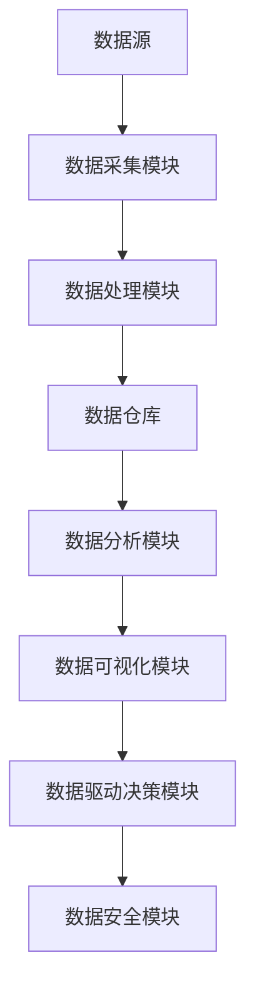

                 


# 彼得林奇如何评估公司的数据变现能力

> 关键词：彼得林奇，数据变现，数据资产，数据评估，数据价值，数据安全

> 摘要：本文从彼得·林奇的投资哲学出发，结合现代数据驱动的商业实践，系统阐述如何评估公司的数据变现能力。文章详细分析了数据资产的价值评估模型、数据治理与安全、数据市场的供需关系，以及数据驱动的决策逻辑，并通过实际案例和系统架构设计，全面解析了数据变现的实现路径和优化策略。

---

## 第一部分：数据变现的背景与重要性

### 第1章：数据变现的背景与概念

#### 1.1 数据资产的重要性

##### 1.1.1 数据作为企业核心资产
数据已成为21世纪最重要的战略资源。企业通过数据收集、分析和利用，能够洞察市场趋势、优化运营流程、提升客户体验，并最终实现业务增长。彼得·林奇曾说过：“数据是企业的命脉。”这句话在数据驱动的时代显得尤为重要。

##### 1.1.2 数据驱动业务增长的潜力
数据的价值不仅在于其本身，更在于通过数据的分析和挖掘，能够为企业创造新的收入来源。数据变现的模式多种多样，包括数据销售、数据分析服务、数据驱动的产品创新等。企业需要将数据视为一种资产，并通过科学的评估方法，确定其在市场上的价值。

##### 1.1.3 数据变现的定义与范畴
数据变现是指通过数据的收集、处理、分析和应用，将其转化为可量化的经济价值。这不仅包括直接出售数据，还包括通过数据驱动的产品和服务间接实现收益。数据变现的核心在于如何将数据资产转化为实际的商业价值。

#### 1.2 数据资产化的核心要素

##### 1.2.1 数据质量与完整性
数据质量是数据资产价值的基础。数据的准确性、一致性、完整性、及时性和安全性直接影响其价值。高质量的数据能够为企业提供可靠的决策支持，而低质量的数据可能导致错误的结论和损失。

##### 1.2.2 数据的可变现性
数据的可变现性取决于其稀缺性、独特性和实用性。稀缺的数据往往具有更高的市场价值，而实用性则是数据变现的关键。例如，实时交易数据的变现能力通常高于历史数据。

##### 1.2.3 数据的隐私与合规性
随着数据保护法规的不断完善，数据的隐私和合规性问题变得尤为重要。企业需要确保数据的收集、存储和使用符合相关法律法规，避免因数据泄露或滥用导致的法律风险。

#### 1.3 数据变现的模式与场景

##### 1.3.1 数据销售
数据销售是最直接的数据变现方式。企业可以将收集到的数据出售给第三方，用于市场研究、广告投放、信用评估等领域。然而，数据销售需要严格遵守隐私保护法规，确保数据的合法性和合规性。

##### 1.3.2 数据分析与洞察
通过数据分析和挖掘，企业可以将数据转化为有价值的洞察，并以报告、咨询服务等形式实现变现。这种模式不仅能够为企业带来直接收益，还能提升企业的专业形象和市场竞争力。

##### 1.3.3 数据驱动的产品与服务
数据驱动的产品与服务是数据变现的高级形式。例如，基于用户行为数据的个性化推荐系统、智能客服系统等，都能够通过数据的应用为企业创造新的收入来源。

#### 1.4 彼得·林奇的视角与方法

##### 1.4.1 投资者的独特视角
作为投资大师，彼得·林奇注重企业的基本面分析，包括财务状况、管理团队、市场竞争力等。他认为，数据资产是企业未来增长的核心驱动力，因此在评估企业价值时，数据资产的评估尤为重要。

##### 1.4.2 数据资产的长期价值
彼得·林奇强调，数据资产的价值不仅体现在当前的收益上，更在于其长期的潜力。企业需要通过持续的数据收集和分析，挖掘数据的深层价值，并将其转化为长期的竞争优势。

##### 1.4.3 数据驱动的决策逻辑
彼得·林奇认为，数据驱动的决策是企业成功的关键。通过数据分析，企业能够更好地理解市场趋势、客户需求和内部运营，从而做出更科学的决策。

### 第2章：数据资产的评估维度

#### 2.1 数据质量评估

##### 2.1.1 数据的准确性
数据的准确性是数据质量的核心要素。企业需要确保数据的来源可靠，数据采集和处理的过程准确无误。

##### 2.1.2 数据的时效性
数据的时效性是指数据的有效期限。实时数据的价值通常高于过时的数据，因此企业需要建立数据更新机制，确保数据的时效性。

##### 2.1.3 数据的唯一性
数据的唯一性是指数据的唯一标识和可追溯性。唯一性数据通常具有更高的价值，例如身份认证数据。

#### 2.2 数据治理与管理

##### 2.2.1 数据分类与标准化
数据分类和标准化是数据治理的基础工作。企业需要将数据按照业务需求进行分类，并制定统一的标准化规范，确保数据的一致性和可比性。

##### 2.2.2 数据安全与隐私保护
数据安全是数据治理的核心问题。企业需要采取技术手段和管理措施，确保数据的安全性，防止数据泄露和滥用。

##### 2.2.3 数据的生命周期管理
数据的生命周期管理包括数据的生成、存储、使用、归档和销毁。企业需要制定科学的数据生命周期管理策略，确保数据的全生命周期安全。

#### 2.3 数据安全与合规性

##### 2.3.1 数据保护法规
企业需要遵守相关数据保护法规，例如欧盟的GDPR（通用数据保护条例）和中国的《数据安全法》等。这些法规对企业数据的收集、存储和使用提出了严格的要求。

##### 2.3.2 数据隐私与伦理
数据隐私不仅是法律问题，也是道德问题。企业需要尊重用户的隐私权，避免因数据滥用导致的伦理争议。

##### 2.3.3 数据安全技术
企业需要采用先进的数据安全技术，例如加密技术、访问控制、数据脱敏等，确保数据的安全性和隐私性。

### 第3章：数据资产的估值方法

#### 3.1 数据资产的价值评估模型

##### 3.1.1 数据资产价值的数学模型
数据资产的价值可以通过以下公式进行评估：
$$ V = f(Q, T, S) $$
其中，$Q$ 表示数据质量，$T$ 表示数据的时效性，$S$ 表示数据的稀缺性。

##### 3.1.2 数据质量的评估指标
数据质量的评估指标包括准确性、完整性、一致性、及时性和唯一性等。企业需要根据具体业务需求，制定合适的数据质量评估标准。

##### 3.1.3 数据稀缺性的衡量
数据的稀缺性可以通过市场供需关系和数据的独特性来衡量。稀缺的数据通常具有更高的市场价值。

#### 3.2 数据资产的市场定价

##### 3.2.1 数据市场的供需关系
数据市场的供需关系直接影响数据的价格。供不应求的数据价格通常较高，而供过于求的数据价格则相对较低。

##### 3.2.2 数据价格的影响因素
数据价格的影响因素包括数据的质量、数量、稀缺性、用途和市场供需关系等。企业需要根据具体情况进行综合评估。

##### 3.2.3 数据定价的策略与方法
企业可以采用成本加成定价、市场导向定价、价值定价等多种策略进行数据定价。价值定价是最常用的方法，即根据数据的实用价值和市场认可度确定价格。

#### 3.3 数据资产的收益预测

##### 3.3.1 数据变现的收入模型
数据变现的收入模型包括数据销售、数据分析服务、数据驱动的产品与服务等。企业需要根据自身情况选择合适的收入模型。

##### 3.3.2 数据资产的 ROI 分析
ROI（投资回报率）是评估数据资产价值的重要指标。企业需要通过ROI分析，评估数据资产的投资收益，确保数据资产的投入能够带来预期的收益。

##### 3.3.3 数据收益的长期预测
数据收益的长期预测需要考虑市场变化、技术进步和企业战略等因素。企业需要建立科学的预测模型，确保数据资产的长期价值。

---

## 第二部分：数据变现的系统架构与实现

### 第4章：数据变现的系统架构设计

#### 4.1 数据变现的系统功能设计

##### 4.1.1 数据采集模块
数据采集模块负责从各种数据源（例如数据库、API、日志文件等）采集数据，并将其存储在数据仓库中。

##### 4.1.2 数据处理模块
数据处理模块负责对采集到的数据进行清洗、转换和 enrichment。通过数据处理，可以确保数据的准确性和一致性。

##### 4.1.3 数据分析模块
数据分析模块负责对处理后的数据进行分析和挖掘，生成有价值的洞察。数据分析可以采用多种方法，例如统计分析、机器学习、自然语言处理等。

##### 4.1.4 数据存储模块
数据存储模块负责将数据存储在数据仓库中，确保数据的安全性和可访问性。数据仓库通常采用分布式存储架构，以提高数据的可靠性和性能。

##### 4.1.5 数据安全模块
数据安全模块负责保护数据的安全性，防止数据泄露和滥用。数据安全模块包括数据加密、访问控制、数据脱敏等技术。

#### 4.2 数据变现的系统架构设计

##### 4.2.1 系统架构设计
以下是数据变现系统的架构设计图：



##### 4.2.2 系统接口设计
数据系统的接口设计需要考虑数据的安全性和可扩展性。企业需要制定统一的接口标准，确保不同模块之间的数据交互高效、安全。

##### 4.2.3 系统交互设计
系统交互设计需要考虑用户体验。例如，数据可视化模块需要设计友好的用户界面，方便用户理解和使用数据。

---

### 第5章：数据变现的系统实现

#### 5.1 环境安装

##### 5.1.1 数据采集工具
常用的数据采集工具包括 Apache Kafka、Flume 等。企业需要根据具体需求选择合适的工具。

##### 5.1.2 数据存储技术
常用的数据存储技术包括 Apache Hadoop、Apache Spark、MongoDB 等。企业需要根据数据类型和规模选择合适的存储技术。

##### 5.1.3 数据分析工具
常用的数据分析工具包括 Python 的 Pandas 库、R 语言、TensorFlow、PyTorch 等。企业需要根据具体需求选择合适的工具。

#### 5.2 核心实现

##### 5.2.1 数据采集与处理
以下是一个数据采集和处理的Python代码示例：

```python
import pandas as pd
from datetime import datetime

# 数据采集模块
def collect_data():
    # 模拟数据采集
    data = {
        'timestamp': [datetime.now()],
        'value': [100]
    }
    return pd.DataFrame(data)

# 数据处理模块
def process_data(df):
    # 数据清洗和转换
    df['timestamp'] = df['timestamp'].astype(str)
    return df

# 主程序
if __name__ == '__main__':
    raw_data = collect_data()
    processed_data = process_data(raw_data)
    print(processed_data)
```

##### 5.2.2 数据分析与建模
以下是一个数据分析与建模的Python代码示例：

```python
import pandas as pd
from sklearn import linear_model

# 数据加载
data = pd.read_csv('data.csv')

# 数据分析与建模
model = linear_model.LinearRegression()
model.fit(data[['feature']], data['target'])

# 模型预测
new_data = pd.DataFrame({'feature': [5]})
prediction = model.predict(new_data)
print(f'预测值为：{prediction[0]}')
```

#### 5.3 项目实战

##### 5.3.1 项目背景与目标
本项目旨在通过数据的收集、处理、分析和应用，帮助企业实现数据变现。项目的核心目标是通过数据分析，为企业提供市场洞察和决策支持。

##### 5.3.2 项目实现步骤
1. 数据采集：从多个数据源采集数据，包括用户行为数据、市场数据、产品数据等。
2. 数据处理：对采集到的数据进行清洗、转换和 enrichment，确保数据的准确性和一致性。
3. 数据分析：通过数据分析工具，对数据进行建模和挖掘，生成有价值的洞察。
4. 数据应用：将分析结果应用到实际业务中，例如优化营销策略、提升客户体验等。

##### 5.3.3 实现细节
数据采集和处理是项目的核心步骤。企业需要选择合适的工具和技术，确保数据的高效采集和处理。数据分析部分需要根据具体业务需求，选择合适的算法和模型，确保分析结果的准确性和实用性。

#### 5.4 项目小结

##### 5.4.1 项目总结
本项目通过数据的收集、处理、分析和应用，帮助企业实现了数据的商业化。项目的核心是数据的高质量处理和深度分析，确保数据能够为企业创造实际价值。

##### 5.4.2 项目启示
数据变现不仅需要技术的支持，还需要企业战略的制定和团队的协作。企业需要将数据视为一种核心资产，通过科学的评估和管理，实现数据的长期价值。

---

## 第三部分：数据变现的优化与展望

### 第6章：数据变现的优化策略

#### 6.1 数据治理与优化

##### 6.1.1 数据治理的最佳实践
企业需要制定科学的数据治理策略，确保数据的全生命周期管理。数据治理包括数据分类、数据安全、数据备份等关键环节。

##### 6.1.2 数据安全的优化措施
企业需要采取多种技术手段和管理措施，确保数据的安全性。例如，采用加密技术、访问控制、数据脱敏等方法，保护数据的安全。

#### 6.2 数据技术的优化

##### 6.2.1 数据采集技术的优化
数据采集技术的优化可以提高数据采集的效率和准确性。例如，采用分布式采集架构，提高数据采集的速度和可靠性。

##### 6.2.2 数据存储技术的优化
数据存储技术的优化可以提高数据存储的效率和安全性。例如，采用分布式存储架构，提高数据的可扩展性和容错性。

##### 6.2.3 数据分析技术的优化
数据分析技术的优化可以提高数据分析的效率和准确性。例如，采用机器学习算法，提高数据分析的深度和广度。

#### 6.3 数据市场的优化

##### 6.3.1 数据市场的规范化
数据市场的规范化是数据变现的重要前提。企业需要遵守相关法律法规，确保数据的合法性和合规性。

##### 6.3.2 数据交易的透明化
数据交易的透明化是数据市场健康发展的关键。企业需要建立透明的数据交易机制，确保数据的合法流通和使用。

### 第7章：数据变现的未来展望

#### 7.1 数据技术的未来发展

##### 7.1.1 人工智能与数据分析的融合
人工智能技术的快速发展将推动数据分析的深度和广度。未来，人工智能将更多地应用于数据的自动分析和预测，为企业提供更精准的洞察。

##### 7.1.2 区块链技术的应用
区块链技术的应用将提高数据的安全性和可信度。通过区块链技术，企业可以实现数据的分布式存储和不可篡改，确保数据的真实性和可靠性。

#### 7.2 数据市场的未来趋势

##### 7.2.1 数据市场的多元化发展
数据市场的多元化发展将为企业提供更多样的数据变现模式。例如，数据共享、数据众包、数据API等新型模式将逐渐兴起。

##### 7.2.2 数据隐私与合规的挑战
随着数据保护法规的不断完善，数据隐私和合规性问题将成为数据市场的核心挑战。企业需要更加注重数据的隐私保护和合规性管理。

#### 7.3 数据价值的未来提升

##### 7.3.1 数据的深度挖掘
数据的深度挖掘将为企业创造更大的价值。通过先进的数据分析技术，企业可以挖掘数据的深层价值，实现业务的持续创新。

##### 7.3.2 数据的跨界应用
数据的跨界应用将推动数据价值的进一步提升。企业需要打破数据孤岛，实现数据的共享和协作，推动数据的跨界应用。

---

## 结语

数据变现是企业未来发展的重要方向。通过科学的数据资产评估、系统的数据管理、先进的数据分析技术，企业可以将数据转化为实际的商业价值。彼得·林奇的投资哲学为企业提供了重要的启示：数据是企业的命脉，数据资产的评估和管理是企业成功的关键。未来，随着技术的进步和市场的发展，数据变现的能力将决定企业的核心竞争力。企业需要持续优化数据管理策略，提升数据应用能力，抓住数据驱动的机遇，实现可持续发展。

---

作者：AI天才研究院/AI Genius Institute & 禅与计算机程序设计艺术/Zen And The Art of Computer Programming

