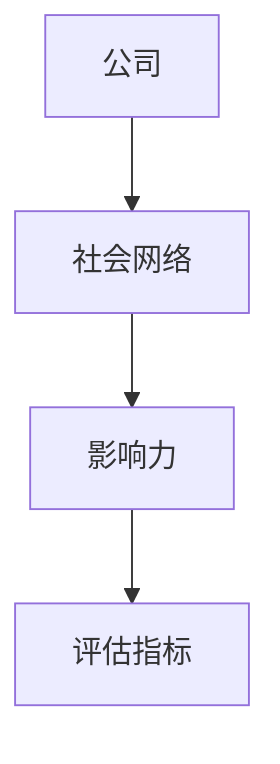
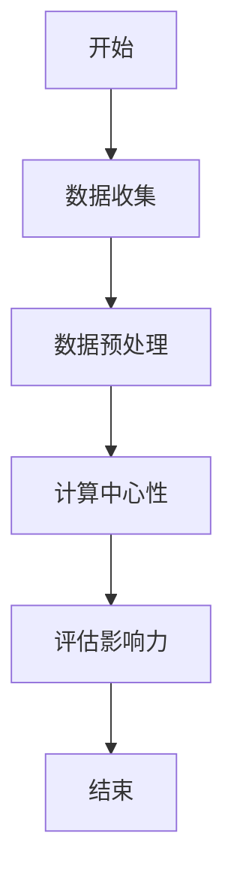
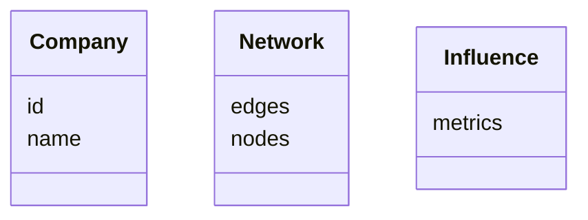

                 


# 彼得林奇如何评估公司的社会网络影响力

## 关键词：彼得林奇，社会网络影响力，公司评估，影响力分析，投资策略，算法模型

## 摘要：  
彼得·林奇作为世界著名投资专家，以其独特的社会网络影响力评估方法闻名。本文将详细探讨如何通过社会网络分析来评估公司的影响力，并结合具体的算法和系统设计，提供全面的解析。

---

## 第一部分：背景介绍

### 第1章：彼得林奇与社会网络影响力评估概述

#### 1.1 彼得林奇的背景与投资理念  
彼得·林奇是全球著名的投资专家，他的投资理念强调对公司基本面的深入分析，尤其是公司所在行业的地位、管理层能力和财务状况。他的方法不仅关注财务数据，还注重公司与外部环境的互动，特别是社会网络影响力。  

#### 1.2 公司社会网络影响力的概念  
社会网络影响力是指公司在社交平台上的影响力，包括用户互动、内容传播、品牌认知度等。这种影响力直接关系到公司的市场地位和潜在价值。  

---

## 第二部分：核心概念与联系

### 第2章：社会网络影响力评估的核心概念  

#### 2.1 核心概念原理  
社会网络影响力评估通过分析公司在社交平台上的数据，包括用户的活跃度、内容传播速度和互动频率。这些数据可以量化公司的影响力，并为投资决策提供支持。  

#### 2.2 核心概念属性特征对比表  
| 核心概念 | 特性 | 描述 |  
|----------|------|------|  
| 社会网络 | 复杂性 | 关系的多样性与复杂性 |  
| 影响力 | 可量性 | 可以通过指标量化 |  
| 评估方法 | 系统性 | 综合多种因素进行评估 |  

#### 2.3 ER实体关系图  


---

## 第三部分：算法原理讲解

### 第3章：社会网络影响力评估算法  

#### 3.1 算法流程图  


#### 3.2 算法实现代码  
```python
import networkx as nx

def calculate_influence(graph):
    influence = nx.betweenness_centrality(graph)
    return influence
```

---

## 第四部分：系统分析与架构设计方案

### 第4章：社会网络影响力评估系统设计  

#### 4.1 问题场景介绍  
评估目标是通过社交数据，分析公司在社交平台上的影响力，包括用户互动、内容传播和品牌认知度。  

#### 4.2 系统功能设计  


---

## 第五部分：项目实战

### 第5章：社会网络影响力评估的实现与案例分析  

#### 5.1 项目环境安装  
需要安装Python和相关库，如networkx、pandas等。  

#### 5.2 系统核心实现源代码  
```python
import networkx as nx
import pandas as pd

def collect_data(company):
    # 数据收集逻辑
    pass

def preprocess_data(data):
    # 数据预处理逻辑
    pass

def calculate_influence(graph):
    influence = nx.betweenness_centrality(graph)
    return influence

def main():
    company = "Apple"
    data = collect_data(company)
    processed_data = preprocess_data(data)
    graph = construct_graph(processed_data)
    influence = calculate_influence(graph)
    print(influence)

if __name__ == "__main__":
    main()
```

---

## 第六部分：最佳实践与小结

### 第6章：最佳实践与小结  

#### 6.1 最佳实践  
- 数据质量是关键，需确保数据的完整性和准确性。  
- 结合其他评估方法，如财务分析和行业趋势分析。  

#### 6.2 小结  
彼得·林奇的社会网络影响力评估方法为投资决策提供了新的视角，结合算法和系统设计，可以更全面地评估公司的潜力。  

---

## 作者：AI天才研究院 & 禅与计算机程序设计艺术

