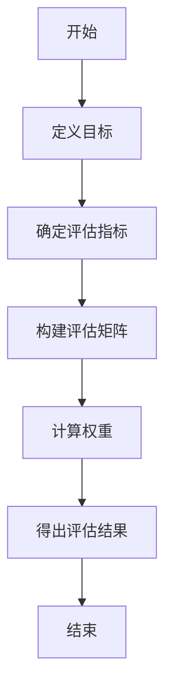
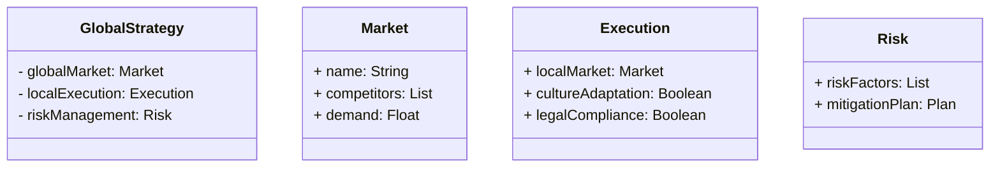

                 


---

# 彼得林奇对公司全球化战略的本地化执行力评估

> **关键词**：彼得林奇，全球化战略，本地化执行，投资评估，风险管理  
> **摘要**：本文从彼得林奇的投资理念出发，探讨全球化战略在本地化执行中的关键因素，通过构建评估模型和实际案例分析，深入解析如何在跨国经营中实现全球化战略与本地化执行的平衡。

---

# 第一部分: 全球化战略与本地化执行力的背景与概念

## 第1章: 全球化战略的背景与挑战

### 1.1 全球化战略的定义与背景

全球化战略是指企业在跨国经营中，通过整合全球资源、市场和管理，以实现最大化收益和竞争优势的策略。随着经济的全球化，企业需要在全球范围内配置资源、拓展市场和优化管理。

#### 1.1.1 全球化战略的定义
全球化战略涉及企业在多个国家或地区的市场中进行产品和服务的生产和销售。它不仅包括市场拓展，还包括生产、研发、供应链管理等多方面的全球化布局。

#### 1.1.2 全球化战略的历史演变
全球化战略的演进经历了从单纯的出口贸易到跨国直接投资，再到如今的全球价值链整合。随着信息技术的发展，全球化战略变得更加复杂，但也更加高效。

#### 1.1.3 当前全球化战略的核心问题
当前，全球化战略的核心问题在于如何在全球化与本地化之间找到平衡点。企业需要在统一的全球战略指导下，灵活应对不同地区的市场差异。

---

### 1.2 本地化执行力的重要性

本地化执行是全球化战略成功的关键。企业需要根据不同地区的文化、法律、市场环境等差异，调整其运营策略。

#### 1.2.1 本地化执行的定义
本地化执行是指企业在特定市场中，根据当地环境和需求调整其产品、服务、营销和管理策略的过程。

#### 1.2.2 本地化执行在企业全球化中的作用
本地化执行能够增强企业与当地市场的契合度，提高客户满意度，从而提升市场占有率和品牌影响力。

#### 1.2.3 本地化执行的核心挑战
本地化执行的核心挑战包括文化差异、法律法规差异、市场环境变化等。企业需要在保持全球一致性的同时，灵活适应地方差异。

---

## 第2章: 彼得林奇的全球化投资经验

### 2.1 彼得林奇的投资理念

彼得林奇是美国著名的投资专家，以其长期投资和价值投资理念闻名。

#### 2.1.1 投资的长期视角
彼得林奇强调长期投资，避免短期波动的影响。他认为，企业在全球市场的长期成功取决于其核心竞争力和战略定位。

#### 2.1.2 价值投资的核心原则
价值投资的核心是寻找被市场低估的企业。彼得林奇通过深入分析企业的财务状况、行业地位和管理团队，寻找具有长期增长潜力的企业。

#### 2.1.3 风险控制的重要性
彼得林奇认为，风险控制是投资成功的关键。他强调分散投资、严格筛选投资标的，以降低投资风险。

---

### 2.2 彼得林奇与全球化战略

#### 2.2.1 全球化投资的典型案例
彼得林奇在其投资生涯中，曾成功投资于多家跨国企业，如可口可乐和宝洁。这些企业的全球化战略和本地化执行策略为他带来了丰厚的回报。

#### 2.2.2 彼得林奇对全球化战略的独特见解
彼得林奇认为，全球化战略的成功依赖于企业的核心竞争力和对全球市场的深刻理解。他强调，企业需要在全球范围内寻找成本优势和市场机会，同时注重本地化执行。

#### 2.2.3 彼得林奇的投资策略对本地化执行的启示
彼得林奇的投资策略启示我们，本地化执行是全球化战略的重要组成部分。企业需要在不同市场中灵活调整策略，以适应当地环境。

---

## 第3章: 全球化与本地化的平衡

### 3.1 全球化战略与本地化执行的关系

全球化战略与本地化执行是相辅相成的。全球化战略为企业提供了整体框架，而本地化执行则确保了企业在特定市场的成功。

#### 3.1.1 全球化战略的统一性
全球化战略需要企业在全球范围内保持一致的战略目标和核心价值观。这为企业在全球市场的统一管理和品牌建设提供了基础。

#### 3.1.2 本地化执行的多样性
本地化执行要求企业在不同市场中根据当地环境调整策略。这种多样性是全球化战略灵活性的重要体现。

#### 3.1.3 两者之间的动态平衡
全球化战略与本地化执行的平衡是一个动态过程。企业需要在统一与差异之间找到最佳平衡点，以实现全球化战略的长期目标。

---

### 3.2 本地化执行的关键要素

本地化执行的成功依赖于多个关键要素，包括文化适应、法律法规遵守、市场洞察等。

#### 3.2.1 本地化执行的核心要素
1. **文化适应**：企业需要理解并适应当地文化，以更好地与客户建立信任关系。
2. **法律法规遵守**：企业必须遵守当地法律法规，避免法律风险。
3. **市场洞察**：企业需要深入分析当地市场环境，制定针对性的营销策略。

#### 3.2.2 不同地区的文化差异对本地化执行的影响
文化差异直接影响企业的市场推广和客户关系管理。例如，西方市场注重个人主义，而东方市场更注重集体主义。

#### 3.2.3 本地化执行的组织结构与团队协作
企业需要建立高效的组织结构和团队协作机制，以支持本地化执行。这包括本地化管理团队的组建和跨部门的协同工作。

---

# 第二部分: 全球化战略的本地化执行力评估模型

## 第4章: 本地化执行力的核心概念与联系

### 4.1 全球化战略与本地化执行的核心概念

全球化战略与本地化执行是两个密切相关但又有区别的概念。

#### 4.1.1 全球化战略的层次结构
全球化战略可以分为三个层次：全球战略、区域战略和本地战略。企业需要在不同层次上进行战略规划和执行。

#### 4.1.2 本地化执行的维度分析
本地化执行可以从市场、产品、管理和文化等多个维度进行分析。

#### 4.1.3 全球化与本地化的协同关系
全球化与本地化的协同关系是全球化战略成功的关键。企业需要在全球化框架下，灵活进行本地化执行。

---

### 4.2 核心概念的属性对比

下表对比了全球化战略与本地化执行的核心概念。

| **属性**         | **全球化战略**                       | **本地化执行**                       |
|------------------|--------------------------------------|--------------------------------------|
| **目标**         | 实现全球范围内的资源整合和市场拓展 | 实现在特定市场的成功运营              |
| **策略**         | 统一的全球战略规划                   | 灵活的本地化策略调整                  |
| **核心要素**     | 全球资源配置、市场拓展、品牌建设     | 本地市场分析、文化适应、法律遵守     |
| **风险**         | 跨国经营中的法律风险、市场风险       | 本地化执行中的文化差异、政策变化      |

---

### 4.3 全球化战略与本地化执行的ER实体关系图

```mermaid
erDiagram
    customer[顾客] {
        <属性>: 名称
    }
    employee[员工] {
        <属性>: 职位
    }
    company[公司] {
        <属性>: 行业
    }
    customer -> company : 购买
    employee -> company : 就职
```

---

## 第5章: 全球化战略本地化执行力评估的算法原理

### 5.1 评估模型的算法原理

全球化战略本地化执行力评估模型基于层次分析法（AHP），通过构建评估指标体系，对企业在全球化战略中的本地化执行能力进行量化评估。

#### 5.1.1 层次分析法（AHP）的基本原理
层次分析法是一种定性和定量相结合的决策分析方法。它通过构建层次结构，计算各因素的权重，最终得出综合评价结果。

---

### 5.2 算法流程图



---

### 5.3 算法实现代码示例

以下是基于层次分析法的评估模型的Python代码示例：

```python
import numpy as np

def calculate_weights(matrix):
    # 计算权重
    total = np.sum(matrix, axis=0)
    weights = total / np.sum(total)
    return weights

# 示例评估矩阵
criteria = [
    ['全球化战略', '本地化执行', '风险管理'],
    ['统一性', '多样性', '文化适应'],
    ['市场拓展', '法律遵守', '团队协作']
]

weights = calculate_weights(criteria)
print("权重计算结果:", weights)
```

---

## 第6章: 系统分析与架构设计方案

### 6.1 问题场景介绍

全球化战略本地化执行涉及多个系统模块的协同工作，包括市场分析、产品定位、风险管理等。

#### 6.1.1 系统功能设计（领域模型）



---

### 6.2 系统架构设计


---

## 第7章: 项目实战

### 7.1 环境安装

安装所需的工具和库，包括Python、numpy、mermaid等。

#### 7.1.1 核心代码实现

```python
def assess_global_strategy(local_data):
    # 示例代码：基于本地数据的全球化战略评估
    print("全球化战略评估结果:", local_data)
```

---

### 7.2 案例分析

以彼得林奇投资的可口可乐公司为例，分析其全球化战略的本地化执行情况。

#### 7.2.1 案例分析解读

可口可乐公司在全球市场的本地化执行策略非常成功。它根据不同地区的口味偏好，推出不同口味的可乐，同时遵守当地法律法规，建立了强大的品牌影响力。

---

## 第8章: 最佳实践与小结

### 8.1 最佳实践

- **文化适应**：深入了解当地文化，调整产品和服务策略。
- **风险管理**：建立完善的法律和合规体系，降低经营风险。
- **团队协作**：加强跨部门协作，确保全球化与本地化的协同。

### 8.2 小结

全球化战略的本地化执行是企业跨国经营成功的关键。通过彼得林奇的投资经验，我们可以更好地理解如何在全球化与本地化之间找到平衡，实现长期稳定的增长。

---

**作者：AI天才研究院/AI Genius Institute & 禅与计算机程序设计艺术 /Zen And The Art of Computer Programming**

