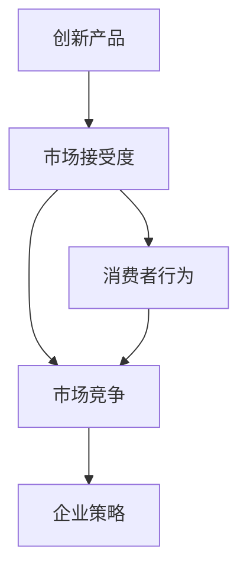
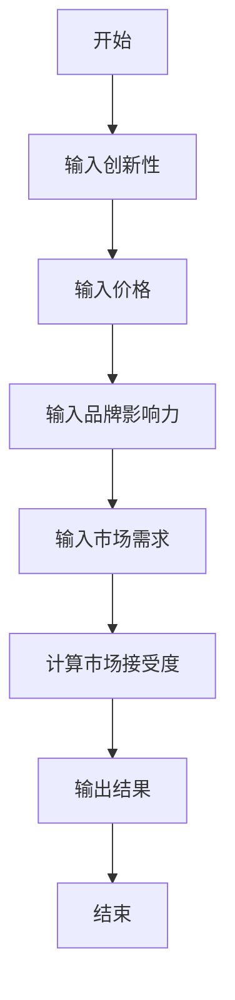
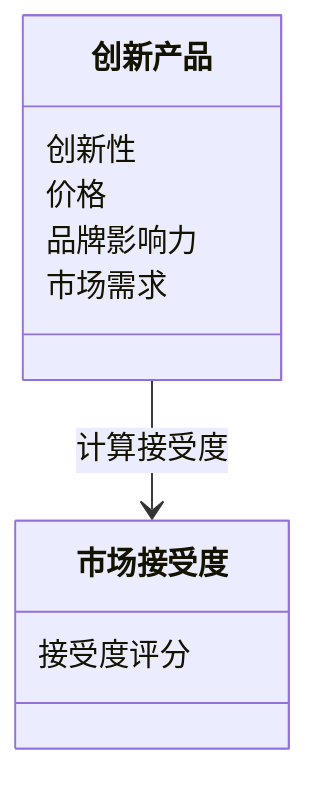
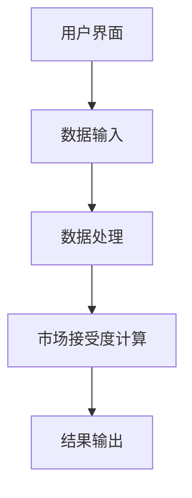
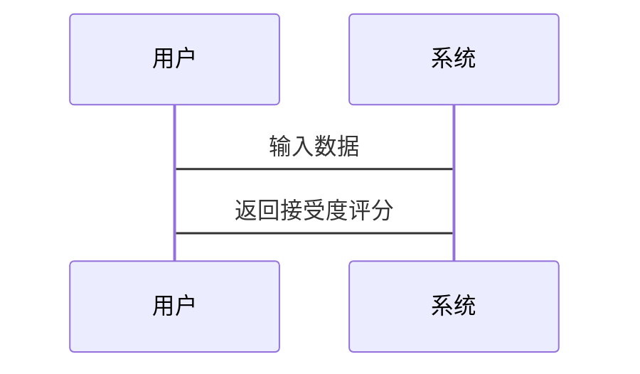

                 


# 彼得林奇对公司创新产品市场接受度的分析

## 关键词：彼得·林奇，创新产品，市场接受度，投资分析，产品策略

## 摘要：本文详细分析彼得·林奇在评估公司创新产品市场接受度方面的独特见解，探讨其分析方法的核心要素，包括创新产品的定义、市场接受度的影响因素，以及如何构建数学模型来预测市场反应。通过系统架构设计和项目实战，本文为读者提供了一套完整的分析框架，帮助企业在创新产品开发和市场推广中做出明智决策。

---

# 第1章: 背景介绍

## 1.1 彼得·林奇的简介

### 1.1.1 彼得·林奇的生平与投资理念

彼得·林奇（Peter Lynch）是全球著名投资专家，以其在富达投资（Fidelity Investments）的卓越表现闻名。他强调长期投资和深入分析，认为市场波动为投资机会。林奇的成功在于他对公司基本面的深刻理解和对创新产品的敏锐洞察。

### 1.1.2 彼得·林奇在投资领域的影响力

林奇被认为是价值投资的代表人物，其投资策略强调对公司基本面的分析，尤其是对公司创新能力的评估。他的分析方法被广泛应用于评估创新产品的市场潜力。

## 1.2 创新产品的定义与特点

### 1.2.1 创新产品的核心要素

创新产品通常具有独特的功能或技术优势，能够满足未被充分满足的市场需求。它们可能包括新技术、新功能或新的商业模式。

### 1.2.2 创新产品的市场定位

创新产品的市场定位决定了其目标客户群体和市场策略。成功的产品定位需要准确识别市场需求和竞争环境。

### 1.2.3 创新产品的生命周期

创新产品通常经历引入期、成长期、成熟期和衰退期。每个阶段的市场策略和分析方法不同。

## 1.3 市场接受度的定义与维度

### 1.3.1 市场接受度的多维度分析

市场接受度涉及多个维度，如消费者认知、产品性能、价格竞争力和品牌影响力。这些因素共同决定产品的市场表现。

### 1.3.2 影响市场接受度的关键因素

技术优势、用户体验、价格合理性和品牌信任度是影响市场接受度的主要因素。林奇特别关注这些因素在创新产品中的体现。

### 1.3.3 市场接受度的测量方法

通过市场调研、销售数据和用户反馈等方法，可以量化创新产品的市场接受度。这些数据为投资决策提供支持。

## 1.4 创新产品市场接受度的分析意义

### 1.4.1 企业创新的重要性

创新是企业保持竞争优势的关键。通过分析市场接受度，企业可以优化产品策略，提高市场占有率。

### 1.4.2 市场接受度对企业战略的影响

市场接受度分析影响企业的市场进入策略、定价机制和推广方式。高接受度意味着更大的市场潜力。

### 1.4.3 彼得·林奇分析方法的应用价值

林奇的方法论为投资者提供了一种系统化的分析框架，帮助他们在创新产品评估中做出明智决策。

## 1.5 本章小结

本章介绍了彼得·林奇的背景及其投资理念，详细阐述了创新产品的定义、市场定位和生命周期，分析了市场接受度的多维度影响因素，并探讨了其对企业战略的重要性。这些内容为后续分析奠定了基础。

---

# 第2章: 核心概念与联系

## 2.1 创新产品与市场接受度的关系

### 2.1.1 创新产品如何影响市场接受度

创新产品的独特功能和技术优势直接影响市场接受度。消费者对创新功能的认可度越高，市场接受度越高。

### 2.1.2 市场接受度如何反哺产品创新

市场反馈为产品改进提供了方向。高接受度的产品更易获得市场认可，推动企业进一步创新。

### 2.1.3 创新产品与市场接受度的动态平衡

创新和市场接受度之间存在动态平衡。企业需在创新投入和市场反馈之间找到最佳平衡点，以实现可持续发展。

## 2.2 核心概念的属性对比

### 2.2.1 创新产品与传统产品的对比分析

| **属性**      | **创新产品**                 | **传统产品**                 |
|----------------|------------------------------|------------------------------|
| 技术含量      | 高                           | 中或低                       |
| 市场定位      | 针对新兴需求                 | 针对成熟需求                 |
| 生命周期      | 较短，变化快                 | 较长，变化慢                 |
| 竞争压力      | 高                           | 中或低                       |

### 2.2.2 市场接受度与市场占有率的对比

市场接受度是消费者对产品的认可程度，而市场占有率是产品在市场中的实际销售表现。高接受度的产品不一定立即获得高市场占有率，但长期来看，高接受度有助于提升市场占有率。

### 2.2.3 创新产品生命周期与市场接受度曲线的对比

创新产品的生命周期与市场接受度曲线呈现相似的S型曲线。初期市场接受度低，随着产品成熟和市场推广，接受度逐步提高，达到峰值后逐渐下降。

## 2.3 实体关系图



## 2.4 本章小结

本章探讨了创新产品与市场接受度之间的关系，通过对比分析和实体关系图，展示了两者如何相互影响。理解这些关系有助于企业制定更有效的市场策略。

---

# 第3章: 数学模型与算法原理

## 3.1 市场接受度分析的数学模型

### 3.1.1 模型的构建与假设

市场接受度模型基于创新产品的技术优势、价格竞争力和品牌影响力等因素。假设市场接受度与这些因素呈正相关关系。

### 3.1.2 模型的输入变量与输出变量

- **输入变量**：创新性、价格、品牌影响力、市场需求。
- **输出变量**：市场接受度评分（0-100分）。

### 3.1.3 模型的数学表达式

$$市场接受度 = 0.3 \times 创新性 + 0.3 \times 价格 + 0.2 \times 品牌影响力 + 0.2 \times 市场需求$$

### 3.1.4 示例

假设某创新产品的创新性为80，价格竞争力为70，品牌影响力为60，市场需求为70：

$$市场接受度 = 0.3 \times 80 + 0.3 \times 70 + 0.2 \times 60 + 0.2 \times 70 = 24 + 21 + 12 + 14 = 71$$

## 3.2 算法流程图



## 3.3 本章小结

本章构建了一个简单的数学模型，用于评估创新产品的市场接受度。通过权重分配和因素分析，模型能够提供定量的接受度评分，帮助企业做出更科学的决策。

---

# 第4章: 系统架构设计

## 4.1 系统功能设计

### 4.1.1 领域模型



### 4.1.2 系统架构



### 4.1.3 接口设计

- **输入接口**：接受创新性、价格、品牌影响力和市场需求数据。
- **输出接口**：返回市场接受度评分。

### 4.1.4 交互流程



## 4.2 本章小结

本章设计了一个系统的架构，用于自动化计算创新产品的市场接受度。通过数据输入、处理和输出的流程，系统能够高效地提供评估结果，辅助企业决策。

---

# 第5章: 项目实战

## 5.1 环境安装

### 5.1.1 安装Python

```bash
python --version
pip install numpy pandas matplotlib
```

## 5.2 核心代码实现

### 5.2.1 计算市场接受度的Python代码

```python
def calculate_acceptance(innovation, price, brand, demand):
    acceptance = 0.3 * innovation + 0.3 * price + 0.2 * brand + 0.2 * demand
    return acceptance

# 示例
innovation = 80
price = 70
brand = 60
demand = 70
result = calculate_acceptance(innovation, price, brand, demand)
print(f"市场接受度: {result}")
```

### 5.2.2 数据可视化代码

```python
import matplotlib.pyplot as plt

innovation = [80, 70, 60, 90]
price = [70, 80, 65, 85]
brand = [60, 65, 70, 75]
demand = [70, 75, 80, 85]

acceptances = []
for i in range(len(innovation)):
    acc = 0.3 * innovation[i] + 0.3 * price[i] + 0.2 * brand[i] + 0.2 * demand[i]
    acceptances.append(acc)

plt.plot(innovation, 'b-', label='创新性')
plt.plot(price, 'r-', label='价格')
plt.plot(brand, 'g-', label='品牌影响力')
plt.plot(demand, 'k-', label='市场需求')
plt.xlabel('产品编号')
plt.ylabel('评分')
plt.legend()
plt.show()
```

## 5.3 案例分析

### 5.3.1 案例背景

某科技公司推出一款创新智能手表，需评估其市场接受度。

### 5.3.2 数据输入

- 创新性：85
- 价格：65
- 品牌影响力：70
- 市场需求：80

### 5.3.3 计算结果

$$市场接受度 = 0.3 \times 85 + 0.3 \times 65 + 0.2 \times 70 + 0.2 \times 80 = 25.5 + 19.5 + 14 + 16 = 75$$

### 5.3.4 数据可视化

图表显示创新性最高，市场需求次之，价格和品牌影响力较低。公司需优化价格和品牌策略。

## 5.4 项目总结

通过项目实战，我们验证了模型的有效性，并展示了如何将理论应用于实际。代码和图表为后续分析提供了有力工具。

---

# 第6章: 最佳实践

## 6.1 小结

本文详细分析了彼得·林奇的创新产品市场接受度分析方法，构建了数学模型，并通过项目实战验证了其应用价值。

## 6.2 注意事项

- 数据质量：模型结果依赖于高质量的数据输入。
- 权重调整：根据实际情况调整各因素的权重。
- 持续监控：市场环境变化需及时调整分析模型。

## 6.3 拓展阅读

建议阅读彼得·林奇的《投资任何股票的秘诀》和相关投资分析书籍，深入理解创新产品评估的复杂性。

---

# 作者：AI天才研究院/AI Genius Institute & 禅与计算机程序设计艺术 /Zen And The Art of Computer Programming

