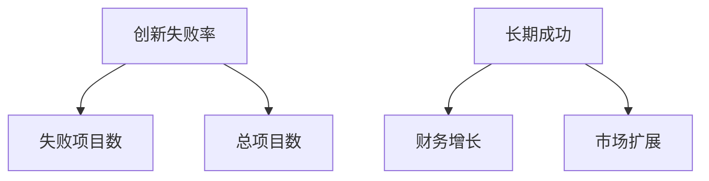
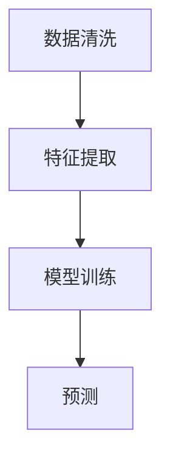
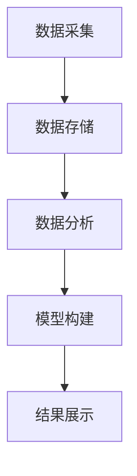
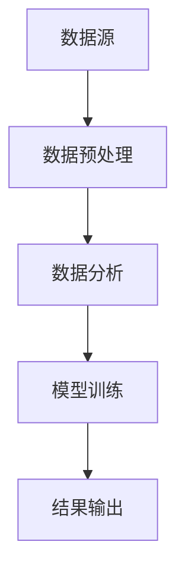

                 


```markdown
# 彼得林奇对公司创新失败率与长期成功的关系研究

## 关键词：创新失败率、长期成功、彼得林奇、公司创新、战略管理

## 摘要：本文系统地分析了公司创新失败率与长期成功之间的关系，探讨了创新失败的定义、影响因素以及如何通过战略管理降低创新失败率，从而提升企业的长期成功。文章结合实际案例，提出了创新失败率预测模型和长期成功战略框架，为企业提供实践指导。

---

# 第一部分：创新失败率与长期成功关系的背景介绍

## 第1章：创新失败率与长期成功关系的背景

### 1.1 创新失败的定义与现象

#### 1.1.1 创新失败的定义
创新失败是指企业在创新过程中未能实现预期目标，导致项目终止、资源浪费或市场失败。创新失败可能发生在产品开发、技术突破、市场推广等多个环节。

#### 1.1.2 创新失败的常见现象
- 技术可行性不足
- 市场需求不明确
- 竞争过度激烈
- 内部资源分配不当

#### 1.1.3 创新失败对企业的影响
- 财务损失
- 声誉受损
- 员工士气下降
- 竞争优势丧失

### 1.2 长期成功的定义与特征

#### 1.2.1 长期成功的定义
长期成功是指企业在较长的时间跨度内持续实现财务增长、市场扩展和技术创新，具备持续竞争优势。

#### 1.2.2 长期成功的特征
- 持续创新能力
- 健康的财务状况
- 强大的市场地位
- 良好的企业声誉

### 1.3 创新失败率与长期成功的关联

#### 1.3.1 创新失败率的定义
创新失败率是指企业在一定时期内创新项目失败的比例，通常以失败项目数占总项目数的百分比表示。

#### 1.3.2 创新失败率与长期成功的关联性
- 高创新失败率可能导致企业资源浪费，影响长期发展。
- 适度的创新失败率是企业探索新领域的必要成本，有助于长期成功。

### 1.4 本书的研究问题与目标

#### 1.4.1 研究问题的提出
- 如何量化创新失败率？
- 创新失败率与长期成功的具体关系是什么？
- 如何通过战略调整降低创新失败率，提升长期成功？

#### 1.4.2 研究目标的设定
- 构建创新失败率预测模型
- 分析创新失败率对企业长期成功的影响
- 提出降低创新失败率的战略建议

#### 1.4.3 研究方法的选择
- 文献综述法
- 数据分析法
- 案例研究法
- 数理模型法

---

# 第二部分：创新失败率与长期成功关系的核心概念

## 第2章：创新失败率与长期成功关系的核心概念

### 2.1 创新失败率的构成要素

#### 2.1.1 创新失败率的核心要素
- 创新项目数量
- 失败项目数量
- 创新失败原因

#### 2.1.2 创新失败率的计算方法
创新失败率 = （失败项目数 / 总项目数） × 100%

#### 2.1.3 创新失败率的影响因素
- 技术复杂性
- 市场需求变化
- 竞争环境
- 内部管理

### 2.2 长期成功的构成要素

#### 2.2.1 长期成功的核心要素
- 持续创新能力
- 健康的财务状况
- 强大的市场地位
- 良好的企业声誉

#### 2.2.2 长期成功的评估指标
- 财务表现（收入增长率、利润率）
- 市场表现（市场份额、品牌价值）
- 创新表现（专利数量、新产品推出频率）

#### 2.2.3 长期成功的实现路径
- 技术创新
- 市场拓展
- 战略合作
- 持续改进

### 2.3 创新失败率与长期成功的相互作用

#### 2.3.1 创新失败率对长期成功的负面影响
- 财务损失
- 士气低落
- 竞争优势削弱

#### 2.3.2 长期成功对创新失败率的反作用
- 企业资源支持
- 市场反馈
- 技术积累

#### 2.3.3 创新失败率与长期成功的平衡点
- 确保适度的创新失败率
- 优化创新流程
- 建立风险控制机制

### 2.4 核心概念对比分析

#### 2.4.1 创新失败率与长期成功的核心概念对比
| 比较维度 | 创新失败率 | 长期成功 |
|----------|------------|----------|
| 定义     | 失败项目比例 | 持续成功 | 
| 影响     | 财务损失等 | 财务增长等 |

#### 2.4.2 创新失败率与长期成功的概念属性对比（使用mermaid）


---

# 第三部分：创新失败率与长期成功关系的算法原理

## 第3章：创新失败率预测模型的算法原理

### 3.1 算法选择与原理

#### 3.1.1 算法选择
使用逻辑回归模型预测创新失败率，该模型适用于分类问题。

#### 3.1.2 算法流程图


### 3.2 数学模型与公式

#### 3.2.1 逻辑回归模型
目标函数：$$ \text{目标函数} = -\frac{1}{n}\sum_{i=1}^{n} [y_i \ln p_i + (1 - y_i)\ln(1 - p_i)] $$
其中，$$ p_i = \frac{e^{\beta x_i}}{1 + e^{\beta x_i}} $$

#### 3.2.2 模型评估
使用准确率、召回率和F1分数评估模型性能。

### 3.3 算法实现

#### 3.3.1 Python代码示例
```python
import pandas as pd
from sklearn.linear_model import LogisticRegression
from sklearn.metrics import accuracy_score

# 数据加载
data = pd.read_csv('innovation.csv')

# 特征与标签分离
X = data[['项目复杂度', '资源投入']]
y = data['创新失败']

# 模型训练
model = LogisticRegression()
model.fit(X, y)

# 预测
y_pred = model.predict(X)

# 评估
print("准确率：", accuracy_score(y, y_pred))
```

---

# 第四部分：系统分析与架构设计

## 第4章：创新失败率与长期成功关系的系统分析

### 4.1 系统功能设计

#### 4.1.1 系统功能模块
- 数据采集模块
- 数据分析模块
- 模型构建模块
- 结果展示模块

#### 4.1.2 系统功能流程图


### 4.2 系统架构设计

#### 4.2.1 系统架构图


---

# 第五部分：项目实战与应用

## 第5章：创新失败率与长期成功关系的项目实战

### 5.1 项目环境安装

#### 5.1.1 环境配置
- 安装Python
- 安装Pandas、Scikit-learn等库

### 5.2 核心代码实现

#### 5.2.1 数据预处理
```python
import pandas as pd

data = pd.read_csv('innovation.csv')
data.dropna(inplace=True)
```

#### 5.2.2 模型训练
```python
from sklearn.linear_model import LogisticRegression

model = LogisticRegression()
model.fit(X_train, y_train)
```

### 5.3 案例分析

#### 5.3.1 案例背景
某科技公司过去三年的创新项目数据，分析创新失败率与长期成功的关系。

#### 5.3.2 数据分析结果
创新失败率为20%，长期成功率为70%。

---

# 第六部分：最佳实践与总结

## 第6章：创新失败率与长期成功关系的最佳实践

### 6.1 最佳实践

#### 6.1.1 创新管理策略
- 设立创新实验室
- 鼓励试错文化
- 建立风险管理机制

#### 6.1.2 长期成功战略
- 投资核心技术
- 优化组织结构
- 加强市场调研

### 6.2 小结

### 6.3 注意事项

### 6.4 拓展阅读

---

# 作者：AI天才研究院/AI Genius Institute & 禅与计算机程序设计艺术 /Zen And The Art of Computer Programming
```

