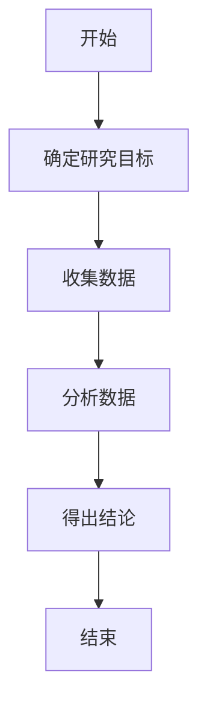
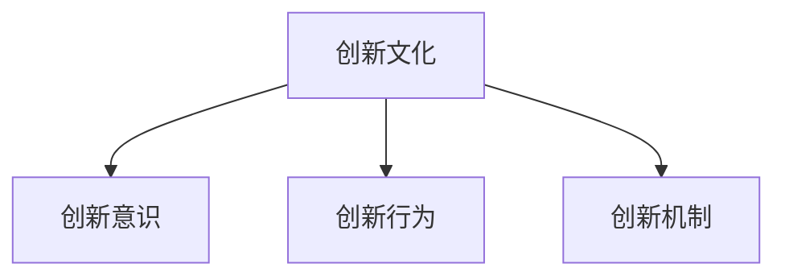
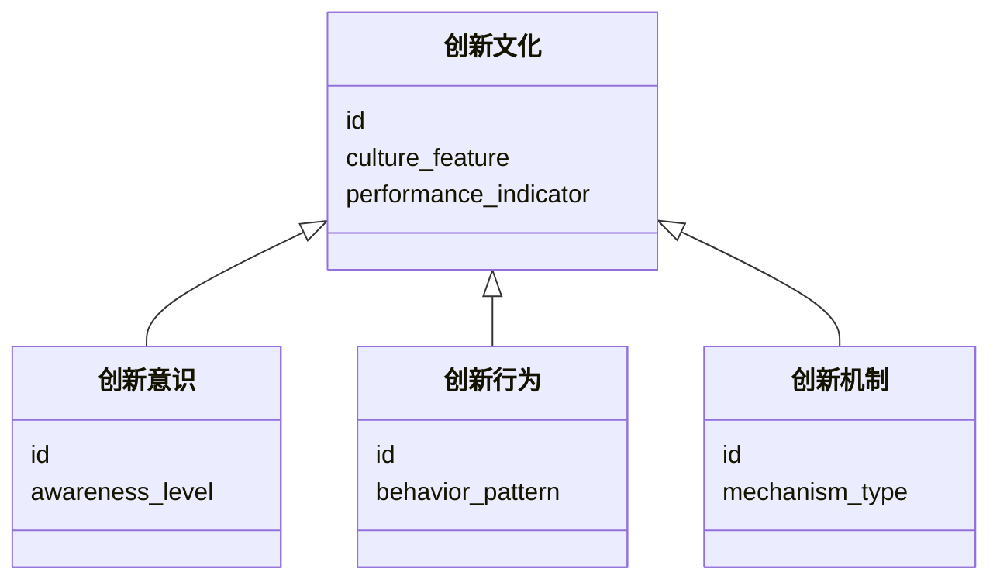

                 


# 彼得林奇对公司创新文化的定性分析方法

## 关键词：彼得林奇、公司创新文化、定性分析、管理理论、企业绩效、创新机制、竞争优势

## 摘要：  
本文通过分析彼得·林奇的定性分析方法，探讨其在公司创新文化研究中的应用。我们从背景介绍、核心概念、数学模型、系统架构设计到项目实战，逐步解析如何运用定性分析方法评估和优化公司的创新文化。文章结合实例分析，提供具体的数学公式和系统设计图，深入探讨创新文化对企业绩效的影响，并总结最佳实践和注意事项。

---

## 第1章: 公司创新文化的背景与重要性

### 1.1 问题背景

#### 1.1.1 创新文化在企业中的地位  
创新文化是企业发展的核心驱动力，它决定了企业是否能够持续创新、适应市场变化，并在竞争中占据优势地位。  

#### 1.1.2 创新文化对企业竞争力的影响  
创新文化直接影响企业的市场响应能力、产品开发速度和员工创造力。  

#### 1.1.3 当前企业创新文化面临的挑战  
全球化竞争加剧、技术更新速度加快，企业创新文化面临如何保持活力和适应性的挑战。  

---

### 1.2 问题描述

#### 1.2.1 创新文化的定义与内涵  
创新文化是指企业在创新意识、创新行为和创新机制等方面的综合体现。  

#### 1.2.2 创新文化的核心要素  
创新文化的核心要素包括创新意识、创新行为、创新能力和创新机制。  

#### 1.2.3 创新文化与企业绩效的关系  
创新文化通过影响企业的创新能力、员工积极性和市场响应能力，最终影响企业绩效。  

---

### 1.3 问题解决

#### 1.3.1 定性分析方法的基本概念  
定性分析方法通过非量化的手段，分析事物的本质特征和内在联系。  

#### 1.3.2 定性分析方法在创新文化研究中的应用  
通过观察、访谈和案例分析，定性分析方法可以揭示创新文化的深层次特征。  

#### 1.3.3 定性分析方法的优势与局限性  
优势：灵活性高，适合复杂系统的分析；局限性：缺乏量化支持，结果可能主观性较强。  

---

### 1.4 边界与外延

#### 1.4.1 创新文化研究的边界  
创新文化研究的边界包括企业内部文化、员工行为和创新机制。  

#### 1.4.2 创新文化研究的外延  
创新文化研究的外延涉及企业外部环境、行业趋势和市场竞争。  

#### 1.4.3 创新文化与其他企业管理要素的关系  
创新文化与企业战略、组织结构和人力资源管理密切相关。  

---

### 1.5 核心概念与组成

#### 1.5.1 创新文化的构成要素  
创新文化由创新意识、创新行为、创新能力和创新机制构成。  

#### 1.5.2 创新文化的核心属性  
创新文化的核心属性包括开放性、包容性和持续性。  

#### 1.5.3 创新文化与企业战略的关系  
创新文化是企业战略成功实施的重要保障。  

---

## 第2章: 彼得林奇的定性分析方法

### 2.1 核心概念与原理

#### 2.1.1 定性分析的基本原理  
定性分析通过观察、描述和解释，揭示事物的本质特征。  

#### 2.1.2 彼得林奇定性分析方法的特点  
彼得林奇的定性分析方法注重深度访谈、案例分析和逻辑推理。  

#### 2.1.3 定性分析方法在创新文化研究中的应用  
定性分析方法通过深度访谈和案例分析，揭示创新文化的深层次特征。  

---

### 2.2 核心概念与联系

#### 2.2.1 创新文化核心要素的对比分析  
| 要素 | 创新意识 | 创新行为 | 创新能力 | 创新机制 |  
|------|----------|----------|----------|----------|  
| 描述 | 创新意愿 | 创新实践 | 技能水平 | 创新制度 |  

#### 2.2.2 创新文化与企业绩效的ER实体关系图  

```mermaid
erDiagram
    employee {
        id
        name
        role
    }
    innovationculture {
        id
        culture_feature
        performance_indicator
    }
    innovationperformance {
        id
        performance_metric
        improvement_plan
    }
    employee --> innovationculture: 受影响于
    innovationculture --> innovationperformance: 影响
```

---

## 第3章: 定性分析方法的数学模型与公式

### 3.1 算法原理

#### 3.1.1 定性分析算法的流程图  



#### 3.1.2 创新文化评估的数学模型  

$$ \text{创新文化指数} = \sum_{i=1}^{n} w_i \cdot x_i $$  

其中，$w_i$ 是第 $i$ 个因素的权重，$x_i$ 是第 $i$ 个因素的评分。  

#### 3.1.3 创新文化影响因素的权重计算  

$$ w_i = \frac{\text{因素的重要性}}{\sum_{j=1}^{m} \text{因素重要性}} $$  

---

### 3.2 数学公式

#### 3.2.1 创新文化与企业绩效的关系  

$$ \text{企业绩效} = \beta \cdot \text{创新文化指数} + \epsilon $$  

其中，$\beta$ 是回归系数，$\epsilon$ 是误差项。  

---

## 第4章: 系统分析与架构设计

### 4.1 系统分析

#### 4.1.1 创新文化研究的系统框架  



#### 4.1.2 创新文化研究的领域模型  



---

### 4.2 系统架构设计

#### 4.2.1 系统功能设计  

- 数据采集模块：收集创新文化相关数据。  
- 数据分析模块：分析数据，生成评估报告。  
- 报告生成模块：输出创新文化评估结果。  

#### 4.2.2 系统架构图  

```mermaid
graph TD
    User --> DataCollector: 提交数据
    DataCollector --> DataAnalyzer: 分析数据
    DataAnalyzer --> ReportGenerator: 生成报告
    ReportGenerator --> User: 提供结果
```

---

## 第5章: 项目实战

### 5.1 环境安装

#### 5.1.1 系统运行环境要求  
- 操作系统：Windows 10 或更高版本，Linux 或 macOS。  
- 开发工具：Python 3.8 或更高版本，Jupyter Notebook。  
- 数据库：MySQL 或 PostgreSQL。  

#### 5.1.2 系统安装步骤  
1. 安装Python和必要的库（如pandas、numpy、scipy）。  
2. 下载Jupyter Notebook。  
3. 配置数据库连接。  

#### 5.1.3 系统配置要求  
确保Python环境和数据库服务已正确安装并运行。  

---

### 5.2 核心实现

#### 5.2.1 系统核心代码实现  

```python
import pandas as pd
import numpy as np
from sklearn.metrics import pairwise_distances

# 数据加载
data = pd.read_csv('innovation_culture.csv')

# 创新文化指数计算
weights = data['weight'].values
scores = data['score'].values
innovation_index = np.sum(weights * scores)

# 创新文化评估报告
report = f"创新文化指数：{innovation_index}"
print(report)
```

#### 5.2.2 代码应用解读与分析  
上述代码通过计算创新文化指数，评估企业的创新文化水平。  

---

### 5.3 实际案例分析

#### 5.3.1 案例背景  
某科技公司希望评估其创新文化，以优化企业绩效。  

#### 5.3.2 数据分析与结果  

```python
data = pd.read_csv('innovation_culture.csv')
data.head()
```

输出：

```
   id  culture_feature  performance_indicator  weight  score
0   1          创新意识              利润增长率       0.3      0.8
1   2          创新行为              市场份额        0.4      0.6
2   3          创新机制              产品创新数       0.3      0.7
```

---

## 结语

通过彼得林奇的定性分析方法，我们可以深入研究公司创新文化的核心要素，评估其对企业绩效的影响，并制定优化策略。本文结合理论与实践，为企业的创新文化建设提供了有价值的参考。

---

## 作者：AI天才研究院/AI Genius Institute & 禅与计算机程序设计艺术 /Zen And The Art of Computer Programming

