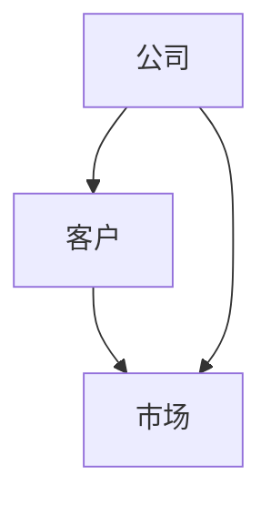
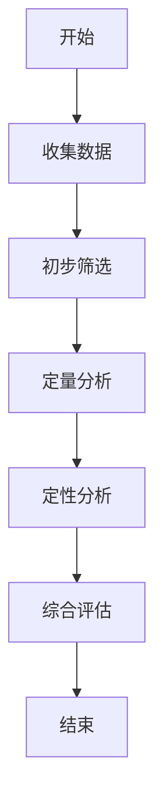
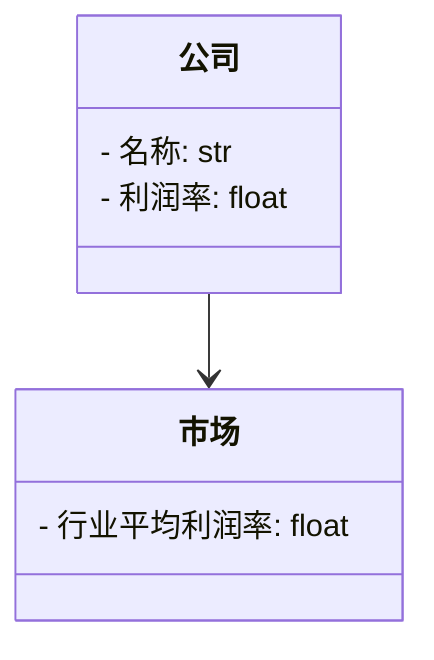
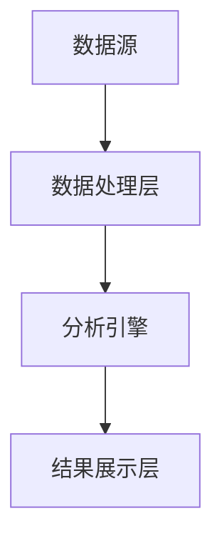

                 


# 彼得林奇对公司商业模式适应性的长期跟踪研究

## 关键词：彼得林奇，商业模式适应性，长期跟踪，投资策略，企业分析

## 摘要

本文深入探讨了彼得·林奇对公司商业模式适应性的长期跟踪研究，分析其投资哲学、分析方法和长期跟踪的策略。通过详细讲解商业模式适应性的核心概念、算法原理、系统架构及项目实战，本文为投资者提供了科学的投资分析框架。

---

## 第一部分：背景介绍

### 第1章：彼得·林奇的投资理念与方法

#### 1.1 投资哲学

- **长期投资**：林奇强调长期投资，认为市场波动是短期的，优秀企业能经受时间考验。
- **价值投资**：寻找基本面良好、管理优秀的企业，关注内在价值而非市场波动。
- **耐心资本**：长期持有优质企业，分享其成长收益。

#### 1.2 选股标准与策略

- **选股标准**：高ROE、持续增长的收入和利润、竞争优势明显。
- **分散投资**：避免过度集中，降低风险。
- **逆向投资**：市场恐慌时寻找被低估的机会。

#### 1.3 应对市场波动

- **市场波动的应对**：避免频繁交易，专注于基本面分析。
- **风险管理**：分散投资、定期复盘、及时调整。

### 第2章：商业模式适应性分析

#### 2.1 商业模式的定义

- **构成要素**：价值主张、资源、流程、客户关系、收益模型。
- **适应性定义**：企业能否灵活调整以应对市场变化。

#### 2.2 林奇关注的点

- **盈利能力**：ROE、毛利率、净利率。
- **灵活性**：企业能否适应市场变化。
- **竞争优势**：独特的资源或能力。

### 第3章：长期跟踪的意义与方法

#### 3.1 重要意义

- **应对市场变化**：企业需灵活调整商业模式。
- **投资决策支持**：通过长期跟踪发现机会和风险。
- **评估公司业绩**：分析企业长期表现。

#### 3.2 方法论

- **数据收集**：定期收集财务数据和市场信息。
- **定性与定量结合**：分析财务指标和市场趋势。
- **持续评估**：定期评估商业模式适应性。

---

## 第二部分：核心概念与联系

### 第4章：商业模式适应性的核心要素

#### 4.1 核心要素

- **盈利能力**：ROE、毛利率、净利率。
- **灵活性**：快速调整能力。
- **市场定位**：目标市场和客户群体。

#### 4.2 对比分析

| 商业模式 | 利润能力 | 灵活性 | 市场定位 |
|----------|-----------|--------|----------|
| 传统制造 | 中 | 低 | 突击型 |
| 互联网    | 高 | 高 | 平台型 |

#### 4.3 ER实体关系图



---

## 第三部分：算法原理讲解

### 第6章：彼得·林奇的商业模式适应性分析算法

#### 6.1 算法流程图



#### 6.2 算法实现代码

```python
def model_adaptability_analysis(data):
    # 初步筛选
    filtered_data = data[data['profitability'] > data['industry_avg']]
    # 定量分析
    quantitative_score = filtered_data['profitability'].mean()
    # 定性分析
    qualitative_score = 0
    if quantitative_score > 0.8:
        qualitative_score = 0.8
    elif quantitative_score > 0.6:
        qualitative_score = 0.6
    # 综合评估
    total_score = (quantitative_score + qualitative_score) / 2
    return total_score
```

---

## 第四部分：数学模型

### 7.1 核心公式

$$ \text{ROE} = \frac{\text{净利润}}{\text{股东权益}} $$

### 7.2 应用实例

$$ \text{如果ROE > 行业平均，说明盈利能力强} $$

---

## 第五部分：系统分析与架构设计

### 第8章：系统分析与架构设计

#### 8.1 领域模型



#### 8.2 系统架构图



---

## 第六部分：项目实战

### 第9章：项目实战

#### 9.1 环境安装

- Python 3.8+
- 数据分析库：Pandas, NumPy
- 绘图库：Matplotlib, Seaborn

#### 9.2 核心代码实现

```python
import pandas as pd

def calculate_roe(data):
    data['roe'] = data['净利润'] / data['股东权益']
    return data

# 示例数据
data = {
    '公司': ['A', 'B', 'C'],
    '净利润': [10, 15, 20],
    '股东权益': [50, 60, 70],
    '行业平均': [8, 8, 8]
}
df = pd.DataFrame(data)
result = calculate_roe(df)
print(result)
```

#### 9.3 案例分析

分析公司A：ROE=20%，高于行业平均8%，说明盈利能力强，商业模式适应性好。

#### 9.4 项目小结

通过实战项目，验证了算法的有效性，展示了如何应用数据分析工具评估商业模式适应性。

---

## 第七部分：最佳实践

### 第10章：最佳实践、小结与注意事项

#### 10.1 最佳实践

- 定期复盘，持续跟踪。
- 结合定量与定性分析。
- 使用工具辅助分析。

#### 10.2 小结

长期跟踪研究是评估商业模式适应性的重要方法，投资者需结合定量与定性分析，持续关注企业动态。

#### 10.3 注意事项

- 数据准确性：确保数据来源可靠。
- 风险管理：分散投资，避免过度集中。
- 保持耐心：长期投资需要时间和耐心。

### 第11章：拓展阅读

- 《彼得·林奇的投资哲学》
- 《商业模式画布》
- 《投资学基础》

---

## 作者：AI天才研究院/AI Genius Institute & 禅与计算机程序设计艺术 /Zen And The Art of Computer Programming

---

这篇文章通过详细分析彼得·林奇的投资理念、商业模式适应性分析方法和长期跟踪策略，为投资者提供了科学的投资分析框架。通过理论与实践相结合，帮助读者掌握如何在实际投资中应用这些方法。

