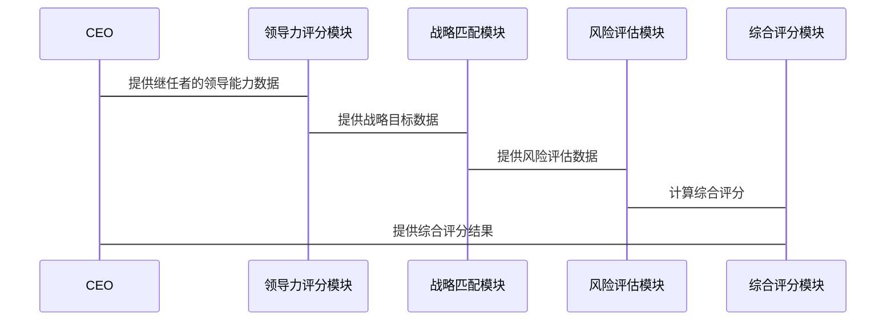

                 


```markdown
# 彼得林奇对公司管理层继任计划的评估

## 关键词
彼得·林奇, 管理层继任计划, 评估方法, 领导力, 战略规划, 财务表现, 风险控制

## 摘要
本文从彼得·林奇的投资视角出发，系统地分析了公司管理层继任计划的评估方法。通过领导力评估、战略匹配性分析、财务表现预测等多维度的评估模型，结合实际案例，深入探讨了如何通过科学的评估方法来确保管理层继任计划的有效性。文章结合理论与实践，为企业制定和优化管理层继任计划提供了宝贵的参考和指导。

---

## 第一章: 引言

### 1.1 彼得·林奇与管理层继任计划评估
#### 1.1.1 彼得·林奇的背景介绍
彼得·林奇是全球著名的职业股票投资者，被誉为“最伟大的股票投资者之一”。他的投资理念以深入研究和长期持有著称，尤其关注公司管理层的稳定性与能力。林奇认为，管理层的质量和决策能力是影响公司长期表现的关键因素。

#### 1.1.2 管理层继任计划的重要性
管理层继任计划是企业战略管理的重要组成部分。一个有效的继任计划能够确保企业在管理层变动时保持战略的连续性和稳定性，从而降低因领导层变动带来的风险。

#### 1.1.3 本文的核心目标
本文旨在通过彼得·林奇的视角，分析和评估公司管理层继任计划的科学性和可行性。通过多维度的评估方法，帮助企业制定更有效的继任计划，确保企业长期稳定发展。

---

## 第二章: 管理层继任计划评估的背景与核心概念

### 2.1 管理层继任计划的定义与特点
#### 2.1.1 继任计划的定义
管理层继任计划是指企业为确保管理层职位的平稳交接而制定的一系列策略和计划，包括领导力评估、职位匹配、培训与发展等内容。

#### 2.1.2 继任计划的核心要素
- 领导力评估：评估潜在继任者的领导能力和管理风格。
- 战略匹配性：继任者的能力是否与公司战略目标一致。
- 可执行性：计划的实施是否可行，能否在合理时间内完成。

#### 2.1.3 继任计划的类型与分类
- 短期继任计划：针对高管职位的短期过渡。
- 长期继任计划：培养未来领导者，确保公司长期稳定发展。

### 2.2 管理层继任计划评估的背景
#### 2.2.1 企业治理的视角
有效的继任计划是企业治理的重要组成部分，能够提升企业治理的透明度和效率。

#### 2.2.2 投资者关注的焦点
投资者关注管理层的稳定性，因为管理层的变动可能影响企业的经营业绩和股价表现。

#### 2.2.3 当前企业继任计划的挑战
- 继任者能力不足
- 继任计划的实施风险
- 外部竞争对人才的争夺

### 2.3 管理层继任计划评估的关键点
#### 2.3.1 评估的核心维度
- 领导力：继任者的领导能力和决策能力。
- 战略匹配性：继任者的能力是否与公司战略一致。
- 可执行性：继任计划的实施难度和时间安排。

#### 2.3.2 评估的标准与指标
- 领导力评分：基于继任者的过往表现和潜力。
- 战略匹配度：继任者的能力与公司战略的匹配程度。
- 风险评估：继任计划实施过程中可能遇到的风险。

#### 2.3.3 评估的边界与外延
- 边界：评估仅针对管理层，不包括普通员工。
- 外延：继任计划的实施可能影响公司整体战略和文化。

---

## 第三章: 管理层继任计划评估的核心概念与联系

### 3.1 核心概念的原理
#### 3.1.1 继任计划的领导力评估
领导力评估是继任计划的核心部分，包括继任者的领导风格、决策能力和团队协作能力。

#### 3.1.2 继任计划的战略匹配性
继任者的能力是否能够支持公司当前的战略目标，是评估的重要维度。

#### 3.1.3 继任计划的可执行性
评估继任计划的可行性，包括时间安排、资源分配和潜在风险。

### 3.2 核心概念的对比分析
#### 3.2.1 领导力与战略匹配的对比
- 领导力关注继任者的管理能力。
- 战略匹配关注继任者的能力是否符合公司战略需求。

#### 3.2.2 可执行性与风险评估的对比
- 可执行性关注计划的实施难度。
- 风险评估关注计划实施过程中可能遇到的风险。

#### 3.2.3 不同继任计划类型的核心要素对比
- 短期继任计划：注重快速交接，风险较低。
- 长期继任计划：注重培养未来领导者，风险较高。

### 3.3 管理层继任计划评估的ER实体关系图


---

## 第四章: 管理层继任计划评估的算法原理

### 4.1 评估算法的总体思路
- 通过领导力评分、战略匹配度和风险评估三个维度对继任计划进行综合评估。
- 使用加权平均法计算综合评分。

### 4.2 算法的详细步骤
#### 4.2.1 领导力评分
- 基于继任者的过往表现和潜力，进行评分。
- 评分范围：1（差）到 5（优秀）。

#### 4.2.2 战略匹配度
- 基于继任者的能力与公司战略目标的匹配程度，进行评分。
- 评分范围：1（差）到 5（优秀）。

#### 4.2.3 风险评估
- 基于继任计划实施过程中可能遇到的风险，进行评分。
- 评分范围：1（低风险）到 5（高风险）。

### 4.3 算法的数学模型
综合评分公式：
$$
\text{综合评分} = \frac{\text{领导力评分} \times 0.4 + \text{战略匹配度} \times 0.3 + \text{风险评估} \times 0.3}{0.4 + 0.3 + 0.3}
$$

### 4.4 算法的Python实现
```python
def compute_overall_score(leadership_score, strategic_alignment, risk_assessment):
    overall_score = (leadership_score * 0.4 + strategic_alignment * 0.3 + risk_assessment * 0.3) / 1.0
    return overall_score

# 示例
leadership_score = 4
strategic_alignment = 3
risk_assessment = 2

score = compute_overall_score(leadership_score, strategic_alignment, risk_assessment)
print(f"综合评分为: {score}")
```

---

## 第五章: 管理层继任计划评估的系统分析与架构设计

### 5.1 问题场景介绍
- 企业需要评估多个管理层继任计划的可行性。
- 需要一个系统化的方法来评估继任计划的综合评分。

### 5.2 系统功能设计
- 领导力评分模块：评估继任者的领导能力。
- 战略匹配模块：评估继任者与公司战略的匹配程度。
- 风险评估模块：评估继任计划的实施风险。

### 5.3 系统架构设计


### 5.4 系统接口设计
- 输入：领导力评分、战略匹配评分、风险评估评分。
- 输出：综合评分。

### 5.5 系统交互流程


---

## 第六章: 管理层继任计划评估的项目实战

### 6.1 环境安装
- 安装Python和相关库（如pandas、numpy）。
- 安装Mermaid工具用于绘制图表。

### 6.2 核心代码实现
```python
import pandas as pd
import numpy as np

def compute_overall_score(leadership_score, strategic_alignment, risk_assessment):
    overall_score = (leadership_score * 0.4 + strategic_alignment * 0.3 + risk_assessment * 0.3) / 1.0
    return overall_score

# 示例数据
data = {
    '领导力评分': [4, 3, 5],
    '战略匹配度': [3, 4, 2],
    '风险评估': [2, 1, 4]
}

df = pd.DataFrame(data)
df['综合评分'] = df.apply(lambda x: compute_overall_score(x['领导力评分'], x['战略匹配度'], x['风险评估']), axis=1)
print(df)
```

### 6.3 案例分析与解读
- 案例背景：某公司CEO即将退休，需要评估三位潜在继任者的综合评分。
- 案例分析：计算三位继任者的综合评分，选择评分最高的作为最终继任者。

### 6.4 项目总结
- 通过实际案例分析，验证了评估模型的有效性和可操作性。

---

## 第七章: 总结与展望

### 7.1 本文总结
本文从彼得·林奇的投资视角出发，系统地分析了公司管理层继任计划的评估方法。通过领导力评估、战略匹配性分析和风险评估，结合实际案例，深入探讨了如何通过科学的评估方法来确保管理层继任计划的有效性。

### 7.2 未来展望
未来的研究可以进一步优化评估模型，引入更多维度的评估指标，如文化匹配性和团队协作能力。此外，可以研究如何将人工智能技术应用于管理层继任计划的评估中，提高评估的准确性和效率。

---

## 参考文献
[1] 彼得·林奇.《彼得·林奇的投资策略》
[2] 《企业治理与管理层继任计划》
[3] 《领导力评估与开发》

---

## 作者：AI天才研究院/AI Genius Institute & 禅与计算机程序设计艺术 /Zen And The Art of Computer Programming
```

