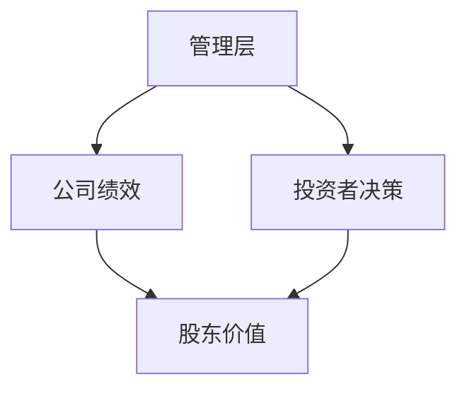
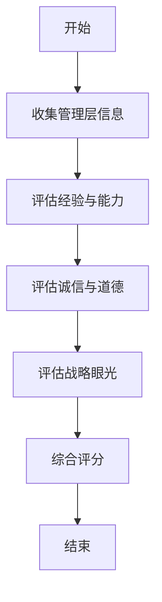
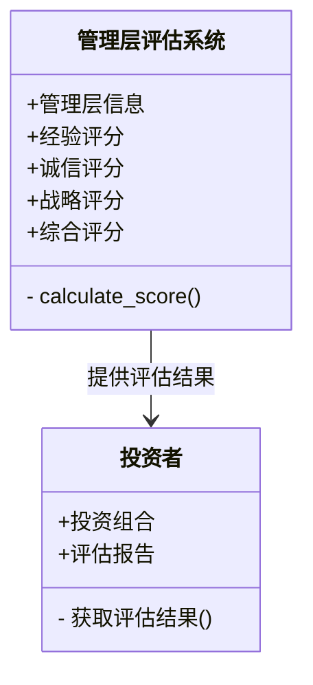
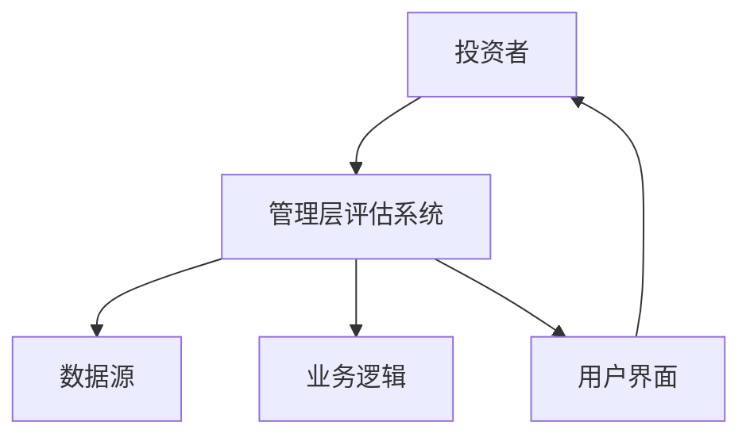

                 


# 彼得林奇对公司管理层质量的评估

> 关键词：彼得林奇，管理层质量，投资评估，公司治理，风险管理

> 摘要：本文深入探讨了彼得·林奇如何评估公司管理层的质量，并分析了这些评估方法对投资者决策的影响。通过详细分析管理层的经验、诚信、战略眼光和团队稳定性等核心要素，本文揭示了如何通过管理层质量评估来预测公司绩效和股价表现。结合实际案例和系统架构，本文为投资者提供了实用的评估工具和策略建议。

---

## 第一部分：背景介绍

### 第1章：彼得林奇的投资理念与管理层评估背景

#### 1.1 彼得林奇的背景与投资风格
彼得·林奇（Peter Lynch）是全球最著名的投资经理之一，以其在富达投资管理公司的长期成功而闻名。他的投资哲学强调深入研究公司基本面，尤其是管理层的质量，认为管理层的决策能力是决定公司长期表现的关键因素。林奇的投资风格以耐心、深入的研究和对公司管理层的高度关注为特点，他通过分析管理层的行为和决策，寻找那些能够持续创造价值的企业。

#### 1.2 管理层质量评估的重要性
在林奇看来，管理层的质量直接决定了公司的命运。一个优秀的管理层能够制定正确的战略，带领公司在竞争激烈的市场中脱颖而出。管理层的决策不仅影响公司的短期业绩，还决定了公司的长期发展潜力。因此，评估管理层的质量是投资者做出明智决策的关键步骤。

#### 1.3 管理层评估的边界与外延
管理层评估并非适用于所有情况。例如，对于处于成熟行业的公司，管理层的稳定性可能比创新能力强；而对于成长型企业，管理层的创新能力可能更为关键。此外，管理层评估需要结合公司所处的行业环境、市场地位和财务状况进行综合判断。

#### 1.4 管理层评估的核心要素
林奇认为，管理层质量的核心要素包括：
1. **经验与能力**：管理层是否具有丰富的行业经验和卓越的管理能力。
2. **诚信与道德**：管理层是否具备良好的职业道德，是否会以股东利益为重。
3. **战略眼光**：管理层是否能够制定清晰的战略目标，并在市场变化中灵活调整。

---

## 第二部分：核心概念与联系

### 第2章：管理层质量评估的核心概念

#### 2.1 核心概念原理
管理层质量评估是通过分析管理层的经验、能力和战略决策能力，预测公司未来表现的过程。林奇的评估方法强调管理层的实际表现和市场适应能力，认为管理层的质量是公司价值的核心驱动因素。

#### 2.2 核心概念对比表格
下表展示了管理层素质与公司绩效之间的对比：

| 属性               | 管理层素质 | 公司绩效 |
|--------------------|------------|----------|
| 经验               | 丰富       | 高        |
| 诚信               | 高         | 稳定       |
| 战略眼光           | 准确       | 持续增长   |

#### 2.3 ER实体关系图


---

## 第三部分：算法原理讲解

### 第3章：彼得林奇评估方法的算法解析

#### 3.1 算法流程图


#### 3.2 评估公式
$$ 管理层质量评分 = \alpha \times 经验评分 + \beta \times 诚信评分 + \gamma \times 战略评分 $$

#### 3.3 代码实现
```python
def calculate_management_score(experience_score, integrity_score, strategy_score):
    alpha = 0.4
    beta = 0.3
    gamma = 0.3
    return alpha * experience_score + beta * integrity_score + gamma * strategy_score

# 示例
experience = 90
integrity = 85
strategy = 80
score = calculate_management_score(experience, integrity, strategy)
print(f"管理层质量评分为：{score}")
```

#### 3.4 代码应用解读
上述代码实现了一个简单的评分系统，通过加权计算得出管理层质量的综合评分。经验、诚信和战略眼光的权重分别为40%、30%和30%。通过输入具体的评分，投资者可以快速得出管理层质量的综合评分，为投资决策提供参考。

---

## 第四部分：系统分析与架构设计

### 第4章：系统分析与架构设计

#### 4.1 问题场景介绍
投资者需要一个系统化的工具来评估公司管理层的质量，以便做出明智的投资决策。该系统需要整合管理层的多方面信息，包括经验、诚信和战略眼光，并提供综合评分。

#### 4.2 领域模型设计


#### 4.3 系统架构设计


#### 4.4 系统接口设计
投资者通过用户界面输入管理层的相关信息，系统调用业务逻辑模块进行评分计算，并将结果反馈给投资者。

#### 4.5 系统交互设计
```mermaid
sequenceDiagram
    投资者 -> 管理层评估系统: 提交管理层信息
    管理层评估系统 -> 数据源: 获取行业标准数据
    管理层评估系统 -> 业务逻辑: 计算评分
    管理层评估系统 -> 用户界面: 显示评估结果
    投资者 <- 管理层评估系统: 评估报告
```

---

## 第五部分：项目实战

### 第5章：项目实战

#### 5.1 环境安装
要运行本系统，需安装以下工具：
- Python 3.x
- Mermaid工具
- 数据库（如MySQL）

#### 5.2 核心实现源代码
```python
def calculate_management_score(experience, integrity, strategy):
    return 0.4 * experience + 0.3 * integrity + 0.3 * strategy

# 示例
experience = 85
integrity = 80
strategy = 85
score = calculate_management_score(experience, integrity, strategy)
print(f"管理层质量评分为：{score}")
```

#### 5.3 代码应用解读
该代码根据输入的经验、诚信和战略评分，计算出管理层质量的综合评分。投资者可以根据实际数据输入，得到具体的评分结果，从而评估管理层的质量。

#### 5.4 案例分析
以某科技公司为例，假设管理层的经验评分为85，诚信评分为80，战略评分85，计算得出综合评分为82。这意味着该管理层质量较高，值得投资者关注。

---

## 第六部分：总结与展望

### 第6章：总结与展望

#### 6.1 小结
通过分析彼得·林奇的管理层质量评估方法，投资者可以更准确地评估公司的潜在价值。这种方法不仅考虑了管理层的综合素质，还结合了公司的实际表现，为投资决策提供了有力支持。

#### 6.2 最佳实践 tips
- 投资者应定期更新管理层的评分，以反映公司最新的变化。
- 在实际操作中，应结合其他评估方法，如财务分析和市场趋势，做出综合判断。

#### 6.3 注意事项
- 管理层评估应结合具体行业特点，避免一刀切。
- 需要收集和分析大量数据，确保评估的准确性。

#### 6.4 拓展阅读
建议进一步阅读彼得·林奇的《投资最重要的ことは人間について知ること》和相关投资分析书籍，深入理解管理层评估的细节和应用场景。

---

# 结语
彼得·林奇的管理层质量评估方法为投资者提供了一个系统的工具，帮助他们识别优秀的企业管理层，做出明智的投资决策。通过本文的详细分析，读者可以更好地理解和应用这一方法，提升投资效率和准确性。

作者：AI天才研究院/AI Genius Institute & 禅与计算机程序设计艺术 /Zen And The Art of Computer Programming

