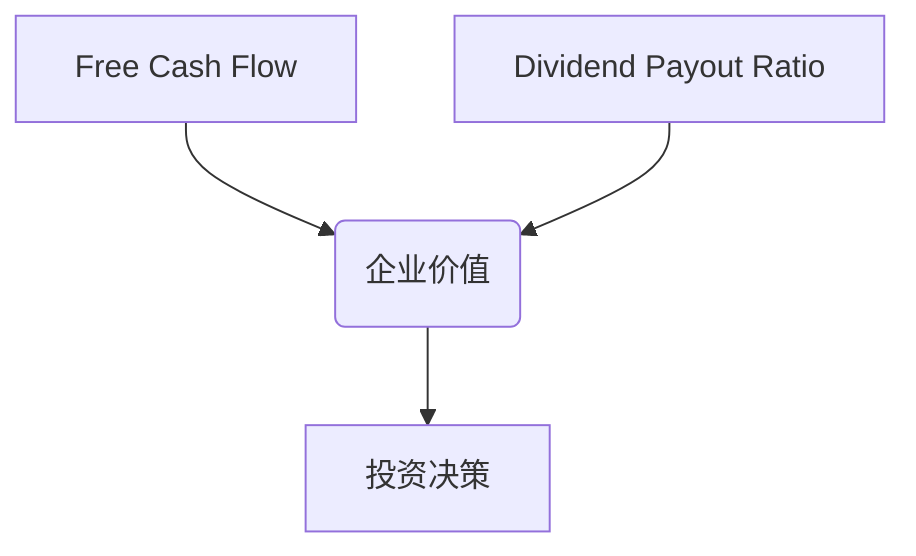
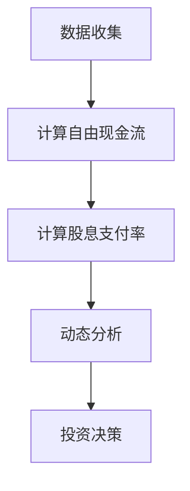
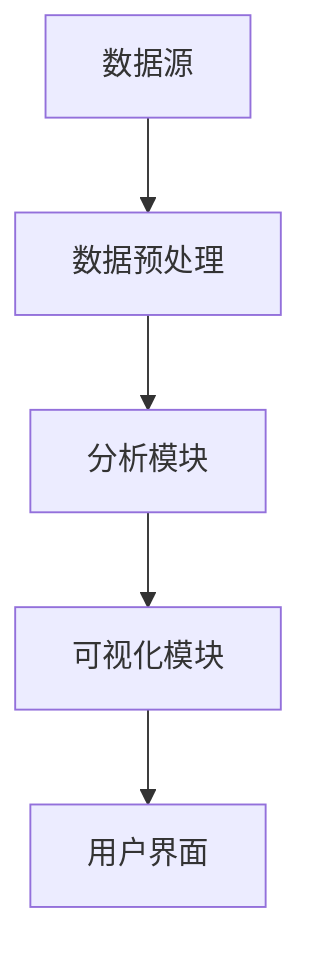
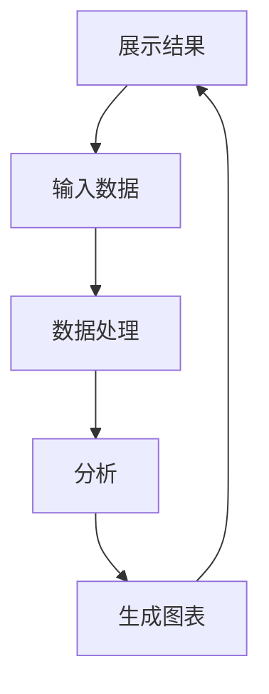

                 


# 彼得林奇对公司自由现金流与股息支付率关系的动态分析

---

## 关键词

- 自由现金流
- 股息支付率
- 动态分析
- 投资决策
- 彼得·林奇

---

## 摘要

本文深入探讨了自由现金流（Free Cash Flow，FCF）与股息支付率（Dividend Payout Ratio，DPR）之间的动态关系，分析了它们如何共同影响企业的财务健康和投资价值。通过结合彼得·林奇的投资理念，文章提出了一种动态分析方法，帮助投资者优化投资决策。文章从核心概念、算法原理、系统架构到项目实战，全面解析了如何利用这两个指标评估企业价值，优化投资组合，并提供了可操作的实战指南。

---

# 目录大纲

---

## 第一部分：背景介绍

### 第1章：自由现金流与股息支付率的核心概念

#### 1.1 问题背景

- 1.1.1 投资者关注的财务指标
- 1.1.2 自由现金流与股息支付率的定义
- 1.1.3 两者关系对企业价值的影响

#### 1.2 问题描述

- 1.2.1 自由现金流的计算与意义
- 1.2.2 股息支付率的计算与意义
- 1.2.3 两者关系的动态变化

#### 1.3 问题解决

- 1.3.1 通过动态分析评估企业价值
- 1.3.2 结合两者的动态变化优化投资决策

#### 1.4 边界与外延

- 1.4.1 自由现金流与股息支付率的适用范围
- 1.4.2 与其他财务指标的关系
- 1.4.3 动态分析的局限性

#### 1.5 概念结构与核心要素

- 1.5.1 自由现金流的构成要素
- 1.5.2 股息支付率的构成要素
- 1.5.3 两者关系的核心要素

---

## 第二部分：核心概念与联系

### 第2章：自由现金流与股息支付率的原理与对比

#### 2.1 核心概念原理

- 2.1.1 自由现金流的计算公式
  $$\text{自由现金流} = \text{净利润} - \text{非现金支出}$$

- 2.1.2 股息支付率的计算公式
  $$\text{股息支付率} = \frac{\text{股息支付总额}}{\text{净利润}} \times 100\%$$

#### 2.2 属性特征对比

| 指标 | 定义 | 重要性 | 计算公式 |
|------|------|--------|----------|
| 自由现金流 | 净利润减去非现金支出 | 评估企业财务健康 | $$\text{FCF} = \text{净利润} - \text{非现金支出}$$ |
| 股息支付率 | 股息支付总额占净利润的比例 | 评估股东回报 | $$\text{DPR} = \frac{\text{股息支付总额}}{\text{净利润}} \times 100\%$$ |

#### 2.3 ER实体关系图架构



---

## 第三部分：算法原理讲解

### 第3章：动态分析模型

#### 3.1 算法步骤

1. **数据收集**：获取公司历史财务数据。
2. **计算自由现金流**：
   $$\text{FCF}_t = \text{净利润}_t - \text{非现金支出}_t$$
3. **计算股息支付率**：
   $$\text{DPR}_t = \frac{\text{股息支付总额}_t}{\text{净利润}_t} \times 100\%$$
4. **动态分析**：比较FCF和DPR的变化趋势，评估企业财务健康和投资价值。

#### 3.2 Mermaid流程图



#### 3.3 Python代码实现

```python
import pandas as pd

def calculate_fcf(net_income, non_cash_expenses):
    return net_income - non_cash_expenses

def calculate DPR(dividends_paid, net_income):
    return (dividends_paid / net_income) * 100

# 示例数据
data = {
    '年份': [2020, 2021, 2022],
    '净利润': [100, 120, 150],
    '非现金支出': [20, 25, 30],
    '股息支付总额': [10, 15, 20]
}

df = pd.DataFrame(data)

df['自由现金流'] = df.apply(lambda x: calculate_fcf(x['净利润'], x['非现金支出']), axis=1)
df['股息支付率'] = df.apply(lambda x: calculate_DPR(x['股息支付总额'], x['净利润']), axis=1)

print(df)
```

---

## 第四部分：系统分析与架构设计方案

### 第4章：系统架构设计

#### 4.1 项目介绍

- 系统目标：动态分析自由现金流与股息支付率的关系。
- 项目范围：数据收集、分析、可视化。

#### 4.2 系统功能设计

- 数据收集模块：从财务报表获取数据。
- 分析模块：计算FCF和DPR，动态分析。
- 可视化模块：生成图表展示结果。

#### 4.3 系统架构设计



#### 4.4 接口设计

- 数据接口：与数据库交互。
- 分析接口：调用算法模块。
- 可视化接口：生成图表。

#### 4.5 交互流程



---

## 第五部分：项目实战

### 第5章：环境安装与代码实现

#### 5.1 环境安装

- Python 3.8+
- Pandas、Matplotlib库

#### 5.2 核心代码实现

```python
import pandas as pd
import matplotlib.pyplot as plt

def calculate_fcf(net_income, non_cash_expenses):
    return net_income - non_cash_expenses

def calculate_DPR(dividends_paid, net_income):
    return (dividends_paid / net_income) * 100

# 示例数据
data = {
    '年份': [2020, 2021, 2022],
    '净利润': [100, 120, 150],
    '非现金支出': [20, 25, 30],
    '股息支付总额': [10, 15, 20]
}

df = pd.DataFrame(data)

df['自由现金流'] = df.apply(lambda x: calculate_fcf(x['净利润'], x['非现金支出']), axis=1)
df['股息支付率'] = df.apply(lambda x: calculate_DPR(x['股息支付总额'], x['净利润']), axis=1)

print(df)

# 可视化
plt.figure(figsize=(10, 6))
plt.plot(df['年份'], df['自由现金流'], label='自由现金流')
plt.plot(df['年份'], df['股息支付率'], label='股息支付率')
plt.xlabel('年份')
plt.ylabel('值')
plt.title('自由现金流与股息支付率的动态关系')
plt.legend()
plt.show()
```

#### 5.3 案例分析

- 通过实际数据，分析某公司FCF和DPR的变化趋势，评估其投资价值。

---

## 第六部分：最佳实践

### 第6章：总结与展望

#### 6.1 小结

- 动态分析FCF和DPR，优化投资决策。
- 结合彼得·林奇的投资理念，提升分析深度。

#### 6.2 注意事项

- 数据质量的重要性。
- 动态分析的局限性。
- 结合其他财务指标进行综合分析。

#### 6.3 拓展阅读

- 彼得·林奇的投资策略。
- 其他财务指标分析方法。

---

## 第七部分：总结与展望

### 第7章：总结与展望

#### 7.1 总结

- 本文通过动态分析FCF和DPR的关系，提供了优化投资决策的方法。
- 结合彼得·林奇的投资理念，深入解析了两个指标的动态变化。

#### 7.2 展望

- 进一步研究多指标动态分析。
- 开发自动化分析工具，提升投资效率。

---

## 作者

作者：AI天才研究院/AI Genius Institute & 禅与计算机程序设计艺术 /Zen And The Art of Computer Programming

---

通过以上目录大纲，文章内容将全面覆盖自由现金流与股息支付率的关系分析，结合理论与实践，为投资者提供实用的指导。

