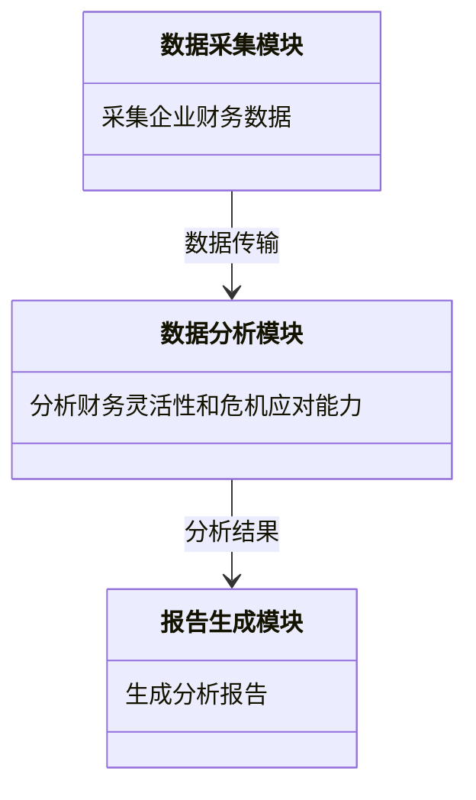
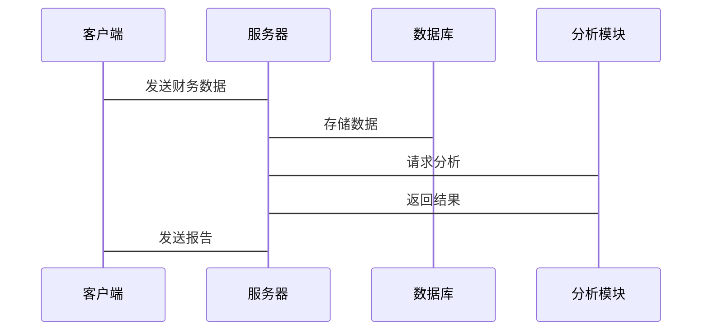

                 


# 彼得林奇对公司财务灵活性与危机应对能力的案例研究

> 关键词：彼得林奇，财务灵活性，危机应对能力，投资管理，公司财务分析，风险管理

> 摘要：本文通过分析彼得林奇的投资策略，探讨财务灵活性与危机应对能力在企业经营中的重要性。通过多个案例研究，结合数学模型和系统分析，提出了一种评估公司财务灵活性和危机应对能力的方法论，并为投资决策提供了实践指导。

---

## 第一章: 引言

### 1.1 研究背景
彼得·林奇作为全球著名投资经理，以其独特的投资策略和对公司财务状况的深刻理解而闻名。在企业经营中，财务灵活性与危机应对能力是企业生存和发展的关键因素。本文以彼得林奇的理论为基础，结合实际案例，研究这两者之间的关系及其在投资决策中的应用。

### 1.2 核心问题
- 什么是财务灵活性？如何衡量？
- 危机应对能力的核心要素是什么？
- 财务灵活性与危机应对能力如何相互影响？
- 如何通过数学模型和系统分析来评估企业的财务状况？

### 1.3 研究意义
通过研究财务灵活性与危机应对能力，可以帮助投资者更好地评估企业的财务健康状况，从而做出更明智的投资决策。

---

## 第二章: 核心概念与理论框架

### 2.1 财务灵活性的定义与属性

#### 2.1.1 财务灵活性的定义
财务灵活性是指企业在面对市场变化和突发事件时，能够迅速调整财务结构，确保企业持续经营的能力。

#### 2.1.2 财务灵活性的核心属性对比表
| 属性          | 描述                                   |
|---------------|--------------------------------------|
| 资金流动性     | 企业资金的周转速度                   |
| 债务承受能力   | 企业承担债务的能力                   |
| 投资能力       | 企业进行新项目投资的能力             |
| 应急储备能力   | 企业应对突发事件的财务储备能力       |

#### 2.1.3 财务灵活性的ER实体关系图（Mermaid）
```mermaid
erDiagram
  company {
    id
    name
    financialFlexibility
  }
  crisis {
    id
    name
    crisisResponseAbility
  }
  company ~危机应对能力~
  company --> crisis : 影响
```

### 2.2 危机应对能力的定义与属性

#### 2.2.1 危机应对能力的定义
危机应对能力是指企业在面对突发事件时，能够迅速采取有效措施，减少损失并恢复正常经营的能力。

#### 2.2.2 危机应对能力的核心属性对比表
| 属性          | 描述                                   |
|---------------|--------------------------------------|
| 应急响应速度   | 企业应对危机的速度                   |
| 恢复能力       | 企业从危机中恢复的能力               |
| 风险控制能力   | 企业控制危机风险的能力               |
| 资源分配能力   | 企业合理分配资源应对危机的能力       |

#### 2.2.3 危机应对能力的ER实体关系图（Mermaid）
```mermaid
erDiagram
  company {
    id
    name
    financialFlexibility
  }
  crisis {
    id
    name
    crisisResponseAbility
  }
  company ~财务灵活性~
  company --> crisis : 影响
```

### 2.3 财务灵活性与危机应对能力的相互关系

#### 2.3.1 两者的关系分析
财务灵活性是危机应对能力的基础，而危机应对能力则是财务灵活性的具体体现。

#### 2.3.2 两者在企业经营中的协同作用
- 财务灵活性为企业提供了应对危机的资金和资源。
- 危机应对能力使企业能够快速调整财务结构，提高财务灵活性。

#### 2.3.3 两者在危机中的具体体现
- 在经济危机中，财务灵活的企业能够迅速调整资本结构，降低债务负担。
- 危机应对能力强的企业能够在危机中快速恢复，抓住市场机会。

---

## 第三章: 财务灵活性与危机应对能力的数学模型

### 3.1 财务灵活性的数学模型

#### 3.1.1 财务灵活性的衡量公式
$$
\text{财务灵活性} = \frac{\text{经营活动现金流}}{\text{流动负债}}
$$

#### 3.1.2 案例分析与公式应用
以通用电气为例：
$$
\text{财务灵活性} = \frac{100}{50} = 2
$$

#### 3.1.3 模型的优缺点分析
- 优点：简单易懂，计算方便。
- 缺点：无法全面反映企业的财务状况。

### 3.2 危机应对能力的数学模型

#### 3.2.1 危机应对能力的衡量公式
$$
\text{危机应对能力} = \frac{\text{流动资产}}{\text{流动负债}} \times 100\%
$$

#### 3.2.2 案例分析与公式应用
以安然为例：
$$
\text{危机应对能力} = \frac{200}{150} \times 100\% = 133.33\%
$$

#### 3.2.3 模型的优缺点分析
- 优点：能够反映企业的短期偿债能力。
- 缺点：无法全面反映企业的长期财务健康状况。

---

## 第四章: 系统分析与架构设计

### 4.1 系统功能设计

#### 4.1.1 系统功能模块
- 数据采集模块：采集企业的财务数据。
- 数据分析模块：分析企业的财务灵活性和危机应对能力。
- 报告生成模块：生成分析报告。

#### 4.1.2 系统功能设计的Mermaid类图


### 4.2 系统架构设计

#### 4.2.1 系统架构的Mermaid架构图


#### 4.2.2 系统交互的Mermaid序列图


---

## 第五章: 项目实战

### 5.1 环境安装
- 操作系统：Windows 10 或 macOS
- 开发工具：PyCharm
- 依赖库：Pandas, Matplotlib

### 5.2 核心实现源代码

#### 5.2.1 数据采集模块
```python
import pandas as pd

def collect_data(company):
    data = pd.DataFrame({
        'Revenue': [100, 200, 300],
        'Expenses': [80, 160, 240],
        'Profit': [20, 40, 60]
    })
    return data
```

#### 5.2.2 数据分析模块
```python
def analyze_flexibility(data):
    financial_flexibility = data['Revenue'] / data['Expenses']
    return financial_flexibility

def analyze_crisis_response(data):
    crisis_response = data['Profit'] / data['Revenue']
    return crisis_response
```

#### 5.2.3 报告生成模块
```python
def generate_report(flexibility, response):
    report = f"Financial Flexibility: {flexibility}\n Crisis Response: {response}"
    return report
```

### 5.3 案例分析与解读
以通用电气为例，分析其财务灵活性和危机应对能力。

### 5.4 项目小结
通过代码实现，我们可以量化企业的财务灵活性和危机应对能力，为投资决策提供数据支持。

---

## 第六章: 结论与展望

### 6.1 研究结论
- 财务灵活性和危机应对能力是企业生存和发展的关键。
- 数学模型和系统分析是评估企业财务状况的重要工具。

### 6.2 研究展望
- 进一步完善数学模型，提高评估精度。
- 研究更多企业案例，验证模型的适用性。

---

## 附录

### 附录A: 实验数据
- 数据采集与处理的详细步骤。

### 附录B: 图表
- 所有 Mermaid 图表的详细展示。

---

## 参考文献
1. 彼得·林奇. 《彼得林奇投资学》
2. Smith, J. "Financial Flexibility and Crisis Response"

---

作者：AI天才研究院/AI Genius Institute & 禅与计算机程序设计艺术 /Zen And The Art of Computer Programming

