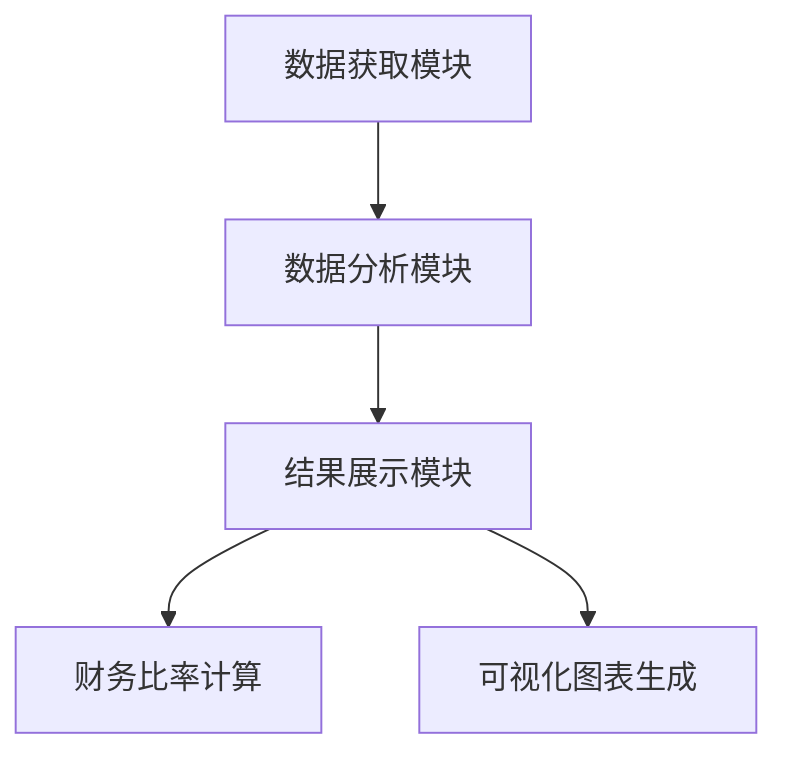

                 


# 彼得林奇对公司资产负债表的解读技巧

> 关键词：彼得林奇，资产负债表，财务分析，投资技巧，公司估值

> 摘要：本文将详细介绍彼得·林奇在解读公司资产负债表方面的独特技巧。通过分析资产负债表的核心要素，包括资产、负债和所有者权益，结合实际案例，深入探讨如何利用这些信息评估公司的财务健康状况和投资价值。文章还介绍了如何通过财务比率分析和行业比较来优化投资决策，并提供了基于Python的资产负债表分析系统架构和实现方法。

---

# 文章正文

## 第一部分：背景介绍

### 1.1 资产负债表的核心概念

资产负债表是反映企业在某一特定时期内财务状况的报表，主要包含资产、负债和所有者权益三个核心要素。这些要素之间的关系可以表示为：

$$资产 = 负债 + 所有者权益$$

资产代表企业拥有的资源，负债是企业需要偿还的债务，所有者权益则是企业在扣除负债后的剩余价值。

### 1.2 彼得·林奇的投资理念

彼得·林奇是全球著名的投资专家，以其独特的分析方法和对资产负债表的深入研究闻名。他认为，理解一家公司的财务状况是评估其投资价值的关键。以下是彼得·林奇分析资产负债表的核心要点：

1. **资产分析**：重点关注流动资产和非流动资产的构成，尤其是现金、应收账款和存货等关键指标。
2. **负债分析**：评估流动负债和长期负债的结构，识别潜在的偿债压力。
3. **所有者权益分析**：通过净资产收益率（ROE）等指标，评估公司利用股东资金的效率。

---

## 第二部分：资产负债表的核心要素分析

### 2.1 资产分析

#### 2.1.1 流动资产与非流动资产

流动资产是指可以在一年内变现或消耗的资产，主要包括：

- 现金及现金等价物
- 应收账款
- 存货
- 短期投资

非流动资产则是指长期使用的资产，如：

- 固定资产
- 无形资产
- 长期投资

#### 2.1.2 资产质量分析

资产的质量直接影响企业的偿债能力和运营效率。例如，高比例的应收账款可能意味着企业存在收款困难，从而增加流动性风险。

### 2.2 负债分析

#### 2.2.1 流动负债与长期负债

流动负债包括：

- 短期借款
- 应付账款
- 应付工资
- 税款

长期负债包括：

- 长期借款
- 债券发行
- 租赁负债

#### 2.2.2 负债比率分析

通过计算流动比率（Current Ratio）和速动比率（Quick Ratio）等指标，可以评估企业的短期偿债能力：

$$流动比率 = \frac{流动资产}{流动负债}$$

$$速动比率 = \frac{流动资产 - 存货}{流动负债}$$

### 2.3 所有者权益分析

#### 2.3.1 净资产收益率（ROE）

净资产收益率是衡量公司盈利能力的重要指标：

$$ROE = \frac{净利润}{平均净资产}$$

---

## 第三部分：财务比率分析

### 3.1 流动比率与速动比率

#### 3.1.1 流动比率的意义

流动比率衡量企业短期偿债能力，通常认为合理的流动比率应保持在2:1左右。

#### 3.1.2 速动比率的意义

速动比率进一步排除存货的影响，更能反映企业的即时偿债能力。

### 3.2 负债率与资产负债率

#### 3.2.1 负债率的计算

$$负债率 = \frac{总负债}{总资产}$$

#### 3.2.2 资产负债率的计算

$$资产负债率 = \frac{总负债}{总资产}$$

---

## 第四部分：行业分析与公司比较

### 4.1 行业分析的重要性

不同行业的资产负债表结构差异显著，例如制造业和科技企业的资产构成完全不同。

### 4.2 公司比较

通过横向比较同行业内的公司，可以识别出财务状况更健康、投资价值更高的标的。

---

## 第五部分：彼得林奇的分析框架

### 5.1 资产负债表的结构分析

彼得·林奇强调，资产负债表的结构能够揭示企业的财务健康状况和潜在风险。

#### 5.1.1 流动资产与流动负债的匹配

通过分析流动资产与流动负债的匹配程度，可以评估企业的短期偿债能力。

### 5.2 非流动资产与非流动负债的评估

非流动资产和非流动负债的合理匹配是企业长期稳定发展的关键。

---

## 第六部分：基于Python的资产负债表分析系统

### 6.1 系统架构设计

#### 6.1.1 系统功能模块

- 数据获取模块：从财务报表中提取资产负债表数据。
- 数据分析模块：计算各项财务比率，生成可视化图表。
- 结果展示模块：以直观的方式呈现分析结果。

#### 6.1.2 系统架构图



### 6.2 系统实现

#### 6.2.1 环境安装

需要安装以下Python库：

```bash
pip install pandas matplotlib numpy
```

#### 6.2.2 核心代码实现

```python
import pandas as pd
import matplotlib.pyplot as plt

# 假设我们有一个名为balance_sheet.csv的资产负债表数据文件
df = pd.read_csv('balance_sheet.csv')

# 计算流动比率
current_assets = df['流动资产'].sum()
current_liabilities = df['流动负债'].sum()
current_ratio = current_assets / current_liabilities

# 计算速动比率
quick_assets = df['流动资产'].sum() - df['存货'].sum()
quick_ratio = quick_assets / current_liabilities

# 可视化图表
plt.figure(figsize=(10, 6))
plt.bar(['流动资产', '流动负债'], [current_assets, current_liabilities])
plt.title('流动资产与流动负债对比')
plt.show()
```

---

## 第七部分：实战案例分析

### 7.1 案例选择

以某制造企业为例，分析其资产负债表。

#### 7.1.1 数据清洗与处理

```python
# 清洗数据
df = df.dropna()
df = df[df['年份'] == 2022]
```

#### 7.1.2 财务比率计算

```python
# 计算净资产收益率
net_profit = df['净利润'].sum()
average_equity = (df['所有者权益'].sum() + df['所有者权益'].shift(1).sum()) / 2
roe = net_profit / average_equity
```

---

## 第八部分：总结与建议

### 8.1 总结

彼得·林奇的资产负债表分析方法为我们提供了一个系统的框架，通过深入分析资产、负债和所有者权益，结合财务比率和行业比较，能够有效评估企业的财务健康状况和投资价值。

### 8.2 建议

- **持续学习**：关注行业动态和财务报表的变化。
- **结合其他报表**：将资产负债表与利润表和现金流量表结合起来分析。
- **使用工具**：利用Python等工具提高分析效率和准确性。

---

# 作者信息

作者：AI天才研究院/AI Genius Institute & 禅与计算机程序设计艺术 /Zen And The Art of Computer Programming

---

通过以上步骤，我们系统地介绍了彼得·林奇对公司资产负债表的解读技巧，并结合实际案例和系统设计，帮助读者深入理解和应用这些分析方法。希望这篇文章能为您的投资决策提供有价值的参考。

