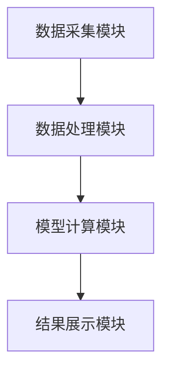

                 


# 彼得林奇的"价值陷阱"在新兴市场中的识别技巧

## 关键词：彼得林奇，价值陷阱，新兴市场，投资风险，股票分析，算法识别

## 摘要：  
本文深入探讨了彼得林奇提出的“价值陷阱”概念，并结合新兴市场的特点，分析了如何在复杂的新兴市场环境中识别和避免价值陷阱。文章从理论分析到算法实现，再到系统设计，详细介绍了价值陷阱的识别技巧，为投资者提供了实用的指导和工具。

---

## 第一部分: 彼得林奇的"价值陷阱"概述

### 第1章: 价值陷阱的核心概念

#### 1.1 价值陷阱的定义与背景

彼得林奇在投资领域提出了许多经典理论，其中“价值陷阱”是投资者最容易忽视但也最容易导致重大损失的概念之一。价值陷阱指的是那些看似具有吸引力的低估值股票，但实际上隐藏着严重的问题，如财务困境、管理不善或行业周期性风险。投资者如果盲目追求低估值，很容易陷入这些陷阱中。

#### 1.2 价值陷阱的形成机制与特征

价值陷阱的形成通常与市场的不完善、信息不对称以及投资者的非理性行为有关。其主要特征包括：

1. **低估值的表象**：股票价格远低于其内在价值，但这种估值可能是不合理的。
2. **高负债与财务困境**：公司可能面临高额债务，财务状况不稳定。
3. **经营不善与管理问题**：公司管理层可能存在重大问题，或公司业务模式存在严重缺陷。
4. **行业周期性与政策风险**：新兴市场中的行业可能受到周期性波动和政策变化的严重影响。

---

### 第2章: 新兴市场中的价值陷阱特点

#### 2.1 新兴市场的投资环境分析

新兴市场通常具有以下特点：

1. **高增长潜力**：新兴市场的经济增速通常高于成熟市场。
2. **波动性大**：新兴市场的股票价格波动较大，市场参与者较为激进。
3. **信息不透明**：新兴市场中的公司信息披露可能不完整，投资者获取信息的难度较大。
4. **政策风险高**：新兴市场中的政策变化可能对行业和公司产生重大影响。

#### 2.2 新兴市场与成熟市场的价值陷阱差异

在新兴市场中，价值陷阱的表现形式可能与成熟市场有所不同。例如：

- 新兴市场中的公司可能因为政策变化或行业周期性问题而陷入困境。
- 新兴市场的低估值股票可能隐藏着更大的财务风险和经营问题。

---

### 第3章: 价值陷阱识别的核心要素

#### 3.1 价值陷阱的关键特征

为了识别价值陷阱，我们需要关注以下几个关键特征：

1. **低估值的表象**：股票价格远低于行业平均水平或历史平均水平。
2. **高负债与财务困境**：公司资产负债率过高，或存在大量短期负债。
3. **经营不善与管理问题**：公司管理层可能存在重大问题，或公司业务模式存在严重缺陷。
4. **行业周期性与政策风险**：行业处于下行周期，或政策变化可能对行业产生重大影响。

#### 3.2 价值陷阱识别的逻辑框架

识别价值陷阱的逻辑框架可以分为以下几个步骤：

1. **确定投资目标与范围**：明确投资目标和范围，选择具有增长潜力的行业和公司。
2. **数据收集与初步筛选**：收集相关公司的财务数据和行业信息，进行初步筛选。
3. **财务分析与风险评估**：对筛选出的公司进行深入的财务分析，评估其财务状况和经营风险。
4. **综合判断与决策**：结合财务分析和行业分析，综合判断是否存在价值陷阱，并做出投资决策。

---

## 第二部分: 价值陷阱识别的算法与模型

### 第5章: 价值陷阱识别的算法原理

#### 5.1 价值陷阱识别的算法框架

价值陷阱识别的算法框架可以分为以下几个步骤：

1. **数据预处理**：清洗数据，去除无效数据，标准化数据。
2. **特征提取**：从财务数据中提取关键特征，如市盈率、市净率、资产负债率等。
3. **算法选择**：选择适合的机器学习算法，如决策树、随机森林等。
4. **模型训练**：使用训练数据训练模型，调整模型参数。
5. **模型验证**：使用验证数据验证模型的性能，优化模型。

#### 5.2 价值陷阱识别的算法实现

以下是基于机器学习的分类算法实现的代码示例：

```python
import pandas as pd
from sklearn.model_selection import train_test_split
from sklearn.ensemble import RandomForestClassifier
from sklearn.metrics import accuracy_score

# 数据加载
data = pd.read_csv('value_trap_dataset.csv')

# 特征提取
features = ['市盈率', '市净率', '资产负债率']
target = '是否价值陷阱'

# 数据分割
X = data[features]
y = data[target]
X_train, X_test, y_train, y_test = train_test_split(X, y, test_size=0.2, random_state=42)

# 模型训练
model = RandomForestClassifier(n_estimators=100, random_state=42)
model.fit(X_train, y_train)

# 模型验证
y_pred = model.predict(X_test)
print('准确率:', accuracy_score(y_test, y_pred))
```

---

### 第6章: 价值陷阱识别的数学模型

#### 6.1 价值陷阱识别的数学公式

以下是一个基于因子分析的多维度评价模型：

$$
\text{价值陷阱评分} = w_1 \times \text{市盈率} + w_2 \times \text{市净率} + w_3 \times \text{资产负债率}
$$

其中，$w_1, w_2, w_3$ 是各个因子的权重，通常通过主成分分析或其他方法确定。

---

## 第三部分: 价值陷阱识别的系统设计与实现

### 第7章: 价值陷阱识别系统的架构设计

#### 7.1 系统功能设计

1. **数据采集模块**：从数据库中获取公司财务数据和行业信息。
2. **数据处理模块**：清洗数据，提取关键特征。
3. **模型计算模块**：使用机器学习算法识别价值陷阱。
4. **结果展示模块**：将识别结果以可视化的方式展示。

#### 7.2 系统架构设计

以下是系统架构图：



---

## 结语

识别新兴市场中的价值陷阱需要投资者具备丰富的经验和专业的知识。通过结合彼得林奇的理论和现代算法，我们可以更有效地识别和避免价值陷阱，提高投资成功率。未来，随着技术的不断发展，价值陷阱的识别将更加智能化和精准化。

---

## 作者：AI天才研究院 & 禅与计算机程序设计艺术

