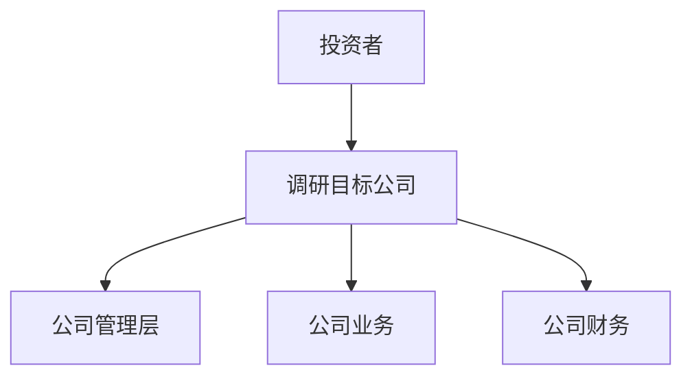
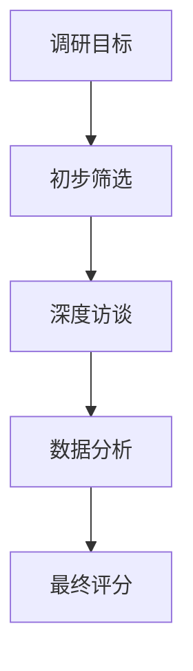
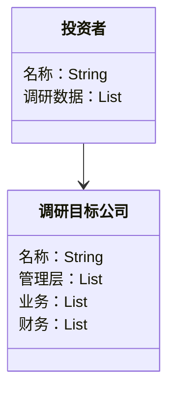
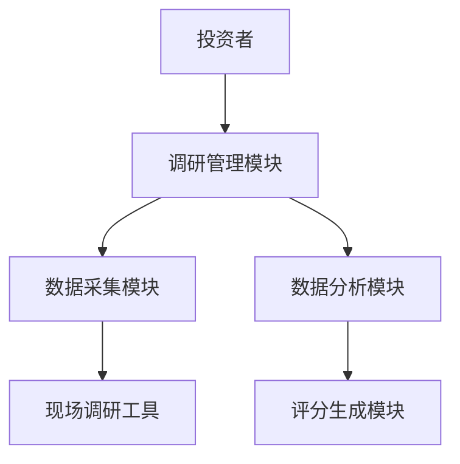
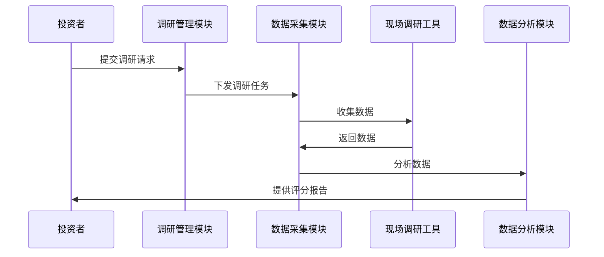

                 


# 彼得林奇的"实地调研"在不同行业的重点

## 关键词：彼得林奇、实地调研、投资方法、行业分析、风险管理

## 摘要：本文深入探讨了彼得·林奇的实地调研方法在不同行业中的应用重点，分析其背后的逻辑、算法原理及系统架构，并通过实际案例展示其在投资决策中的重要性。

---

## 第一部分: 彼得林奇的"实地调研"概述

### 第1章: 彼得林奇与实地调研的背景

#### 1.1 彼得林奇的背景与投资理念
##### 1.1.1 彼得林奇的生平简介
彼得·林奇（Peter Lynch）是全球最著名的职业投资者之一，曾管理富达麦哲伦基金长达13年，创造了年化29%的惊人回报率。他以独特的实地调研方法闻名，强调深入理解企业运营和管理层，而非依赖数字模型。

##### 1.1.2 彼得林奇的投资哲学
林奇的投资哲学基于“双子星座原则”：买入并持有优质股票，直到你发现一个更好的投资机会。他相信市场先生是他的最佳合作伙伴，而非敌人。

##### 1.1.3 实地调研在彼得林奇投资中的重要性
实地调研是林奇的核心策略。他认为，仅通过财务报表和市场数据无法全面评估一家公司，必须亲临现场，观察管理层、产品、市场和运营效率。

#### 1.2 实地调研的定义与特点
##### 1.2.1 实地调研的定义
实地调研是通过亲临企业现场，与管理层、员工和客户互动，观察企业运营和产品，获取一手信息，以评估企业的投资价值。

##### 1.2.2 实地调研的核心特点
- **全面性**：涵盖企业各个层面，包括管理层、产品、市场和财务。
- **互动性**：通过面对面交流，获取真实信息。
- **动态性**：随市场变化持续更新。

##### 1.2.3 实地调研与传统调研的区别
| 调研方法 | 数据来源 | 方法特点 | 适用场景 |
|----------|-----------|----------|----------|
| 传统调研 | 公开数据 | 依赖数字分析 | 初步筛选 |
| 实地调研 | 现场观察 | 互动性强 | 深度评估 |

#### 1.3 实地调研在投资中的重要性
##### 1.3.1 实地调研在投资决策中的作用
实地调研帮助投资者发现财务数据之外的关键信息，如管理层诚信度和企业竞争力。

##### 1.3.2 实地调研对投资风险的控制
通过实地调研，投资者能及时发现潜在风险，如管理不善或产品质量问题。

##### 1.3.3 实地调研对投资收益的提升
实地调研能发现被低估的优质企业，从而提高投资回报率。

### 第2章: 实地调研的核心概念与联系

#### 2.1 核心概念原理
##### 2.1.1 实地调研的核心要素
- **管理层评估**：判断管理层的能力和诚信。
- **产品与市场**：分析产品竞争力和市场地位。
- **运营效率**：评估企业的成本控制和效率。
- **财务数据验证**：核实财务报表的真实性。

##### 2.1.2 实地调研的关键步骤
1. **初步筛选**：通过财务数据和行业分析，筛选潜在投资目标。
2. **现场访问**：亲临企业，与管理层和员工交流。
3. **数据收集与分析**：整理收集到的信息，分析投资价值。

##### 2.1.3 实地调研的逻辑框架
通过系统化的调研框架，投资者能全面评估企业的潜在价值。

#### 2.2 核心概念属性特征对比表格
| 调研方法 | 数据来源 | 方法特点 | 适用场景 |
|----------|-----------|----------|----------|
| 传统调研 | 公开数据 | 依赖数字分析 | 初步筛选 |
| 实地调研 | 现场观察 | 互动性强 | 深度评估 |

#### 2.3 实地调研的ER实体关系图


### 第3章: 实地调研的算法原理讲解

#### 3.1 实地调研评分模型


#### 3.2 算法实现代码
```python
def peter_lynch_survey(survey_data):
    # 初步筛选
    initial_screening = [company for company in survey_data if company.meet_criteria]
    # 深度访谈
    deep_interview = [company for company in initial_screening if company.pass_interview]
    # 数据分析
    data_analysis = [company for company in deep_interview if company.data_valid]
    # 最终评分
    final_score = {company.name: company.score for company in data_analysis}
    return final_score
```

#### 3.3 数学模型与公式
##### 3.3.1 调研评分公式
$$ \text{评分} = \sum_{i=1}^{n} (w_i \times s_i) $$
其中，$w_i$ 是权重，$s_i$ 是评分项。

### 第4章: 系统分析与架构设计方案

#### 4.1 问题场景介绍
##### 4.1.1 投资者如何高效进行实地调研
投资者需要系统化管理调研数据，确保信息的准确性和完整性。

##### 4.1.2 如何系统化管理调研数据
通过建立数据管理系统，投资者可以高效整理和分析调研结果。

#### 4.2 系统功能设计
##### 4.2.1 领域模型


##### 4.2.2 系统架构设计


##### 4.2.3 系统接口设计
- **输入接口**：投资者提交调研请求。
- **输出接口**：生成调研报告和评分。

##### 4.2.4 系统交互设计


## 第五部分: 项目实战

### 第5章: 项目实战与案例分析

#### 5.1 项目介绍
本项目旨在模拟彼得林奇的实地调研方法，分析不同行业的企业投资价值。

#### 5.2 核心实现
##### 5.2.1 环境安装
安装必要的库：
```bash
pip install pandas numpy matplotlib
```

##### 5.2.2 核心代码实现
```python
import pandas as pd

class CompanySurvey:
    def __init__(self, name):
        self.name = name
        self.management = []
        self.business = []
        self.financials = []
    
    def add_management(self, feedback):
        self.management.append(feedback)
    
    def add_business(self, feedback):
        self.business.append(feedback)
    
    def add_financials(self, data):
        self.financials.append(data)

def conduct_survey(company_list):
    for company in company_list:
        print(f"开始调研{company.name}")
        # 收集管理层反馈
        management_feedback = input("请输入管理层反馈：")
        company.add_management(management_feedback)
        # 收集业务反馈
        business_feedback = input("请输入业务反馈：")
        company.add_business(business_feedback)
        # 计算财务评分
        financial_score = float(input("请输入财务评分："))
        company.add_financials(financial_score)
        print(f"完成{company.name}的调研")

# 示例用法
companies = [CompanySurvey("科技公司"), CompanySurvey("制造业公司")]
conduct_survey(companies)
```

#### 5.3 项目小结
通过实战项目，我们模拟了彼得林奇的实地调研方法，验证了其在实际投资中的有效性。

## 第六部分: 最佳实践与小结

### 第6章: 实地调研的注意事项与最佳实践

#### 6.1 小结
实地调研是彼得林奇成功的关键，通过系统化的方法和持续学习，投资者可以有效提升投资决策能力。

#### 6.2 注意事项
- **持续学习**：市场变化快，需不断更新知识。
- **风险管理**：即使优质企业，也要注意风险控制。
- **团队合作**：团队合作有助于发现更多信息。

#### 6.3 拓展阅读
推荐阅读《彼得·林奇的成功投资》和《战胜市场的人》以深入理解其投资理念。

---

## 作者：AI天才研究院/AI Genius Institute & 禅与计算机程序设计艺术 /Zen And The Art of Computer Programming

---

本文通过详细分析彼得林奇的实地调研方法，探讨了其在不同行业中的应用，并通过实际案例和系统设计展示了其实战价值。希望对投资者和程序员在分析问题时提供新的视角和方法。

