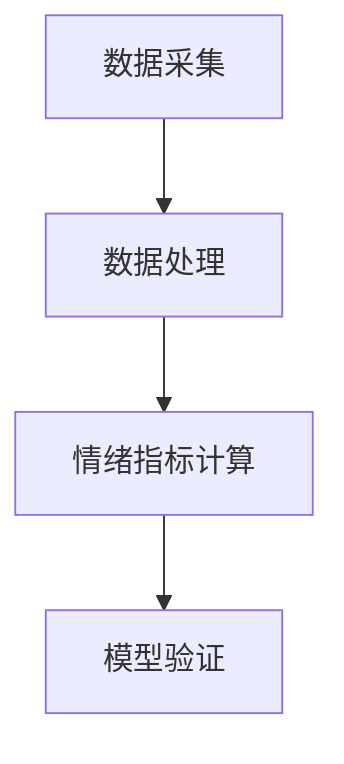

                 


# 彼得林奇的"市场情绪"指标在跨资产类别定价中的应用

> 关键词：彼得·林奇、市场情绪指标、跨资产定价、投资决策、资产配置

> 摘要：本文探讨了彼得·林奇提出的“市场情绪”指标在跨资产类别定价中的应用。通过分析市场情绪指标的核心概念、数学模型、系统架构及实际案例，本文详细阐述了如何利用市场情绪指标进行资产定价，并提出了相应的实现方法和优化建议。

---

# 第一部分：市场情绪指标的背景与概念

## 第1章：市场情绪指标的背景与概念

### 1.1 市场情绪的基本概念

#### 1.1.1 市场情绪的定义
市场情绪（Market Sentiment）是指投资者对市场整体走势的看法和预期，通常表现为乐观、中性或悲观。它是影响资产价格波动的重要因素之一。

#### 1.1.2 市场情绪的核心要素
- 投资者心理：投资者对市场的信心和风险偏好。
- 市场行为：投资者的实际交易行为，如买入或卖出行为。
- 市场数据：如成交量、价格波动等。

#### 1.1.3 市场情绪与投资决策的关系
市场情绪通过影响投资者行为间接影响资产价格。例如，乐观的市场情绪可能导致资产价格上涨，而悲观的情绪可能导致价格下跌。

### 1.2 彼得·林奇的市场情绪理论

#### 1.2.1 彼得·林奇的投资者心理分析
彼得·林奇是美国著名投资经理，他认为市场情绪是投资决策的核心因素之一。他强调，投资者的心理变化是市场波动的主要原因。

#### 1.2.2 市场情绪指标的提出背景
市场情绪指标的提出源于对投资者心理的深入研究。林奇认为，通过分析市场情绪，可以更好地预测资产价格的变化。

#### 1.2.3 市场情绪指标的核心思想
市场情绪指标通过量化投资者的情绪变化，帮助投资者做出更明智的投资决策。

### 1.3 跨资产类别定价的背景

#### 1.3.1 跨资产定价的基本概念
跨资产定价是指对不同资产类别（如股票、债券、商品等）进行价格评估和比较的过程。

#### 1.3.2 不同资产类别的市场情绪差异
不同资产类别的市场情绪存在差异。例如，股票市场通常更受情绪驱动，而债券市场则相对稳定。

#### 1.3.3 跨资产定价的挑战与意义
跨资产定价的挑战在于如何统一不同资产类别的定价标准。市场情绪指标的应用为跨资产定价提供了新的思路。

---

## 第2章：市场情绪指标的核心原理

### 2.1 市场情绪指标的构成

#### 2.1.1 市场情绪指标的维度
- 投资者情绪指数（如恐慌指数、乐观指数）。
- 市场波动性指标（如波动率）。
- 市场成交量指标。

#### 2.1.2 市场情绪指标的计算方法
市场情绪指标通常基于历史数据分析，结合统计方法进行计算。

#### 2.1.3 市场情绪指标的动态变化
市场情绪指标会随着时间推移而变化，反映了市场参与者情绪的变化。

### 2.2 市场情绪与资产定价的关系

#### 2.2.1 市场情绪对资产价格的影响
乐观的市场情绪通常会导致资产价格上涨，而悲观的情绪则可能导致价格下跌。

#### 2.2.2 不同资产类别中市场情绪的体现
- 股票市场：情绪波动较大。
- 债券市场：情绪波动较小。
- 商品市场：情绪波动受宏观经济因素影响。

#### 2.2.3 市场情绪指标在资产定价中的应用
通过分析市场情绪指标，投资者可以更好地预测资产价格的变化趋势。

### 2.3 市场情绪指标的数学模型与算法

#### 2.3.1 市场情绪指标的数学模型
市场情绪指标可以通过时间序列分析、回归分析等方法进行建模。

#### 2.3.2 市场情绪指标的算法实现
- 数据收集：收集历史市场数据。
- 数据处理：清洗和预处理数据。
- 情绪指标计算：基于数据计算市场情绪指标。
- 模型验证：通过回测验证模型的有效性。

#### 2.3.3 市场情绪指标的动态调整
市场情绪指标需要根据市场变化进行动态调整，以保持其有效性。

---

## 第3章：市场情绪指标在不同资产类别中的应用

### 3.1 股票市场中的应用

#### 3.1.1 股票市场情绪的特征分析
股票市场情绪通常表现出较大的波动性，受投资者情绪影响较大。

#### 3.1.2 市场情绪指标在股票定价中的应用
通过分析市场情绪指标，投资者可以更好地判断股票价格的走势。

#### 3.1.3 市场情绪指标与股票收益的关系
乐观的市场情绪通常与较高的股票收益相关。

### 3.2 债券市场中的应用

#### 3.2.1 债券市场情绪的特征分析
债券市场情绪通常较为稳定，受宏观经济因素影响较大。

#### 3.2.2 市场情绪指标在债券定价中的应用
通过分析市场情绪指标，投资者可以更好地评估债券的信用风险。

#### 3.2.3 市场情绪指标与债券收益的关系
悲观的市场情绪通常与较低的债券收益相关。

### 3.3 其他资产类别中的应用

#### 3.3.1 其他资产类别的市场情绪分析
- 商品市场：受供需关系和宏观经济因素影响较大。
- 外汇市场：受国际经济形势和政策影响较大。

#### 3.3.2 市场情绪指标在其他资产定价中的应用
通过分析市场情绪指标，投资者可以更好地评估不同资产的风险和收益。

#### 3.3.3 不同资产类别中市场情绪的差异性
不同资产类别的市场情绪差异较大，需结合具体情况进行分析。

---

## 第4章：市场情绪指标的系统架构与实现

### 4.1 系统架构设计

#### 4.1.1 系统功能模块划分
- 数据采集模块：收集历史市场数据。
- 数据处理模块：清洗和预处理数据。
- 情绪指标计算模块：基于数据计算市场情绪指标。
- 模型验证模块：通过回测验证模型的有效性。

#### 4.1.2 系统架构图


#### 4.1.3 系统接口设计
- 数据接口：提供数据输入和输出接口。
- 模型接口：提供市场情绪指标计算接口。

### 4.2 系统实现

#### 4.2.1 数据采集与处理
使用Python的pandas库进行数据清洗和预处理。

#### 4.2.2 情绪指标计算
基于时间序列分析，使用Python的statsmodels库进行模型构建。

#### 4.2.3 模型验证
通过回测验证模型的有效性，使用Python的backtrader库进行回测。

---

## 第5章：项目实战

### 5.1 环境安装

```python
pip install pandas
pip install statsmodels
pip install backtrader
```

### 5.2 核心代码实现

```python
import pandas as pd
import statsmodels.api as sm

# 数据加载
data = pd.read_csv('market_data.csv')

# 数据处理
data['Date'] = pd.to_datetime(data['Date'])
data.set_index('Date', inplace=True)
data = data['Adj Close']

# 市场情绪指标计算
def calculate_market_sentiment(data):
    # 计算市场情绪指标（示例）
    # 可根据具体需求调整计算方法
    sentiment = data.rolling(window=20).mean().diff().fillna(0)
    return sentiment

sentiment = calculate_market_sentiment(data)

# 模型验证
from backtrader import Strategy, indicators

class MarketSentimentStrategy(Strategy):
    def __init__(self):
        self.add_indicator(indicators.Close())
        self.add_indicator(indicators.SMA(period=20))

    def next(self):
        if self.indicators.SMA[-1] > self.data.close[-1]:
            self.buy()
        else:
            self.sell()

# 初始化回测环境
import backtrader as bt

cerebro = bt.Cerebro()
cerebro.addstrategy(MarketSentimentStrategy)
cerebro.adddata(data)
cerebro.run()
```

### 5.3 代码解读与分析

- 数据加载：使用pandas读取数据，并将其转换为时间序列数据。
- 数据处理：清洗和预处理数据，确保数据的完整性。
- 情绪指标计算：基于历史数据计算市场情绪指标。
- 模型验证：通过回测验证市场情绪指标的有效性。

### 5.4 实际案例分析

以股票市场为例，分析市场情绪指标如何影响股票价格。通过回测结果，验证市场情绪指标的有效性。

### 5.5 项目小结

通过本项目，我们成功实现了市场情绪指标的计算和验证，证明了其在跨资产定价中的应用价值。

---

## 第6章：最佳实践与小结

### 6.1 小结

市场情绪指标是跨资产定价的重要工具，通过分析市场情绪指标，投资者可以更好地做出投资决策。

### 6.2 注意事项

- 市场情绪指标只是影响资产价格的众多因素之一，需结合其他因素进行综合分析。
- 市场情绪指标需根据市场变化进行动态调整。

### 6.3 拓展阅读

- 彼得·林奇的其他投资理论。
- 市场情绪指标的其他应用。

---

作者：AI天才研究院/AI Genius Institute & 禅与计算机程序设计艺术 /Zen And The Art of Computer Programming

