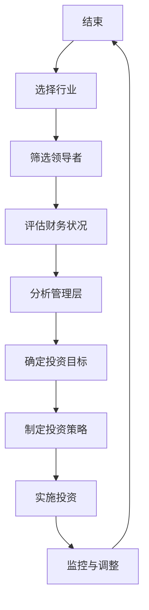
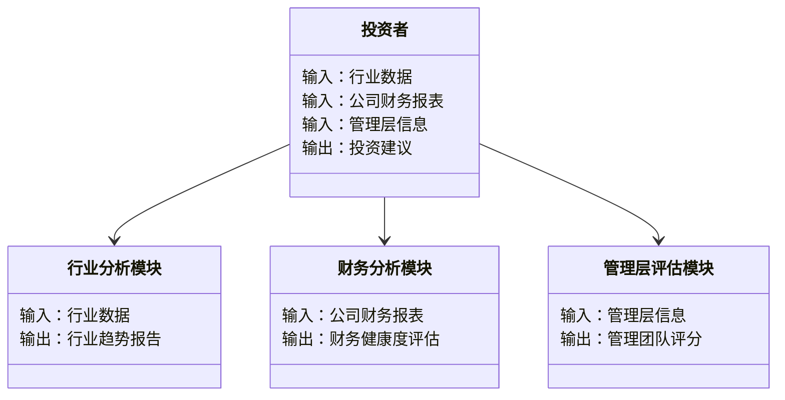
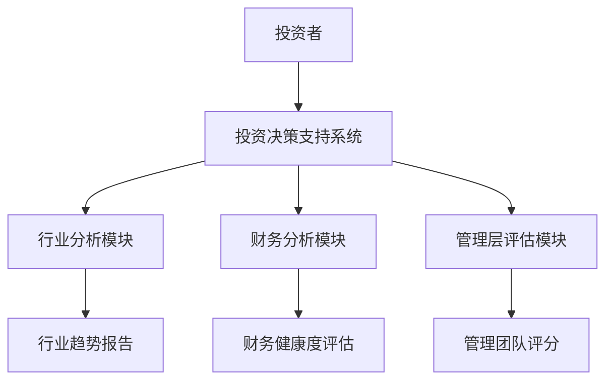

                 


# 彼得林奇的"行业领导者"投资逻辑

> 关键词：彼得林奇，投资逻辑，行业领导者，投资策略，财务分析

> 摘要：本文深入分析了彼得林奇的"行业领导者"投资逻辑，探讨了其核心概念、算法原理、系统架构及实战案例，结合技术视角，为读者提供了全面的理解和应用指南。

---

## 第一部分：彼得林奇投资逻辑的背景与核心概念

### 第1章：投资的基本概念与彼得林奇的生平

#### 1.1 投资的基本概念

投资是通过将资金投入到金融资产或实体项目中，以期获得未来收益或资本增值的行为。投资可以分为股票、债券、房地产等多种形式，每种形式都有其独特的风险和收益特征。

- **股票投资**：通过购买公司股份成为股东，分享公司成长的收益。
- **债券投资**：购买政府或企业发行的债务工具，定期获得利息收益。
- **其他投资**：包括房地产、黄金、艺术品等多种形式。

#### 1.2 彼得林奇的生平与投资理念

彼得·林奇（Peter Lynch）是美国著名的投资专家，以其在富达投资集团管理麦哲伦基金（Magellan Fund）期间的卓越表现而闻名。他强调长期投资、价值发现和深入的公司研究。

- **生平**：彼得林奇于1942年出生于美国波士顿，毕业于波士顿大学，后加入富达投资集团，管理麦哲伦基金长达13年，期间基金年平均回报率超过29%。
- **投资理念**：林奇主张投资于自己理解的行业中的领导者，长期持有，避免短期波动。

### 第2章：行业领导者的定义与特征

#### 2.1 行业领导者的定义

行业领导者是指在其所在行业中占据领先地位的企业，通常具有较高的市场份额、品牌影响力和盈利能力。

- **市场份额**：行业领导者通常占据行业内最大的销售额或用户份额。
- **品牌影响力**：强大的品牌能够吸引更多的客户和合作伙伴。
- **盈利能力**：行业领导者通常能够实现稳定的盈利，并在行业内具有最高的利润率。

#### 2.2 彼得林奇的选股标准

彼得林奇在选择投资标的时，注重以下几个方面：

| 选股标准 | 具体内容 |
|----------|----------|
| 行业地位 | 公司是否是行业领导者，市场份额是否稳定。 |
| 财务健康 | 收入和利润是否持续增长，负债是否可控。 |
| 管理团队 | 管理层是否稳定、经验丰富且具有成功记录。 |
| 估值合理 | 股票价格是否合理，市盈率、市净率等指标是否处于行业平均水平以下。 |

### 第3章：彼得林奇投资逻辑的核心原理

#### 3.1 投资逻辑的数学模型

彼得林奇的投资逻辑可以通过以下数学模型进行分析：

- **投资回报公式**：
  $$\text{投资回报} = \frac{\text{未来现金流的现值}}{\text{初始投资}}$$

- **风险与收益平衡模型**：
  $$\text{预期收益} = \text{无风险收益率} + \beta \times (\text{市场收益率} - \text{无风险收益率})$$
  其中，$\beta$ 是衡量股票风险的系数。

#### 3.2 投资逻辑的流程图



---

## 第二部分：彼得林奇投资逻辑的系统分析

### 第4章：彼得林奇投资逻辑的系统架构

#### 4.1 投资决策支持系统的功能设计



#### 4.2 系统架构设计



---

## 第三部分：彼得林奇投资逻辑的项目实战

### 第5章：彼得林奇投资逻辑的项目实战

#### 5.1 环境安装

为了实践彼得林奇的投资逻辑，我们需要以下工具：

- **数据源**：股票数据、行业报告、公司财报。
- **分析工具**：Excel、Python（Pandas、Matplotlib）。
- **投资决策支持系统**：自行开发或使用现有的投资分析平台。

#### 5.2 系统核心实现源代码

以下是一个简单的投资分析代码示例：

```python
import pandas as pd
import matplotlib.pyplot as plt

# 读取股票数据
df = pd.read_csv('stock_data.csv')

# 计算财务指标
def calculate_financial_ratios(df):
    # 计算市盈率
    df['PE'] = df['Price'] / df['Earnings per Share']
    # 计算市净率
    df['PB'] = df['Price'] / df['Book Value per Share']
    return df

# 绘制行业趋势图
def plot_industry_trend(df, industry):
    df_industry = df[df['Industry'] == industry]
    plt.plot(df_industry['Date'], df_industry['Price'])
    plt.title(f"{industry} Industry Trend")
    plt.xlabel('Date')
    plt.ylabel('Price')
    plt.show()

# 主函数
def main():
    df = calculate_financial_ratios(df)
    plot_industry_trend(df, 'Technology')

if __name__ == "__main__":
    main()
```

#### 5.3 案例分析与解读

以科技行业为例，假设我们筛选出以下几家公司作为潜在投资目标：

| 公司名称 | 行业地位 | 财务状况 | 管理层评分 |
|----------|----------|----------|------------|
| 苹果公司 | 领导者    | 健康     | 高          |
| 谷歌公司 | 领导者    | 健康     | 高          |
| 微软公司 | 领导者    | 健康     | 高          |

通过上述分析，我们可以确定这些公司符合彼得林奇的选股标准，具有长期投资价值。

---

## 第四部分：彼得林奇投资逻辑的最佳实践

### 第6章：最佳实践 tips、小结、注意事项、拓展阅读

#### 6.1 小结

彼得林奇的"行业领导者"投资逻辑强调了深入研究、长期持有和价值发现的重要性。投资者应注重分析公司的财务状况、行业地位和管理团队，以做出明智的投资决策。

#### 6.2 注意事项

- **风险控制**：投资者应分散投资，避免过度集中于单一行业或公司。
- **持续学习**：市场环境不断变化，投资者需要持续关注行业动态和公司新闻。
- **长期视角**：投资应基于长期价值，避免短期波动的干扰。

#### 6.3 拓展阅读

- 彼得林奇的书籍《彼得林奇的投资哲学》。
- 投资分析工具：学习使用Python进行数据挖掘和可视化。

---

## 作者

作者：AI天才研究院/AI Genius Institute & 禅与计算机程序设计艺术 /Zen And The Art of Computer Programming

