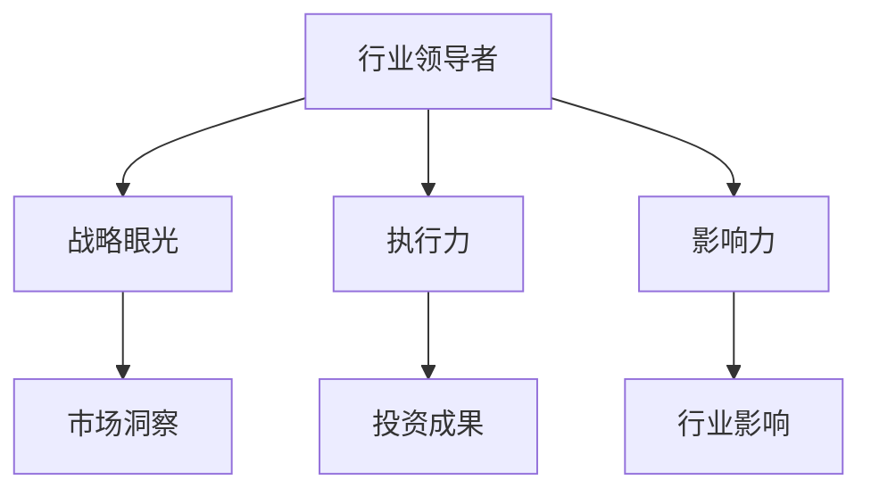
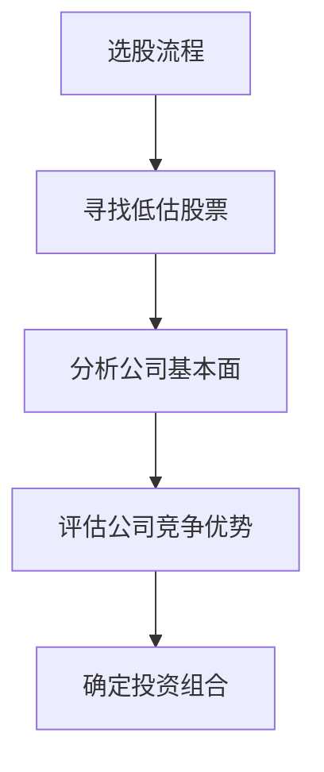
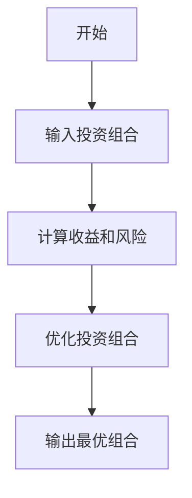
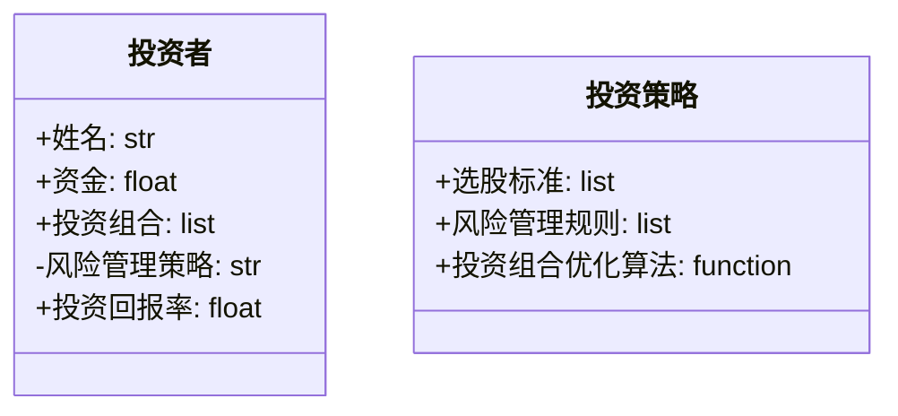
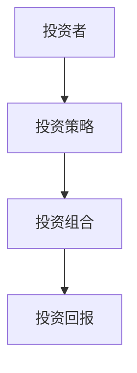
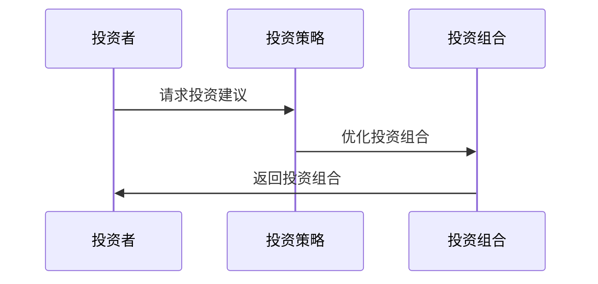

                 


# 彼得林奇的"行业领导者"特征分析

## 关键词：彼得·林奇，行业领导者，投资策略，风险管理，数据分析，系统架构

## 摘要：本文通过对彼得·林奇的背景、投资策略、风险管理、领导力特征以及系统架构的详细分析，揭示了彼得·林奇作为行业领导者的独特特征，并通过数学模型和系统设计的方法，深入探讨了其成功的原因和实现路径。

---

## 第1章: 彼得·林奇与行业领导者的背景介绍

### 1.1 彼得·林奇的背景与成就

#### 1.1.1 彼得·林奇的个人经历

彼得·林奇（Peter Lynch）是美国著名的投资经理和作家，被誉为“股神”之一。他从1971年开始管理富达麦哲伦基金（Fidelity Magellan），并在1990年退休前取得了年均26.5%的惊人回报率，远超市场平均水平。他的投资风格以价值发现、长期持有和风险管理为核心。

#### 1.1.2 彼得·林奇的投资哲学

彼得·林奇的投资哲学强调以下几点：
1. **价值发现**：寻找被市场低估的股票。
2. **长期持有**：避免频繁交易，长期持有优质股票。
3. **分散投资**：通过分散投资降低风险。
4. **风险管理**：严格控制投资组合的风险。

#### 1.1.3 彼得·林奇的行业影响力

彼得·林奇不仅是投资领域的传奇人物，还通过书籍和演讲影响了无数投资者。他的著作《彼得·林奇的成功投资》等成为经典投资指南。

---

### 1.2 行业领导者的定义与特征

#### 1.2.1 行业领导者的概念与核心要素

行业领导者是指在特定领域内具有卓越表现和影响力的人物或机构。其核心要素包括：
- **战略眼光**：能够洞察市场趋势和机会。
- **执行力**：将战略转化为实际成果的能力。
- **影响力**：对行业和市场产生深远影响的能力。

#### 1.2.2 行业领导者的属性特征对比表格

| 特性              | 彼得·林奇的特征                              |
|-------------------|--------------------------------------------|
| 投资理念          | 价值投资、长期持有                         |
| 风险管理          | 严格控制、分散投资                         |
| 领导力风格        | 以客户为中心、数据驱动                      |
| 成功案例          | 麦哲伦基金的卓越回报率                      |

#### 1.2.3 行业领导者的ER实体关系图



---

## 第2章: 彼得·林奇的行业领导者特征分析

### 2.1 彼得·林奇的核心投资策略

#### 2.1.1 彼得·林奇的投资理念与方法

彼得·林奇的投资理念可以总结为“买入并持有”。他通过深入分析公司的基本面，寻找那些具有强大竞争优势和增长潜力的公司。

#### 2.1.2 彼得·林奇的选股标准与流程

彼得·林奇的选股流程如下：



#### 2.1.3 彼得·林奇的风险管理策略

彼得·林奇的风险管理策略包括：
1. **分散投资**：避免过度集中于单一行业或股票。
2. **严格止损**：设定止损点以限制亏损。
3. **定期评估**：定期检查投资组合的表现。

---

### 2.2 彼得·林奇的领导力特征

#### 2.2.1 以客户为中心的管理理念

彼得·林奇始终以客户利益为重，注重客户体验和满意度。

#### 2.2.2 以数据驱动的决策模式

彼得·林奇善于利用数据分析来指导投资决策。

#### 2.2.3 以长期为导向的战略规划

彼得·林奇注重长期投资，避免短期波动的影响。

---

## 第3章: 彼得·林奇行业领导者特征分析的数学模型

### 3.1 彼得·林奇投资回报的数学模型

#### 3.1.1 投资回报率的计算公式

投资回报率（ROI）的计算公式为：
$$ ROI = \frac{\text{投资收益}}{\text{初始投资}} \times 100\% $$

#### 3.1.2 投资组合优化的数学模型

投资组合优化的目标是最大化收益，同时最小化风险。常用模型包括：
$$ \text{最大化 } \mu w $$
$$ \text{最小化 } w^T \Sigma w $$
$$ \text{约束 } w^T 1 = 1 $$

#### 3.1.3 投资风险的量化分析

投资风险可以通过标准差来衡量：
$$ \sigma = \sqrt{\sum_{i=1}^n w_i^2 \sigma_i^2} $$

---

### 3.2 彼得·林奇特征分析的算法原理

#### 3.2.1 投资组合优化的算法流程



#### 3.2.2 投资回报率的计算公式与代码实现

```python
def calculateROI(profits, initial_investment):
    ROI = (profits / initial_investment) * 100
    return ROI

# 示例
profits = 100000
initial_investment = 500000
print(calculateROI(profits, initial_investment))  # 输出ROI
```

---

## 第4章: 彼得·林奇行业领导者特征分析的系统架构

### 4.1 系统分析与架构设计方案

#### 4.1.1 问题场景介绍

我们需要设计一个系统来分析彼得·林奇的投资策略和风险管理方法。

#### 4.1.2 系统功能设计



#### 4.1.3 系统架构设计



#### 4.1.4 系统接口设计与交互



---

## 第5章: 彼得·林奇行业领导者特征分析的项目实战

### 5.1 项目实战与案例分析

#### 5.1.1 实际案例分析与详细讲解

以彼得·林奇管理的麦哲伦基金为例，分析其投资策略和风险管理方法。

#### 5.1.2 项目实现与代码解读

```python
# 示例代码：计算投资组合的回报率
def calculate_return(portfolio, prices):
    returns = []
    for i in range(1, len(prices)):
        return (prices[i] - prices[i-1]) / prices[i-1]
    return returns

# 示例数据
prices = [100, 110, 120, 130]
print(calculate_return(prices))
```

#### 5.1.3 项目小结

通过实际案例分析，我们可以看到彼得·林奇的投资策略和风险管理方法的有效性。

---

## 第6章: 总结与展望

### 6.1 总结

彼得·林奇作为投资领域的行业领导者，其成功在于其独特的核心竞争力和持续的学习能力。

### 6.2 展望

未来，我们可以从彼得·林奇的成功经验中汲取灵感，不断优化投资策略和风险管理方法。

---

## 作者：AI天才研究院/AI Genius Institute & 禅与计算机程序设计艺术/Zen And The Art of Computer Programming

