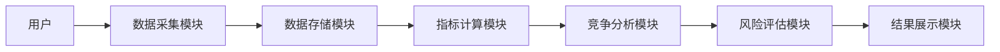

                 


# 彼得林奇的"行业龙头"识别方法

## 关键词：
- 彼得林奇、行业龙头、投资策略、基本面分析、系统设计

## 摘要：
本文深入探讨了彼得林奇的投资理念，详细分析了如何识别行业龙头公司，结合系统设计和实际案例，为投资者提供科学的识别方法和策略。

---

## 第一部分：引言

## 第1章：彼得林奇的投资理念

### 1.1 彼得林奇的投资哲学
#### 1.1.1 投资的定义与核心理念
投资不仅仅是买入股票，而是买入优秀的公司，关注其长期盈利能力。彼得林奇强调基本面分析，认为市场先生是机会的提供者，而非敌人。

#### 1.1.2 彼得林奇的投资风格与成功秘诀
彼得林奇以其耐心、纪律性和对基本面的深入研究闻名。他倾向于投资那些具有强大竞争优势、良好财务状况和持续增长潜力的公司。

#### 1.1.3 行业龙头在彼得林奇投资体系中的地位
行业龙头公司因其在市场中的领先地位，往往具备更强的抗风险能力和增长潜力，是彼得林奇投资组合中的重要组成部分。

---

## 第二部分：行业龙头的核心概念

## 第2章：行业龙头的特征与分类

### 2.1 行业龙头的特征分析
#### 2.1.1 市场地位与竞争优势
行业龙头通常在市场份额、品牌影响力和技术壁垒等方面具有显著优势。例如，苹果在智能手机市场中的主导地位。

#### 2.1.2 财务表现与盈利能力
行业龙头公司通常具有稳定的收益能力和健康的财务状况，ROE（净资产收益率）和净利润率等指标表现优异。

#### 2.1.3 创新能力与研发能力
行业龙头公司往往在研发投入上占据优势，能够持续推出创新产品，保持市场竞争力。

### 2.2 行业龙头的分类
#### 2.2.1 按行业分类
例如，科技行业的龙头公司（如微软）、金融行业的龙头公司（如摩根大通）等。

#### 2.2.2 按规模分类
可分为区域性的行业龙头和全球性的行业龙头。

#### 2.2.3 按地区分类
例如，美国的行业龙头、中国的行业龙头等。

### 2.3 行业龙头与非行业龙头的对比
#### 2.3.1 财务指标对比
行业龙头通常在收入、利润、ROE等指标上表现优于非行业龙头。

#### 2.3.2 市场地位对比
行业龙头在市场份额和品牌影响力上具有显著优势。

---

## 第三部分：行业龙头的识别方法

## 第3章：行业龙头的识别指标与方法

### 3.1 基本面分析
#### 3.1.1 财务指标分析
- **收入与利润**：关注公司过去几年的收入和利润增长情况。
- **ROE（净资产收益率）**：衡量公司盈利能力的重要指标。
- **毛利率与净利率**：分析公司的盈利能力和成本控制能力。
- **负债率**：评估公司的财务健康状况。

#### 3.1.2 非财务指标分析
- **市场地位**：公司在行业中的市场份额和品牌影响力。
- **管理团队**：公司高管的背景和稳定性。
- **竞争优势**：公司的核心竞争力，如技术专利、成本优势等。
- **行业趋势**：行业整体发展趋势和潜在机会。

#### 3.1.3 行业趋势分析
关注行业的发展前景，选择处于上升期的行业中的龙头公司。

### 3.2 行业地位分析
#### 3.2.1 市场份额分析
通过分析公司在行业中的市场份额，判断其是否为行业龙头。

#### 3.2.2 品牌影响力分析
品牌价值高的公司通常具有更强的市场竞争力和议价能力。

### 3.3 竞争分析
#### 3.3.1 竞争对手分析
对比公司在与竞争对手的对比中是否具有明显优势。

#### 3.3.2 行业集中度分析
分析行业的CR4或CR5（前4或前5家企业的市场份额之和），判断行业是否高度集中。

---

## 第四部分：系统分析与架构设计

## 第4章：构建行业龙头识别系统

### 4.1 系统功能设计
#### 4.1.1 数据采集模块
- 从多个数据源（如财务报表、行业报告、新闻等）获取数据。
- 数据清洗与预处理：去除无效数据，填补缺失值。

#### 4.1.2 指标计算模块
- 计算各项财务指标（ROE、毛利率等）。
- 评估行业地位（市场份额、品牌影响力）。

#### 4.1.3 竞争分析模块
- 对比分析公司在行业中的竞争优势。

#### 4.1.4 风险评估模块
- 分析公司的财务风险、市场风险等。

### 4.2 系统架构设计
#### 4.2.1 系统架构图


#### 4.2.2 接口设计
- 数据接口：与财务数据供应商的接口。
- 用户接口：友好的前端界面，方便用户输入和查看结果。

#### 4.2.3 交互设计
- 用户输入：选择行业和公司。
- 系统输出：显示公司是否为行业龙头，及相关分析报告。

---

## 第五部分：项目实战

## 第5章：环境安装与代码实现

### 5.1 环境安装
- **Python 3.8+**
- **Pandas、NumPy、Matplotlib、Scikit-learn**
- **数据来源：Yahoo Finance API**

### 5.2 核心代码实现
```python
import pandas as pd
import requests
import json

def get_stock_data(ticker):
    url = f"https://api.finance.yahoo.com/stock/v2/xchange/{ticker}"
    response = requests.get(url)
    data = json.loads(response.text)
    return data

def calculate_roe(ticker):
    data = get_stock_data(ticker)
    net_income = data['financials']['incomeStatement']['netIncome']
    equity = data['financials']['balanceSheet']['equity']
    roe = net_income / equity
    return roe

# 示例：分析苹果公司
ticker = 'AAPL'
roe = calculate_roe(ticker)
print(f"Apple的ROE为：{roe}")
```

### 5.3 代码解读与分析
- **数据获取**：使用Yahoo Finance API获取股票数据。
- **ROE计算**：公式为净利润除以股东权益，反映公司的盈利能力。

### 5.4 实际案例分析
以苹果公司为例，分析其是否为行业龙头：
- 苹果在全球科技行业占据领先地位，市场份额高，品牌价值大，财务表现优异。

### 5.5 项目小结
通过代码实现，我们可以系统地识别行业龙头公司，辅助投资决策。

---

## 第六部分：总结与展望

## 第6章：总结与注意事项

### 6.1 全书回顾
本文从彼得林奇的投资理念出发，详细讲解了行业龙头的识别方法，并结合系统设计和实战案例，为投资者提供了科学的识别框架。

### 6.2 投资技巧与注意事项
- **长期投资**：避免短期波动，关注公司长期价值。
- **分散投资**：不要将所有资金投入单一行业或公司。
- **持续学习**：市场变化快，需不断更新知识和策略。

### 6.3 拓展阅读
- 《彼得·林奇的成功投资》
- 《巴菲特的选股智慧》
- 《技术分析的理论与实践》

---

## 作者：AI天才研究院 & 禅与计算机程序设计艺术

---

以上为文章的完整目录大纲和内容概述，如需进一步扩展或补充，请随时告知。

