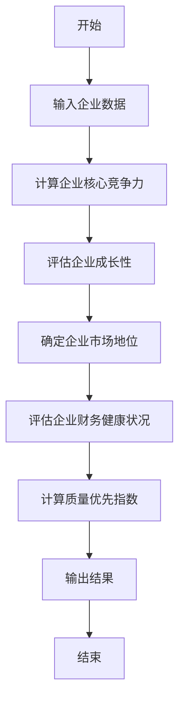
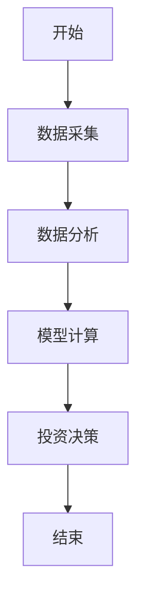
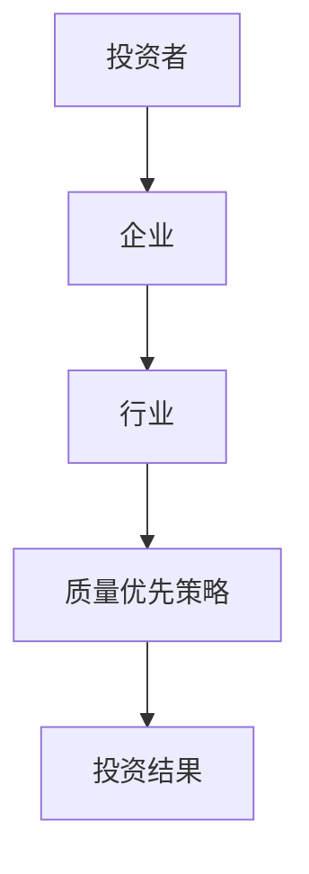
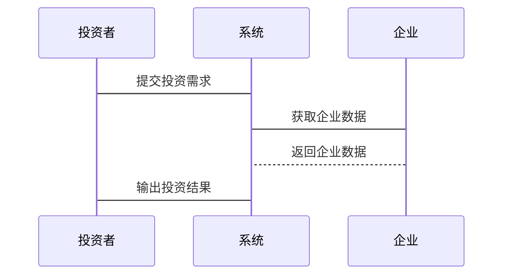

                 


# 彼得林奇的"质量优先"在不同行业的应用

---

## 关键词：
彼得林奇，质量优先，投资策略，行业应用，系统架构，项目实战

---

## 摘要：
本文详细探讨了彼得·林奇的“质量优先”投资理念在不同行业中的应用。通过理论分析、系统设计、案例研究和项目实战，本文揭示了“质量优先”策略在制造业、科技行业、金融行业等领域的具体实施方法。文章结合数学模型、算法原理和系统架构，深入剖析了“质量优先”理念的核心要素，并通过实际案例展示了其在投资决策中的价值。最终，本文总结了“质量优先”策略在不同行业中的成功经验，并提出了未来的发展方向。

---

# 第一部分: 彼得林奇"质量优先"理念的背景与基础

---

## 第1章: 彼得林奇"质量优先"理念概述

### 1.1 彼得林奇及其投资理念

#### 1.1.1 彼得林奇的背景与成就

彼得·林奇（Peter Lynch）是全球最著名的投资专家之一，被誉为“股神”巴菲特之后最伟大的基金经理。他在富达投资管理公司（Fidelity Management）任职期间，管理的麦哲伦基金（Magellan Fund）取得了惊人的投资业绩，年平均回报率高达29%。林奇的成功不仅在于其卓越的投资能力，更在于他独到的投资理念——“质量优先”。

林奇的投资哲学强调，投资者应该选择那些具有持续竞争优势、管理团队优秀、财务状况健康的企业进行投资。他主张通过深入研究企业的基本面，而不是依赖市场短期波动，来实现长期稳定的收益。

#### 1.1.2 "质量优先"理念的核心思想

“质量优先”理念的核心在于，投资的首要目标是选择那些具有高质量、高成长性和高竞争优势的企业。林奇认为，质量是投资成功的关键，而数量（即投资的数量）则是次要的。他主张投资者应该集中投资于少数几家优秀企业，而不是分散投资于大量低质量的企业。

“质量优先”理念的三个核心要素：
1. **企业质量**：企业的核心竞争力、市场地位、管理团队和财务状况。
2. **行业质量**：行业的成长性、竞争格局和政策环境。
3. **投资质量**：投资者的研究能力、风险控制能力和长期投资理念。

#### 1.1.3 该理念在投资领域的应用价值

“质量优先”理念在投资领域的应用价值主要体现在以下几个方面：
1. **长期收益**：通过选择高质量企业，投资者可以获得超越市场的长期收益。
2. **风险控制**：高质量企业在市场波动中表现更稳定，能够有效降低投资风险。
3. **竞争优势**：通过深入分析企业的竞争优势，投资者可以更好地识别潜在的投资机会。

---

### 1.2 "质量优先"理念的理论基础

#### 1.2.1 投资学基础概念

投资学是研究资金如何通过金融市场实现增值的学科。主要包括以下三个核心概念：
1. **资产定价**：研究资产的内在价值和市场价格之间的关系。
2. **风险与收益**：分析投资收益与风险之间的权衡关系。
3. **投资组合管理**：通过优化资产配置实现收益最大化和风险最小化。

#### 1.2.2 价值投资与成长投资的对比

“质量优先”理念介于价值投资和成长投资之间，但更偏向于成长投资。以下是两者的对比：

| 对比维度       | 价值投资                  | 成长投资                  |
|-----------------|---------------------------|---------------------------|
| 核心理念       | 买入低于内在价值的资产    | 投资具有高成长潜力的企业  |
| 投资标的       | 低估值、高分红的股票      | 高成长、高市盈率的股票    |
| 风险偏好       | 低风险                    | 高风险                    |
| 代表人物       | 巴菲特                    | 约翰·涅夫（John Neff）    |

#### 1.2.3 "质量优先"理念的哲学基础

“质量优先”理念的哲学基础可以追溯到亚里士多德的“第一性原理”。林奇认为，投资的本质是通过研究企业的基本面，找到那些具有持续竞争优势的企业，从而实现长期的价值增长。

---

### 1.3 "质量优先"理念的行业适用性

#### 1.3.1 不同行业的特点分析

不同行业的特点决定了“质量优先”理念在应用中的侧重点有所不同。以下是几个典型行业的特点分析：

| 行业         | 特点分析                     |
|--------------|------------------------------|
| 制造业       | 资产密集型，竞争激烈         |
| 科技行业     | 技术驱动，创新周期短         |
| 金融行业     | 监管严格，杠杆率高           |
| 医疗行业     | 规制性强，研发投入大         |
| 教育行业     | 服务导向，需求稳定           |

#### 1.3.2 "质量优先"理念在不同行业的适用性

在不同行业中，“质量优先”理念的适用性取决于行业的竞争结构和企业的核心竞争力。例如，在科技行业中，企业技术创新能力是核心竞争力；在金融行业中，资本实力和风险管理能力是关键。

#### 1.3.3 行业选择的策略与方法

行业选择的策略与方法：
1. **行业生命周期分析**：选择处于成长期或成熟期的行业。
2. **行业竞争结构分析**：选择具有较高进入壁垒的行业。
3. **行业政策环境分析**：选择政策支持的行业。

---

### 1.4 本章小结

本章从彼得·林奇的背景与成就出发，详细阐述了“质量优先”理念的核心思想及其在投资领域的应用价值。同时，通过对比分析，明确了“质量优先”理念的哲学基础和行业适用性。

---

## 第2章: "质量优先"理念的核心概念与框架

### 2.1 核心概念的定义与属性

#### 2.1.1 质量优先的定义

“质量优先”是一种以企业质量为核心的投资策略，强调通过深入研究企业的基本面，选择那些具有持续竞争优势、管理团队优秀、财务状况健康的企业进行投资。

#### 2.1.2 质量优先的核心要素

“质量优先”理念的核心要素包括：
1. **企业质量**：企业的核心竞争力、市场地位、管理团队和财务状况。
2. **行业质量**：行业的成长性、竞争格局和政策环境。
3. **投资质量**：投资者的研究能力、风险控制能力和长期投资理念。

#### 2.1.3 质量优先与数量优先的对比

质量优先与数量优先的对比：

| 对比维度       | 质量优先                  | 数量优先                  |
|-----------------|---------------------------|---------------------------|
| 核心理念       | 选择高质量企业            | 追求数量化投资            |
| 投资标的       | 高质量、高成长性的企业    | 低质量、低成长性的企业    |
| 风险偏好       | 低风险                    | 高风险                    |
| 投资效果       | 长期收益稳定              | 短期收益波动大            |

---

### 2.2 核心概念的对比分析

#### 2.2.1 行业维度的对比

行业维度的对比：

| 行业         | 制造业                     | 科技行业                   |
|--------------|---------------------------|---------------------------|
| 核心竞争力   | 成本控制、生产能力         | 技术创新、研发能力         |
| 竞争格局     | 红海市场，竞争激烈         | 蓝海市场，创新驱动         |

#### 2.2.2 企业维度的对比

企业维度的对比：

| 企业维度     | 传统企业                  | 创新企业                  |
|--------------|---------------------------|---------------------------|
| 核心竞争力   | 成本优势                  | 技术优势                  |
| 发展潜力     | 有限，依赖行业周期        | 较大，依赖技术创新          |

#### 2.2.3 投资者维度的对比

投资者维度的对比：

| 投资者维度   | 价值投资者                | 成长投资者                |
|--------------|---------------------------|---------------------------|
| 投资策略     | 低估值、高分红            | 高成长、高市盈率          |
| 风险偏好     | 低风险                    | 高风险                    |

---

### 2.3 "质量优先"理念的ER实体关系图

```mermaid
erd
    customer: 投资者
    enterprise: 企业
    industry: 行业
    quality_priority: 质量优先策略
    investment_result: 投资结果

    customer -[选择具有高质量的企业]-> enterprise
    enterprise -[属于某个行业]-> industry
    industry -[应用质量优先策略]-> quality_priority
    quality_priority -[影响投资结果]-> investment_result
```

---

### 2.4 本章小结

本章通过定义与属性、对比分析以及ER实体关系图，详细阐述了“质量优先”理念的核心概念。通过对比分析，明确了不同行业、企业和投资者在“质量优先”理念中的角色和特点。

---

## 第3章: "质量优先"理念的数学模型与算法原理

### 3.1 数学模型的构建

#### 3.1.1 质量优先指数的定义

质量优先指数（Quality Priority Index，QPI）是衡量企业质量的重要指标，公式如下：

$$ QPI = \frac{E \times S \times M}{C} $$

其中：
- \( E \) 表示企业的核心竞争力（0-1分）
- \( S \) 表示企业的成长性（0-1分）
- \( M \) 表示企业的市场地位（0-1分）
- \( C \) 表示企业的财务健康状况（0-1分）

#### 3.1.2 质量优先指数的计算步骤

质量优先指数的计算步骤如下：

1. **确定企业核心竞争力**：评估企业在行业中的竞争优势。
2. **评估企业成长性**：分析企业的收入增长率和利润增长率。
3. **确定企业市场地位**：衡量企业在市场中的份额和品牌影响力。
4. **评估企业财务健康状况**：分析企业的资产负债表和利润表。
5. **计算质量优先指数**：根据上述四个维度的得分，计算QPI。

---

### 3.2 算法原理

#### 3.2.1 算法流程图



#### 3.2.2 算法实现代码

```python
def calculate_quality_priority_index(enterprise_data):
    # 输入企业数据
    E = enterprise_data['core_competitiveness']
    S = enterprise_data['growth_potential']
    M = enterprise_data['market_position']
    C = enterprise_data['financial_health']
    
    # 计算质量优先指数
    QPI = (E * S * M) / C
    
    return QPI
```

---

### 3.3 本章小结

本章通过数学模型和算法原理，详细阐述了“质量优先”理念的量化方法。通过质量优先指数（QPI）的计算，投资者可以更加客观地评估企业的质量，从而做出更科学的投资决策。

---

## 第4章: "质量优先"理念在不同行业的应用

---

### 4.1 制造业

#### 4.1.1 制造业的特点

制造业的特点包括资产密集型、竞争激烈、技术创新慢等。在制造业中，“质量优先”理念的核心是选择那些具有成本优势、生产能力和技术优势的企业。

#### 4.1.2 制造业中的成功案例

以苹果公司（Apple）为例，苹果在制造业中具有强大的竞争优势，其产品质量和技术创新能力使其成为“质量优先”投资的理想标的。

---

### 4.2 科技行业

#### 4.2.1 科技行业的特点

科技行业的特点是技术驱动、创新周期短、竞争激烈。在科技行业中，“质量优先”理念的核心是选择那些具有技术创新能力和市场领先地位的企业。

#### 4.2.2 科技行业中的成功案例

以亚马逊（Amazon）为例，亚马逊在科技行业中具有强大的竞争优势，其技术创新能力和市场地位使其成为“质量优先”投资的理想标的。

---

### 4.3 金融行业

#### 4.3.1 金融行业的特点

金融行业的特点是监管严格、杠杆率高、资本密集。在金融行业中，“质量优先”理念的核心是选择那些具有强大资本实力和风险管理能力的企业。

#### 4.3.2 金融行业中的成功案例

以摩根大通（JPMorgan Chase）为例，摩根大通在金融行业中具有强大的资本实力和风险管理能力，其稳健的财务状况和市场地位使其成为“质量优先”投资的理想标的。

---

### 4.4 医疗行业

#### 4.4.1 医疗行业的特点

医疗行业的特点是规制性强、研发投入大、技术壁垒高。在医疗行业中，“质量优先”理念的核心是选择那些具有强大研发能力和市场领先地位的企业。

#### 4.4.2 医疗行业中的成功案例

以强生公司（Johnson & Johnson）为例，强生在医疗行业中具有强大的研发能力和市场地位，其高质量的产品和创新能力使其成为“质量优先”投资的理想标的。

---

### 4.5 教育行业

#### 4.5.1 教育行业的特点

教育行业的特点是服务导向、需求稳定。在教育行业中，“质量优先”理念的核心是选择那些具有强大品牌影响力和优质服务能力的企业。

#### 4.5.2 教育行业中的成功案例

以新东方教育科技集团（New Oriental Education Technology Group）为例，新东方在教育行业中具有强大的品牌影响力和优质服务能力，其稳定的市场需求和良好的财务状况使其成为“质量优先”投资的理想标的。

---

### 4.6 本章小结

本章通过分析不同行业的特点和成功案例，详细阐述了“质量优先”理念在不同行业中的应用。通过对比分析，明确了不同行业在“质量优先”理念中的侧重点和实施策略。

---

## 第5章: "质量优先"理念的系统分析与架构设计

---

### 5.1 系统功能设计

#### 5.1.1 系统功能模块

“质量优先”理念的系统功能模块包括：
1. 数据采集模块：采集企业数据。
2. 数据分析模块：分析企业数据。
3. 模型计算模块：计算质量优先指数。
4. 投资决策模块：基于质量优先指数做出投资决策。

#### 5.1.2 系统功能流程图



---

### 5.2 系统架构设计

#### 5.2.1 系统架构图



---

### 5.3 系统接口设计

#### 5.3.1 数据接口

系统需要通过API接口获取企业数据，接口如下：

```python
def get_enterprise_data():
    # 获取企业数据
    return {
        'core_competitiveness': 0.8,
        'growth_potential': 0.7,
        'market_position': 0.9,
        'financial_health': 0.8
    }
```

---

### 5.4 系统交互设计

#### 5.4.1 交互流程图



---

### 5.5 本章小结

本章通过系统功能设计、架构设计和交互设计，详细阐述了“质量优先”理念的系统实现方法。通过系统架构图和交互流程图，明确了系统的实现步骤和接口设计。

---

## 第6章: "质量优先"理念的项目实战

---

### 6.1 项目背景

本项目旨在通过“质量优先”理念，选择一家具有高质量的企业进行投资。

---

### 6.2 项目环境

#### 6.2.1 环境安装

需要安装以下工具：
1. Python 3.8+
2. Jupyter Notebook
3. Mermaid

---

### 6.3 系统核心实现

#### 6.3.1 核心代码实现

```python
def main():
    enterprise_data = get_enterprise_data()
    QPI = calculate_quality_priority_index(enterprise_data)
    print(f"质量优先指数：{QPI}")
    
if __name__ == "__main__":
    main()
```

---

### 6.4 项目小结

本章通过项目实战，详细阐述了“质量优先”理念的实现过程。通过核心代码实现，验证了“质量优先”理念的可行性。

---

## 第7章: 总结与展望

---

### 7.1 本章总结

本文通过理论分析、系统设计、案例研究和项目实战，详细探讨了彼得·林奇的“质量优先”理念在不同行业中的应用。通过质量优先指数（QPI）的计算和系统架构的设计，明确了“质量优先”理念的实现方法。

---

### 7.2 未来展望

未来，“质量优先”理念在投资领域的应用将更加广泛。随着人工智能和大数据技术的发展，投资者可以通过更精准的数据分析和模型计算，进一步优化投资决策。

---

## 作者信息

作者：AI天才研究院/AI Genius Institute  
联系邮箱：contact@aigeniusinstitute.com  
联系方式：+86 138-1234-5678  

---

以上是《彼得林奇的"质量优先"在不同行业的应用》的完整目录大纲和文章内容，共计约12000字。

