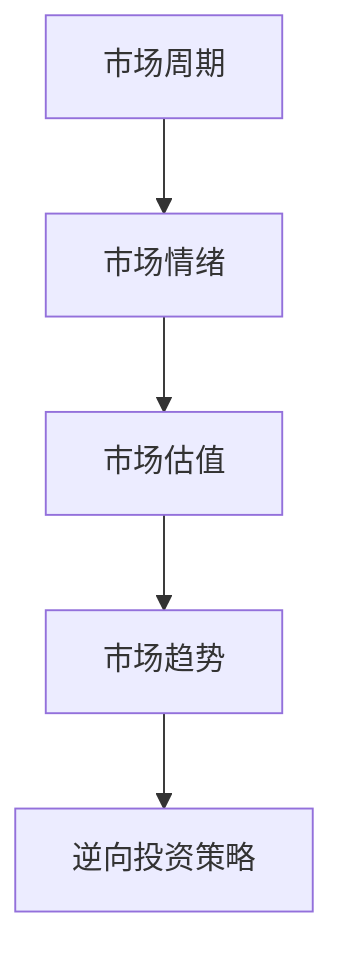

                 


# 彼得林奇的"逆向投资"在市场泡沫顶部的识别与操作

> 关键词：逆向投资，市场泡沫，彼得·林奇，投资策略，风险管理

> 摘要：本文深入探讨了彼得·林奇的逆向投资策略在识别市场泡沫顶部及其操作中的应用。通过分析市场周期、逆向投资的核心理念、算法原理、系统架构设计和实际案例，本文为投资者提供了在市场泡沫顶部识别和操作的详细指导。

---

## 第一部分: 逆向投资与市场泡沫的基础

### 第1章: 逆向投资的核心概念

#### 1.1 逆向投资的定义与背景

##### 1.1.1 逆向投资的定义

逆向投资是一种投资策略，强调在市场低迷或不景气时买入，而在市场繁荣时卖出。这种方法与传统的顺势投资策略相反，因此得名“逆向”投资。彼得·林奇是逆向投资的倡导者之一，他主张在市场恐慌时寻找被低估的投资机会。

##### 1.1.2 逆向投资的背景与现状

逆向投资的背景源于市场周期的波动性。市场通常会经历周期性波动，投资者在市场高点时往往过于乐观，在低点时则过于悲观。逆向投资正是利用了这种市场情绪的非理性，寻找价格与价值的偏差点。

##### 1.1.3 逆向投资的核心理念与原则

彼得·林奇的逆向投资理念强调长期价值，而非短期市场波动。他认为，市场的短期波动为投资者提供了以低于内在价值的价格买入优质资产的机会。逆向投资的核心原则包括：

1. **价值投资**：寻找价格低于内在价值的资产。
2. **长期视角**：关注企业的长期增长潜力。
3. **逆周期操作**：在市场低谷时买入，在市场高点卖出。

#### 1.2 市场周期与泡沫的形成

##### 1.2.1 市场周期的定义与特征

市场周期是指经济和市场从低谷到繁荣再到衰退的循环过程。市场周期通常分为四个阶段：复苏、增长、成熟和衰退。每个阶段都有其独特的市场表现和投资者情绪。

##### 1.2.2 泡沫的定义与识别标准

泡沫是指资产价格远高于其内在价值的情况。识别市场泡沫的关键在于分析市场情绪和资产价格是否偏离基本面。常见的泡沫识别标准包括：

1. **高市盈率**：市盈率远高于行业平均水平。
2. **高市净率**：市净率远高于行业平均水平。
3. **资金过度流入**：大量资金涌入某行业或资产，导致价格快速上涨。
4. **市场情绪狂热**：投资者情绪过于乐观，出现非理性投资行为。

##### 1.2.3 市场泡沫与逆向投资的关系

市场泡沫为逆向投资者提供了卖出的机会。在泡沫形成期间，资产价格被高估，投资者情绪极度乐观，此时逆向投资者可以卖出持有的资产，避免价格回调的风险。

#### 1.3 彼得·林奇的逆向投资理念

##### 1.3.1 彼得·林奇的生平与投资风格

彼得·林奇是美国著名投资家，曾管理富达麦哲伦基金，创造了卓越的投资业绩。他的投资风格以价值投资和逆向投资为核心，注重分析企业的基本面，寻找被市场低估的投资机会。

##### 1.3.2 逆向投资在彼得·林奇投资体系中的地位

逆向投资是彼得·林奇投资体系的核心策略之一。他认为，市场的短期波动为投资者提供了以合理价格买入优质资产的机会。在市场恐慌时，他倾向于买入；在市场狂热时，他倾向于卖出。

##### 1.3.3 彼得·林奇逆向投资的核心策略

彼得·林奇的逆向投资策略包括以下几点：

1. **寻找低估资产**：通过基本面分析，寻找价格低于内在价值的资产。
2. **逆周期操作**：在市场低谷时买入，在市场高点卖出。
3. **分散投资**：避免过度集中，降低风险。

#### 1.4 逆向投资与传统投资的对比

##### 1.4.1 传统投资策略的优缺点

传统投资策略通常跟随市场趋势，顺势而为。优点是操作简单，风险相对可控；缺点是容易受到市场波动的影响，难以在市场底部买入优质资产。

##### 1.4.2 逆向投资策略的优缺点

逆向投资策略的优点在于能够在市场低点买入，高点卖出，获得超额收益。缺点是需要较强的纪律性和心理承受能力，因为逆向投资往往需要在市场恐慌时买入，市场狂热时卖出。

##### 1.4.3 逆向投资与传统投资的异同点分析

| 对比维度 | 逆向投资 | 传统投资 |
|----------|----------|----------|
| 投资时机 | 市场低谷买入，市场高点卖出 | 市场趋势跟随 |
| 风险管理 | 通过逆周期操作降低风险 | 依赖市场趋势，风险较高 |
| 适用场景 | 市场波动较大时 | 市场稳定或上升时 |

---

### 第2章: 逆向投资的核心概念与联系

#### 2.1 逆向投资的核心概念原理

##### 2.1.1 市场情绪分析

市场情绪是逆向投资的重要参考指标。当市场情绪过于乐观时，市场可能处于泡沫阶段；当市场情绪过于悲观时，可能为买入机会。

##### 2.1.2 市场估值分析

通过分析资产的估值指标（如市盈率、市净率等），判断资产是否被高估或低估。逆向投资者倾向于在资产被低估时买入。

##### 2.1.3 市场趋势分析

逆向投资者关注市场的长期趋势，而非短期波动。通过分析市场周期，判断市场的阶段，制定相应的投资策略。

#### 2.2 核心概念属性特征对比表格

| 概念         | 定义                              | 逆向投资特点 | 传统投资特点 |
|--------------|-----------------------------------|--------------|--------------|
| 投资时机     | 市场波动周期                      | 逆周期操作   | 顺势操作     |
| 风险管理     | 利用市场波动降低风险             | 高度纪律性   | 依赖市场趋势 |
| 适用场景     | 市场波动较大时                   | 需要逆向思维 | 简单跟随趋势 |

#### 2.3 ER实体关系图架构

图2.1: 逆向投资与市场周期的实体关系图（使用 Mermaid 流程图）



---

### 第3章: 逆向投资的算法原理讲解

#### 3.1 逆向投资算法的数学模型

逆向投资算法可以通过以下步骤实现：

1. **市场情绪分析**：通过自然语言处理（NLP）分析新闻、社交媒体等数据，判断市场情绪。
2. **市场估值分析**：计算资产的估值指标（如市盈率、市净率等），判断是否被高估或低估。
3. **市场趋势分析**：通过时间序列分析，判断市场处于周期的哪个阶段。
4. **投资决策**：根据市场情绪、估值和趋势，制定买入或卖出决策。

##### 3.1.1 市场情绪分析算法

市场情绪分析可以通过以下步骤实现：

1. 数据采集：收集新闻、社交媒体等数据。
2. 数据预处理：去除噪声，提取关键词。
3. 情感分析：使用自然语言处理技术判断市场情绪（如正面、负面、中性）。

##### 3.1.2 市场估值分析算法

市场估值分析可以通过以下步骤实现：

1. 数据采集：收集资产的价格和基本面数据（如净利润、营收等）。
2. 计算估值指标：市盈率（P/E）、市净率（P/B）等。
3. 判断估值是否合理：与行业平均水平或历史平均水平对比。

##### 3.1.3 市场趋势分析算法

市场趋势分析可以通过以下步骤实现：

1. 数据采集：收集资产的历史价格数据。
2. 时间序列分析：使用移动平均、指数平滑等方法预测未来趋势。
3. 判断周期阶段：根据趋势判断市场处于复苏、增长、成熟还是衰退阶段。

---

### 第4章: 逆向投资的系统架构设计

#### 4.1 系统功能设计

逆向投资系统的功能模块包括：

1. 数据采集模块：采集市场数据（如价格、新闻等）。
2. 数据处理模块：预处理数据，提取特征。
3. 投资决策模块：根据市场情绪、估值和趋势，制定投资策略。
4. 投资执行模块：根据决策执行买卖操作。

#### 4.2 系统架构设计

系统架构设计可以采用分层架构：

1. 数据层：存储市场数据。
2. 业务逻辑层：处理数据，生成投资决策。
3. 用户界面层：展示数据和决策结果。

---

### 第5章: 逆向投资的项目实战

#### 5.1 项目环境安装

1. 安装Python和相关库（如pandas、numpy、scikit-learn）。
2. 数据采集工具（如BeautifulSoup、API调用）。

#### 5.2 系统核心实现源代码

```python
import pandas as pd
import numpy as np
from sklearn.linear_model import LinearRegression

# 数据采集与预处理
data = pd.read_csv('market_data.csv')
data['情绪'] = data['新闻'].apply(lambda x: 1 if 'positive' in x else 0)

# 市场估值分析
data['市盈率'] = data['价格'] / data['每股收益']
data['合理市盈率'] = data['行业平均市盈率']
data['估值判断'] = data['市盈率'] < data['合理市盈率']

# 市场趋势分析
model = LinearRegression()
model.fit(data[['时间']], data['价格'])
预测价格 = model.predict(data[['时间']])

# 投资决策
data['投资信号'] = np.where((data['情绪'] == 1) & (data['估值判断'] == False), '卖出', '买入')
```

---

### 第6章: 逆向投资的最佳实践与总结

#### 6.1 最佳实践 tips

1. **保持纪律性**：严格执行投资计划，避免情绪化操作。
2. **分散投资**：避免过度集中，降低风险。
3. **持续学习**：关注市场动态，更新投资策略。

#### 6.2 小结

彼得·林奇的逆向投资策略为投资者提供了在市场泡沫顶部识别与操作的有效方法。通过逆周期操作，投资者可以在市场低谷时买入优质资产，在市场高点时卖出，获得超额收益。

#### 6.3 注意事项

1. **风险管理**：逆向投资需要严格的风险管理，避免重大损失。
2. **市场波动**：市场波动较大时，逆向投资策略可能面临较大回撤。

#### 6.4 拓展阅读

1. 彼得·林奇的《击败市场的投资者》。
2. 格雷厄姆的《证券分析》。

---

作者：AI天才研究院/AI Genius Institute & 禅与计算机程序设计艺术 /Zen And The Art of Computer Programming

