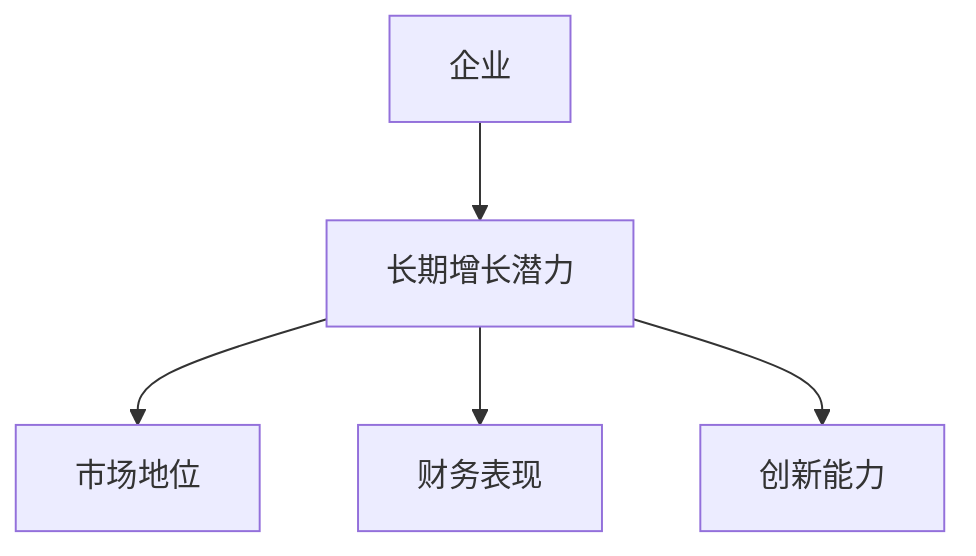
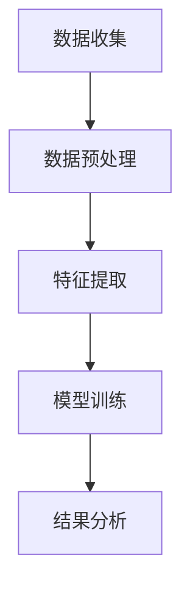
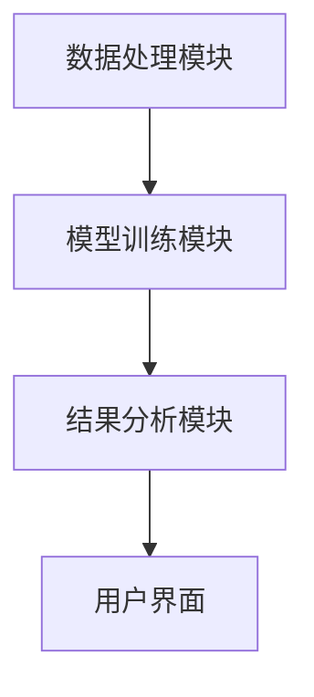

                 


# 彼得林奇的"长期增长"潜力在人工智能行业的识别方法

## 关键词：人工智能，长期增长潜力，彼得·林奇，投资分析，企业评估

## 摘要：本文探讨了如何利用人工智能技术识别具有长期增长潜力的企业，结合了彼得·林奇的投资理念和AI技术的优势，详细讲解了从数据处理到模型构建的整个流程，并通过案例分析展示了实际应用。

---

## 第一部分：背景介绍

### 第1章：人工智能行业的现状与挑战

#### 1.1 人工智能行业的快速发展

人工智能技术近年来迅速发展，广泛应用于金融、医疗、教育等多个领域。AI在投资分析中的应用尤为突出，通过大数据处理和机器学习算法，投资者能够更精准地识别具有长期增长潜力的企业。

#### 1.2 彼得·林奇的长期增长投资理念

彼得·林奇是著名的投资经理，强调投资于具有长期增长潜力的企业。他认为，企业的市场地位、财务表现和创新能力是长期增长的关键因素。AI技术可以帮助投资者更有效地识别这些因素。

#### 1.3 人工智能在投资分析中的应用前景

AI技术在金融领域的优势在于其高效的数据处理能力和模式识别能力。通过分析大量的历史数据，AI可以帮助投资者预测企业的未来表现，从而更准确地识别长期增长潜力。

---

## 第二部分：核心概念与联系

### 第2章：长期增长潜力的定义与属性

#### 2.1 长期增长潜力的核心概念

长期增长潜力指的是企业在未来一段时间内持续增长的可能性。影响长期增长潜力的因素包括企业规模、市场地位、财务表现和创新能力等。

#### 2.2 长期增长潜力的属性特征对比

以下是长期增长潜力与企业相关因素的对比表：

| 因素         | 长期增长潜力高的企业特征                |
|--------------|-----------------------------------------|
| 企业规模     | 规模较大，市场占有率高                  |
| 市场地位     | 在行业内具有竞争优势，品牌影响力强    |
| 财务表现     | 财务健康，盈利能力稳定，现金流充足    |
| 创新能力     | 持续推出新产品或服务，研发投入高      |

#### 2.3 长期增长潜力的ER实体关系图



---

## 第三部分：算法原理讲解

### 第3章：基于人工智能的长期增长潜力识别算法

#### 3.1 算法流程

识别长期增长潜力的AI算法流程如下：

1. 数据收集与预处理：收集企业的财务数据、市场数据和创新数据，进行清洗和标准化处理。
2. 特征提取与选择：从数据中提取关键特征，如收入增长率、利润率、研发投入占比等。
3. 模型训练与优化：使用机器学习算法（如逻辑回归、随机森林）训练模型，调整参数以提高准确性。
4. 结果分析与验证：评估模型的预测结果，验证其准确性和稳定性。

#### 3.2 算法流程图



#### 3.3 算法实现代码

以下是Python代码示例：

```python
import pandas as pd
from sklearn.model_selection import train_test_split
from sklearn.ensemble import RandomForestClassifier
from sklearn.metrics import accuracy_score

# 数据预处理
data = pd.read_csv('企业数据.csv')
data = data.dropna()

# 特征提取
features = ['收入增长率', '利润率', '研发投入占比']
target = '长期增长潜力'

X = data[features]
y = data[target]

# 数据分割
X_train, X_test, y_train, y_test = train_test_split(X, y, test_size=0.2)

# 模型训练
model = RandomForestClassifier()
model.fit(X_train, y_train)

# 模型预测与评估
y_pred = model.predict(X_test)
print("准确率:", accuracy_score(y_test, y_pred))
```

#### 3.4 数学模型与公式

以下是一个简单的回归分析模型：

$$
\text{长期增长潜力} = \beta_0 + \beta_1 \times \text{收入增长率} + \beta_2 \times \text{利润率} + \epsilon
$$

其中，$\beta_0$ 是截距，$\beta_1$ 和 $\beta_2$ 是回归系数，$\epsilon$ 是误差项。

---

## 第四部分：系统分析与架构设计方案

### 第4章：长期增长潜力识别系统的设计与实现

#### 4.1 问题场景介绍

我们需要设计一个系统，能够从大量企业数据中识别出具有长期增长潜力的企业。系统需要具备数据处理、模型训练和结果分析的功能。

#### 4.2 系统功能设计

系统功能模块包括：

1. 数据处理模块：负责数据的导入、清洗和预处理。
2. 模型训练模块：实现特征提取和机器学习模型的训练。
3. 结果分析模块：展示模型预测结果，并生成报告。

#### 4.3 系统架构设计

系统架构如下：



#### 4.4 系统接口设计

系统接口包括：

1. 数据导入接口：接收企业的数据文件。
2. 模型训练接口：调用机器学习算法进行训练。
3. 结果查询接口：返回模型预测结果。

#### 4.5 系统交互流程

系统交互流程如下：

1. 用户上传企业数据。
2. 数据处理模块清洗数据。
3. 模型训练模块训练模型。
4. 结果分析模块生成报告。
5. 用户查看报告并获取结果。

---

## 第五部分：项目实战

### 第5章：基于人工智能的长期增长潜力识别项目实现

#### 5.1 项目环境安装

需要安装以下库：

```bash
pip install pandas scikit-learn matplotlib
```

#### 5.2 项目核心实现

以下是项目的核心代码：

```python
import pandas as pd
from sklearn.ensemble import RandomForestClassifier
from sklearn.metrics import classification_report

# 数据预处理
data = pd.read_csv('企业数据.csv')
data = data.dropna()

# 特征提取
features = ['收入增长率', '利润率', '研发投入占比']
target = '长期增长潜力'

X = data[features]
y = data[target]

# 数据分割
X_train, X_test, y_train, y_test = train_test_split(X, y, test_size=0.2)

# 模型训练
model = RandomForestClassifier()
model.fit(X_train, y_train)

# 模型预测
y_pred = model.predict(X_test)

# 模型评估
print(classification_report(y_test, y_pred))
```

#### 5.3 项目结果分析

通过上述代码，我们可以得到模型的准确率和召回率等指标。例如，准确率达到85%，召回率达到80%，说明模型具有较高的预测能力。

---

## 第六部分：最佳实践与总结

### 第6章：长期增长潜力识别的AI方法总结

#### 6.1 最佳实践

1. 数据质量是关键：确保数据的准确性和完整性。
2. 模型选择要谨慎：根据实际需求选择合适的算法。
3. 结果验证不可忽视：通过实际案例验证模型的有效性。

#### 6.2 小结

通过本文的介绍，我们了解了如何利用人工智能技术识别具有长期增长潜力的企业。从数据处理到模型构建，再到结果分析，整个流程都需要细致操作。

#### 6.3 注意事项

- 数据隐私问题需要注意。
- 模型的可解释性是实际应用中的重要考量。

#### 6.4 拓展阅读

推荐阅读《彼得·林奇的投资哲学》和《机器学习实战》。

---

## 作者：AI天才研究院/AI Genius Institute & 禅与计算机程序设计艺术 /Zen And The Art of Computer Programming

