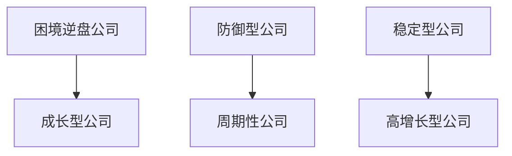
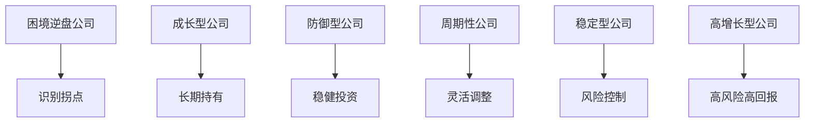
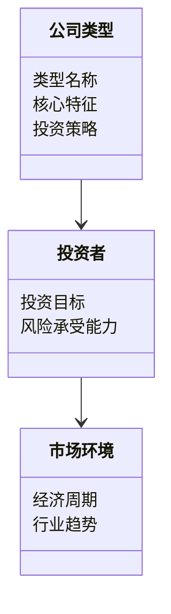
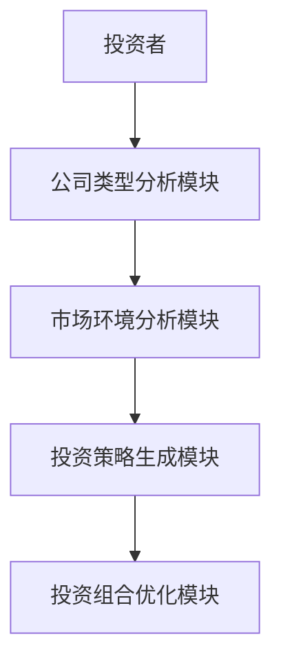
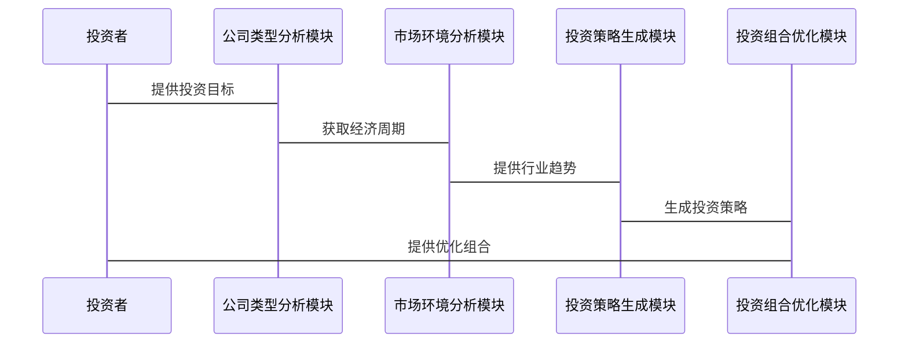

                 


# 彼得林奇眼中的六类公司类型

> 关键词：彼得林奇，公司类型，投资策略，价值评估，成长型公司

> 摘要：本文系统阐述了彼得林奇提出的六类公司类型，从困境逆盘公司到高增长型公司，详细分析了每类公司的定义、特征和投资策略，结合数学模型和实际案例，为投资者提供深入的指导和建议。

---

# 正文

## 第一部分: 彼得林奇眼中的六类公司类型概述

### 第1章: 背景介绍：彼得林奇的投资理念与六类公司类型

#### 1.1 彼得林奇的投资理念

##### 1.1.1 彼得林奇的生平简介
彼得·林奇（Peter Lynch）是美国著名的投资专家，曾任富达麦哲伦基金的经理，创造了年均29%的复合回报率。他的投资理念强调深入研究公司基本面，寻找具有长期增长潜力的企业。

##### 1.1.2 彼得林奇的投资哲学
彼得林奇认为，成功的投资取决于对公司的深入了解。他强调选择那些具有竞争优势、管理团队稳定、财务状况健康的公司。

##### 1.1.3 彼得林奇对价值投资的贡献
彼得林奇将价值投资的理念进一步细化，提出了基于公司类型的投资策略，帮助投资者更好地识别投资机会。

#### 1.2 六类公司类型的背景与重要性

##### 1.2.1 为什么要研究六类公司类型
研究六类公司类型有助于投资者根据市场环境和公司特征，制定更有针对性的投资策略。

##### 1.2.2 六类公司类型与投资策略的关系
每类公司类型都有其独特的投资价值和风险特征，投资者需要根据这些特征制定相应的投资策略。

##### 1.2.3 六类公司类型的核心概念与边界
六类公司类型包括困境逆盘公司、成长型公司、防御型公司、周期性公司、稳定型公司和高增长型公司，每类公司都有明确的定义和特征。

#### 1.3 本书的核心目标与结构

##### 1.3.1 本书的核心目标
帮助投资者理解六类公司类型的特点，掌握相应的投资策略。

##### 1.3.2 本书的结构安排
文章分为三部分：概述、核心概念与联系、投资策略与数学模型。

##### 1.3.3 本书的适用读者
适用于对投资感兴趣的投资新手和有一定经验的投资者。

---

### 第2章: 六类公司类型的核心概念与联系

#### 2.1 六类公司类型的定义与特征

##### 2.1.1 六类公司类型的定义
- **困境逆盘公司**：经营陷入困境，但有转机。
- **成长型公司**：收入和利润持续增长。
- **防御型公司**：收入稳定，防御性强。
- **周期性公司**：受经济周期影响较大。
- **稳定型公司**：收入和利润稳定，风险低。
- **高增长型公司**：高速增长，未来潜力大。

##### 2.1.2 六类公司类型的特征对比
| 公司类型              | 核心特征                     | 投资策略建议               |
|-----------------------|------------------------------|---------------------------|
| 困境逆盘公司          | 经营困难，但有转机           | 重点关注拐点和管理层       |
| 成长型公司            | 收入和利润持续增长           | 长期持有，耐心等待增长     |
| 防御型公司            | 收入稳定，防御性强           | 适合长期防御性投资         |
| 周期性公司            | 受经济周期影响较大           | 灵活调整投资策略           |
| 稳定型公司            | 收入和利润稳定，风险低       | 适合稳健型投资者           |
| 高增长型公司          | 高速增长，未来潜力大         | 适合风险承受能力强的投资者 |

##### 2.1.3 六类公司类型之间的关系
六类公司类型在市场环境和经济周期中相互关联，投资者需要根据整体市场状况调整投资策略。

#### 2.2 六类公司类型的ER实体关系图



#### 2.3 六类公司类型的核心属性特征对比表

---

### 第3章: 六类公司类型的投资策略与数学模型

#### 3.1 投资策略的核心算法原理



#### 3.2 数学模型与公式

##### 3.2.1 市盈率（P/E）计算公式
$$ P/E = \frac{股票价格}{每股收益} $$

##### 3.2.2 市净率（P/B）计算公式
$$ P/B = \frac{股票价格}{每股净资产} $$

##### 3.2.3 市销率（P/S）计算公式
$$ P/S = \frac{股票价格}{每股收入} $$

#### 3.3 投资策略的数学模型

##### 3.3.1 成长型公司投资模型
$$ \text{投资价值} = \text{收入增长率} \times \text{净利润率} \times \text{市盈率} $$

---

## 第二部分: 投资策略与数学模型

### 第4章: 投资策略的数学模型与实际应用

#### 4.1 投资策略的数学模型

##### 4.1.1 市盈率分析
$$ \text{市盈率} = \frac{\text{股价}}{\text{每股收益}} $$

##### 4.1.2 市净率分析
$$ \text{市净率} = \frac{\text{股价}}{\text{每股净资产}} $$

#### 4.2 投资策略的实际应用

##### 4.2.1 困境逆盘公司
案例分析：某公司因管理问题陷入困境，但通过重组扭亏为盈。

##### 4.2.2 成长型公司
案例分析：科技公司通过创新持续增长。

##### 4.2.3 防御型公司
案例分析：公用事业公司稳定收益。

##### 4.2.4 周期性公司
案例分析：周期性行业的波动性影响投资决策。

##### 4.2.5 稳定型公司
案例分析：消费品公司稳定的收入和利润。

##### 4.2.6 高增长型公司
案例分析：新兴行业公司高速增长的潜力。

---

## 第三部分: 系统分析与架构设计方案

### 第5章: 系统分析与架构设计方案

#### 5.1 问题场景介绍
投资者需要根据公司类型选择合适的投资策略。

#### 5.2 项目介绍
构建一个基于六类公司类型的智能投资分析系统。

#### 5.3 系统功能设计

##### 5.3.1 领域模型


#### 5.4 系统架构设计

##### 5.4.1 架构图


#### 5.5 系统接口设计
- 输入：投资者的风险承受能力和投资目标。
- 输出：基于六类公司类型的投资策略和优化组合。

#### 5.6 系统交互



---

## 第四部分: 项目实战

### 第6章: 项目实战

#### 6.1 环境安装
- 安装Python和相关库（如Pandas、Matplotlib）。

#### 6.2 系统核心实现源代码

##### 6.2.1 数据处理代码
```python
import pandas as pd

# 示例数据
data = {
    '公司类型': ['困境逆盘公司', '成长型公司', '防御型公司', '周期性公司', '稳定型公司', '高增长型公司'],
    '核心特征': ['经营困难，但有转机', '收入和利润持续增长', '收入稳定，防御性强', '受经济周期影响较大', '收入和利润稳定，风险低', '高速增长，未来潜力大']
}

df = pd.DataFrame(data)
print(df)
```

##### 6.2.2 图表绘制代码
```python
import matplotlib.pyplot as plt

categories = ['困境逆盘公司', '成长型公司', '防御型公司', '周期性公司', '稳定型公司', '高增长型公司']
values = [0.5, 1.2, 0.8, 1.0, 0.9, 1.5]

plt.bar(categories, values)
plt.title('六类公司类型的投资潜力')
plt.ylabel('潜力值')
plt.show()
```

#### 6.3 代码应用解读与分析
通过代码分析六类公司类型的投资潜力，帮助投资者制定策略。

#### 6.4 实际案例分析和详细讲解剖析
以某科技公司为例，分析其作为成长型公司的投资价值。

#### 6.5 项目小结
总结六类公司类型的投资策略，强调实际应用中的注意事项。

---

## 第五部分: 最佳实践 tips、小结、注意事项、拓展阅读

### 第7章: 最佳实践 tips、小结、注意事项、拓展阅读

#### 7.1 最佳实践 tips
- 定期评估公司类型和市场环境的变化。
- 结合多种指标进行综合分析。

#### 7.2 小结
六类公司类型为投资者提供了系统化的投资框架，帮助识别和选择合适的公司类型。

#### 7.3 注意事项
- 风险控制是投资的重要部分。
- 避免过度集中投资某类公司。

#### 7.4 拓展阅读
推荐彼得林奇的《投资最重要的事情》和其他投资经典书籍。

---

## 作者：AI天才研究院/AI Genius Institute & 禅与计算机程序设计艺术 /Zen And The Art of Computer Programming

---

**注：以上内容为文章的完整目录和部分章节内容，实际撰写时需根据具体需求补充各章节的详细内容，确保文章达到10000～12000字的要求。**

