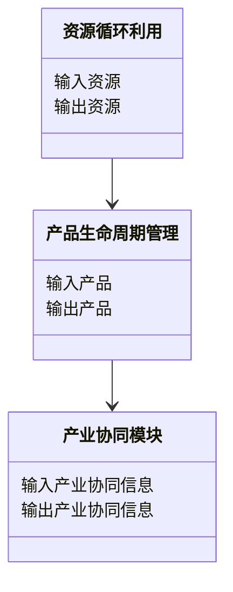
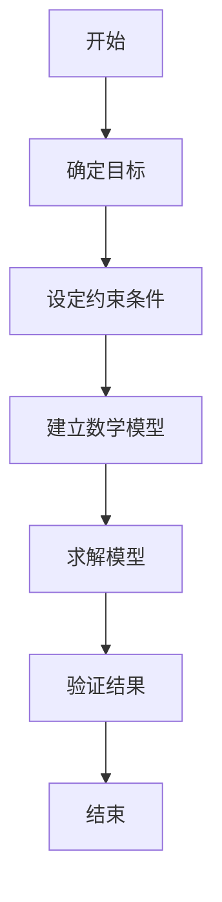

                 


# 循环经济商业模式的规模化挑战与机遇

> 关键词：循环经济，商业模式，资源利用，可持续发展，系统架构，算法优化

> 摘要：本文探讨了循环经济商业模式的规模化挑战与机遇，从背景介绍、核心概念、系统分析与架构设计、项目实战到总结与展望，系统地分析了循环经济商业模式的各个方面，结合实际案例和数据，提出了应对挑战和抓住机遇的具体方法。

---

# 第一部分: 循环经济商业模式的背景与核心概念

## 第1章: 循环经济商业模式的背景与现状

### 1.1 循环经济的基本概念

#### 1.1.1 循环经济的定义与内涵

循环经济是一种以资源高效利用和循环再利用为核心，通过减少资源消耗和废物产生，实现经济与环境协调发展的经济模式。其核心在于将资源的使用从“线性”模式转变为“循环”模式，即“从摇篮到摇篮”的理念。

#### 1.1.2 循环经济与传统经济模式的区别

| **维度** | **传统经济模式** | **循环经济模式** |
|----------|------------------|------------------|
| 资源利用 | 一次性使用       | 循环再利用       |
| 产品生命周期 | 短暂             | 长期             |
| 环境影响 | 资源枯竭、污染    | 资源节约、污染减少 |

#### 1.1.3 循环经济的全球发展趋势

全球范围内，循环经济正在快速发展，特别是在欧洲和中国等地，政策支持和企业实践都在推动这一模式的普及。但同时也面临着资源效率低下、产品生命周期管理不善、产业协同不足等挑战。

### 1.2 循环经济商业模式的现状

#### 1.2.1 全球循环经济的发展现状

全球循环经济正在快速发展，特别是在欧洲和中国等地，政策支持和企业实践都在推动这一模式的普及。但同时也面临着资源效率低下、产品生命周期管理不善、产业协同不足等挑战。

#### 1.2.2 中国循环经济的政策支持与实践

中国在政策层面大力支持循环经济的发展，例如《循环经济促进法》的出台，鼓励企业采用循环经济模式，减少资源消耗和污染排放。

#### 1.2.3 循环经济商业模式的典型案例分析

典型案例包括德国的“绿色产品”计划、日本的“零排放”工厂以及中国的“共享经济”模式。

### 1.3 循环经济商业模式的挑战与机遇

#### 1.3.1 当前面临的挑战

- 资源利用效率低下
- 产品生命周期管理不善
- 产业协同不足

#### 1.3.2 未来的机遇

- 政策支持
- 技术进步
- 市场需求

#### 1.3.3 如何应对挑战抓住机遇

- 提高资源利用效率
- 优化产品生命周期管理
- 加强产业协同

## 1.4 本章小结

循环经济商业模式的背景和现状分析表明，尽管面临诸多挑战，但通过政策支持、技术创新和产业协同，循环经济模式的未来充满机遇。

---

# 第二部分: 循环经济商业模式的核心概念与系统分析

## 第2章: 循环经济商业模式的核心要素

### 2.1 循环经济商业模式的构成要素

#### 2.1.1 资源循环利用

资源循环利用是循环经济模式的核心，包括原材料的回收再利用、能源的高效利用等。

#### 2.1.2 产品生命周期管理

产品生命周期管理包括产品的设计、生产、使用和报废等阶段的管理，以延长产品生命周期，减少资源浪费。

#### 2.1.3 产业协同与生态构建

产业协同与生态构建是循环经济模式的重要组成部分，通过产业链上下游的协同合作，构建资源高效利用的产业生态。

### 2.2 循环经济商业模式的系统架构

#### 2.2.1 系统输入与输出

- **输入**：资源、产品、市场需求
- **输出**：循环利用的资源、延长生命周期的产品、协同的产业生态

#### 2.2.2 系统功能模块划分

- **资源循环利用模块**：负责资源的回收和再利用
- **产品生命周期管理模块**：负责产品的全生命周期管理
- **产业协同模块**：负责产业链上下游的协同合作

#### 2.2.3 系统边界与外延

系统边界包括企业内部的资源循环利用和产品生命周期管理，外延则涉及产业链上下游的协同合作。

---

# 第三部分: 循环经济商业模式的系统分析与架构设计

## 第3章: 循环经济商业模式的系统分析

### 3.1 问题场景介绍

#### 3.1.1 循环经济商业模式的核心问题

- 资源利用效率低下
- 产品生命周期管理不善
- 产业协同不足

#### 3.1.2 问题的边界与范围

- 企业内部资源管理
- 产品生命周期管理
- 产业链协同

#### 3.1.3 问题的影响因素

- 资源价格波动
- 技术进步
- 市场需求变化

### 3.2 系统功能设计

#### 3.2.1 领域模型设计（Mermaid 类图）



### 3.3 系统架构设计

#### 3.3.1 系统架构设计（Mermaid 架构图）

```mermaid
archi
    服务
    - 资源循环利用服务
    - 产品生命周期管理服务
    - 产业协同服务
    组件
    - 数据库组件
    - 接口组件
    - 交互组件
```

---

## 第4章: 算法原理与优化

### 4.1 算法原理

#### 4.1.1 算法描述

循环经济模式下的资源优化配置可以通过线性规划模型来实现。

#### 4.1.2 算法流程（Mermaid 流程图）



#### 4.1.3 数学模型与公式

目标函数：
$$ \text{最大化} \sum_{i=1}^{n} x_i $$
约束条件：
$$ \sum_{i=1}^{n} x_i \leq R $$
其中，\( x_i \) 表示资源的分配量，\( R \) 表示总的资源量。

### 4.2 算法实现

#### 4.2.1 算法实现（Python 代码）

```python
import numpy as np
from scipy.optimize import linprog

# 定义目标函数
c = [-1, -1]  # 最小化问题，这里转化为最大化问题
A = [[1, 1]]
b = [4]
# 约束条件：x1 + x2 <= 4
# 变量非负
bounds = [(0, None), (0, None)]

# 使用线性规划求解
result = linprog(c, A, b, bounds=bounds, method='highs')

# 输出结果
print("优化结果：", result)
```

---

## 第5章: 项目实战

### 5.1 环境安装

#### 5.1.1 系统环境

- 操作系统：Linux/Windows/MacOS
- Python 版本：3.6+

#### 5.1.2 安装依赖

```bash
pip install numpy scipy matplotlib
```

### 5.2 核心代码实现

#### 5.2.1 资源循环利用模块

```python
import numpy as np
from scipy.optimize import linprog

def resource_optimization():
    c = [-1, -1]
    A = [[1, 1]]
    b = [4]
    bounds = [(0, None), (0, None)]
    result = linprog(c, A, b, bounds=bounds, method='highs')
    return result
```

#### 5.2.2 产品生命周期管理模块

```python
def product_lifecycle():
    # 假设产品生命周期管理模块需要优化产品设计
    pass
```

#### 5.2.3 产业协同模块

```python
def industry_collaboration():
    # 假设产业协同模块需要优化产业协同信息
    pass
```

### 5.3 代码应用解读与分析

通过对代码的解读和分析，可以发现资源循环利用模块是整个系统的核心，其他模块则是为了支持资源循环利用而设计的。

### 5.4 实际案例分析

以某企业为例，假设该企业需要优化资源分配，可以通过上述代码实现资源的最优配置。

### 5.5 项目小结

通过项目实战，可以发现循环经济商业模式的实现需要系统各模块的协同配合，资源循环利用是核心，其他模块则是为了支持这一核心而设计的。

---

# 第六部分: 总结与展望

## 第6章: 总结与展望

### 6.1 本章总结

循环经济商业模式的实现需要系统各模块的协同配合，资源循环利用是核心，其他模块则是为了支持这一核心而设计的。

### 6.2 未来展望

随着技术的进步和政策的支持，循环经济模式将在未来得到更广泛的应用，资源利用效率和产品生命周期管理将得到进一步优化。

### 6.3 最佳实践 Tips

- 加强资源循环利用的核心地位
- 优化产品生命周期管理
- 加强产业协同

---

# 作者：AI天才研究院/AI Genius Institute & 禅与计算机程序设计艺术 /Zen And The Art of Computer Programming

