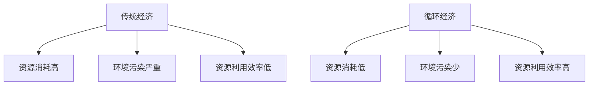
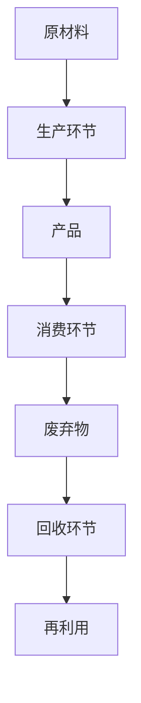

                 

# 循环经济模式下的可持续投资策略

## 关键词：循环经济、可持续投资、资源循环利用、绿色金融、ESG投资

## 摘要：
本文探讨了循环经济模式下的可持续投资策略，分析了循环经济与可持续投资的核心概念及其内在联系，详细阐述了循环经济的运作机制与投资逻辑，提出了可持续投资策略的制定与实施方法。通过系统分析与架构设计，构建了循环经济模式下的可持续投资理论框架，并结合实际案例，提出了具体的实施路径与最佳实践建议。

---

# 第一部分：循环经济与可持续投资的背景分析

## 第1章：循环经济与可持续投资的核心概念

### 1.1 循环经济的基本定义与特征

#### 1.1.1 循环经济的定义
循环经济是一种以资源高效利用和循环利用为核心，以减量化、再利用、资源化为原则的经济发展模式。其本质是通过技术创新和制度创新，实现资源的闭环循环，减少对自然资源的依赖，降低环境污染。

#### 1.1.2 循环经济的核心特征
循环经济效益对比对表：

| 特征       | 描述                                                                 |
|------------|----------------------------------------------------------------------|
| 资源高效利用 | 通过技术创新，提高资源利用效率，减少浪费。                       |
| 循环利用    | 资源在不同环节之间循环流动，形成闭环系统。                         |
| 低排放      | 通过减少污染物排放，实现环境友好型发展。                           |
| 经济与生态协同发展 | 经济发展与生态环境保护相辅相成，实现可持续发展目标。             |

#### 1.1.3 循环经济与传统经济的对比
循环经济与传统经济的对比图（Mermaid）：

---

### 1.2 可持续投资的基本概念

#### 1.2.1 可持续投资的定义
可持续投资是指在追求财务回报的同时，考虑环境、社会和公司治理（ESG）因素的投资方式。其目标是通过投资于具有可持续性优势的企业或项目，实现长期的经济和社会价值。

#### 1.2.2 可持续投资的核心原则
可持续投资的核心原则包括：
1. 环境原则（Environmental）：关注企业在环境保护方面的表现。
2. 社会原则（Social）：关注企业在社会责任方面的表现。
3. 治理原则（Governance）：关注企业的治理结构和透明度。

#### 1.2.3 可持续投资的分类与范围
可持续投资的分类：

| 类型         | 描述                                                                 |
|--------------|----------------------------------------------------------------------|
| 绿色债券     | 投资于环保项目的企业债券。                                             |
| ESG投资     | 根据企业ESG表现进行选股或配置的投资策略。                               |
| 社会责任投资 | 投资于具有良好社会表现的企业或项目。                                     |

---

### 1.3 循环经济模式与可持续投资的内在联系

#### 1.3.1 循环经济模式对可持续投资的影响
循环经济模式通过资源循环利用和产业协同，降低了投资的风险，并为投资者提供了新的收益来源。

#### 1.3.2 可持续投资在循环经济中的作用
可持续投资为循环经济提供了资金支持，推动了循环经济相关技术和产业的发展。

#### 1.3.3 两者的协同效应与边界条件
循环经济与可持续投资的协同效应体现在资源利用效率提升、环境污染减少和经济价值创造。边界条件包括政策支持、技术创新和市场机制。

---

## 第2章：循环经济模式下的投资策略分析

### 2.1 循环经济模式下的投资机会识别

#### 2.1.1 循环经济产业链的构成与分析
循环经济产业链的构成：

#### 2.1.2 可持续投资机会的识别方法
识别循环经济模式下的投资机会时，应重点关注技术创新、政策支持和市场需求。

#### 2.1.3 循环经济模式下的新兴行业分析
新兴行业包括资源回收利用、绿色能源和共享经济。

---

### 2.2 可持续投资策略的制定与实施

#### 2.2.1 投资目标的设定与分解
可持续投资目标的设定应包括财务回报、环境效益和社会效益。

#### 2.2.2 投资组合的构建与优化
投资组合应包含绿色债券、ESG表现良好的企业股票和循环经济相关产业的项目。

#### 2.2.3 投资风险的评估与管理
投资风险包括政策风险、市场风险和技术风险。

---

### 2.3 循环经济模式下的投资风险与挑战

#### 2.3.1 循环经济模式中的主要风险因素
主要风险包括技术不成熟、市场需求不足和政策不确定性。

#### 2.3.2 可持续投资面临的政策与市场不确定性
政策变化和市场波动是可持续投资的主要挑战。

#### 2.3.3 技术与商业模式的创新挑战
技术创新和商业模式的创新是推动循环经济发展的关键。

---

# 第二部分：循环经济与可持续投资的核心机制

## 第3章：循环经济的运作机制与投资逻辑

### 3.1 循环经济的资源循环利用机制

#### 3.1.1 资源循环利用的实现路径
资源循环利用的实现路径包括技术改造、制度创新和市场机制。

#### 3.1.2 资源高效利用的技术创新
技术创新是实现资源高效利用的核心驱动力。

#### 3.1.3 循环经济模式下的资源分配与优化
资源分配应遵循公平、高效和可持续的原则。

---

### 3.2 循环经济的产业模式创新

#### 3.2.1 产业共生网络的构建
产业共生网络的构建是循环经济发展的关键。

#### 3.2.2 产业链协同发展的实现路径
产业链协同发展的实现路径包括技术创新、资源整合和政策支持。

#### 3.2.3 循环经济模式下的企业组织创新
企业组织创新包括扁平化、网络化和模块化。

---

### 3.3 循环经济的生态价值评估与实现

#### 3.3.1 生态价值的量化方法
生态价值的量化方法包括环境成本法和生态补偿法。

#### 3.3.2 生态价值与经济价值的结合
生态价值与经济价值的结合是循环经济发展的核心。

#### 3.3.3 循环经济模式下的生态补偿机制
生态补偿机制包括政府补偿、市场补偿和社会补偿。

---

## 第4章：可持续投资的核心机制与策略

### 4.1 可持续投资的绿色金融创新

#### 4.1.1 绿色金融的定义与作用
绿色金融是指用于支持环境改善、应对气候变化和资源节约的金融工具。

#### 4.1.2 绿色金融的创新模式
绿色金融的创新模式包括绿色债券、绿色基金和绿色保险。

---

### 4.2 可持续投资的ESG投资策略

#### 4.2.1 ESG投资的核心理念
ESG投资的核心理念是通过关注环境、社会和公司治理因素，实现长期的财务回报。

#### 4.2.2 ESG投资的实施路径
ESG投资的实施路径包括企业筛选、投资组合优化和风险控制。

---

### 4.3 可持续投资的风险管理与收益分析

#### 4.3.1 可持续投资的风险管理
风险管理包括政策风险、市场风险和信用风险。

#### 4.3.2 可持续投资的收益分析
可持续投资的收益来源于资源效率提升、技术创新和市场需求增长。

---

# 第三部分：系统分析与可持续投资架构设计

## 第5章：系统分析与可持续投资架构设计

### 5.1 循环经济模式下的可持续投资理论框架

#### 5.1.1 理论框架的构建
理论框架的构建应包括循环经济、可持续投资和系统科学的交叉融合。

#### 5.1.2 理论框架的验证与优化
理论框架的验证与优化需要通过实证研究和案例分析。

---

### 5.2 可持续投资策略的实施路径

#### 5.2.1 投资策略的制定
投资策略的制定应基于市场分析、风险评估和收益预测。

#### 5.2.2 投资策略的实施
投资策略的实施包括资产配置、投资组合管理和风险控制。

---

### 5.3 可持续投资的系统架构设计

#### 5.3.1 系统架构的总体设计
系统架构的总体设计应包括数据采集、分析、决策和反馈模块。

#### 5.3.2 系统架构的功能模块
功能模块包括数据采集、分析、决策和反馈模块。

---

# 第四部分：项目实战与最佳实践

## 第6章：项目实战与最佳实践

### 6.1 项目背景与目标

#### 6.1.1 项目背景
项目背景包括循环经济的发展现状和可持续投资的市场需求。

#### 6.1.2 项目目标
项目目标包括实现资源循环利用、降低环境污染和提高经济效益。

---

### 6.2 系统实现与代码分析

#### 6.2.1 环境安装与配置
环境安装与配置包括操作系统、编程语言和开发工具的安装。

#### 6.2.2 核心代码实现
核心代码实现包括数据采集、分析和决策模块的开发。

#### 6.2.3 代码解读与优化
代码解读与优化包括代码的可读性、效率和功能完善。

---

### 6.3 案例分析与经验总结

#### 6.3.1 典型案例分析
典型案例分析包括绿色债券发行、ESG投资和循环经济项目的实施。

#### 6.3.2 经验总结与启示
经验总结包括政策支持、技术创新和市场机制的重要性。

---

## 第7章：最佳实践、小结与注意事项

### 7.1 最佳实践建议

#### 7.1.1 政策支持与制度创新
政策支持与制度创新是推动循环经济发展的关键。

#### 7.1.2 技术创新与模式创新
技术创新与模式创新是实现可持续投资的核心驱动力。

---

### 7.2 小结与展望

#### 7.2.1 小结
本文系统分析了循环经济模式下的可持续投资策略，提出了理论框架和实践路径。

#### 7.2.2 展望
未来的研究方向包括技术创新、政策优化和国际合作。

---

## 第8章：注意事项与拓展阅读

### 8.1 投资者注意事项

#### 8.1.1 风险提示
投资者应关注政策风险、市场风险和技术风险。

#### 8.1.2 投资策略调整
投资者应根据市场变化和企业表现调整投资策略。

---

### 8.2 拓展阅读与学习资源

#### 8.2.1 相关书籍
推荐阅读《循环经济理论与实践》和《可持续投资策略》。

#### 8.2.2 研究论文
推荐阅读相关领域的学术论文和研究报告。

---

## 作者：AI天才研究院/AI Genius Institute & 禅与计算机程序设计艺术 /Zen And The Art of Computer Programming

