                 


# 微服务架构：构建模块化的AI Agent系统

> **关键词**：微服务架构，AI Agent，模块化设计，服务发现，分布式系统，系统架构

> **摘要**：  
本文探讨了如何利用微服务架构构建模块化的AI Agent系统。通过分析微服务架构的核心原则和AI Agent的功能机制，结合实际案例，详细阐述了模块化设计、服务发现、通信机制等关键环节，并通过系统架构设计和项目实战，展示了如何在实际应用中实现高效的AI Agent系统。本文还讨论了系统优化和扩展性设计，为读者提供了深入的技术指导和实践建议。

---

## 第一部分：微服务架构与AI Agent概述

### 第1章：微服务架构与AI Agent的基本概念

#### 1.1 微服务架构的定义与特点

微服务架构是一种将应用程序分解为多个小型、独立服务的软件架构模式。每个服务都是一个独立的进程，围绕一个特定的业务功能构建，并通过轻量级通信机制（如HTTP或消息队列）进行通信。以下是微服务架构的核心特点：

- **独立开发与部署**：每个服务都可以独立开发、测试和部署。
- **松耦合**：服务之间松耦合，便于扩展和维护。
- **可扩展性**：可以根据负载需求单独扩展服务。
- **技术多样性**：每个服务可以选择不同的技术栈。

**图1-1 微服务架构与单体架构对比**

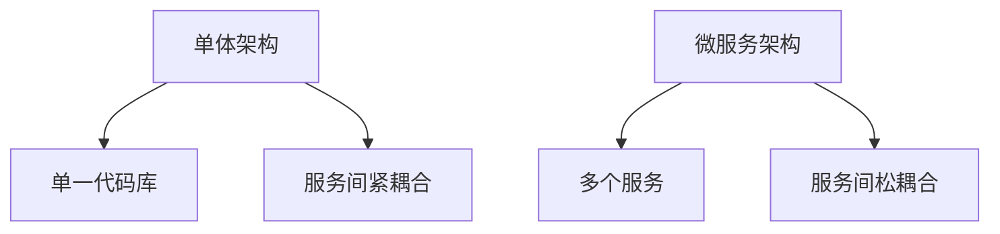

---

#### 1.2 AI Agent的基本概念

AI Agent（人工智能代理）是一种能够感知环境、做出决策并执行动作的智能实体。AI Agent的核心功能包括：

- **感知**：通过传感器或API获取环境数据。
- **决策**：基于感知数据，使用算法做出决策。
- **执行**：通过执行器将决策转化为具体动作。

**图1-2 AI Agent的核心功能**

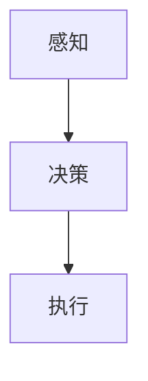

---

#### 1.3 微服务架构与AI Agent的结合

将微服务架构应用于AI Agent系统中，可以通过模块化设计将AI Agent的感知、决策和执行功能分解为独立的服务。这种设计不仅提高了系统的可维护性和扩展性，还便于团队协作开发。

**图1-3 微服务架构下的AI Agent系统**

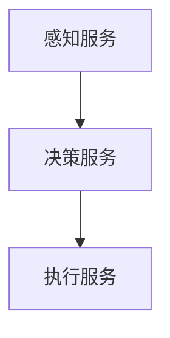

---

## 第二部分：微服务架构的设计原则

### 第2章：模块化设计与服务发现

#### 2.1 模块化设计的原则

模块化设计是微服务架构的核心思想。以下是模块化设计的几个关键原则：

1. **单一职责原则**：每个服务只负责一个业务功能。
2. **模块间松耦合**：服务之间通过接口通信，避免直接依赖。
3. **可扩展性**：模块可以独立扩展或替换。

**表2-1 模块化设计与传统架构对比**

| 特性                | 模块化设计            | 传统单体架构          |
|---------------------|----------------------|----------------------|
| 独立性              | 高                  | 低                  |
| 扩展性              | 高                  | 低                  |
| 维护复杂度          | 低                  | 高                  |
| 开发效率            | 高                  | 低                  |

#### 2.2 服务发现机制

服务发现是微服务架构中的关键问题。以下是几种常见的服务发现机制：

1. **基于DNS的服务发现**：通过DNS记录服务地址，客户端直接通过DNS解析服务IP。
2. **基于注册中心的服务发现**：服务注册到注册中心，客户端通过注册中心获取服务地址。

**图2-1 基于注册中心的服务发现流程**

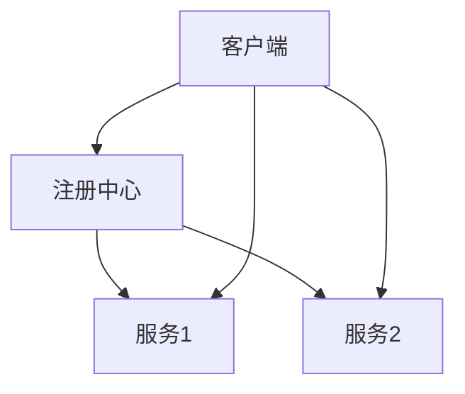

#### 2.3 微服务间的通信机制

微服务之间的通信方式主要有以下几种：

1. **REST API**：通过HTTP协议调用远程服务。
2. **消息队列**：通过队列系统异步通信。
3. **GraphQL**：通过图灵查询语言进行复杂查询。

**图2-2 微服务通信方式对比**

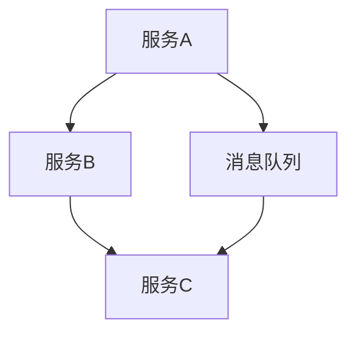

---

## 第三部分：AI Agent的核心机制

### 第3章：AI Agent的感知、决策与执行

#### 3.1 感知机制

AI Agent的感知机制通过传感器或API获取环境数据。以下是感知机制的核心步骤：

1. **数据采集**：通过传感器或API获取数据。
2. **数据预处理**：对数据进行清洗和转换，使其适合后续处理。
3. **数据存储**：将数据存储到数据库中，供后续使用。

**图3-1 感知机制流程图**

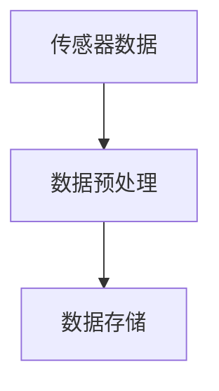

#### 3.2 决策机制

决策机制是AI Agent的核心部分，基于感知数据做出决策。以下是常见的决策算法：

1. **基于规则的决策**：根据预定义的规则进行决策。
2. **基于模型的决策**：使用机器学习模型进行预测。

**图3-2 基于规则的决策流程**

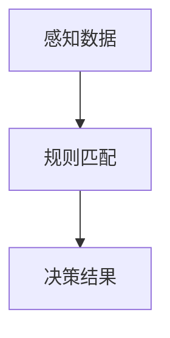

#### 3.3 执行机制

执行机制将决策结果转化为具体动作。以下是执行机制的核心步骤：

1. **动作规划**：根据决策结果制定执行计划。
2. **动作执行**：通过执行器将计划转化为具体动作。
3. **结果反馈**：将执行结果反馈给感知模块。

**图3-3 执行机制流程图**

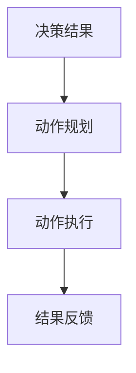

---

## 第四部分：微服务架构下的AI Agent系统设计

### 第4章：微服务架构与AI Agent的结合设计

#### 4.1 微服务架构下的AI Agent设计模式

在微服务架构下，AI Agent的模块划分通常包括以下部分：

1. **感知服务**：负责数据采集和预处理。
2. **决策服务**：负责基于感知数据做出决策。
3. **执行服务**：负责将决策结果转化为具体动作。

**图4-1 微服务架构下的AI Agent系统架构**


#### 4.2 服务拆分与通信机制

服务拆分是微服务架构设计中的关键步骤。以下是服务拆分的几个原则：

1. **业务功能划分**：根据业务功能将服务划分为独立的模块。
2. **通信机制选择**：根据服务之间的依赖关系选择合适的通信机制。

**图4-2 服务拆分与通信机制**

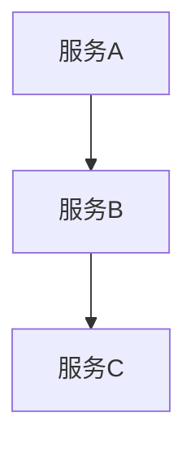

---

## 第五部分：系统实现与项目实战

### 第5章：系统实现

#### 5.1 整体架构设计

以下是微服务架构下的AI Agent系统整体架构：

1. **感知服务**：负责数据采集和预处理。
2. **决策服务**：负责基于感知数据做出决策。
3. **执行服务**：负责将决策结果转化为具体动作。
4. **API网关**：负责统一对外接口和流量管理。

**图5-1 系统整体架构**

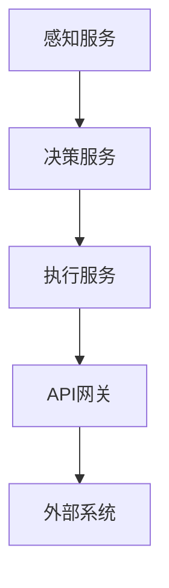

#### 5.2 服务实现

以下是各服务的实现代码示例：

##### 感知服务实现

```python
from flask import Flask

app = Flask(__name__)

@app.route('/api/sensor', methods=['GET'])
def get_sensor_data():
    # 模拟传感器数据
    return {'temperature': 25, 'humidity': 60}
```

##### 决策服务实现

```python
from flask import Flask
import random

app = Flask(__name__)

@app.route('/api/decision', methods=['POST'])
def make_decision():
    # 模拟决策逻辑
    data = request.json
    return {'decision': random.choice(['open', 'close'])}
```

##### 执行服务实现

```python
from flask import Flask
import time

app = Flask(__name__)

@app.route('/api/action', methods=['POST'])
def execute_action():
    # 模拟执行动作
    time.sleep(2)
    return {'status': 'success'}
```

#### 5.3 API设计与集成

以下是API设计的详细说明：

1. **感知服务API**：提供传感器数据获取接口。
2. **决策服务API**：提供决策接口，接收感知数据并返回决策结果。
3. **执行服务API**：提供执行动作接口，接收决策结果并返回执行状态。

**图5-2 系统API设计**


#### 5.4 系统测试与优化

系统测试包括以下步骤：

1. **单元测试**：对每个服务进行单元测试，确保每个服务独立运行正常。
2. **集成测试**：对整个系统进行集成测试，确保服务之间的通信正常。
3. **性能优化**：通过分析系统性能瓶颈，进行优化。

**图5-3 系统测试流程**

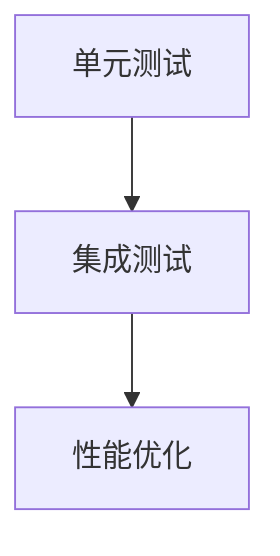

---

## 第六部分：扩展与优化

### 第6章：系统优化与扩展

#### 6.1 性能优化

性能优化是系统设计中的重要部分。以下是几个常见的性能优化方法：

1. **缓存优化**：通过缓存技术减少重复计算。
2. **负载均衡**：通过负载均衡技术分摊服务压力。
3. **数据库优化**：通过数据库索引优化查询性能。

**图6-1 负载均衡实现**

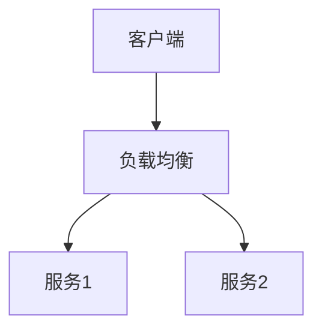

#### 6.2 可扩展性设计

可扩展性设计是系统设计中的另一个重要部分。以下是几个常见的可扩展性设计方法：

1. **服务拆分**：将系统拆分为多个独立的服务，便于扩展。
2. **消息队列**：通过消息队列实现异步通信，提高系统的可扩展性。
3. **弹性伸缩**：通过弹性伸缩技术自动调整资源分配。

**图6-2 弹性伸缩实现**

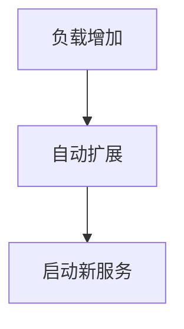

#### 6.3 安全性增强

安全性是系统设计中的重要部分。以下是几个常见的安全性增强方法：

1. **身份认证**：通过身份认证技术确保只有授权用户可以访问系统。
2. **权限控制**：通过权限控制技术确保用户只能访问其权限范围内的资源。
3. **加密通信**：通过加密技术确保数据在传输过程中的安全性。

**图6-3 安全性增强实现**

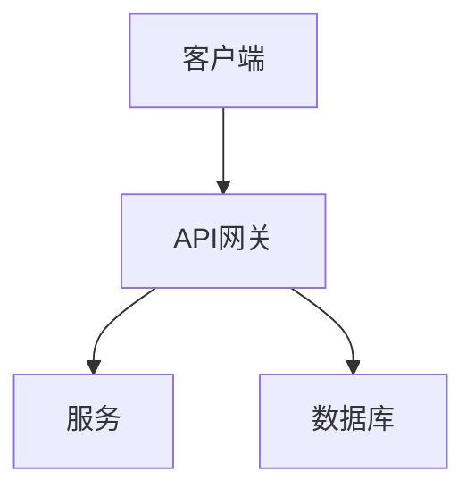

---

## 第七部分：总结与展望

### 第7章：总结与展望

#### 7.1 小结

本文详细探讨了如何利用微服务架构构建模块化的AI Agent系统。通过模块化设计、服务发现和通信机制的设计，我们可以将AI Agent的感知、决策和执行功能分解为独立的服务，从而提高系统的可维护性和扩展性。

#### 7.2 展望

随着人工智能技术的不断发展，微服务架构在AI Agent系统中的应用将越来越广泛。未来，我们可以进一步研究如何在微服务架构下实现更高效的AI Agent系统，例如通过边缘计算、区块链等技术进一步优化系统的性能和安全性。

---

## 作者信息

作者：AI天才研究院/AI Genius Institute & 禅与计算机程序设计艺术 /Zen And The Art of Computer Programming

---

**文章总结**：  
通过本文的详细讲解，读者可以深入了解如何利用微服务架构构建模块化的AI Agent系统。从核心概念到系统设计，从项目实战到系统优化，本文为读者提供了全面的技术指导和实践建议。

