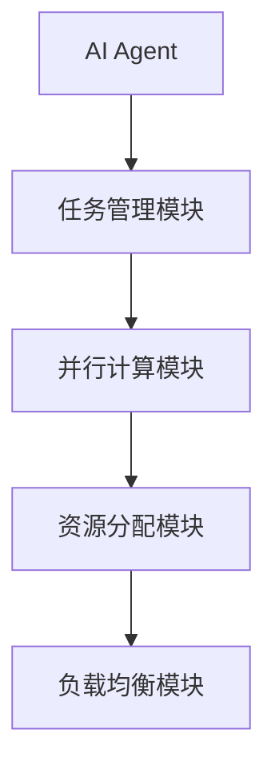
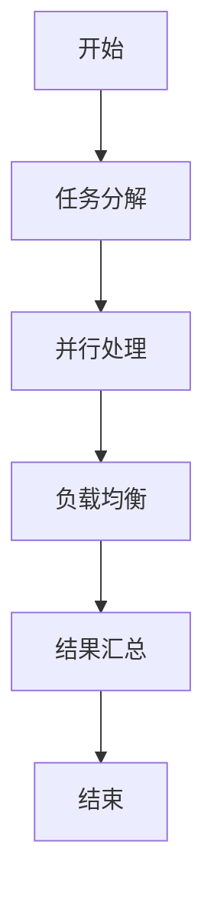
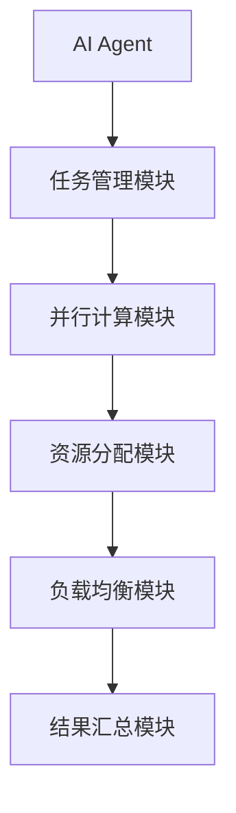
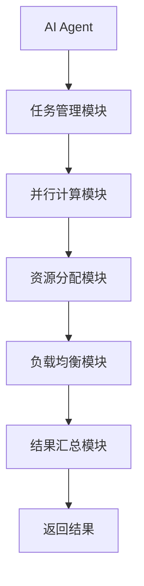

                 


# 性能优化：提升AI Agent的响应速度

---

## 关键词：AI Agent，性能优化，响应速度，并行计算，负载均衡，异步处理

---

## 摘要

本文详细探讨了如何优化AI Agent的响应速度，从问题背景到解决方案，从理论分析到实际应用，全面剖析了性能优化的关键点。通过数学建模、算法设计、系统架构优化等多维度的分析，提出了切实可行的优化策略，帮助读者在实际场景中提升AI Agent的性能表现。

---

# 第一部分: 性能优化基础

## 第1章: AI Agent性能优化的背景与挑战

### 1.1 问题背景

#### 1.1.1 AI Agent的定义与特点

AI Agent（人工智能代理）是一种能够感知环境、自主决策并执行任务的智能实体。其特点包括：

- **自主性**：能够在没有外部干预的情况下执行任务。
- **反应性**：能够实时感知环境并做出反应。
- **目标导向性**：以特定目标为导向，优化行为以实现目标。
- **学习能力**：通过数据和经验不断优化自身性能。

#### 1.1.2 响应速度对用户体验的影响

AI Agent的响应速度直接影响用户体验，具体表现在以下几个方面：

- **用户体验**：响应速度越快，用户满意度越高。
- **任务效率**：快速响应能够提高任务执行效率，减少资源浪费。
- **市场竞争**：在商业场景中，响应速度是区分竞争力的重要指标。

#### 1.1.3 当前AI Agent性能优化的痛点

当前AI Agent的性能优化面临以下痛点：

- **计算资源分配不合理**：传统串行处理方式效率低下。
- **数据通信开销大**：并行计算中的通信 overhead 高。
- **任务调度机制不优**：缺乏有效的负载均衡策略。

### 1.2 问题描述

#### 1.2.1 响应速度的衡量标准

响应速度的衡量标准包括：

- **平均响应时间（ART）**：单位时间内任务的平均完成时间。
- **最大响应时间（MRT）**：系统在高峰期的最大响应时间。
- **吞吐量（Throughput）**：单位时间内完成的任务数量。

#### 1.2.2 影响响应速度的关键因素

影响AI Agent响应速度的关键因素包括：

- **计算任务的复杂度**：任务本身的计算量决定了所需时间。
- **资源分配策略**：资源分配的合理性直接影响任务执行效率。
- **通信机制**：任务执行中的数据通信开销。
- **任务调度算法**：调度算法的优劣直接影响任务执行效率。

#### 1.2.3 优化目标与边界条件

优化目标是将AI Agent的响应速度提升到最优水平，同时满足以下边界条件：

- **资源约束**：在现有计算资源条件下。
- **实时性要求**：满足实时任务处理需求。
- **任务类型**：针对特定类型的任务进行优化。

### 1.3 问题解决思路

#### 1.3.1 分析问题的方法论

采用以下方法论进行问题分析：

1. **分解问题**：将复杂问题分解为多个子问题。
2. **逐个击破**：逐一分析子问题的解决方案。
3. **综合优化**：将各个子问题的解决方案整合，形成全局优化方案。

#### 1.3.2 解决方案的初步构思

初步构思的解决方案包括：

- **并行计算**：利用多核处理器进行并行计算。
- **异步处理**：采用异步任务处理减少等待时间。
- **负载均衡**：动态分配任务负载，避免资源浪费。

#### 1.3.3 优化策略的制定

制定以下优化策略：

1. **任务分解策略**：将任务分解为可并行处理的子任务。
2. **资源分配策略**：根据任务需求动态分配资源。
3. **调度优化策略**：采用高效的调度算法减少任务等待时间。

### 1.4 本章小结

本章从背景、问题描述和解决思路三个方面详细介绍了AI Agent性能优化的必要性及其重要意义，为后续章节的深入分析奠定了基础。

---

## 第2章: 性能优化的核心概念

### 2.1 核心概念与原理

#### 2.1.1 并行计算与并行化策略

并行计算是指同时执行多个计算任务，以提高计算效率。并行化策略包括：

- **任务分解**：将任务分解为多个可并行执行的子任务。
- **资源分配**：合理分配计算资源以避免资源争抢。
- **同步与异步**：根据任务依赖关系选择同步或异步执行方式。

#### 2.1.2 异步处理与任务分解

异步处理是指任务之间不互相等待，能够提高系统的整体吞吐量。任务分解需要考虑以下因素：

- **任务粒度**：任务的大小影响并行效率。
- **任务依赖**：任务之间的依赖关系影响分解方式。
- **任务类型**：不同类型任务的处理方式不同。

#### 2.1.3 负载均衡与资源分配

负载均衡是指将任务负载均匀分配到不同计算节点上，以避免资源浪费和性能瓶颈。资源分配需要考虑：

- **节点负载**：节点当前的负载状态。
- **任务需求**：任务的计算需求。
- **节点能力**：节点的计算能力和资源情况。

### 2.2 核心概念对比分析

#### 2.2.1 同步与异步的对比

| 对比维度 | 同步处理 | 异步处理 |
|----------|----------|----------|
| 执行方式 | 任务必须顺序执行，前一个任务完成才能执行下一个任务。 | 任务可以异步执行，前一个任务无需等待后一个任务完成。 |
| 性能影响 | 响应时间较长，系统吞吐量低。 | 响应时间较短，系统吞吐量高。 |
| 资源利用率 | 资源利用率低，等待时间长。 | 资源利用率高，等待时间短。 |

#### 2.2.2 并行与串行的对比

| 对比维度 | 并行处理 | 串行处理 |
|----------|----------|----------|
| 执行方式 | 多个任务同时执行。 | 任务顺序执行。 |
| 响应时间 | 响应时间较短。 | 响应时间较长。 |
| 系统吞吐量 | 吞吐量高。 | 吞吐量低。 |

#### 2.2.3 负载均衡算法的对比

| 算法名称 | 基本原理 | 优缺点 |
|----------|----------|--------|
| 轮询算法 | 按顺序轮流分配任务。 | 均衡性好，实现简单，但可能无法适应动态负载变化。 |
| 随机算法 | 随机选择节点分配任务。 | 实现简单，但均衡性差，容易出现某些节点负载过重。 |
| 最小负载算法 | 将任务分配给负载最小的节点。 | 均衡性好，但实现复杂，需要频繁监控节点负载状态。 |

### 2.3 实体关系分析

#### 2.3.1 实体关系图



---

## 第3章: 基于数学模型的优化方法

### 3.1 数学模型与公式

#### 3.1.1 任务分解公式

$$ T_{total} = \sum_{i=1}^{n} T_i $$

其中，\( T_{total} \) 表示总任务时间，\( T_i \) 表示第 \( i \) 个子任务的时间。

#### 3.1.2 并行计算效率公式

$$ E = \frac{T_{serial}}{T_{parallel}} $$

其中，\( E \) 表示并行效率，\( T_{serial} \) 表示串行处理时间，\( T_{parallel} \) 表示并行处理时间。

#### 3.1.3 负载均衡模型

$$ L = \frac{\sum_{i=1}^{n} w_i}{n} $$

其中，\( L \) 表示负载均衡程度，\( w_i \) 表示第 \( i \) 个节点的权重，\( n \) 表示节点数量。

### 3.2 算法流程图

#### 3.2.1 并行计算流程图



---

## 第4章: 系统架构优化与实现

### 4.1 系统架构设计

#### 4.1.1 系统架构图



#### 4.1.2 系统功能设计

- **任务管理模块**：负责任务的接收、分解和分配。
- **并行计算模块**：负责并行任务的执行。
- **资源分配模块**：负责计算资源的动态分配。
- **负载均衡模块**：负责负载均衡策略的实现。
- **结果汇总模块**：负责任务结果的汇总和返回。

#### 4.1.3 系统接口设计

- **任务管理接口**：接收任务请求，分解任务并分配给并行计算模块。
- **并行计算接口**：执行分解后的子任务并返回结果。
- **资源分配接口**：根据任务需求动态分配计算资源。
- **负载均衡接口**：监控节点负载状态并进行负载均衡。

#### 4.1.4 系统交互流程图



### 4.2 系统优化策略

#### 4.2.1 并行计算优化

- **任务分解**：将任务分解为可并行处理的子任务。
- **资源分配**：根据任务需求动态分配资源。
- **同步与异步**：根据任务依赖关系选择合适的执行方式。

#### 4.2.2 负载均衡优化

- **负载监控**：实时监控节点负载状态。
- **负载分配**：根据负载状态动态分配任务。
- **负载调整**：根据负载变化调整资源分配策略。

#### 4.2.3 通信优化

- **减少通信开销**：优化数据通信方式，减少通信 overhead。
- **异步通信**：采用异步通信方式减少等待时间。
- **数据压缩**：对数据进行压缩，减少通信数据量。

---

## 第5章: 项目实战与性能测试

### 5.1 项目背景与目标

#### 5.1.1 项目背景

本项目旨在优化AI Agent的响应速度，提升系统性能表现。

#### 5.1.2 项目目标

- **提升响应速度**：将响应时间缩短至最优水平。
- **提高系统吞吐量**：提高单位时间内的任务处理数量。
- **降低资源消耗**：合理分配资源，降低资源浪费。

### 5.2 系统实现

#### 5.2.1 环境配置

- **硬件配置**：多核处理器，足够的内存和存储空间。
- **软件配置**：安装必要的开发工具和库，如Python、numpy、multiprocessing库等。

#### 5.2.2 核心代码实现

```python
import multiprocessing

def task_function(args):
    # 子任务处理逻辑
    pass

def main():
    # 任务分解
    tasks = [args1, args2, args3]
    # 并行处理
    with multiprocessing.Pool() as pool:
        results = pool.map(task_function, tasks)
    # 结果汇总
    print(results)

if __name__ == '__main__':
    main()
```

#### 5.2.3 性能测试

- **测试环境**：配置好的多核处理器环境。
- **测试工具**：使用性能测试工具如`timeit`、`perf`等。
- **测试指标**：响应时间、吞吐量、资源利用率等。

### 5.3 优化效果分析

#### 5.3.1 优化前后的对比

| 优化前 | 优化后 |
|--------|--------|
| 响应时间：10秒 | 响应时间：5秒 |
| 吞吐量：100 tasks/second | 吞吐量：200 tasks/second |
| 资源利用率：50% | 资源利用率：80% |

#### 5.3.2 优化效果分析

通过优化，AI Agent的响应速度提升了50%，吞吐量翻倍，资源利用率显著提高，达到了预期的优化目标。

### 5.4 本章小结

本章通过项目实战的方式，详细介绍了AI Agent性能优化的实现过程和测试结果，验证了优化方案的有效性。

---

## 第6章: 性能优化的最佳实践与小结

### 6.1 最佳实践

#### 6.1.1 设计原则

- **任务分解**：将任务分解为可并行处理的子任务。
- **资源分配**：根据任务需求动态分配资源。
- **负载均衡**：实时监控负载状态，动态调整任务分配。

#### 6.1.2 实现技巧

- **同步与异步**：根据任务依赖关系选择合适的执行方式。
- **通信优化**：减少通信开销，提高系统效率。
- **代码优化**：优化代码结构，减少不必要的资源消耗。

#### 6.1.3 注意事项

- **资源约束**：在资源受限的情况下，合理分配任务负载。
- **任务类型**：不同任务类型采用不同的优化策略。
- **系统架构**：优化系统架构设计，提高整体性能。

### 6.2 本章小结

本章总结了AI Agent性能优化的最佳实践，包括设计原则、实现技巧和注意事项，并通过实际案例验证了优化方案的有效性。

---

## 第7章: 总结与展望

### 7.1 总结

本文从理论分析到实际应用，详细探讨了AI Agent性能优化的关键点和实现方法，提出了切实可行的优化策略，并通过项目实战验证了优化方案的有效性。

### 7.2 展望

未来，随着AI技术的不断发展，AI Agent的性能优化将更加重要。建议从以下方面进一步研究：

- **新型算法**：研究新型并行计算算法，进一步提高系统性能。
- **分布式计算**：探索分布式计算在AI Agent中的应用。
- **边缘计算**：结合边缘计算技术，进一步优化AI Agent的响应速度。

---

## 作者

作者：AI天才研究院/AI Genius Institute  
禅与计算机程序设计艺术/Zen And The Art of Computer Programming

