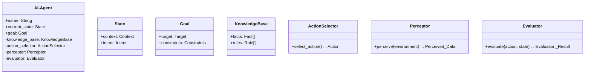
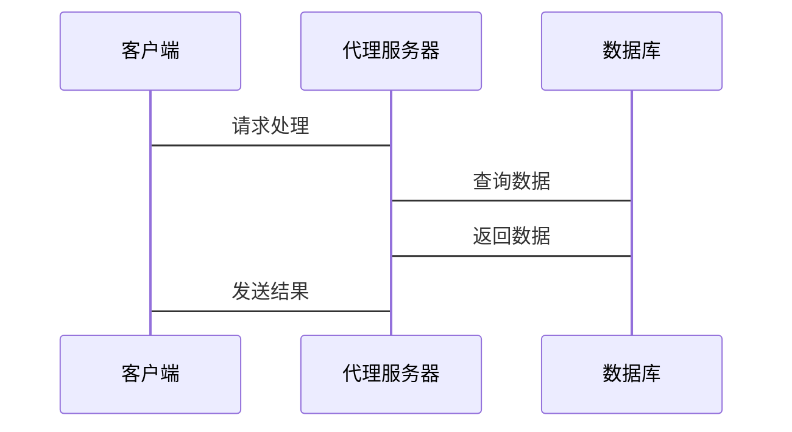

                 


# 性能基准测试：评估和比较AI Agent的能力

> 关键词：性能基准测试，AI Agent，能力评估，技术指标，系统测试

> 摘要：性能基准测试是评估和比较AI Agent能力的重要方法。本文将从基础概念、核心原理、算法实现、系统架构、项目实战等多个方面详细阐述性能基准测试的各个方面，帮助读者全面理解如何科学地评估和比较AI Agent的能力。

---

## 第1章: 性能基准测试概述

### 1.1 性能基准测试的定义与背景
#### 1.1.1 性能基准测试的定义
性能基准测试（Performance Benchmark Testing）是一种通过设定标准和指标，对系统或组件的性能进行测量和评估的过程。其目的是验证系统在特定场景下的表现是否符合预期。

#### 1.1.2 AI Agent的定义与核心能力
AI Agent（人工智能代理）是一种能够感知环境并采取行动以实现目标的智能实体。其核心能力包括感知能力、决策能力、学习能力和执行能力。

#### 1.1.3 为什么需要性能基准测试
在AI Agent开发中，性能基准测试是确保其能力符合预期的重要手段。它可以帮助开发者发现问题、优化性能，并在不同AI Agent之间进行公平比较。

---

### 1.2 AI Agent的性能评估维度
#### 1.2.1 响应时间（Response Time）
AI Agent完成任务所需的时间，是衡量其效率的重要指标。

#### 1.2.2 正确率（Accuracy Rate）
AI Agent在决策中的正确性，是衡量其智能水平的关键指标。

#### 1.2.3 资源利用率（Resource Utilization）
AI Agent在运行过程中对计算资源（如CPU、内存）的占用情况，是衡量其效率的重要指标。

#### 1.2.4 可扩展性（Scalability）
AI Agent在处理大规模任务时的表现，是衡量其适用性的关键指标。

---

## 第2章: 性能基准测试的核心概念

### 2.1 性能基准测试的指标体系
#### 2.1.1 核心指标
- **响应时间**：任务完成所需的时间。
- **正确率**：决策的准确程度。
- **资源利用率**：计算资源的占用情况。
- **可扩展性**：处理任务规模的能力。

#### 2.1.2 指标间的对比与选择
在选择基准测试指标时，需要根据具体场景和需求进行权衡。例如，对于实时决策任务，响应时间可能比正确率更重要。

#### 2.1.3 指标权重的确定方法
通过分析任务场景，可以使用加权平均的方法确定各指标的权重。

---

### 2.2 性能基准测试的标准与流程
#### 2.2.1 标准的制定
制定基准测试标准时，需要考虑测试环境、测试数据和测试方法等因素。

#### 2.2.2 实施流程
1. **需求分析**：明确测试目标和指标。
2. **环境搭建**：配置测试环境和工具。
3. **数据准备**：收集和处理测试数据。
4. **测试执行**：按照标准流程进行测试。
5. **结果分析**：解读测试结果并提出改进建议。

#### 2.2.3 评估方法
- **定量评估**：基于指标数据进行分析。
- **定性评估**：通过专家评审等方式进行评估。

---

### 2.3 性能基准测试的边界与外延
#### 2.3.1 测试的适用范围
性能基准测试主要用于评估AI Agent的性能表现，但不适用于功能测试或其他类型的测试。

#### 2.3.2 与其他评估方法的区别
性能基准测试注重量化指标，而其他评估方法可能更关注功能或用户体验。

#### 2.3.3 综合评估的重要性
为了全面评估AI Agent的能力，需要结合性能基准测试和其他评估方法。

---

## 第3章: 性能基准测试的核心要素

### 3.1 测试场景的设计
#### 3.1.1 场景分类
- **典型场景**：代表实际应用中的常见任务。
- **极端场景**：测试系统在极限条件下的表现。

#### 3.1.2 场景模拟
通过模拟真实环境中的任务，确保测试结果具有代表性。

#### 3.1.3 场景动态调整
根据测试结果动态调整测试场景，以发现潜在问题。

---

### 3.2 测试数据的准备
#### 3.2.1 数据采集
从实际应用中采集真实数据，确保测试的准确性。

#### 3.2.2 数据预处理
对数据进行清洗、归一化等处理，确保测试数据的质量。

#### 3.2.3 数据管理
建立数据仓库，方便测试过程中的数据访问和管理。

---

### 3.3 测试工具与环境
#### 3.3.1 工具选择
选择适合的性能测试工具，如JMeter、LoadRunner等。

#### 3.3.2 环境搭建
配置合适的硬件和软件环境，确保测试结果的准确性。

#### 3.3.3 环境优化
通过优化资源分配，提高测试效率。

---

## 第4章: 性能基准测试的算法实现

### 4.1 基准测试算法概述
基准测试算法用于量化AI Agent的性能表现，常见的算法包括A/B测试和回归分析。

#### 4.1.1 A/B测试
通过对比不同版本的AI Agent，评估其性能差异。

#### 4.1.2 回归分析
通过统计方法，分析性能指标与影响因素之间的关系。

---

### 4.2 基准测试算法的实现步骤
1. **数据收集**：获取AI Agent在不同场景下的性能数据。
2. **数据预处理**：清洗和归一化数据。
3. **算法选择**：根据需求选择合适的测试算法。
4. **模型训练**：建立基准测试模型。
5. **结果分析**：解读测试结果并提出优化建议。

---

## 第5章: 性能基准测试的系统架构

### 5.1 系统架构设计
设计一个高效的系统架构是性能基准测试成功的关键。

#### 5.1.1 领域模型
通过领域模型（如Mermaid类图）展示系统的功能模块及其关系。



#### 5.1.2 系统架构
通过系统架构图（如Mermaid架构图）展示系统的整体结构。


#### 5.1.3 接口设计
定义清晰的接口规范，确保各模块之间的通信顺畅。

#### 5.1.4 交互流程
通过交互序列图展示系统的交互流程。



---

## 第6章: 性能基准测试的项目实战

### 6.1 环境配置
#### 6.1.1 系统需求
- 操作系统：Linux/Windows/MacOS
- 硬件配置：建议使用高配置服务器
- 软件依赖：安装必要的测试工具和库

#### 6.1.2 环境搭建
安装必要的软件工具，配置测试环境。

---

### 6.2 核心代码实现
#### 6.2.1 数据预处理
编写Python代码对数据进行清洗和归一化处理。

```python
import pandas as pd
import numpy as np

# 读取数据
data = pd.read_csv('test_data.csv')

# 数据清洗
data.dropna(inplace=True)
data.drop_duplicates(inplace=True)

# 数据归一化
from sklearn.preprocessing import MinMaxScaler
scaler = MinMaxScaler()
scaled_data = scaler.fit_transform(data)
```

#### 6.2.2 测试算法实现
实现A/B测试算法，对比不同AI Agent的性能表现。

```python
def ab_test(agent_a, agent_b, test_cases):
    results_a = []
    results_b = []
    for case in test_cases:
        result_a = agent_a.execute(case)
        result_b = agent_b.execute(case)
        results_a.append(result_a)
        results_b.append(result_b)
    return results_a, results_b

# 示例用法
agent1 = AI_Agent1()
agent2 = AI_Agent2()
cases = [case1, case2, case3]
a_results, b_results = ab_test(agent1, agent2, cases)
```

#### 6.2.3 结果分析
通过可视化工具（如Matplotlib）绘制性能指标的对比图。

```python
import matplotlib.pyplot as plt

a_results = [...]  # 测试结果
b_results = [...]  # 测试结果

plt.figure(figsize=(10,6))
plt.plot(a_results, label='Agent A')
plt.plot(b_results, label='Agent B')
plt.xlabel('Test Case Number')
plt.ylabel('Performance')
plt.legend()
plt.show()
```

---

### 6.3 项目总结
通过实际项目的实施，验证了性能基准测试的有效性。测试结果为AI Agent的优化提供了重要依据。

---

## 第7章: 性能基准测试的最佳实践与小结

### 7.1 最佳实践
#### 7.1.1 测试环境配置
确保测试环境与实际应用环境一致，避免偏差。

#### 7.1.2 数据质量管理
数据质量直接影响测试结果，需重视数据的采集和处理。

#### 7.1.3 测试工具选择
选择合适的测试工具，提高测试效率。

#### 7.1.4 测试结果解读
结合业务背景，全面分析测试结果，避免片面解读。

---

### 7.2 小结
性能基准测试是评估和比较AI Agent能力的重要手段。通过科学的设计、合理的实施和准确的分析，可以有效提升AI Agent的性能表现。

---

## 第8章: 性能基准测试的注意事项与扩展阅读

### 8.1 注意事项
- **测试目标明确**：确保测试目的清晰。
- **数据质量控制**：重视数据的准确性和完整性。
- **结果分析深度**：结合业务场景，深入解读测试结果。

### 8.2 拓展阅读
- 推荐阅读《软件性能工程》、《AI系统性能优化》等书籍。
- 关注性能基准测试领域的最新研究和技术进展。

---

## 作者信息

作者：AI天才研究院/AI Genius Institute & 禅与计算机程序设计艺术 /Zen And The Art of Computer Programming

---

通过以上结构和内容，我们可以系统地了解性能基准测试的各个方面，从理论到实践，全面掌握如何评估和比较AI Agent的能力。

