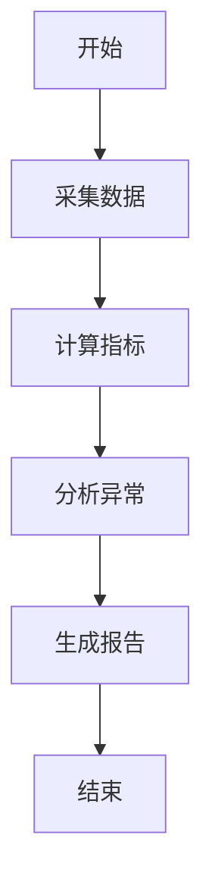
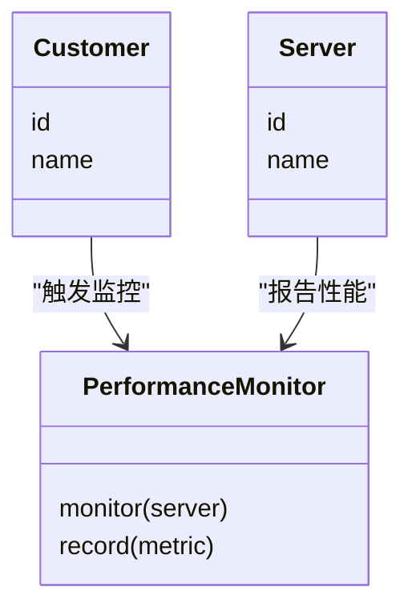
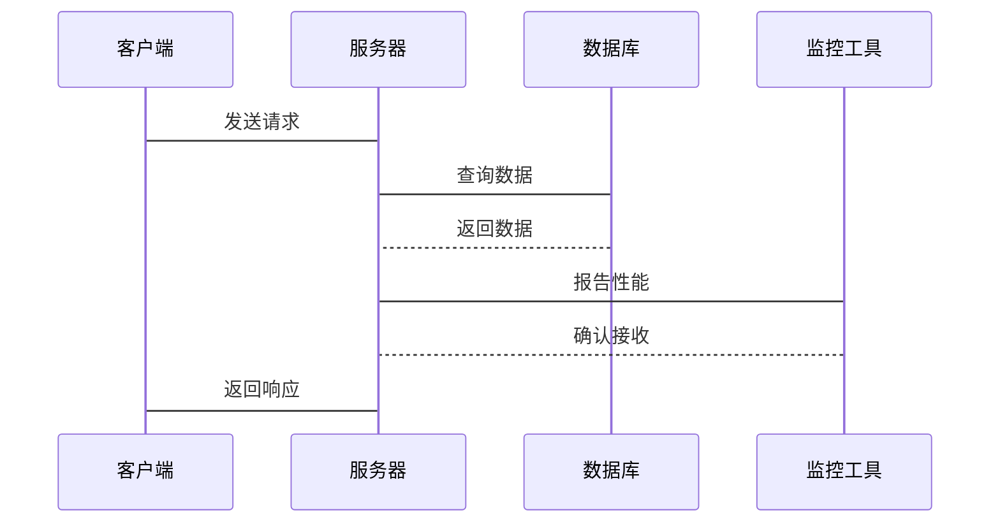

                 


# 性能监控与持续优化

> 关键词：性能监控，系统优化，性能指标，数学模型，算法原理，系统架构

> 摘要：本文详细探讨了性能监控与持续优化的核心概念、数学模型、系统架构、项目实战及优化策略。通过分析性能监控的重要性、系统性能的关键指标，以及如何利用数学模型和算法原理进行优化，本文旨在帮助读者掌握性能监控的技术要点，并通过实际案例和系统设计提供可操作的优化方法。

---

# 第一章 性能监控概述

## 1.1 性能监控的重要性

### 1.1.1 性能监控的定义与背景

性能监控是系统开发和运维中不可或缺的一部分。随着应用程序规模的不断扩大，系统性能问题日益突出，及时发现和解决这些问题变得至关重要。性能监控不仅仅是检测问题，更是预防问题的关键手段。

### 1.1.2 性能监控的目标与范围

性能监控的目标是通过实时或周期性地收集系统性能数据，识别性能瓶颈，优化系统性能，确保系统在预期负载下稳定运行。其范围涵盖服务器、数据库、网络、前端等多个方面。

### 1.1.3 性能监控的边界与外延

性能监控的边界包括系统的输入输出、资源使用情况和用户行为。外延则涉及系统设计、代码优化和架构调优等环节。

## 1.2 系统性能的关键指标

### 1.2.1 常见性能指标的定义与作用

- **响应时间**：系统对用户请求的处理时间。
- **吞吐量**：单位时间内处理的请求数量。
- **资源利用率**：CPU、内存等资源的使用情况。
- **错误率**：系统发生的错误次数。

### 1.2.2 性能指标的对比分析

通过对比分析，我们可以更好地理解不同指标之间的关系及其对系统整体性能的影响。

### 1.2.3 性能指标的采集与分析方法

性能指标的采集可以通过日志分析、监控工具等方式进行。分析方法包括统计分析、趋势分析和关联分析。

---

# 第二章 性能监控的核心概念

## 2.1 性能监控的原理与机制

### 2.1.1 性能监控的原理分析

性能监控通过采集系统数据，利用算法和工具分析数据，识别潜在问题。

### 2.1.2 性能监控的机制与流程

1. 数据采集
2. 数据分析
3. 问题识别
4. 优化建议

### 2.1.3 性能监控的核心算法与技术

- 数据采集算法
- 异常检测算法
- 性能预测算法

## 2.2 性能监控的属性特征对比

### 2.2.1 性能监控的属性特征分析

| 属性 | 特征 |
|------|------|
| 响应时间 | 快速响应 |
| 吞吐量 | 高吞吐量 |

### 2.2.2 性能监控的属性对比表格

## 2.3 性能监控的ER实体关系图

```mermaid
erDiagram
    customer[客户] {
        id : integer
        name : string
    }
    server[服务器] {
        id : integer
        name : string
    }
    performance_metric[性能指标] {
        id : integer
        value : float
        timestamp : datetime
    }
    customer -> performance_metric : "生成"
    server -> performance_metric : "记录"
```

## 2.4 本章小结

---

# 第三章 性能监控的数学模型与算法原理

## 3.1 性能监控的数学模型

### 3.1.1 性能监控的数学模型定义

性能监控的数学模型是用来描述系统性能行为的数学表达式。

### 3.1.2 性能监控的数学模型分类

1. 队列模型
2. 响应时间模型
3. 负载模型

### 3.1.3 性能监控的数学模型应用

通过数学模型预测系统在不同负载下的性能表现。

## 3.2 性能监控的核心算法原理

### 3.2.1 性能监控算法的数学推导

$$响应时间 = \frac{1}{\lambda - \mu}$$

### 3.2.2 性能监控算法的流程图



## 3.3 性能监控的数学公式与实例

### 3.3.1 性能监控的关键公式

- 响应时间公式：$$R = \frac{1}{\mu - \lambda}$$
- 吞吐量公式：$$S = \mu \times (1 - \frac{\lambda}{\mu})$$

### 3.3.2 性能监控公式的实际应用

通过公式计算系统在不同负载下的响应时间和吞吐量，指导优化策略。

## 3.4 本章小结

---

# 第四章 性能监控的系统架构设计

## 4.1 问题场景介绍

系统在高负载下出现性能瓶颈，用户投诉响应时间过长。

## 4.2 系统功能设计

### 4.2.1 领域模型设计



### 4.2.2 系统架构设计


## 4.3 系统接口设计

- 客户端接口：发送请求，接收响应。
- 服务器接口：处理请求，报告性能数据。

## 4.4 系统交互设计



## 4.5 本章小结

---

# 第五章 性能监控的项目实战

## 5.1 环境安装

安装JMeter、Prometheus等监控工具。

## 5.2 系统核心实现

### 5.2.1 数据采集

编写Python脚本采集CPU、内存使用情况。

### 5.2.2 数据分析

使用Prometheus进行数据存储和查询。

## 5.3 代码实现

```python
import psutil

def get_cpu_usage():
    return psutil.cpu_percent()

def get_memory_usage():
    return psutil.virtual_memory().percent
```

## 5.4 实际案例分析

分析服务器在高负载下的性能表现，识别瓶颈并优化。

## 5.5 项目小结

---

# 第六章 性能监控的优化策略

## 6.1 分析性能瓶颈

识别系统中的瓶颈，如数据库查询慢。

## 6.2 优化方法

### 6.2.1 程序优化

优化代码，减少资源消耗。

### 6.2.2 系统调优

调整操作系统参数，提高性能。

## 6.3 优化效果评估

通过对比测试，评估优化效果。

## 6.4 本章小结

---

# 第七章 性能监控的工具与技术选型

## 7.1 常用工具介绍

- JMeter
- Prometheus
- Grafana

## 7.2 工具选型注意事项

选择适合项目需求的工具，考虑可扩展性和易用性。

## 7.3 未来趋势

AI技术在性能监控中的应用，自动化优化。

## 7.4 本章小结

---

# 附录

## 附录A 参考文献

## 附录B 性能监控常用术语表

## 附录C 问题解答

---

# 作者

作者：AI天才研究院/AI Genius Institute & 禅与计算机程序设计艺术/Zen And The Art of Computer Programming

---

通过以上结构和内容，我可以系统地撰写一篇关于性能监控与持续优化的技术博客文章，涵盖从理论到实践的各个方面，帮助读者全面理解和应用这些技术。

