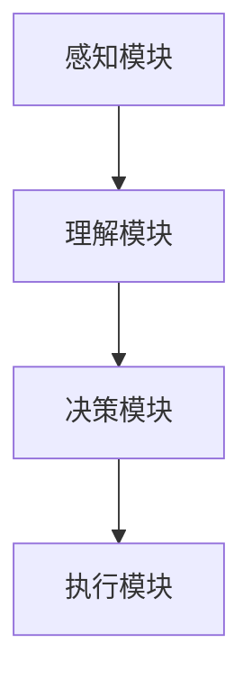
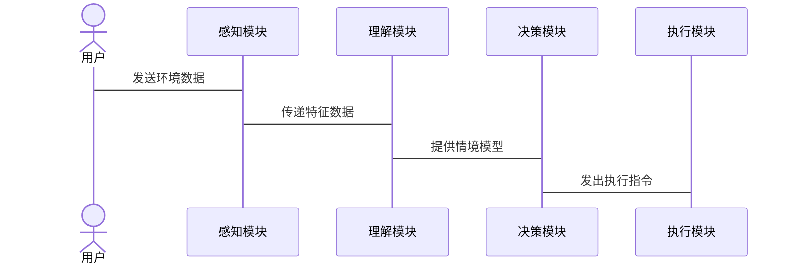

                 


# 情境感知AI Agent：适应动态环境

## 关键词
情境感知、AI Agent、动态环境、智能决策、实时感知、多模态数据

## 摘要
情境感知AI Agent是一种能够实时感知环境、理解和分析情境，并在此基础上做出智能决策和行动的Agent。本文将详细探讨情境感知AI Agent的核心概念、算法原理、系统架构设计以及实际应用案例。通过分析动态环境中的不确定性与复杂性，结合多模态数据的融合与分析技术，我们将揭示情境感知AI Agent如何实现自适应决策与执行，为读者提供一个全面而深入的技术视角。

---

## 第1章：情境感知AI Agent概述

### 1.1 情境感知AI Agent的背景与重要性
人工智能（AI）技术的快速发展为各个领域带来了革命性的变化。然而，在动态、复杂和不确定的环境中，传统的AI系统往往难以应对实时变化的情境。情境感知AI Agent的出现，正是为了弥补这一技术空白。它能够通过实时感知环境信息、理解情境，并基于情境做出智能决策和行动，从而在动态环境中实现高效、可靠的执行。

#### 1.1.1 人工智能与Agent的基本概念
- **人工智能（AI）**：模拟人类智能的技术，包括学习、推理、感知和决策等能力。
- **Agent**：智能体，能够在环境中感知、理解并采取行动的实体，具有自主性和响应性。

#### 1.1.2 情境感知技术的定义与特点
- **定义**：情境感知技术是指通过多模态数据的采集、融合与分析，理解和建模当前情境的技术。
- **特点**：
  - **实时性**：能够实时感知和分析环境信息。
  - **动态性**：能够适应环境中的实时变化。
  - **多模态**：结合多种数据源（如视觉、听觉、文本等）进行感知和分析。

#### 1.1.3 情境感知AI Agent的核心价值
- **提升决策的准确性**：通过实时感知和情境理解，AI Agent能够做出更准确的决策。
- **增强系统的适应性**：能够在动态环境中自适应地调整行为，以应对不确定性。
- **扩展应用的边界**：适用于复杂场景，如自动驾驶、智能助手、机器人等领域。

### 1.2 情境感知AI Agent的问题背景
在动态环境中，传统AI系统往往面临以下挑战：
- **不确定性**：环境中的信息不完整或模糊，导致决策的不确定性。
- **动态变化**：环境中的情况可能随时变化，传统系统难以快速响应。
- **多模态数据融合**：如何有效地融合来自不同模态的数据，以提高感知的准确性。

### 1.3 情境感知AI Agent的实现目标
- **实时感知与动态响应**：通过实时感知环境信息，快速做出响应。
- **多模态数据的融合与分析**：结合多种数据源，提高感知的准确性和全面性。
- **自适应决策与执行**：根据实时情境，动态调整决策和行动。

### 1.4 情境感知AI Agent的边界与外延
- **技术边界**：
  - **感知层**：数据采集与特征提取。
  - **理解层**：语义分析与情境建模。
  - **决策层**：基于情境的智能决策。
- **应用边界**：
  - **特定场景**：如自动驾驶、智能助手。
  - **通用场景**：如智能城市、智能医疗。
- **拓展边界**：
  - 与其他AI技术（如强化学习、自然语言处理）的融合。

### 1.5 情境感知AI Agent的概念结构与核心要素
- **核心要素**：
  - **感知模块**：负责采集和处理环境数据。
  - **决策模块**：基于感知结果做出决策。
  - **执行模块**：根据决策结果执行行动。
- **模块之间的关系**：感知模块提供数据，决策模块基于数据做出决策，执行模块将决策转化为实际行动。

## 第2章：情境感知AI Agent的核心概念

### 2.1 情境感知的基本原理
- **感知层**：通过传感器、摄像头等设备采集环境数据，并提取特征。
- **理解层**：对感知到的数据进行语义分析，构建情境模型。
- **决策层**：基于情境模型，结合任务目标，做出智能决策。

### 2.2 情境感知与传统AI的区别
| 特征维度 | 传统AI Agent | 情境感知AI Agent |
|----------|--------------|-------------------|
| 数据来源 | 单一数据源   | 多模态数据源     |
| 处理方式 | 静态处理     | 动态实时处理     |
| 决策机制 | 基于规则     | 基于情境理解     |

### 2.3 情境感知AI Agent的ER实体关系图
```mermaid
er
actor(Agent, 感知数据, 决策逻辑, 执行动作)
```

## 第3章：情境感知AI Agent的核心算法

### 3.1 基于规则的感知算法
- **算法流程**：
  1. 采集环境数据。
  2. 通过预定义规则对数据进行分类。
  3. 根据规则做出决策。
- **优缺点分析**：
  - 优点：简单易懂，适用于规则明确的场景。
  - 缺点：难以应对复杂和动态变化的环境。

### 3.2 统计学习的感知算法
- **算法流程**：
  1. 采集多模态数据。
  2. 对数据进行预处理和特征提取。
  3. 使用统计学习模型（如聚类、分类）进行分析。
- **优缺点分析**：
  - 优点：能够处理复杂数据，适应性强。
  - 缺点：需要大量数据支持，计算复杂。

### 3.3 深度学习的感知算法
- **算法流程**：
  1. 采集多模态数据。
  2. 构建深度学习模型（如CNN、RNN）进行特征提取和语义分析。
  3. 基于模型输出做出决策。
- **优缺点分析**：
  - 优点：能够处理非结构化数据，学习能力强。
  - 缺点：需要大量计算资源，模型解释性差。

## 第4章：系统分析与架构设计

### 4.1 问题场景介绍
- **问题描述**：在动态环境中，如何实现高效的情境感知和智能决策？
- **问题解决**：通过多模态数据的融合与分析，结合深度学习模型，实现情境感知和智能决策。

### 4.2 系统功能设计
- **领域模型**：定义系统的功能模块及其交互关系。
- **系统架构设计**：采用分层架构，包括感知层、理解层和决策层。
- **系统接口设计**：定义各模块之间的接口和数据流。

### 4.3 系统架构设计


### 4.4 系统交互设计


## 第5章：项目实战

### 5.1 智能助手的设计与实现
- **环境安装**：安装必要的库和工具，如TensorFlow、OpenCV。
- **核心代码实现**：
  ```python
  import tensorflow as tf
  from tensorflow.keras import layers

  model = tf.keras.Sequential([
      layers.Conv2D(32, (3, 3), activation='relu', input_shape=(224, 224, 3)),
      layers.MaxPooling2D((2, 2)),
      layers.Flatten(),
      layers.Dense(128, activation='relu'),
      layers.Dense(1, activation='sigmoid')
  ])

  model.compile(optimizer='adam', loss='binary_crossentropy', metrics=['accuracy'])
  model.fit(train_data, train_labels, epochs=10, batch_size=32)
  ```

- **案例分析与解读**：通过具体案例分析，展示系统的设计与实现过程。

### 5.2 项目小结
- **总结**：通过项目实战，验证了情境感知AI Agent的可行性与有效性。
- **注意事项**：在实际应用中，需要考虑数据的质量、模型的可解释性等问题。

## 第6章：总结与展望

### 6.1 全文总结
情境感知AI Agent是一种能够实时感知环境、理解和分析情境，并在此基础上做出智能决策和行动的Agent。通过多模态数据的融合与分析，结合深度学习等技术，情境感知AI Agent能够在动态环境中实现高效、可靠的执行。

### 6.2 未来展望
- **技术发展**：随着AI技术的不断进步，情境感知AI Agent将更加智能化和自主化。
- **应用场景**：情境感知AI Agent将在更多领域得到应用，如智能城市、智能医疗、智能交通等。

## 第7章：最佳实践与小结

### 7.1 最佳实践
- **数据质量**：确保数据的多样性和代表性。
- **模型选择**：根据具体场景选择合适的模型和算法。
- **系统优化**：通过优化算法和架构设计，提高系统的性能和效率。

### 7.2 注意事项
- **数据隐私**：在处理多模态数据时，需要注意数据的隐私和安全。
- **模型可解释性**：在实际应用中，模型的可解释性非常重要。

## 参考文献
1. LeCun, Y., Bengio, Y., & Hinton, G. (2015). Deep learning. Nature, 521(7552), 436-444.
2. Russell, S., & Norvig, P. (2010). Artificial Intelligence: A Modern Approach. Pearson Education.
3. 李航. (2006). 统计学习方法. 清华大学出版社.

## 索引
- AI Agent
- 情境感知
- 动态环境
- 多模态数据
- 深度学习

---

## 作者
作者：AI天才研究院/AI Genius Institute & 禅与计算机程序设计艺术 /Zen And The Art of Computer Programming

