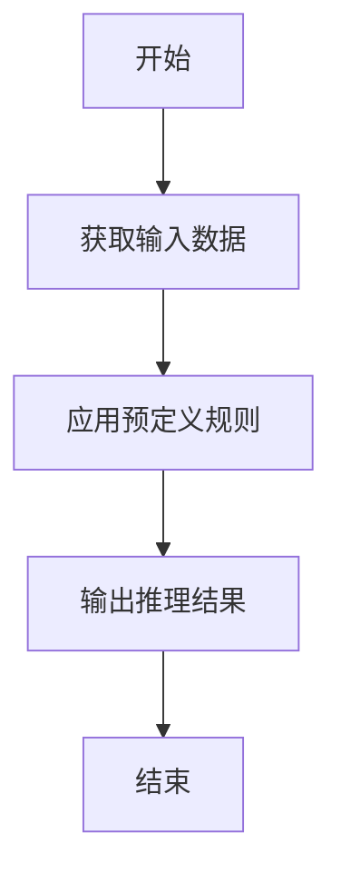
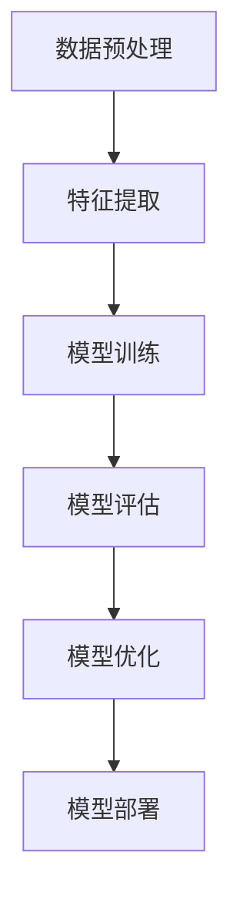

                 


# 情境感知技术的应用

## 关键词：情境感知, 上下文理解, 多模态数据, 动态推理, 人工智能, 智能系统

## 摘要：情境感知技术是一种通过整合多模态数据和动态推理机制，理解当前环境、用户状态和上下文信息，从而提供智能化服务的技术。本文将从情境感知的核心概念、算法原理、系统架构到实际应用案例，全面探讨情境感知技术的应用及其在智能系统中的重要性。

---

# 第一部分: 情境感知技术的背景与核心概念

## 第1章: 情境感知技术的概述

### 1.1 情境感知的基本概念

#### 1.1.1 问题背景与问题描述

在现代智能系统中，单纯依赖单一数据源或孤立的技术难以满足复杂场景下的需求。例如，在智能家居系统中，仅仅依靠温度传感器来调节室内温度是不够的，还需要结合用户的行为模式、时间、地点等因素，才能提供更贴心的服务。这种需求推动了情境感知技术的发展。

#### 1.1.2 情境感知的核心问题解决

情境感知技术通过整合多模态数据（如传感器数据、用户行为数据、环境数据等），结合动态推理机制，实时理解用户所处的环境、状态和意图，从而提供更智能的服务。

#### 1.1.3 情境感知的边界与外延

情境感知的边界在于如何有效整合多模态数据并进行动态推理。其外延则涉及如何将这些推理结果应用于实际场景，例如智能助手、自动驾驶、智能医疗等领域。

#### 1.1.4 情境感知的概念结构与核心要素

情境感知的核心要素包括：
1. **数据来源**：多模态数据的采集与整合。
2. **上下文建模**：对环境、用户状态的建模。
3. **动态推理**：基于上下文的实时推理与决策。

### 1.2 情境感知与相关技术的对比

#### 1.2.1 情境感知与其他感知技术的对比分析

| 技术 | 描述 | 优缺点 |
|------|------|--------|
| 感知技术 | 侧重单一数据源的感知 | 数据单一，难以全面理解场景 |
| 上下文感知 | 基于环境信息的上下文理解 | 静态上下文建模，难以动态推理 |
| 情境感知 | 整合多模态数据的动态推理 | 全面、动态、实时 |

#### 1.2.2 情境感知与情景理解的联系与区别

| 特性 | 情境感知 | 情景理解 |
|------|---------|----------|
| 数据来源 | 多模态数据 | 文本、图像等 |
| 动态性 | 动态推理 | 静态分析 |
| 应用场景 | 智能助手、自动驾驶 | 自然语言处理、图像识别 |

---

## 第2章: 情境感知的核心概念与联系

### 2.1 情境感知的核心原理

#### 2.1.1 情境感知的多模态数据融合

情境感知需要整合多种数据源，例如：
- **传感器数据**：温度、湿度、光照等环境数据。
- **用户行为数据**：用户的点击、语音指令等。
- **环境数据**：地理位置、时间等。

#### 2.1.2 情境感知的动态推理机制

动态推理是情境感知的核心，主要通过以下步骤实现：
1. **数据采集**：整合多模态数据。
2. **上下文建模**：构建上下文模型。
3. **推理与决策**：基于上下文模型进行动态推理，输出结果。

#### 2.1.3 情境感知的上下文建模方法

上下文建模可以通过以下方式实现：
- **基于规则的建模**：定义预设的规则，例如“如果用户在晚上使用手机，则可能是休息”。
- **基于机器学习的建模**：通过训练模型自动学习上下文关系。

### 2.2 情境感知的核心要素对比

#### 2.2.1 数据来源对比表

| 数据来源 | 描述 |
|----------|------|
| 传感器数据 | 环境数据，如温度、湿度等 |
| 用户行为数据 | 用户操作数据，如点击、语音指令等 |
| 地理位置数据 | 用户所在位置 |

#### 2.2.2 数据处理方式对比表

| 处理方式 | 描述 |
|----------|------|
| 数据清洗 | 去除噪声数据 |
| 数据融合 | 整合多模态数据 |
| 数据建模 | 构建上下文模型 |

### 2.3 情境感知的ER实体关系图

```mermaid
erDiagram
    user <--- context : "用户与上下文的关系"
    context <--- sensor : "上下文与传感器的关系"
    sensor <--> data : "传感器与数据的关系"
    data --> model : "数据与模型的关系"
    model <--> inference : "模型与推理的关系"
```

---

# 第二部分: 情境感知技术的算法原理

## 第3章: 情境感知的核心算法

### 3.1 基于规则的推理算法

#### 3.1.1 算法流程图



#### 3.1.2 算法实现代码

```python
def contextual_reasoning(rules, data):
    results = []
    for rule in rules:
        if rule['condition'](data):
            results.append(rule['action'](data))
    return results
```

### 3.2 基于机器学习的模型

#### 3.2.1 模型训练流程图



#### 3.2.2 模型数学公式

$$ P(context | data) = \prod_{i=1}^{n} P(context_i | data_i) $$

---

## 第4章: 情境感知的系统架构设计

### 4.1 系统功能设计

#### 4.1.1 系统功能模块

- **传感器数据采集模块**：采集环境数据。
- **情境建模模块**：构建上下文模型。
- **用户意图推理模块**：基于上下文模型推理用户意图。

#### 4.1.2 系统功能流程图

```mermaid
graph TD
    start --> sensor_data : "获取传感器数据"
    sensor_data --> context_model : "构建上下文模型"
    context_model --> inference : "进行用户意图推理"
    inference --> end : "输出结果"
```

---

## 第5章: 情境感知技术的项目实战

### 5.1 环境配置

- **安装依赖**：
  ```bash
  pip install numpy scikit-learn
  ```

### 5.2 核心代码实现

```python
import numpy as np
from sklearn import tree

# 示例数据
X = np.array([[25, 1], [26, 0], [24, 1], [25, 1]])
y = np.array([0, 1, 0, 0])

# 训练决策树模型
model = tree.DecisionTreeClassifier()
model.fit(X, y)

# 推理
new_data = np.array([[25, 1]])
print(model.predict(new_data))
```

### 5.3 案例分析与解读

通过上述代码，我们可以看到基于机器学习的模型在情境感知中的应用。模型通过训练数据学习上下文关系，并对新数据进行推理。

### 5.4 项目小结

本项目展示了如何通过机器学习模型实现情境感知技术的应用，验证了情境感知技术在实际场景中的有效性。

---

## 第6章: 情境感知技术的最佳实践

### 6.1 小结

情境感知技术通过整合多模态数据和动态推理机制，能够更好地理解用户需求，提供智能化服务。

### 6.2 注意事项

- 数据质量和多样性直接影响推理结果。
- 算法的选择需要根据具体场景进行调整。

### 6.3 扩展阅读

- 《Multi-modal Data Fusion for Contextual Reasoning》
- 《Dynamic Reasoning in Intelligent Systems》

---

# 作者：AI天才研究院/AI Genius Institute & 禅与计算机程序设计艺术 /Zen And The Art of Computer Programming

