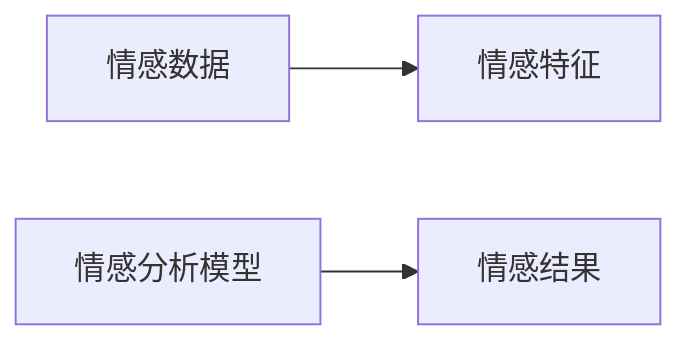

                 


# 情感人工智能的发展与应用前景分析

## 关键词：情感人工智能，情感计算，自然语言处理，深度学习，情感分析

## 摘要：情感人工智能是将人类情感分析与计算机技术相结合的新兴领域，通过自然语言处理和深度学习技术，情感人工智能能够理解、识别和分析人类情感，为多种应用场景提供了智能化解决方案。本文详细分析了情感人工智能的核心概念、算法原理、系统架构，以及其在实际应用中的案例和挑战，探讨了未来的发展方向和应用前景。

---

## 第一部分：情感人工智能的背景与问题背景

### 第1章：情感人工智能的背景与问题背景

#### 1.1 情感人工智能的定义与问题背景

情感人工智能（Affective Artificial Intelligence）是一种结合了情感计算和人工智能技术的新兴领域，旨在通过计算机技术理解和分析人类情感。随着自然语言处理和深度学习技术的快速发展，情感人工智能在情感分析、情感识别、情感生成等方面取得了显著进展。

**问题背景**：在人机交互、社交媒体分析、智能客服等领域，情感人工智能能够帮助计算机更准确地理解用户的情感状态，从而提供更个性化的服务。然而，情感人工智能也面临着数据获取、模型精度、隐私保护等挑战。

#### 1.2 情感人工智能的核心概念

情感人工智能的核心概念包括情感计算、情感分析、情感识别等。情感计算是指通过分析文本、语音、面部表情等方式，识别和理解人类情感状态的过程。情感分析是情感计算的核心任务之一，旨在判断文本中蕴含的情感倾向（如正面、负面、中性）。

**ER实体关系图**：


该图展示了用户通过情感数据与情感特征的关联，通过情感分析模型得到情感结果的过程。

---

## 第二部分：情感人工智能的核心概念与联系

### 第2章：情感人工智能的核心概念与联系

#### 2.1 情感人工智能的核心概念原理

情感人工智能的核心原理包括情感计算的数学模型和情感分析的算法原理。情感计算的数学模型通常基于概率论和统计学，如朴素贝叶斯分类器，用于情感分类任务。

**数学公式**：

$$ P(y|x) = \frac{P(x|y)P(y)}{P(x)} $$

其中，$P(y|x)$表示在给定特征$x$的情况下，样本属于类别$y$的概率，$P(x|y)$是条件概率，$P(y)$是先验概率，$P(x)$是边际概率。

#### 2.2 情感人工智能的核心概念属性特征对比

情感人工智能与传统文本分析相比，具有以下特点：

- **情感计算**：基于情感特征，如情感强度、情感类型等。
- **情感分析**：基于分类算法，如朴素贝叶斯、支持向量机（SVM）、深度学习模型（如LSTM）等。
- **情感表达**：情感表达可以通过文本、语音、面部表情等多种形式进行。

**ER实体关系图**：



该图展示了情感数据通过情感特征提取，经过情感分析模型，最终得到情感结果的过程。

---

## 第三部分：情感人工智能的算法原理讲解

### 第3章：情感人工智能的算法原理讲解

#### 3.1 情感分析的算法流程

情感分析的算法流程包括文本预处理、特征提取和情感分类三个主要步骤：

1. **文本预处理**：包括分词、去除停用词、词干提取等。
2. **特征提取**：通过TF-IDF、Word2Vec等方法提取文本特征。
3. **情感分类**：使用机器学习或深度学习算法对情感进行分类。

**算法流程图**：


#### 3.2 情感分析的主流算法

- **基于机器学习的情感分类算法**：如朴素贝叶斯、支持向量机（SVM）等。
- **基于深度学习的情感分类算法**：如卷积神经网络（CNN）、循环神经网络（RNN）、长短期记忆网络（LSTM）等。
- **基于规则的情感分类算法**：通过预定义的规则进行情感分析。

**数学公式**：

$$ \text{LSTM}(x_i) = \text{tanh}(W_{x}x_i + W_{h}h_{i-1} + b) $$

其中，$x_i$是输入，$h_{i-1}$是前一时刻的隐藏状态，$W_x$和$W_h$是权重矩阵，$b$是偏置项。

#### 3.3 情感分析的数学模型与公式

- **朴素贝叶斯分类器**：

$$ P(y|x) = \frac{P(x|y)P(y)}{P(x)} $$

- **LSTM情感分类模型**：

$$ \text{LSTM}(x_i) = \text{tanh}(W_{x}x_i + W_{h}h_{i-1} + b) $$

---

## 第四部分：情感人工智能的系统分析与架构设计方案

### 第4章：情感人工智能的系统分析与架构设计方案

#### 4.1 情感人工智能的系统问题场景介绍

情感人工智能的系统问题场景包括：

1. **情感数据的采集与处理**：如何高效采集和处理情感数据。
2. **情感分析的实时性要求**：如何实现实时情感分析。
3. **情感结果的可视化展示**：如何将情感结果直观展示。

#### 4.2 情感人工智能的系统架构设计

- **系统功能模块划分**：

  1. 数据采集模块：负责采集情感数据。
  2. 特征提取模块：负责提取情感特征。
  3. 情感分类模块：负责进行情感分类。
  4. 结果展示模块：负责展示情感结果。

- **系统架构图**：


---

## 第五部分：情感人工智能的项目实战

### 第5章：情感人工智能的项目实战

#### 5.1 情感人工智能的环境安装

- **安装Python环境**：使用Anaconda或虚拟环境。
- **安装相关库**：如numpy、pandas、sklearn、tensorflow等。

#### 5.2 情感人工智能的核心代码实现

```python
import numpy as np
from sklearn.feature_extraction.text import TfidfVectorizer
from sklearn.naive_bayes import MultinomialNB

# 数据预处理
def preprocess(text):
    return text.lower().split()

# 特征提取
vectorizer = TfidfVectorizer(preprocess)
X = vectorizer.fit_transform(texts)

# 模型训练
model = MultinomialNB()
model.fit(X, labels)

# 模型预测
test_text = ["I love this product!"]
test_X = vectorizer.transform([test_text])
prediction = model.predict(test_X)
print(prediction)
```

#### 5.3 情感人工智能的实际案例分析

- **案例分析**：在社交媒体情感分析中的应用。
- **代码解读**：解释上述代码的功能和实现细节。

#### 5.4 情感人工智能的项目小结

总结项目成果，分析遇到的问题，提出改进建议。

---

## 第六部分：情感人工智能的总结与展望

### 第6章：情感人工智能的总结与展望

#### 6.1 情感人工智能的总结

总结情感人工智能的核心概念、算法原理和系统架构，回顾本文的主要内容。

#### 6.2 情感人工智能的应用前景

分析情感人工智能在未来的应用前景，如智能客服、情感健康监测、教育等领域。

#### 6.3 情感人工智能的挑战与未来方向

讨论情感人工智能面临的挑战，如数据隐私、模型解释性等，并提出未来的研究方向。

#### 6.4 情感人工智能的最佳实践 Tips

给出一些实际应用中的建议和注意事项，如数据清洗、模型调优等。

---

## 作者：AI天才研究院（AI Genius Institute） & 禅与计算机程序设计艺术（Zen And The Art of Computer Programming）

---

以上是《情感人工智能的发展与应用前景分析》的技术博客文章的完整目录和内容概要。接下来将根据上述大纲，逐步撰写每一部分的具体内容，确保逻辑清晰、结构紧凑、简单易懂。

