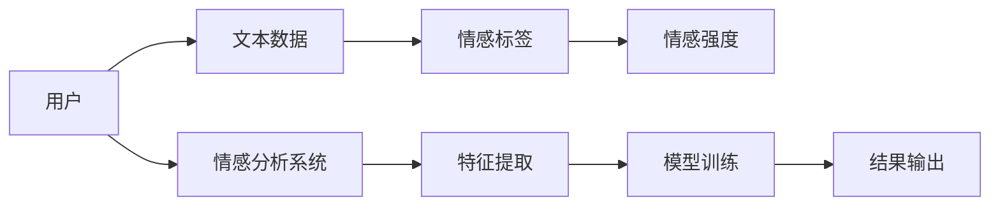
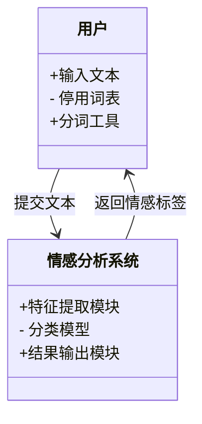

                 


# 情感分析：让AI Agent具备情商

> 关键词：情感分析，AI Agent，自然语言处理，机器学习，深度学习

> 摘要：情感分析是一种通过分析文本数据来识别和分类情感状态的技术。本文将详细探讨情感分析的核心概念、算法原理、系统架构以及项目实战，帮助AI Agent具备理解人类情感的能力，从而提升其情商。通过本文的学习，读者将能够从零开始构建一个简单但功能强大的情感分析系统，理解其背后的技术原理，并能够在实际应用中灵活运用这些知识。

---

## 目录

### 第一部分: 情感分析概述

#### 第1章: 情感分析的核心概念与背景

##### 1.1 情感分析的定义与背景

- 什么是情感分析
- 情感分析的背景与应用领域
- 情感分析与AI Agent的关系

##### 1.2 情感分析的核心概念

- 情感分析的三要素：文本、情感极性、上下文
- 情感分析的分类：二分类、多分类、情感强度分析
- 情感分析的边界与外延

##### 1.3 情感分析的背景介绍

- 情感分析的起源与发展
- 情感分析在自然语言处理中的地位
- 情感分析与AI Agent的情商提升

##### 1.4 情感分析的核心要素组成

- 情感分析的输入：文本数据
- 情感分析的输出：情感标签或强度
- 情感分析的中间过程：特征提取与模型训练

##### 1.5 本章小结

### 第2章: 情感分析的核心概念与联系

#### 2.1 情感分析的核心概念原理

- 情感分析的基本原理
- 情感分析的关键技术
- 情感分析的实现流程

#### 2.2 情感分析的核心概念属性特征对比

- 情感分析的特征提取方法对比
- 情感分析的模型选择对比
- 情感分析的评价指标对比

#### 2.3 情感分析的ER实体关系图架构



#### 2.4 本章小结

### 第3章: 情感分析的算法原理讲解

#### 3.1 情感分析的算法原理

- 基于规则的情感分析算法
- 基于机器学习的情感分析算法
- 基于深度学习的情感分析算法

#### 3.2 情感分析的算法流程图


#### 3.3 情感分析的数学模型与公式

- 情感分析的特征向量表示
  $$x = (x_1, x_2, ..., x_n)$$
- 情感分析的分类模型
  $$y = \arg\max_{k} P(y=k|x)$$
- 情感分析的损失函数
  $$L = -\sum_{i=1}^{m} \log P(y_i|x_i)$$

#### 3.4 情感分析的算法实现与代码

- 基于机器学习的情感分析实现

```python
from sklearn.feature_extraction.text import TfidfVectorizer
from sklearn.svm import SVC
from sklearn.pipeline import Pipeline
from sklearn.metrics import accuracy_score

# 示例数据
text_train = ["This is a good movie.", "This is a bad movie."]
y_train = [1, 0]

# 创建管道
text_model = Pipeline([
    ('tfidf', TfidfVectorizer()),
    ('clf', SVC())
])

# 训练模型
text_model.fit(text_train, y_train)

# 预测
predicted = text_model.predict(text_train)
print("准确率:", accuracy_score(y_train, predicted))
```

### 第4章: 情感分析的系统架构与设计

#### 4.1 系统架构设计


#### 4.2 系统功能设计

- 领域模型设计



- 系统架构设计


- 系统接口设计
- 系统交互设计


### 第5章: 情感分析的项目实战

#### 5.1 项目环境搭建

```bash
pip install numpy
pip install scikit-learn
pip install nltk
pip install matplotlib
```

#### 5.2 项目核心实现

- 特征提取与模型训练

```python
import numpy as np
from sklearn.feature_extraction.text import CountVectorizer
from sklearn.naive_bayes import MultinomialNB

# 示例数据
text_train = ["This is a good movie.", "This is a bad movie."]
y_train = [1, 0]

# 特征提取
vectorizer = CountVectorizer()
X_train = vectorizer.fit_transform(text_train)

# 模型训练
clf = MultinomialNB()
clf.fit(X_train, y_train)

# 预测
predicted = clf.predict(X_train)
print("准确率:", np.mean(predicted == y_train))
```

#### 5.3 项目实际案例分析

- 情感分析的实际应用场景
- 系统功能的实际操作演示
- 项目实现的详细解读与分析

### 第6章: 总结与展望

#### 6.1 本章小结

- 情感分析的核心概念
- 情感分析的关键技术
- 情感分析的应用场景

#### 6.2 情感分析的未来发展趋势

- 深度学习在情感分析中的应用
- 多模态情感分析的发展
- 情感分析的实时处理能力

#### 6.3 情感分析的最佳实践 tips

- 数据预处理的重要性
- 模型选择的注意事项
- 系统优化的技巧

#### 6.4 情感分析的注意事项

- 数据偏差的影响
- 模型泛化的挑战
- 系统性能的优化

#### 6.5 情感分析的拓展阅读

- 深度学习在情感分析中的应用
- 多语言情感分析
- 情感分析与自然语言生成的结合

---

# 作者：AI天才研究院/AI Genius Institute & 禅与计算机程序设计艺术 /Zen And The Art of Computer Programming

