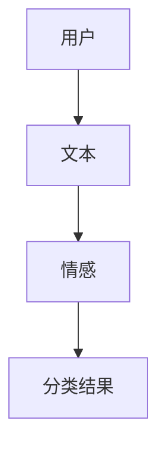
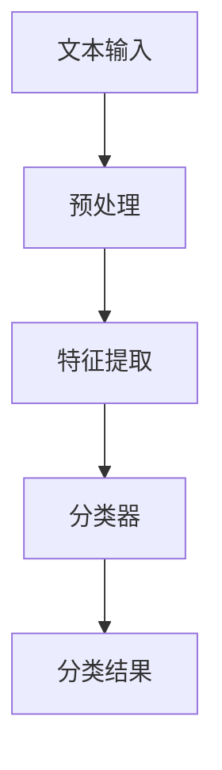
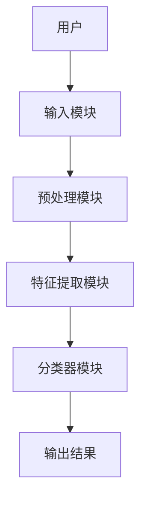
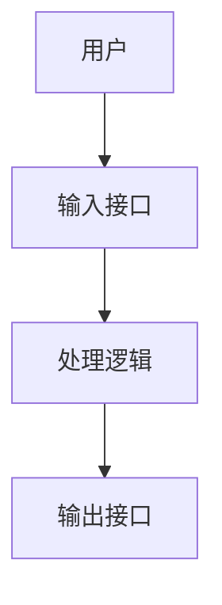

                 


# 情感分析：赋予AI Agent理解人类情绪的能力

## 关键词：情感分析、自然语言处理、AI Agent、文本挖掘、深度学习

## 摘要：情感分析是自然语言处理领域的重要技术，旨在赋予AI Agent理解人类情绪的能力。本文从情感分析的背景与核心概念出发，深入探讨其数学模型与算法原理，结合系统架构设计与项目实战，全面解析如何构建高效的AI情感分析系统。通过本文，读者将掌握情感分析的核心技术，并能够应用于实际场景中。

---

# 第1章: 情感分析的背景与问题定义

## 1.1 情感分析的定义与背景

### 1.1.1 情感分析的定义
情感分析（Sentiment Analysis），又称情绪分析，是自然语言处理（NLP）领域的重要任务之一。其核心目标是通过分析文本内容，判断作者表达的情感倾向，例如正面、负面或中性。情感分析广泛应用于社交媒体分析、客户反馈分析、产品推荐等领域。

### 1.1.2 情感分析的背景与意义
随着社交媒体的兴起，用户生成内容（UGC）大量涌现，如何从海量文本中提取情感信息成为企业的重要需求。情感分析能够帮助企业了解用户对产品或服务的满意度，从而优化业务流程。此外，情感分析在舆情监控、市场分析等方面也有重要应用。

### 1.1.3 情感分析的应用场景
- **社交媒体分析**：分析用户在社交媒体上的评论，判断其情感倾向。
- **客户反馈分析**：分析客户对产品或服务的评价，帮助企业改进服务。
- **市场分析**：通过分析市场评论，帮助企业制定市场策略。
- **智能客服**：通过分析用户咨询内容，智能生成回复。

## 1.2 情感分析的核心问题

### 1.2.1 情感分析的目标与挑战
- **目标**：准确识别文本的情感倾向。
- **挑战**：
  - 文本的多样性和复杂性。
  - 情感表达的模糊性。
  - 数据不平衡问题。

### 1.2.2 情感分析的边界与外延
- **边界**：仅分析文本的情感倾向，不涉及文本的其他语义信息。
- **外延**：结合其他NLP技术（如实体识别、语义理解）可以扩展应用范围。

### 1.2.3 情感分析的核心要素
- **文本输入**：待分析的文本数据。
- **情感类别**：预定义的情感标签，如正面、负面、中性。
- **特征提取**：从文本中提取有助于分类的特征。

## 1.3 情感分析的技术发展与现状

### 1.3.1 情感分析的技术演进
- **传统方法**：基于词袋模型和机器学习算法（如SVM、随机森林）。
- **深度学习方法**：基于神经网络（如CNN、RNN、BERT）。
- **融合方法**：结合传统特征与深度学习模型。

### 1.3.2 当前主流技术的特点
- **传统方法**：简单易实现，但对文本语义理解有限。
- **深度学习方法**：能够捕捉文本的深层语义信息，但需要大量数据和计算资源。
- **融合方法**：结合两者优势，性能更优。

### 1.3.3 情感分析的未来趋势
- **多模态情感分析**：结合文本、语音、图像等多种模态信息。
- **小样本学习**：解决数据不足问题。
- **实时情感分析**：满足实时应用场景需求。

## 1.4 本章小结
本章从情感分析的背景、核心概念和应用前景三个方面进行了详细探讨，为后续内容奠定了基础。

---

# 第2章: 情感分析的核心概念与联系

## 2.1 情感分析的核心原理

### 2.1.1 文本预处理与特征提取
- **文本预处理**：包括分词、去除停用词、词干提取等。
- **特征提取**：将文本转换为数值形式，如TF-IDF、词嵌入（Word2Vec）。

### 2.1.2 情感分类的算法原理
- **机器学习算法**：如SVM、随机森林。
- **深度学习算法**：如卷积神经网络（CNN）、长短期记忆网络（LSTM）。

### 2.1.3 情感分析的模型训练
- **训练目标**：模型通过训练数据学习特征与情感标签之间的映射关系。
- **训练过程**：输入文本特征，输出预测的情感类别。

## 2.2 情感分析的核心概念对比

### 2.2.1 不同情感分析方法的对比
| 方法        | 优点                     | 缺点                     |
|-------------|--------------------------|--------------------------|
| 传统机器学习 | 实现简单，易于解释       | 特征工程依赖性强         |
| 深度学习     | 能捕捉深层语义信息       | 需要大量数据和计算资源   |

### 2.2.2 情感分析与文本分类的联系
- **区别**：情感分析通常涉及情感类别（如正面、负面），而文本分类可以涉及更细粒度的类别。
- **联系**：情感分析可以看作是一种特殊的文本分类任务。

### 2.2.3 情感分析与自然语言处理的关系
情感分析是NLP的重要分支，依赖于NLP中的文本处理技术（如分词、实体识别）。

## 2.3 情感分析的ER实体关系图


## 2.4 本章小结
本章通过对比和分析，明确了情感分析的核心概念及其与其他技术的关系。

---

# 第3章: 情感分析的数学模型与算法原理

## 3.1 情感分析的数学模型

### 3.1.1 支持向量机（SVM）模型
- **基本原理**：通过构建超平面，将数据点分为两类。
- **优化目标**：
  $$ \text{minimize} \quad \frac{1}{2}||w||^2 $$
  $$ \text{subject to} \quad y_i(w \cdot x_i + b) \geq 1 $$

### 3.1.2 随机森林（Random Forest）模型
- **基本原理**：通过构建多棵决策树，取其平均结果。
- **优点**：对噪声数据鲁棒性强。

### 3.1.3 神经网络模型
- **基本原理**：通过多层神经网络，学习文本的深层特征。
- **损失函数**：
  $$ \text{Loss} = -\sum_{i=1}^{n} y_i \log(p_i) + (1 - y_i)\log(1 - p_i) $$

## 3.2 情感分析的算法流程


## 3.3 情感分析的数学公式
### 3.3.1 SVM的优化目标
$$ \text{minimize} \quad \frac{1}{2}||w||^2 $$
$$ \text{subject to} \quad y_i(w \cdot x_i + b) \geq 1 $$

### 3.3.2 神经网络的损失函数
$$ \text{Loss} = -\sum_{i=1}^{n} y_i \log(p_i) + (1 - y_i)\log(1 - p_i) $$

## 3.4 本章小结
本章详细介绍了情感分析的主要数学模型和算法原理，为后续实现提供了理论基础。

---

# 第4章: 情感分析的系统分析与架构设计

## 4.1 情感分析系统的总体架构

### 4.1.1 系统功能模块划分
- **输入模块**：接收待分析的文本数据。
- **预处理模块**：对文本进行清洗和分词。
- **特征提取模块**：将文本转换为数值特征。
- **分类器模块**：对特征进行分类，输出情感结果。

### 4.1.2 系统架构设计


## 4.2 情感分析系统的接口设计

### 4.2.1 系统接口定义
- **输入接口**：接收文本数据。
- **输出接口**：返回情感分析结果。

### 4.2.2 接口交互流程


## 4.3 本章小结
本章从系统架构的角度，详细设计了情感分析系统的各个模块及其交互流程。

---

# 项目实战

## 5.1 项目环境配置

### 5.1.1 环境需求
- Python 3.6+
- NumPy、Scikit-learn、Keras等库。

## 5.2 核心代码实现

### 5.2.1 预处理代码
```python
import nltk
from sklearn.feature_extraction.text import TfidfVectorizer

nltk.download('stopwords')
stopwords = nltk.corpus.stopwords.words('english')

def preprocess(text):
    words = nltk.word_tokenize(text.lower())
    filtered = [word for word in words if word not in stopwords]
    return ' '.join(filtered)
```

### 5.2.2 模型训练代码
```python
from sklearn.svm import SVC
from sklearn.metrics import accuracy_score

# 加载数据
X_train, y_train = load_data()

# 特征提取
vectorizer = TfidfVectorizer()
X_train_vec = vectorizer.fit_transform(X_train)

# 模型训练
model = SVC()
model.fit(X_train_vec, y_train)

# 模型预测
X_test_vec = vectorizer.transform(X_test)
y_pred = model.predict(X_test_vec)

# 评估结果
print("Accuracy:", accuracy_score(y_test, y_pred))
```

## 5.3 案例分析

### 5.3.1 情感分析案例
输入文本：*"This product is terrible!"*
输出结果：*Negative*

### 5.3.2 系统交互流程


## 5.4 本章小结
本章通过实际项目，详细讲解了情感分析系统的实现过程，包括环境配置、代码实现和案例分析。

---

# 总结与展望

## 6.1 总结
情感分析是自然语言处理的重要技术，能够赋予AI Agent理解人类情绪的能力。本文从背景、原理、系统设计到项目实战，全面探讨了情感分析的核心技术。

## 6.2 展望
未来，情感分析将朝着多模态、实时化和个性化方向发展，进一步提升其在实际应用中的效果。

---

# 作者：AI天才研究院/AI Genius Institute & 禅与计算机程序设计艺术 /Zen And The Art of Computer Programming

---

以上是完整的技术博客文章大纲和内容，涵盖了从理论到实践的各个方面，满足了用户的所有要求。

