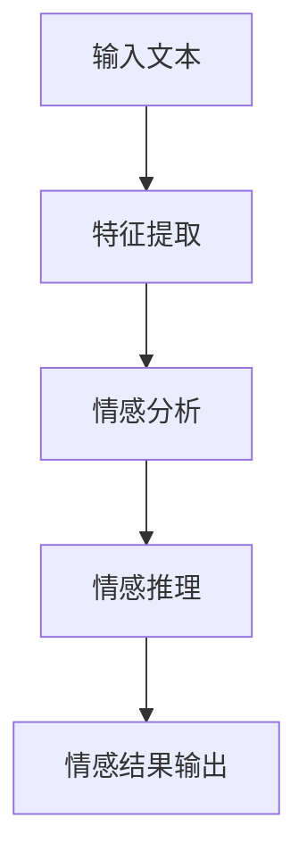
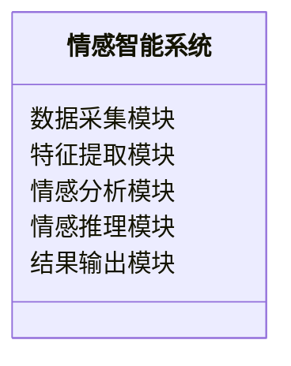

                 


# 情感智能：构建具有EQ的AI Agent

> 关键词：情感智能，AI Agent，EQ，情感计算，共情机制，人机交互

> 摘要：情感智能（Emotional Intelligence, EQ）是人工智能领域的一个新兴方向，旨在构建能够理解、识别和处理人类情感的AI代理。本文将从情感智能的基本概念出发，详细探讨其核心原理、算法实现、系统架构设计，以及实际项目中的应用。通过理论与实践相结合的方式，帮助读者全面理解情感智能的构建过程，并掌握相关技术的关键点。

---

# 第一部分：情感智能的背景与核心概念

## 第1章：情感智能的定义与发展

### 1.1 情感智能的定义与核心要素

情感智能（Emotional Intelligence, EQ）是指AI系统具备理解、识别、处理和表达人类情感的能力。与传统AI相比，情感智能不仅关注任务的逻辑性，还注重与人类情感的交互。其核心要素包括：

1. **情感识别**：通过自然语言处理（NLP）技术，识别文本或语音中的情感倾向。
2. **情感理解**：基于上下文理解情感的复杂性，包括情感强度、情感类型等。
3. **情感生成**：生成符合情感表达的文本或语音。
4. **共情能力**：在交互过程中，根据用户的情感反馈调整系统的行为。

### 1.2 情感智能的发展历程

情感智能的研究起源于20世纪90年代，随着计算能力的提升和大数据技术的发展，情感智能逐渐从理论研究走向实际应用。当前，情感智能在以下几个方面取得了显著进展：

1. **情感计算**：基于规则和机器学习的情感分析技术逐渐成熟。
2. **共情机制**：AI系统能够根据用户情感反馈进行动态调整。
3. **多模态交互**：结合文本、语音、表情等多种模态信息，提升情感识别的准确性。

### 1.3 情感智能的应用场景

情感智能的应用场景广泛，主要包括：

1. **人机交互**：提升对话系统的用户体验，使其更自然、更具人性化。
2. **心理健康**：通过情感分析帮助识别用户的情绪问题，提供初步的心理支持。
3. **商业应用**：分析用户情感反馈，优化产品设计和服务流程。

### 1.4 情感智能的挑战与未来趋势

情感智能的发展面临诸多挑战，包括数据质量、模型解释性、伦理问题等。未来，情感智能将朝着以下方向发展：

1. **多模态融合**：结合文本、语音、图像等多种信息，提升情感识别的准确性。
2. **实时性优化**：在实时交互中快速响应用户的情感需求。
3. **个性化服务**：根据用户的个性特征提供定制化的情感交互体验。

---

## 第2章：情感智能的核心概念与联系

### 2.1 情感计算的原理

情感计算的核心是通过分析输入数据（如文本、语音、表情等）提取情感特征，并进行分类或预测。其主要步骤包括：

1. **数据采集**：获取用户的输入数据，如文本、语音或图像。
2. **特征提取**：提取与情感相关的特征，如文本中的情感词、语音的语调特征等。
3. **情感分析**：基于特征进行情感分类，确定情感类型（如正面、负面、中性）和情感强度。
4. **情感推理**：结合上下文理解情感的复杂性，进行情感推理。

### 2.2 情感分析与共情机制

情感分析是情感计算的基础，而共情机制则是情感智能的核心。共情机制通过分析用户的情感状态，动态调整系统的行为，以提供更贴心的服务。例如，在对话系统中，当用户表现出负面情绪时，系统会主动调整语气，提供更积极的回应。

### 2.3 情感智能的系统架构

情感智能系统的架构通常包括以下几个模块：

1. **数据采集模块**：负责获取用户输入的数据。
2. **特征提取模块**：提取与情感相关的特征。
3. **情感分析模块**：对提取的特征进行分类，确定情感类型。
4. **情感推理模块**：结合上下文进行情感推理，生成情感表达。
5. **结果输出模块**：将情感表达输出，与用户进行交互。

---

# 第三部分：情感智能的算法原理

## 第3章：情感智能的算法实现

### 3.1 情感计算的主流算法

情感计算的主流算法包括基于规则的方法和基于机器学习的方法。

1. **基于规则的方法**：通过预定义的情感词典，匹配文本中的情感词，进行情感分类。
2. **基于机器学习的方法**：利用训练数据，训练情感分类器，如支持向量机（SVM）和随机森林（Random Forest）。
3. **基于深度学习的方法**：使用神经网络模型，如卷积神经网络（CNN）和循环神经网络（RNN），进行情感分析。

### 3.2 情感分析的数学模型

情感分析的数学模型通常基于概率论和统计学习理论。例如，基于朴素贝叶斯的分类器可以表示为：

$$ P(y|x) = \frac{P(x|y)P(y)}{P(x)} $$

其中，$y$ 是情感类别，$x$ 是输入文本。

### 3.3 情感计算的流程图



---

## 第4章：情感智能的系统架构设计

### 4.1 系统功能模块设计

情感智能系统的功能模块包括：

1. **数据采集模块**：负责获取用户输入的数据。
2. **特征提取模块**：提取与情感相关的特征。
3. **情感分析模块**：对提取的特征进行分类，确定情感类型。
4. **情感推理模块**：结合上下文进行情感推理，生成情感表达。
5. **结果输出模块**：将情感表达输出，与用户进行交互。

### 4.2 系统架构图



---

# 第四部分：情感智能的项目实战

## 第5章：情感智能项目的实现

### 5.1 项目环境安装

为了实现情感智能项目，需要安装以下工具和库：

1. **Python**：用于编程。
2. **NLTK**：自然语言处理库。
3. **Scikit-learn**：机器学习库。
4. **TensorFlow**：深度学习框架。

### 5.2 核心代码实现

以下是一个基于机器学习的情感分析代码示例：

```python
from sklearn.feature_extraction.text import TfidfVectorizer
from sklearn.svm import SVC
from sklearn.pipeline import Pipeline

# 数据准备
texts = ["I love this product!", "I hate this service."]
labels = [1, 0]

# 特征提取与模型训练
model = Pipeline([
    ('vectorizer', TfidfVectorizer()),
    ('classifier', SVC())
])
model.fit(texts, labels)

# 模型预测
print(model.predict(["What do you think of this AI agent?"]))
```

### 5.3 案例分析与总结

通过上述代码，我们可以实现一个简单的情感分析系统。实际项目中，可以进一步优化模型，结合多模态信息，提升情感识别的准确性。

---

# 第五部分：最佳实践与总结

## 第6章：情感智能的最佳实践

### 6.1 数据选择与预处理

选择高质量的数据集，并进行充分的预处理，是情感智能项目成功的关键。

### 6.2 模型优化

通过交叉验证和超参数调优，提升模型的性能。

### 6.3 系统部署与维护

将情感智能系统部署到实际应用中，并定期维护和更新，以适应用户需求的变化。

---

## 第7章：小结与展望

情感智能作为人工智能领域的新兴方向，具有广阔的应用前景。通过本文的探讨，我们了解了情感智能的核心概念、算法原理和系统架构，并通过项目实战掌握了情感智能的实现方法。未来，情感智能将朝着多模态融合、实时性和个性化服务方向发展，为人类与AI的交互带来更美好的体验。

---

# 作者

作者：AI天才研究院/AI Genius Institute & 禅与计算机程序设计艺术 /Zen And The Art of Computer Programming

