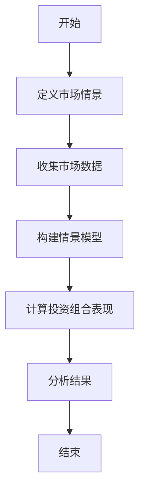
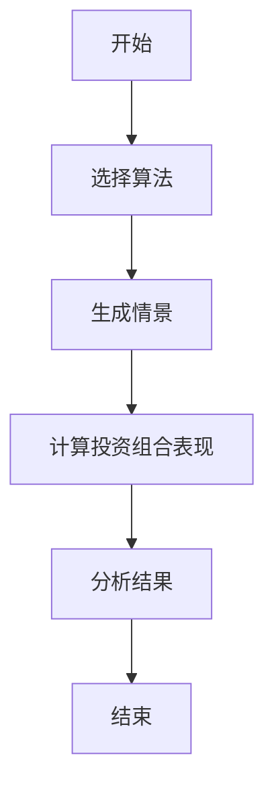
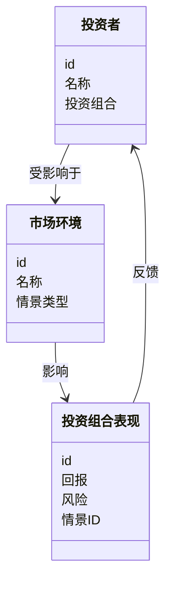
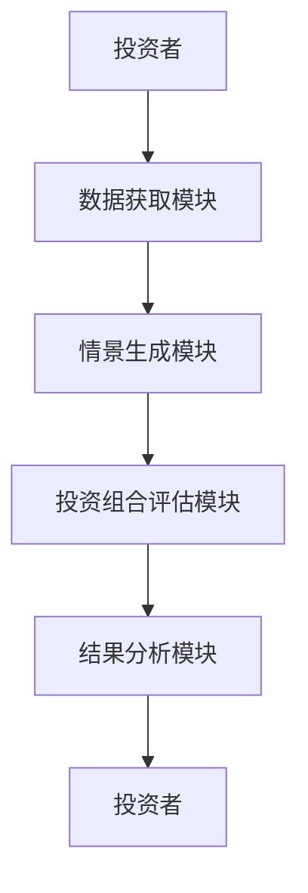
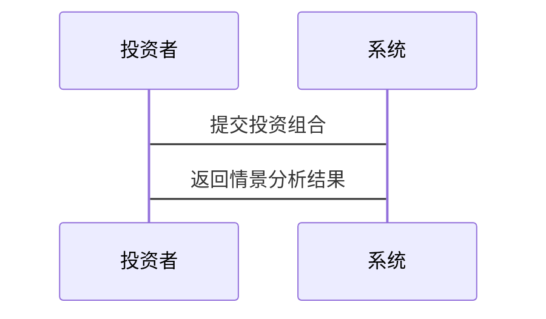

                 


# 情景分析：评估不同市场环境下的组合表现

## 关键词：
情景分析，投资组合，市场环境，风险评估，资产回报，数学模型

## 摘要：
情景分析是一种重要的金融工具，用于评估投资组合在不同市场环境下的表现。本文系统地介绍了情景分析的背景、核心概念、算法原理、数学模型、系统架构、项目实战以及最佳实践。通过详细讲解每一步骤，帮助读者理解如何在实际投资决策中应用情景分析，以优化投资组合的表现。

---

## 第一部分：情景分析的背景与概念

### 第1章：情景分析的背景与定义

#### 1.1 情景分析的背景

- **1.1.1 投资决策中的不确定性**
  投资市场充满了不确定性，经济波动、政策变化和全球事件都可能影响资产价格。投资者需要在这些不确定性中做出明智的决策，而情景分析提供了一种系统的方法来评估不同市场条件下的投资组合表现。

- **1.1.2 市场波动与风险评估**
  市场波动性是投资决策中不可忽视的因素。通过情景分析，投资者可以评估投资组合在不同波动水平下的表现，从而更好地管理风险。

- **1.1.3 情景分析的重要性**
  情景分析帮助投资者在不同市场条件下制定策略。无论是牛市、熊市还是震荡市，情景分析都能提供有价值的见解，帮助投资者优化投资组合。

#### 1.2 情景分析的定义与特点

- **1.2.1 定义与核心概念**
  情景分析是一种评估投资组合在不同市场情景下表现的方法。它通过构建多种市场情景，分析投资组合在每种情景下的收益和风险。

- **1.2.2 情景分析与传统分析方法的区别**
  与传统的历史平均回报分析不同，情景分析考虑了多种可能的市场情况，帮助投资者在极端条件下做出准备。

- **1.2.3 情景分析的适用范围**
  情景分析适用于各类投资组合，包括股票、债券、基金等。它不仅用于风险评估，还可用于资产配置和投资策略制定。

#### 1.3 情景分析的流程与步骤

- **1.3.1 确定分析目标**
  明确情景分析的目标，例如评估投资组合在经济衰退情况下的表现。

- **1.3.2 收集市场数据**
  收集历史价格、宏观经济指标等数据，用于构建不同市场情景。

- **1.3.3 构建情景模型**
  根据市场数据构建不同情景，例如牛市、熊市、震荡市等。

- **1.3.4 评估组合表现**
  计算投资组合在每种情景下的回报和风险指标。

- **1.3.5 结果分析与调整**
  分析结果，识别潜在风险，并根据分析结果调整投资组合。

---

## 第二部分：情景分析的核心概念与联系

### 第2章：情景分析的核心概念

#### 2.1 市场环境的实体关系图

```mermaid
erDiagram
    customer[投资者] {
        id : integer
        name : string
        portfolio : string
    }
    market_conditions[市场环境] {
        id : integer
        name : string
        scenario_type : string
        risk_level : integer
    }
    portfolio_performance[投资组合表现] {
        id : integer
        return : float
        risk : float
        scenario_id : integer
    }
    customer --> market_conditions : 受影响于
    market_conditions --> portfolio_performance : 影响
    portfolio_performance --> customer : 反馈
```

#### 2.2 情景分析的原理



#### 2.3 情景分析的属性对比

| 属性       | 情景分析         | 压力测试         |
|------------|------------------|------------------|
| 定义       | 评估不同情景下表现 | 评估极端压力下的表现 |
| 目标       | 优化投资策略     | 确保风险可控     |
| 方法       | 历史模拟、蒙特卡洛 | 假设极端情况     |

---

## 第三部分：情景分析的算法原理

### 第3章：情景分析的算法原理

#### 3.1 常用算法概述

- **历史模拟法**
  基于历史数据生成情景，分析投资组合的历史表现。

- **蒙特卡洛模拟法**
  使用随机数生成情景，模拟未来可能的市场情况。

- **情景生成模型**
  根据宏观经济指标生成情景，分析不同经济条件下的投资组合表现。

#### 3.2 算法流程图



#### 3.3 算法实现代码

- **历史模拟法的Python代码**

```python
import pandas as pd

# 假设历史回报数据为returns
def historical_simulation(returns):
    scenarios = returns.sample(100, replace=True)
    portfolio_returns = scenarios.mean(axis=1)
    return portfolio_returns
```

- **蒙特卡洛模拟法的Python代码**

```python
import numpy as np

def monte_carlo_simulation(mean_return, std_dev, num_simulations=1000):
    scenarios = np.random.normal(mean_return, std_dev, num_simulations)
    return scenarios
```

---

## 第四部分：数学模型与公式

### 第4章：数学模型与公式

#### 4.1 资产回报模型

- **单变量回归模型**

  $$ R_i = \alpha + \beta R_m + \epsilon $$

- **多变量回归模型**

  $$ R_i = \alpha + \beta_1 R_m + \beta_2 F_2 + \ldots + \beta_n F_n + \epsilon $$

- **风险调整后的回报模型**

  $$ R_{adjusted} = R_{expected} - \text{风险溢价} $$

#### 4.2 风险度量模型

- **方差-协方差矩阵**

  $$ \Sigma = \begin{bmatrix}
  \sigma_1^2 & \sigma_{1,2} & \ldots & \sigma_{1,n} \\
  \sigma_{2,1} & \sigma_2^2 & \ldots & \sigma_{2,n} \\
  \vdots & \vdots & \ddots & \vdots \\
  \sigma_{n,1} & \sigma_{n,2} & \ldots & \sigma_n^2
  \end{bmatrix} $$

- **风险价值（VaR）**

  $$ \text{VaR} = \text{quantile}(p) $$

- **凸性风险**

  $$ \text{凸性风险} = \text{凸性} \times \text{风险因子} $$

#### 4.3 组合表现评估公式

- **投资组合预期回报**

  $$ E[R_p] = \sum_{i=1}^n w_i R_i $$

- **投资组合风险**

  $$ \sigma_p^2 = \sum_{i=1}^n \sum_{j=1}^n w_i w_j \sigma_{i,j} $$

---

## 第五部分：系统分析与架构设计方案

### 第5章：系统分析与架构设计方案

#### 5.1 问题场景介绍

投资组合经理需要评估其投资组合在不同市场情景下的表现，以优化投资策略。

#### 5.2 项目介绍

开发一个情景分析系统，帮助投资者评估投资组合在不同市场条件下的表现。

#### 5.3 系统功能设计（领域模型）



#### 5.4 系统架构设计



#### 5.5 系统接口设计和系统交互



---

## 第六部分：项目实战

### 第6章：项目实战

#### 6.1 环境安装

安装必要的Python库，如Pandas、NumPy、Matplotlib。

#### 6.2 系统核心实现源代码

```python
import pandas as pd
import numpy as np
import matplotlib.pyplot as plt

# 数据获取
def get_market_data(tickers):
    data = pd.DataFrame()
    for ticker in tickers:
        data[ticker] = pd.read_csv(f'{ticker}.csv')['Adj Close']
    return data

# 情景生成
def generate_scenarios(data, num_scenarios=100):
    scenarios = []
    for _ in range(num_scenarios):
        scenario = data.apply(lambda x: x + np.random.normal(0, 0.01))
        scenarios.append(scenario)
    return scenarios

# 投资组合评估
def evaluate_portfolio(scenarios, weights):
    returns = []
    for scenario in scenarios:
        portfolio_return = scenario.dot(weights)
        returns.append(portfolio_return.mean())
    return returns

# 结果可视化
def visualize_results(returns):
    plt.hist(returns, bins=20)
    plt.title('投资组合回报分布')
    plt.xlabel('回报率')
    plt.ylabel('频率')
    plt.show()
```

#### 6.3 代码应用解读与分析

通过代码生成不同市场情景，评估投资组合在每种情景下的回报，并绘制回报分布图。

#### 6.4 实际案例分析和详细讲解剖析

以一个包含股票和债券的投资组合为例，分析其在牛市、熊市和震荡市中的表现。

#### 6.5 项目小结

总结项目实施过程中的关键点，强调情景分析在投资决策中的重要性。

---

## 第七部分：最佳实践 tips、小结、注意事项、拓展阅读

### 第7章：最佳实践 tips、小结、注意事项、拓展阅读

#### 7.1 最佳实践 tips

- 定期更新市场数据，保持情景分析的准确性。
- 根据市场变化调整投资组合，优化表现。
- 结合其他风险评估方法，全面评估投资组合风险。

#### 7.2 小结

情景分析是一种强大的工具，帮助投资者在不同市场条件下评估投资组合表现。通过系统的方法和实际案例分析，可以更好地理解和应用这一方法。

#### 7.3 注意事项

- 情景分析依赖于假设，结果可能与实际情况存在偏差。
- 需要结合市场实际情况调整模型参数。
- 定期回顾和更新情景分析模型。

#### 7.4 拓展阅读

- 《投资学》：深入理解资产定价和风险评估。
- 《蒙特卡洛方法》：学习蒙特卡洛模拟的高级应用。
- 《金融风险管理》：掌握全面的风险管理方法。

---

## 作者：AI天才研究院/AI Genius Institute & 禅与计算机程序设计艺术/Zen And The Art of Computer Programming

---

通过以上目录，您可以系统地学习情景分析的核心概念、算法原理、数学模型、系统架构和实际应用，从而掌握在不同市场环境下评估投资组合表现的方法。

