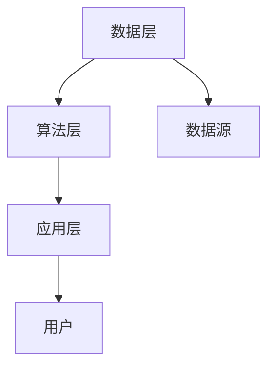
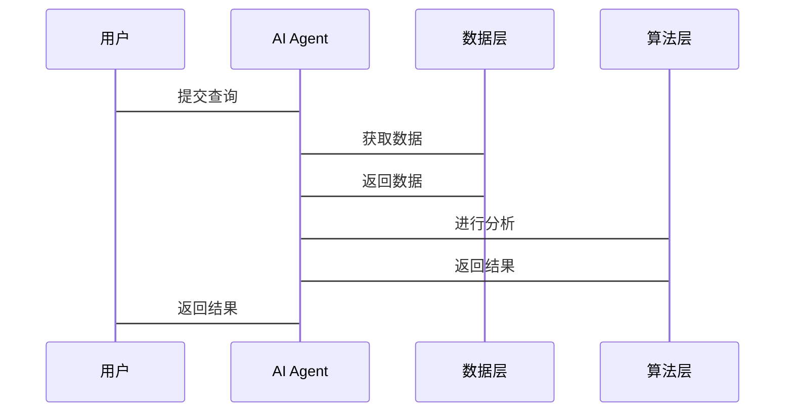

                 


# 房地产AI Agent：智能估价与市场分析

---

## 关键词：房地产，AI Agent，智能估价，市场分析，机器学习，数据挖掘

---

## 摘要

随着人工智能技术的迅速发展，房地产行业正经历着一场深刻的变革。房地产AI Agent（智能代理）作为一种新兴的技术解决方案，正在改变传统的房地产估价和市场分析方式。本文将详细探讨房地产AI Agent的核心概念、工作原理、算法实现以及实际应用场景。通过分析智能估价模型和市场分析算法，结合系统架构设计和实际案例，本文旨在揭示房地产AI Agent在提升估价准确性和市场分析效率方面的巨大潜力。

---

## 第1章：房地产AI Agent的背景与意义

### 1.1 房地产行业面临的挑战

#### 1.1.1 房地产市场的复杂性

房地产市场是一个高度复杂的生态系统，受到多种因素的影响，包括经济指标、政策调控、地理位置、市场供需等。传统的房地产估价方法依赖于人工经验，存在主观性强、效率低、成本高等问题。

#### 1.1.2 传统估价方法的局限性

传统估价方法通常基于历史成交数据和经验判断，难以捕捉市场波动的实时变化。特别是在大数据时代，房地产市场的数据量呈指数级增长，人工分析难以应对海量数据的处理需求。

#### 1.1.3 市场分析的难点与痛点

房地产市场的分析需要考虑多个维度的数据，包括房价走势、供需关系、政策变化等。传统的市场分析方法往往依赖于经验丰富的专家，但这种方法效率低下，且容易受到主观因素的影响。

### 1.2 AI技术在房地产行业的应用潜力

#### 1.2.1 AI技术的核心优势

AI技术具有数据处理能力强、算法优化速度快、自动化程度高等特点，能够有效解决房地产行业中的复杂问题。

#### 1.2.2 房地产行业与AI技术的结合点

AI技术在房地产行业的应用主要集中在智能估价、市场预测、客户匹配等方面。AI Agent作为智能化的解决方案，能够显著提高估价准确性和市场分析效率。

#### 1.2.3 AI Agent在房地产领域的创新应用

AI Agent通过整合多源数据，利用机器学习算法，能够实现智能化的房地产估价和市场分析。这种创新应用不仅提高了效率，还为房地产行业带来了新的发展机遇。

---

## 第2章：房地产AI Agent的核心概念与原理

### 2.1 房地产AI Agent的定义与特征

#### 2.1.1 房地产AI Agent的定义

房地产AI Agent是一种基于人工智能技术的智能化系统，能够通过数据采集、分析和决策，为用户提供精准的房地产估价和市场分析服务。

#### 2.1.2 房地产AI Agent的核心特征

房地产AI Agent具有智能性、实时性、数据驱动性和可扩展性等核心特征。它能够实时处理海量数据，快速生成准确的估价结果，并根据市场变化动态调整分析策略。

#### 2.1.3 房地产AI Agent与传统房地产中介的区别

与传统中介相比，AI Agent具有更高的效率和准确性，能够提供24/7的全天候服务，并且能够处理更多的数据维度。

### 2.2 房地产AI Agent的工作原理

#### 2.2.1 数据采集与处理

AI Agent通过多种数据源（如房地产交易平台、社交媒体、新闻等）采集房地产相关的数据，并进行清洗和预处理。

#### 2.2.2 智能分析与决策

利用机器学习算法，AI Agent对数据进行建模和分析，生成房地产估价结果和市场分析报告。

#### 2.2.3 人机交互与反馈

用户通过与AI Agent的交互，获取估价结果和市场分析建议，并提供反馈以优化系统性能。

### 2.3 房地产AI Agent的核心技术

#### 2.3.1 自然语言处理（NLP）

NLP技术用于分析房地产相关的文本数据，如新闻报道、政策文件等，提取有用的信息。

#### 2.3.2 计算机视觉（CV）

CV技术用于处理房地产相关的图像数据，如房地产广告中的房屋图片。

#### 2.3.3 机器学习（ML）

ML算法是AI Agent的核心，用于数据建模和预测。

#### 2.3.4 数据挖掘与分析

数据挖掘技术用于从海量数据中提取有价值的模式和趋势。

---

## 第3章：房地产AI Agent的系统架构与设计

### 3.1 系统架构概述

#### 3.1.1 分层架构设计

系统分为数据层、算法层和应用层，每一层负责不同的功能模块。

#### 3.1.2 模块化设计

系统由数据采集模块、智能分析模块、人机交互模块等多个模块组成，各模块之间相互协作。

#### 3.1.3 可扩展性设计

系统架构设计充分考虑了扩展性，便于未来功能的扩展和升级。

### 3.2 系统功能模块设计

#### 3.2.1 数据采集模块

负责从多种数据源采集房地产相关数据，包括交易平台数据、社交媒体数据等。

#### 3.2.2 智能分析模块

利用机器学习算法对数据进行建模和预测，生成估价结果和市场分析报告。

#### 3.2.3 人机交互模块

提供用户友好的界面，用户可以通过该模块与AI Agent进行交互。

#### 3.2.4 决策支持模块

根据分析结果，为用户提供决策支持，如最佳购房时机、投资建议等。

### 3.3 系统接口设计

#### 3.3.1 数据接口

系统需要与各种数据源进行数据对接，数据接口设计需要考虑数据格式和传输协议。

#### 3.3.2 用户接口

用户通过网页或移动应用与系统进行交互，需要设计直观易用的用户界面。

#### 3.3.3 第三方服务接口

系统可能需要与第三方服务（如支付平台、征信机构等）进行对接，设计相应的接口。

---

## 第4章：房地产AI Agent的算法原理与实现

### 4.1 智能估价算法

#### 4.1.1 线性回归模型

线性回归是一种简单的回归算法，适用于线性关系的数据。

$$ y = \beta_0 + \beta_1x_1 + \beta_2x_2 + \dots + \beta_nx_n $$

#### 4.1.2 支持向量机（SVM）

SVM适用于非线性关系的数据，通过核函数将数据映射到高维空间进行分类或回归。

#### 4.1.3 神经网络模型

神经网络模型具有强大的非线性拟合能力，适用于复杂的房地产估价问题。

$$ y = f(Wx + b) $$

其中，$W$ 是权重矩阵，$x$ 是输入向量，$b$ 是偏置向量，$f$ 是激活函数。

#### 4.1.4 集成学习方法

集成学习通过组合多个模型的结果，提高预测的准确性和稳定性。

### 4.2 市场分析算法

#### 4.2.1 时间序列分析

时间序列分析适用于房地产价格的走势预测。

$$ \hat{y}_t = \alpha y_{t-1} + (1-\alpha)y_{t-2} $$

其中，$\alpha$ 是平滑因子。

#### 4.2.2 聚类分析

聚类分析用于将房地产市场划分为不同的区域或类型，便于进行针对性分析。

#### 4.2.3 分类算法

分类算法用于对房地产市场进行分类，如判断房价是否会上涨或下跌。

#### 4.2.4 预测模型的优化与调优

通过交叉验证和网格搜索等方法，优化模型的参数，提高预测的准确性。

---

## 第5章：房地产AI Agent的数学模型与公式

### 5.1 智能估价模型

#### 5.1.1 线性回归模型公式

$$ y = \beta_0 + \beta_1x_1 + \beta_2x_2 + \dots + \beta_nx_n $$

#### 5.1.2 神经网络模型公式

$$ y = f(Wx + b) $$

其中，$W$ 是权重矩阵，$x$ 是输入向量，$b$ 是偏置向量，$f$ 是激活函数。

### 5.2 市场分析模型

#### 5.2.1 时间序列预测公式

$$ \hat{y}_t = \alpha y_{t-1} + (1-\alpha)y_{t-2} $$

其中，$\alpha$ 是平滑因子。

---

## 第6章：房地产AI Agent的系统架构设计

### 6.1 系统架构概述

系统采用分层架构设计，包括数据层、算法层和应用层。

### 6.2 系统功能模块设计

系统功能模块包括数据采集模块、智能分析模块、人机交互模块和决策支持模块。

### 6.3 系统架构图



### 6.4 系统接口设计

系统接口设计包括数据接口、用户接口和第三方服务接口。

### 6.5 系统交互图



---

## 第7章：房地产AI Agent的项目实战

### 7.1 环境安装

需要安装Python、TensorFlow、Scikit-learn等工具。

### 7.2 核心代码实现

#### 7.2.1 数据采集

```python
import requests
from bs4 import BeautifulSoup

url = 'https://example.com/real Estate'
response = requests.get(url)
soup = BeautifulSoup(response.text, 'html.parser')
data = []  # 数据存储
for item in soup.find_all('div', class_='property'):
    price = item.find('span', class_='price').text
    location = item.find('span', class_='location').text
    data.append({'price': price, 'location': location})
```

#### 7.2.2 智能估价模型

```python
from sklearn.linear_model import LinearRegression
import numpy as np

X = np.array([[1, 2, 3], [4, 5, 6], [7, 8, 9]])
y = np.array([10, 11, 12])
model = LinearRegression()
model.fit(X, y)
print(model.predict([[10, 11, 12]]))
```

### 7.3 案例分析

通过一个实际案例，展示AI Agent在房地产估价和市场分析中的应用。

### 7.4 小结

总结项目实施过程中的经验与教训，强调AI Agent的优势和不足。

---

## 第8章：最佳实践与未来展望

### 8.1 最佳实践

在实际应用中，建议采用模块化设计、数据清洗和特征工程的重要性。

### 8.2 小结

总结全文，强调AI Agent在房地产行业的巨大潜力和重要性。

### 8.3 注意事项

在实际应用中，需要注意数据质量和模型调优等问题。

### 8.4 拓展阅读

推荐一些相关的技术书籍和论文，供读者进一步学习。

---

## 作者：AI天才研究院/AI Genius Institute & 禅与计算机程序设计艺术 /Zen And The Art of Computer Programming

---

**这篇文章通过详细讲解房地产AI Agent的核心概念、算法实现和系统架构，展示了AI技术在房地产行业的广泛应用前景。希望本文能为房地产行业的从业者和技术爱好者提供有价值的参考和启发。**

