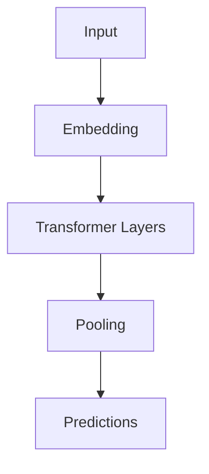
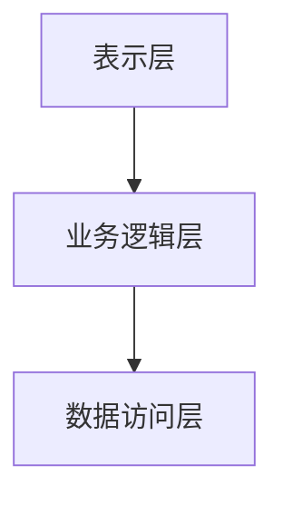

                 


# 打造用户友好的AI Agent交互界面

> 关键词：AI Agent、交互界面、用户体验、自然语言处理、系统架构

> 摘要：本文将深入探讨如何设计用户友好的AI Agent交互界面，从背景介绍、核心概念到算法原理、系统架构，再到项目实战和最佳实践，全面解析打造高效、易用的AI交互界面的关键要素。

---

# 第一部分: 打造用户友好的AI Agent交互界面背景介绍

# 第1章: AI Agent交互界面概述

## 1.1 AI Agent的基本概念

### 1.1.1 AI Agent的定义与特点
AI Agent（人工智能代理）是指能够感知环境并采取行动以实现目标的智能实体。它通过与用户的交互，提供信息检索、任务执行、决策支持等服务。AI Agent的特点包括：
- **智能性**：能够理解用户需求并提供相应服务。
- **自主性**：能够在没有人工干预的情况下运行。
- **适应性**：能够根据环境变化调整行为。

### 1.1.2 AI Agent的类型与应用场景
AI Agent可以分为以下几种类型：
- **简单反应式Agent**：基于当前感知做出反应。
- **基于模型的反射式Agent**：维护环境模型并根据模型做出决策。
- **目标驱动式Agent**：根据目标选择行动。
- **效用驱动式Agent**：通过最大化效用函数来决策。

应用场景包括智能助手、推荐系统、自动驾驶等。

### 1.1.3 用户友好的交互界面的重要性
用户友好的交互界面是AI Agent成功的关键。一个直观、高效的界面能够提升用户体验，降低用户的学习成本，并提高系统的可用性。

## 1.2 AI Agent交互界面的发展历程

### 1.2.1 早期AI交互界面的特点
早期的AI交互界面通常基于规则，功能单一，缺乏灵活性。例如，早期的智能助手只能执行简单的命令，无法理解复杂的用户需求。

### 1.2.2 当前AI交互界面的设计趋势
当前的设计趋势更加注重用户体验，采用自然语言处理（NLP）和机器学习技术，使得交互更加自然和智能。例如，现代的智能助手能够理解上下文并提供更精准的服务。

### 1.2.3 未来AI交互界面的发展方向
未来的交互界面将更加个性化和智能化，支持多模态输入（如语音、文本、图像）和输出，实现更自然的用户交互。

## 1.3 用户需求与AI Agent交互界面的关系

### 1.3.1 用户需求的多样性
用户需求具有多样性，包括信息检索、任务执行、情感交流等。不同的用户群体（如老年人、儿童、专业人士）对交互界面的需求也不同。

### 1.3.2 交互界面设计与用户需求的匹配
交互界面设计需要充分考虑用户需求，通过用户研究（如用户访谈、问卷调查）来获取需求信息，并在此基础上进行设计。

### 1.3.3 用户体验的核心要素
用户体验的核心要素包括：
- **可用性**：界面是否易于使用。
- **可理解性**：用户是否能够理解界面提供的信息。
- **可访问性**：界面是否能够被不同能力的用户使用。

## 1.4 本章小结
本章介绍了AI Agent的基本概念、类型与应用场景，并强调了用户友好的交互界面的重要性。同时，分析了AI交互界面的发展历程和用户需求与界面设计的关系。

---

# 第二部分: AI Agent交互界面的核心概念与联系

# 第2章: AI Agent交互机制解析

## 2.1 AI Agent的核心交互机制

### 2.1.1 自然语言处理在交互中的作用
自然语言处理（NLP）是AI Agent实现语言交互的核心技术。通过NLP技术，AI Agent能够理解用户的输入并生成相应的回应。

### 2.1.2 语音识别与合成的技术原理
语音识别技术将用户的语音输入转化为文本，而语音合成技术则将文本输出转化为语音。这两项技术共同支持用户通过语音与AI Agent进行交互。

### 2.1.3 基于视觉的交互方式
基于视觉的交互方式包括图像识别和计算机视觉技术，支持用户通过图像与AI Agent进行交互。

## 2.2 用户需求与交互设计的关系

### 2.2.1 用户需求的层次化分析
用户需求可以分为功能性需求和情感需求。功能性需求关注实际使用效果，而情感需求关注用户的感受和体验。

### 2.2.2 交互设计的用户中心原则
交互设计应以用户为中心，注重用户的行为习惯和心理需求，确保界面设计符合用户的使用习惯。

### 2.2.3 用户行为与界面设计的关联
用户行为分析是设计交互界面的重要依据。通过分析用户的点击、滑动等行为，可以优化界面设计，提升用户体验。

## 2.3 AI Agent交互界面的设计原则

### 2.3.1 简洁性与直观性
界面设计应简洁明了，避免过多的功能堆砌，确保用户能够快速理解并使用。

### 2.3.2 反馈机制的及时性
AI Agent应提供及时的反馈，让用户了解当前操作的结果。例如，用户提交查询后，系统应及时返回结果。

### 2.3.3 个性化与可定制性
界面设计应支持个性化设置，允许用户根据自己的需求调整界面布局、颜色、字体等。

## 2.4 本章小结
本章分析了AI Agent的核心交互机制，探讨了用户需求与交互设计的关系，并总结了用户友好的交互界面设计原则。

---

# 第三部分: AI Agent交互界面的算法原理

# 第3章: 自然语言处理算法在交互中的应用

## 3.1 自然语言处理的核心算法

### 3.1.1 词嵌入算法（如Word2Vec）

#### Word2Vec模型
Word2Vec是一种用于生成词向量的模型，通过将词语映射到高维空间，捕捉词语之间的语义关系。

#### 代码示例
```python
import gensim

# 训练Word2Vec模型
model = gensim.models.Word2Vec(sentences, vector_size=100, window=5, min_count=1, workers=4)
```

### 3.1.2 语法分析与语义理解
语法分析通过句法树等方法分析句子结构，语义理解则通过上下文理解句子的意思。

### 3.1.3 基于Transformer的模型（如BERT）
BERT是一种基于Transformer的预训练语言模型，广泛应用于自然语言处理任务。

#### BERT模型结构


## 3.2 交互中的上下文处理

### 3.2.1 上下文理解的算法原理
上下文理解通过记忆网络等技术，捕捉对话中的上下文信息，确保交互的连贯性。

### 3.2.2 对话历史的处理方法
对话历史可以通过序列模型（如LSTM）进行处理，捕捉对话的时序信息。

### 3.2.3 基于记忆网络的交互模型
记忆网络通过维护对话历史，增强模型对上下文的理解能力。

## 3.3 交互中的意图识别与槽位填充

### 3.3.1 意图识别的数学模型
意图识别可以通过分类模型（如SVM、神经网络）实现，将用户输入映射到预定义的意图类别。

### 3.3.2 槽位填充的技术实现
槽位填充通过命名实体识别（NER）技术，提取用户输入中的关键信息。

### 3.3.3 意图识别的优化策略
可以通过集成学习、迁移学习等技术优化意图识别模型。

## 3.4 本章小结
本章介绍了自然语言处理算法在交互中的应用，重点分析了词嵌入、语法分析、上下文理解以及意图识别等关键技术。

---

# 第四部分: AI Agent交互界面的系统分析与架构设计

# 第4章: AI Agent交互系统的功能设计

## 4.1 系统功能模块划分

### 4.1.1 用户输入处理模块
用户输入处理模块负责接收用户的输入，并将其转化为系统可处理的形式。

### 4.1.2 自然语言理解模块
自然语言理解模块负责解析用户的输入，提取意图和槽位信息。

### 4.1.3 系统响应生成模块
系统响应生成模块根据解析的结果生成相应的回应。

### 4.1.4 反馈机制模块
反馈机制模块负责将系统的回应反馈给用户，并处理用户的反馈。

## 4.2 系统架构设计

### 4.2.1 系统架构的分层设计
系统架构通常分为表示层、业务逻辑层和数据访问层。

#### 分层架构图


### 4.2.2 系统组件之间的交互
系统组件之间的交互需要通过接口进行，确保各模块之间协同工作。

### 4.2.3 接口设计
接口设计需要遵循RESTful原则，确保系统的可扩展性和可维护性。

---

# 第五部分: 项目实战

# 第5章: AI Agent交互界面的实现

## 5.1 环境安装

### 5.1.1 安装Python环境
需要安装Python 3.6及以上版本。

### 5.1.2 安装相关库
安装自然语言处理库（如spaCy、NLTK）和深度学习框架（如TensorFlow、Keras）。

## 5.2 系统核心代码实现

### 5.2.1 用户输入处理模块
```python
def process_input(user_input):
    # 分词
    tokens = tokenizer(user_input)
    # 意图识别
    intent = intent_model.predict(tokens)
    return intent, tokens
```

### 5.2.2 自然语言理解模块
```python
def nlu_processing(tokens):
    # 词嵌入
    embeddings = embedding_model(tokens)
    # 意图识别
    intent = intent_classifier(embeddings)
    return intent
```

## 5.3 代码解读与分析

### 5.3.1 代码功能分析
代码实现了一个简单的自然语言理解模块，包括分词、词嵌入和意图识别。

### 5.3.2 代码优化建议
可以通过集成学习、数据增强等技术优化模型性能。

## 5.4 实际案例分析

### 5.4.1 案例背景
设计一个智能助手，帮助用户完成日程管理。

### 5.4.2 案例实现
```python
def schedule_management(user_input):
    intent, tokens = process_input(user_input)
    if intent == "add_task":
        add_task(tokens)
    elif intent == "query_task":
        query_task(tokens)
    return response
```

## 5.5 项目小结
本章通过一个实际案例，详细介绍了AI Agent交互界面的实现过程，包括环境安装、核心代码实现和案例分析。

---

# 第六部分: 最佳实践

# 第6章: 设计用户友好的AI Agent交互界面的经验总结

## 6.1 设计经验总结

### 6.1.1 以用户为中心的设计原则
设计应以用户需求为核心，注重用户体验。

### 6.1.2 简洁直观的界面设计
避免过多的功能堆砌，确保界面简洁直观。

### 6.1.3 及时的反馈机制
提供及时的用户反馈，增强用户的操作信心。

## 6.2 小结

## 6.3 注意事项

## 6.4 拓展阅读
推荐阅读《设计模式》、《用户体验要素》等书籍，深入理解交互设计的理论和方法。

---

# 作者：AI天才研究院 & 禅与计算机程序设计艺术

---

以上是《打造用户友好的AI Agent交互界面》的技术博客文章的完整目录和内容大纲。如需进一步扩展或补充，请随时告知！

