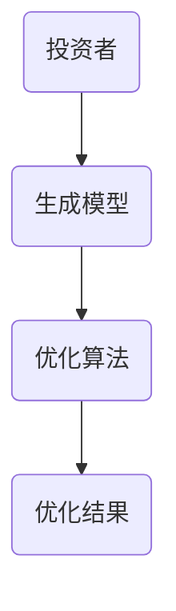
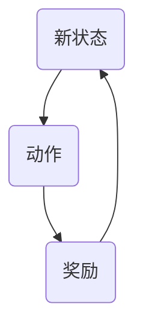
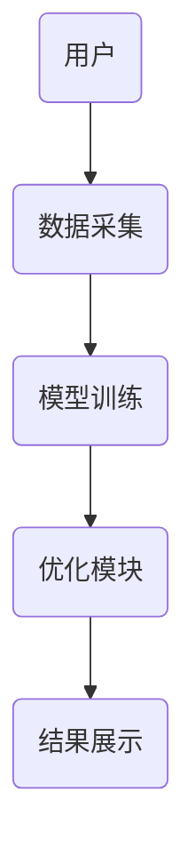

                 


# 投资建议生成与优化

## 关键词：投资建议生成，优化算法，生成模型，强化学习，系统架构

## 摘要：  
投资建议生成与优化是金融领域的重要课题，利用人工智能技术，特别是生成模型和优化算法，可以有效提高投资建议的准确性和效率。本文详细探讨了投资建议生成与优化的核心概念、算法原理、系统架构设计以及实际应用场景，为读者提供全面的技术解读和实践指导。

---

# 第一部分: 投资建议生成与优化的背景与核心概念

## 第1章: 投资建议生成与优化的背景介绍

### 1.1 投资建议生成与优化的基本概念

#### 1.1.1 问题背景与目标  
投资建议生成与优化是指通过算法和模型，为投资者提供个性化的投资建议，并对这些建议进行优化以实现最佳收益。传统的投资建议生成依赖人工分析，效率低且容易受主观因素影响。而通过人工智能技术，可以快速分析海量数据，生成精准的投资建议，并优化投资组合以最大化收益或最小化风险。

#### 1.1.2 投资建议生成与优化的核心要素  
- **数据输入**：市场数据（如股票价格、指数、经济指标）、投资者风险偏好、投资目标（如收益最大化、风险最小化）。  
- **生成模型**：用于生成初步的投资建议，可能涉及股票推荐、资产配置建议等。  
- **优化算法**：对生成的投资建议进行调整，使其更符合投资者的需求和市场变化。  

#### 1.1.3 问题的边界与外延  
- **边界**：仅考虑市场数据和投资者偏好，不涉及实时市场操作。  
- **外延**：可以扩展到动态调整投资组合、风险管理等领域。

### 1.2 投资建议生成与优化的流程  

#### 1.2.1 数据收集与预处理  
- 数据来源：股票价格、经济指标、市场新闻等。  
- 数据清洗：处理缺失值、异常值。  
- 数据特征提取：提取有用特征，如均值、波动率、相关性等。  

#### 1.2.2 模型训练与生成  
- 使用生成模型（如循环神经网络RNN、变种自动编码器VAE）生成初步投资建议。  
- 生成结果：生成多个候选投资组合。  

#### 1.2.3 优化与调整  
- 使用优化算法（如遗传算法、粒子群优化）对生成的投资组合进行调整。  
- 调整目标：最大化收益、最小化风险等。  

## 第2章: 投资建议生成与优化的核心概念与联系  

### 2.1 核心概念原理  

#### 2.1.1 生成模型的原理  
生成模型的目标是学习数据的分布，并根据输入生成新的数据点。例如，使用RNN生成股票价格序列。  

#### 2.1.2 优化算法的原理  
优化算法的目标是最小化或最大化目标函数，例如，使用遗传算法优化投资组合的收益-风险比率。  

#### 2.1.3 两者之间的联系  
生成模型提供候选方案，优化算法对这些方案进行调整以满足特定目标。

### 2.2 核心概念属性特征对比表  

| 概念       | 属性               | 特征                           |
|------------|--------------------|--------------------------------|
| 生成模型   | 数据需求           | 高                             |
| 优化算法   | 计算复杂度         | 中                             |
|            | 应用场景           | 离线优化                        |

### 2.3 实体关系图（ER图）  



---

# 第二部分: 投资建议生成与优化的算法原理  

## 第3章: 生成模型的算法原理  

### 3.1 生成模型的数学模型  

#### 3.1.1 概率分布模型  
$$ P(x) = \prod_{i=1}^{n} p(x_i|x_{i-1}) $$  

#### 3.1.2 基于强化学习的生成模型  



### 3.2 基于深度学习的生成模型  

#### 3.2.1 变量自动编码器（VAE）  
- 编码器：将输入数据编码为潜在空间向量。  
- 解码器：从潜在向量生成新的数据点。  

---

## 第4章: 优化算法的原理  

### 4.1 常见优化算法  

#### 4.1.1 遗传算法  
- **步骤**：  
  1. 初始化种群。  
  2. 计算适应度。  
  3. 选择、交叉、变异。  
  4. 重复步骤2-3，直到满足终止条件。  

#### 4.1.2 梯度下降法  
- **数学公式**：  
  $$ \theta_{t+1} = \theta_t - \eta \cdot \nabla f(\theta_t) $$  

#### 4.1.3 贪心算法  
- 逐步选择当前最优解，直到无法进一步优化。  

### 4.2 优化算法的数学模型  

#### 4.2.1 遗传算法的适应度函数  
$$ f(x) = \sum_{i=1}^{n} w_i x_i $$  

---

# 第三部分: 投资建议生成与优化的系统分析与架构设计  

## 第5章: 系统分析与架构设计  

### 5.1 问题场景介绍  

#### 5.1.1 投资者需求分析  
- 风险偏好：保守、平衡、激进。  
- 投资目标：短期、中期、长期。  

#### 5.1.2 市场数据处理  
- 数据来源：股票市场、基金市场等。  
- 数据特征：价格、波动率、相关性。  

### 5.2 系统功能设计  

#### 5.2.1 数据采集模块  
- 负责从数据源获取市场数据。  

#### 5.2.2 模型训练模块  
- 训练生成模型，生成投资建议。  

#### 5.2.3 优化模块  
- 使用优化算法调整投资组合。  

### 5.3 系统架构设计  



---

## 第6章: 项目实战  

### 6.1 环境安装  

```bash
pip install numpy pandas scikit-learn tensorflow
```

### 6.2 核心实现  

#### 6.2.1 生成模型实现  

```python
import tensorflow as tf
from tensorflow.keras import layers

# 定义生成器模型
def generator_model():
    model = tf.keras.Sequential([
        layers.Dense(256, activation='relu'),
        layers.Dense(128, activation='relu'),
        layers.Dense(10, activation='sigmoid')
    ])
    return model
```

#### 6.2.2 优化算法实现  

```python
def genetic_algorithm(population, fitness_fn, num_generations):
    for _ in range(num_generations):
        fitness = fitness_fn(population)
        # 选择、交叉、变异
        selected = select(population, fitness)
        offspring = crossover(selected)
        population = mutate(offspring)
    return population
```

### 6.3 案例分析  

#### 6.3.1 案例背景  
假设我们有10只股票，目标是生成并优化一个包含5只股票的投资组合。  

#### 6.3.2 数据分析  
- 计算每只股票的预期收益和风险。  

#### 6.3.3 生成与优化  
- 使用生成模型生成多个投资组合。  
- 使用遗传算法优化投资组合，使其在预期收益和风险之间找到最佳平衡。  

---

## 第7章: 最佳实践与小结  

### 7.1 最佳实践  

#### 7.1.1 数据清洗的重要性  
- 不干净的数据可能导致模型生成错误的建议。  

#### 7.1.2 模型调参的必要性  
- 调整模型参数可以提高生成建议的质量。  

### 7.2 小结  

### 7.3 注意事项  

#### 7.3.1 模型的局限性  
- 生成模型可能无法捕捉所有市场因素。  

#### 7.3.2 算法的计算复杂度  
- 优化算法的计算复杂度可能很高，需要优化计算资源。  

### 7.4 拓展阅读  

#### 7.4.1 深度学习在金融中的应用  
- 推荐书籍：《机器学习实战》  

---

# 作者：AI天才研究院/AI Genius Institute & 禅与计算机程序设计艺术 /Zen And The Art of Computer Programming

