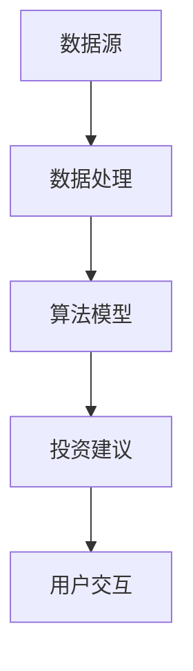

                 

# 投资理财智能助手的基本概念

## 关键词：
投资理财、智能助手、人工智能、数据分析、自然语言处理、系统架构、算法原理

## 摘要：
投资理财智能助手是一种结合人工智能技术的投资辅助工具，旨在通过数据分析、自然语言处理和算法模型帮助投资者做出更明智的决策。本文将从背景、核心概念、算法原理、系统架构、项目实战等多方面详细探讨投资理财智能助手的基本概念和实现原理，帮助读者深入了解其工作原理和应用价值。

---

# 第1章: 投资理财智能助手的背景与意义

## 1.1 问题背景
### 1.1.1 投资理财领域的痛点分析
- **信息过载**：投资者面对海量金融数据，难以快速筛选和分析。
- **决策复杂性**：投资决策涉及多因素分析，普通人难以独立完成。
- **传统工具局限性**：传统金融工具依赖人工分析，效率低且成本高。

### 1.1.2 传统投资理财工具的局限性
- **效率低下**：依赖人工分析，耗时且容易出错。
- **缺乏个性化**：传统工具难以根据用户需求提供定制化建议。
- **数据滞后**：传统工具依赖历史数据，难以实时反馈市场变化。

### 1.1.3 智能化工具的市场需求
- **提升效率**：通过自动化数据分析提高投资效率。
- **个性化服务**：基于用户需求提供定制化投资建议。
- **实时反馈**：利用实时数据和算法模型提供动态投资策略。

## 1.2 问题描述
### 1.2.1 投资者的需求分析
- **信息获取**：投资者需要快速获取准确的市场数据。
- **决策支持**：需要基于数据的科学决策支持。
- **风险控制**：需要实时监控和风险预警。

### 1.2.2 数据驱动的理财决策
- **数据来源**：市场数据、用户行为数据、经济指标等。
- **数据处理**：清洗、分析、建模。
- **数据驱动决策**：通过数据分析制定投资策略。

### 1.2.3 智能化投资理财工具的核心目标
- **提高投资效率**：通过自动化工具减少人工干预。
- **降低投资风险**：利用算法模型预测市场趋势。
- **提升用户体验**：提供个性化的投资建议和交互体验。

## 1.3 问题解决
### 1.3.1 智能助手的功能定位
- **数据收集与处理**：从多个数据源获取并清洗数据。
- **数据分析与建模**：利用机器学习算法进行预测和分析。
- **用户交互与反馈**：通过自然语言处理与用户交互，提供实时反馈。

### 1.3.2 技术手段如何解决投资理财问题
- **人工智能技术**：用于数据建模和预测。
- **自然语言处理**：实现与用户的自然交互。
- **大数据分析**：快速处理和分析海量数据。

### 1.3.3 用户体验的优化方向
- **界面设计**：直观易用的用户界面。
- **交互方式**：支持多种交互方式，如语音和文本。
- **反馈机制**：实时反馈投资建议和市场动态。

## 1.4 边界与外延
### 1.4.1 智能助手的功能边界
- **核心功能**：数据分析、预测和投资建议。
- **非核心功能**：手动数据输入、复杂算法调整。

### 1.4.2 与传统金融工具的区别
- **传统工具**：依赖人工分析，效率低。
- **智能助手**：自动化分析，效率高且个性化。

### 1.4.3 与其他智能工具的对比
- **智能音箱**：主要提供生活服务。
- **智能客服**：解决具体问题，不涉及投资决策。
- **智能助手**：专注于投资理财领域的数据分析和决策支持。

## 1.5 概念结构与核心要素
### 1.5.1 核心概念的组成
- **数据源**：市场数据、用户数据、经济指标。
- **算法模型**：机器学习、深度学习模型。
- **用户交互**：自然语言处理、语音识别。

### 1.5.2 关键要素的定义
- **数据源**：投资理财相关的市场数据和用户行为数据。
- **算法模型**：用于预测市场趋势和投资组合优化的数学模型。
- **用户交互**：通过自然语言处理实现与用户的高效互动。

### 1.5.3 概念结构图

## 1.6 本章小结
本章介绍了投资理财智能助手的背景和意义，分析了传统工具的局限性，提出了智能助手的核心目标和功能定位，明确了其与传统工具和其他智能工具的区别，为后续章节奠定了基础。

---

接下来，我会继续按照这个结构，逐步展开后续章节的内容，确保每部分内容详细且逻辑清晰。

