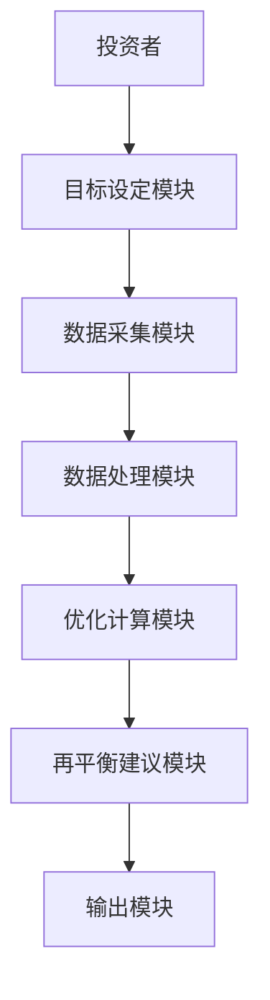

                 


# 投资组合再平衡：何时以及如何调整资产配置

## 关键词：投资组合，再平衡，资产配置，风险管理，组合优化，动态调整

## 摘要：  
投资组合再平衡是维护投资组合健康和实现长期财务目标的关键策略。本文深入探讨了投资组合再平衡的背景、核心概念、算法原理、系统架构以及实际应用。通过理论与实践相结合，本文详细讲解了如何根据市场变化和投资目标动态调整资产配置，以优化投资组合的风险收益比。无论是投资者、金融从业者还是技术爱好者，都能从中获得 valuable insights 和 actionable strategies。

---

# 第一部分: 投资组合再平衡的背景与基础

## 第1章: 投资组合再平衡的基本概念

### 1.1 投资组合再平衡的定义与背景
- **投资组合再平衡**是指定期或不定期地调整投资组合的资产配置，以维持预设的投资目标和风险承受能力。  
- 再平衡的背景源于市场波动、资产价格变化以及投资者自身目标的调整。例如，股市上涨可能导致股票比例超过初始配置，需要通过卖出股票或买入其他资产来恢复目标比例。  

### 1.2 投资组合再平衡的重要性
- **分散风险**：避免单一资产或资产类别的过度集中，降低投资组合的波动性。  
- **捕捉机会**：通过调整资产配置，投资者可以利用市场的周期性变化，优化收益。  
- **适应变化**：随着时间推移，投资者的风险承受能力和财务目标可能会发生变化，再平衡确保投资组合与这些变化保持一致。  

### 1.3 投资组合再平衡的目标
- **维持目标资产配置**：确保投资组合的结构与初始计划一致。  
- **降低风险敞口**：通过调整头寸，减少对某一资产或市场的过度依赖。  
- **优化收益**：通过动态调整，捕捉不同资产类别中的超额收益机会。  

### 1.4 再平衡的时机与频率
- **定期再平衡**：通常每年或每季度进行一次，以应对市场变化和通货膨胀。  
- **事件驱动再平衡**：当市场发生重大波动（如股市 crash 或债券收益率大幅变化）时，进行调整。  
- **动态调整策略**：根据实时市场数据和投资者目标，灵活调整再平衡的频率。  

---

## 第2章: 资产配置与再平衡的关系

### 2.1 资产配置的定义与分类
- **定义**：资产配置是将资金分配到不同的资产类别（如股票、债券、现金等）以实现风险和收益的平衡。  
- **分类**：  
  - **战略资产配置**：基于长期投资目标和风险承受能力设定的资产比例。  
  - **战术资产配置**：根据短期市场条件进行的动态调整。  

### 2.2 再平衡与资产配置的相互作用
- 再平衡是资产配置过程中的关键步骤，确保实际投资组合与目标配置保持一致。  
- 例如，如果市场波动导致某类资产比例偏离目标，再平衡将通过买卖操作恢复配置。  

### 2.3 不同资产类别对再平衡的影响
- **股票**：波动性高，可能导致配置比例偏离目标。  
- **债券**：价格波动相对较小，但收益率变化会影响再平衡决策。  
- **现金**：作为流动性资产，常用于再平衡操作中的暂时过渡。  

---

# 第二部分: 投资组合再平衡的核心概念与联系

## 第3章: 风险管理与再平衡的联系

### 3.1 风险管理的基本概念
- 风险管理是识别、评估和控制投资组合中潜在损失的过程。  
- 再平衡通过调整资产配置，降低特定资产或市场带来的风险。  

### 3.2 再平衡在风险管理中的作用
- **分散风险**：通过投资不同资产类别，降低单一资产带来的风险。  
- **降低波动性**：通过平衡风险资产和防御性资产，减少整体投资组合的波动性。  
- **应对市场冲击**：在市场下跌时，再平衡可以通过减少高风险资产的比例，降低损失。  

---

# 第三部分: 投资组合再平衡的算法原理

## 第4章: 基于均值-方差优化的再平衡算法

### 4.1 均值-方差优化的基本原理
- 均值-方差优化是一种经典的资产配置方法，旨在在给定风险水平下最大化收益，或在给定收益下最小化风险。  
- 公式：  
  $$ \text{Minimize } \sigma^2 \text{ subject to } \mu \geq \text{目标收益} $$  
  其中，$\sigma^2$ 是投资组合的方差（风险），$\mu$ 是期望收益。  

### 4.2 优化步骤
1. 确定各资产的预期收益和风险。  
2. 构建协方差矩阵，衡量资产之间的相关性。  
3. 使用优化算法（如拉格朗日乘数法）求解最优资产配置。  

### 4.3 代码实现
```python
import numpy as np
from scipy.optimize import minimize

# 假设资产的预期收益和协方差矩阵
mu = np.array([0.1, 0.05, 0.02])
cov_matrix = np.array([[0.16, 0.05, 0.02],
                        [0.05, 0.06, 0.01],
                        [0.02, 0.01, 0.03]])

def portfolio_var(weights, mu, cov):
    return np.dot(weights.T, np.dot(cov, weights))

def optimize_portfolio(mu, cov, target_return=0.08):
    n = len(mu)
    init_guess = np.array([1.0/n]*n)
    constraints = [{'type': 'eq', 'fun': lambda w: np.sum(w) - 1.0},
                   {'type': 'eq', 'fun': lambda w: np.dot(w, mu) - target_return}]
    bounds = [(0, 1) for _ in range(n)]
    result = minimize(portfolio_var, init_guess, method='SLSQP', 
                     constraints=constraints, bounds=bounds)
    return result.x

# 示例：优化投资组合以达到8%的预期收益
weights = optimize_portfolio(mu, cov_matrix, 0.08)
print("Optimal weights:", weights)
```

---

## 第5章: 基于蒙特卡洛模拟的再平衡策略

### 5.1 蒙特卡洛模拟的基本原理
- 通过模拟大量市场情景，评估不同资产配置下的投资组合表现。  
- 使用模拟结果优化再平衡策略，选择最优的调整时机和比例。  

### 5.2 算法步骤
1. 生成历史资产收益数据。  
2. 进行大量的随机模拟，生成可能的市场情景。  
3. 计算每种情景下的投资组合收益和风险。  
4. 根据模拟结果优化再平衡策略，例如确定再平衡的频率和阈值。  

### 5.3 代码实现
```python
import numpy as np
import pandas as pd

# 生成历史收益数据
np.random.seed(42)
n_assets = 3
n_samples = 1000
returns = np.random.normal(0.05, 0.2, (n_samples, n_assets))

# 蒙特卡洛模拟
n_simulation = 10000
simulated_returns = np.random.randn(n_simulation, n_samples, n_assets)

# 计算每种情景下的最优权重
optimal_weights = []
for scenario in simulated_returns:
    mu_scenario = np.mean(scenario, axis=0)
    cov_scenario = np.cov(scenario, rowvar=False)
    # 这里省略优化权重的代码
    optimal_weights.append(optimize_portfolio(mu_scenario, cov_scenario))

# 分析模拟结果
# ...
```

---

# 第四部分: 投资组合再平衡的系统架构与设计

## 第6章: 系统分析与架构设计

### 6.1 系统需求分析
- **问题场景**：投资者需要定期调整投资组合以维持目标配置。  
- **功能需求**：  
  - 数据采集与处理：获取实时市场数据。  
  - 模型计算：执行资产配置优化和再平衡决策。  
  - 系统输出：生成再平衡操作建议。  

### 6.2 系统架构设计


### 6.3 关键模块实现
- **数据采集模块**：从API获取实时市场数据。  
- **优化计算模块**：使用Python代码实现优化算法，生成再平衡建议。  
- **输出模块**：将建议以可视化或报告形式呈现给投资者。  

---

## 第7章: 项目实战

### 7.1 投资组合再平衡的环境搭建
```bash
pip install numpy scipy pandas
```

### 7.2 核心功能实现
```python
# 示例代码：计算再平衡后的权重
def calculate_rebalancing(weights, current_value, target_value):
    # 计算当前权重
    current_weights = weights * (current_value / np.sum(weights * current_value))
    # 调整权重以匹配目标
    rebalanced_weights = target_value / np.sum(target_value)
    return rebalanced_weights

# 示例调用
current_weights = [0.6, 0.3, 0.1]
current_value = [100, 50, 20]
target_value = [80, 60, 40]

rebalanced = calculate_rebalancing(current_weights, current_value, target_value)
print("Rebalanced weights:", rebalanced)
```

### 7.3 实际案例分析
- 假设当前投资组合为股票60%、债券30%、现金10%，但市场波动导致股票上涨20%，债券下跌5%。  
- 通过再平衡，调整至股票55%、债券35%、现金10%，以恢复初始目标配置。  

---

## 第8章: 总结与展望

### 8.1 总结
投资组合再平衡是实现长期稳健投资的关键策略。通过定期调整资产配置，投资者可以有效管理风险，优化收益。  

### 8.2 展望
随着人工智能和大数据技术的发展，未来的再平衡策略将更加智能化和个性化。投资者可以利用更复杂的算法和实时数据，做出更精准的再平衡决策。  

---

# 作者：AI天才研究院/AI Genius Institute & 禅与计算机程序设计艺术 /Zen And The Art of Computer Programming

