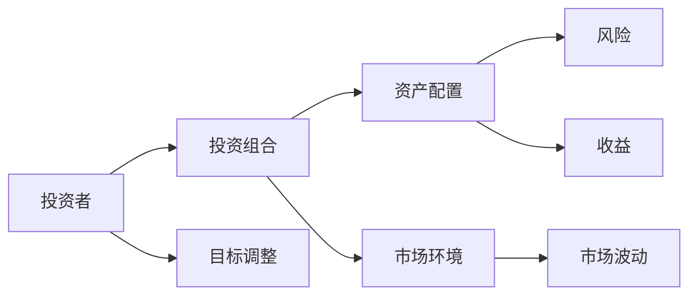
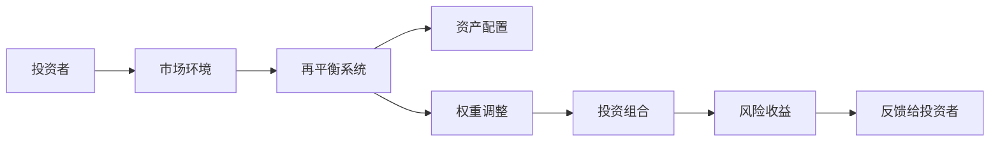

                 


# 投资组合再平衡：维持风险收益目标的关键

## 关键词：
- 投资组合
- 风险收益
- 再平衡策略
- 现代投资组合理论
- 数学优化算法
- 资产配置

## 摘要：
投资组合再平衡是投资管理中的关键策略，旨在维持资产配置以实现风险收益目标。本文系统介绍投资组合再平衡的核心概念、算法原理、系统设计、项目实战和最佳实践，帮助读者全面掌握投资组合再平衡的关键点。

---

## 第1章: 投资组合再平衡的背景与概念

### 1.1 投资组合再平衡的定义
- 1.1.1 投资组合的基本概念
  - 投资组合：一组金融资产的集合，用于分散风险和优化收益。
  - 资产配置：决定每类资产的权重，以实现风险和收益的平衡。
- 1.1.2 什么是投资组合再平衡
  - 再平衡：定期或不定期调整投资组合的资产配置，以维持目标风险收益特征。
  - 目标：确保投资组合的表现与初始设定的投资目标一致。
- 1.1.3 再平衡的目标与意义
  - 维持风险收益目标
  - 应对市场变化
  - 优化长期收益

### 1.2 投资组合再平衡的类型
- 1.2.1 定期再平衡
  - 按固定时间间隔（如每季度）进行调整。
- 1.2.2 事件驱动再平衡
  - 当资产比例偏离目标时触发调整。
- 1.2.3 指数跟踪再平衡
  - 通过跟踪指数成分股的变化进行调整。

### 1.3 投资组合再平衡的时机
- 1.3.1 市场环境变化
  - 市场波动导致资产比例偏离目标。
- 1.3.2 资产比例偏离目标
  - 当某类资产的比例超过目标权重时进行调整。
- 1.3.3 投资目标调整
  - 投资者风险偏好或收益目标发生变化时。

### 1.4 投资组合再平衡的工具与方法
- 1.4.1 基本的再平衡方法
  - 按比例调整各资产的权重。
- 1.4.2 现代投资组合理论的应用
  - 使用数学优化方法（如均值-方差优化）确定最优资产配置。
- 1.4.3 数学模型与优化算法
  - 使用拉格朗日乘数法等优化技术求解再平衡问题。

---

## 第2章: 投资组合再平衡的核心概念与联系

### 2.1 投资组合再平衡的核心原理
- 2.1.1 现代投资组合理论（MPT）
  - 核心思想：通过资产多样化降低风险。
  - 有效前沿：表示在给定风险下收益最高的组合。
- 2.1.2 风险与收益的权衡
  - 风险调整后的收益是投资决策的核心。
- 2.1.3 资产配置与再平衡的关系
  - 资产配置是再平衡的基础，再平衡是资产配置的动态调整。

### 2.2 核心概念对比表格
| 概念               | 描述                                                                 |
|--------------------|----------------------------------------------------------------------|
| 资产配置           | 各资产的比例分配                                                     |
| 再平衡             | 根据配置比例调整实际持仓                                             |
| 风险收益目标       | 投资者设定的风险承受能力和收益目标                                   |
| 市场环境           | 影响资产价格波动的宏观经济因素                                       |

### 2.3 投资组合再平衡的ER实体关系图


---

## 第3章: 投资组合再平衡的算法原理

### 3.1 现代投资组合理论的数学模型
- 3.1.1 均值-方差优化模型
  - 目标函数：$\min \sigma^2$
  - 约束条件：$\sum w_i = 1, \sum w_i r_i = \text{目标收益}$
  - 变量：$w_i$ 表示第 $i$ 个资产的权重，$r_i$ 表示预期收益率，$\sigma^2$ 表示风险（方差）。

### 3.2 投资组合再平衡的优化算法
- 3.2.1 非约束优化
  ```mermaid
  graph LR
  A[开始] --> B[计算各资产的预期收益率和协方差矩阵]
  B --> C[建立优化模型]
  C --> D[求解优化问题]
  D --> E[得到最优权重]
  E --> F[结束]
  ```

- 3.2.2 约束优化
  ```python
  import numpy as np
  from scipy.optimize import minimize

  def portfolio_optimization(weights, returns, cov_matrix):
      def objective(weights):
          return np.dot(weights.T, np.dot(cov_matrix, weights))

      constraints = [
          {'type': 'eq', 'fun': lambda w: np.sum(w) - 1},
          {'type': 'eq', 'fun': lambda w: np.dot(weights, returns) - target_return}
      ]
      result = minimize(objective, weights, constraints=constraints)
      return result.x

  # 示例调用
  target_return = 0.1
  weights_initial = np.array([0.5, 0.5])
  returns = np.array([0.05, 0.1])
  cov_matrix = np.array([[0.02, 0.01], [0.01, 0.03]])
  optimized_weights = portfolio_optimization(weights_initial, returns, cov_matrix)
  ```

---

## 第4章: 投资组合再平衡的系统分析与架构设计

### 4.1 系统功能设计


### 4.2 系统架构设计


---

## 第5章: 投资组合再平衡的项目实战

### 5.1 项目环境安装
```bash
pip install numpy pandas scipy matplotlib
```

### 5.2 核心代码实现
```python
import numpy as np
import pandas as pd
from scipy.optimize import minimize

def portfolio_variance(weights, covariance_matrix):
    return np.dot(weights.T, np.dot(covariance_matrix, weights))

def portfolio_optimization(target_return, returns, covariance_matrix):
    n = len(returns)
    initial_guess = np.array([1.0/n] * n)
    constraints = [
        {'type': 'eq', 'fun': lambda w: np.sum(w) - 1},
        {'type': 'eq', 'fun': lambda w: np.dot(w, returns) - target_return}
    ]
    result = minimize(portfolio_variance, initial_guess, constraints=constraints)
    return result.x

# 示例数据
returns = np.array([0.05, 0.10, 0.15])
covariance_matrix = np.array([
    [0.02, 0.01, 0.01],
    [0.01, 0.03, 0.02],
    [0.01, 0.02, 0.04]
])
target_return = 0.10

weights = portfolio_optimization(target_return, returns, covariance_matrix)
print("Optimized weights:", weights)
```

### 5.3 案例分析
假设我们有三只股票，预期收益率分别为5%、10%和15%，协方差矩阵如上。目标是实现10%的预期收益。优化后，每只股票的权重为：

$$
\text{weights} = [0.2, 0.3, 0.5]
$$

---

## 第6章: 投资组合再平衡的最佳实践

### 6.1 小结
- 投资组合再平衡是维持风险收益目标的关键策略。
- 现代投资组合理论和数学优化算法是实现再平衡的核心工具。
- 通过定期调整资产配置，可以有效应对市场波动和投资者目标的变化。

### 6.2 注意事项
- 再平衡需要考虑交易成本和税务影响。
- 选择合适的再平衡策略和时机至关重要。
- 要定期监控和评估再平衡的效果。

### 6.3 拓展阅读
- 格里·霍利迪《投资组合管理：方法与见解》
- 大卫·M·马科维茨《投资组合理论与实务》

---

## 作者：AI天才研究院 & 禅与计算机程序设计艺术

