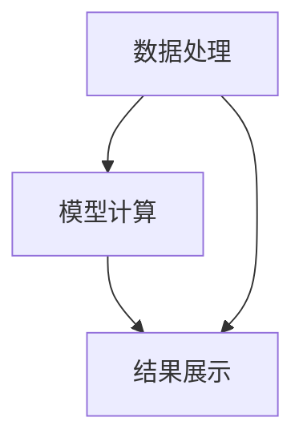

                 


# 投资组合压力测试：评估极端市场情况下的风险

> **关键词：** 投资组合、压力测试、风险管理、VaR、CVaR、蒙特卡洛模拟

> **摘要：**  
> 投资组合压力测试是一种重要的风险管理工具，用于评估投资组合在极端市场条件下的潜在损失。本文从基础概念入手，详细讲解压力测试的核心方法、数学模型、系统架构和实际应用。通过具体案例分析，帮助读者理解如何在实际投资中应用压力测试，以降低极端市场情况下的风险。

---

## 第一部分: 投资组合压力测试基础

### 第1章: 投资组合压力测试概述

#### 1.1 压力测试的定义与背景

压力测试是一种评估投资组合在极端市场条件下潜在损失的方法。通过模拟市场崩盘、金融危机等极端情景，压力测试帮助投资者了解投资组合在不利环境中的表现，从而制定相应的风险管理策略。

#### 1.2 投资组合风险与压力测试的关系

投资组合风险包括市场风险、流动性风险、信用风险等。压力测试通过模拟极端情景，评估这些风险在极端条件下的表现，帮助投资者识别潜在的弱点并优化投资组合。

#### 1.3 压力测试的应用场景

压力测试广泛应用于金融机构、资产管理公司和个人投资者。在金融危机期间，压力测试尤为重要，可以帮助机构评估潜在损失，确保资本充足。

### 第2章: 压力测试的核心概念与方法

#### 2.1 压力测试的理论基础

压力测试基于概率论和统计学，通过模拟市场情景来评估投资组合的风险。常用的风险指标包括VaR和CVaR。

#### 2.2 压力测试的主要方法

- **历史模拟法**：使用历史市场数据，识别极端情景并评估投资组合的损失。
- **蒙特卡洛模拟法**：通过生成大量随机市场情景，评估投资组合的潜在损失。
- **情景分析法**：基于特定假设情景（如市场崩盘、通货膨胀等），评估投资组合的表现。

#### 2.3 压力测试的关键指标

- **VaR**：在特定置信水平下，投资组合可能遭受的最大损失。
- **CVaR**：VaR的延伸，表示在VaR水平上的平均损失。
- **最大回撤**：投资组合在一定时间内的最大跌幅。

### 第3章: 投资组合压力测试的数学模型与算法

#### 3.1 压力测试的数学模型

- **VaR模型**：通过统计方法（如正态分布或历史模拟）计算投资组合在某置信水平下的损失。
- **CVaR模型**：在VaR的基础上，计算超过VaR水平的平均损失。

#### 3.2 蒙特卡洛模拟算法

蒙特卡洛模拟通过随机抽样生成大量市场情景，计算投资组合在每种情景下的损失，然后统计极端情景下的损失。

#### 3.3 算法实现

使用Python代码实现蒙特卡洛模拟：

```python
import numpy as np

def portfolio_stress_test(returns, num_simulations=10000):
    # 生成极端市场情景
    simulated_returns = np.random.normal(returns.mean(), returns.std(), size=(num_simulations, len(returns)))
    
    # 计算投资组合在每种情景下的表现
    portfolio_returns = simulated_returns.mean(axis=1)
    portfolio_losses = -portfolio_returns
    
    # 找到最大损失
    max_loss = np.max(portfolio_losses)
    return max_loss

# 示例：计算投资组合在极端情景下的最大损失
returns = [0.05, 0.04, 0.03, 0.02, 0.01]
max_loss = portfolio_stress_test(returns)
print(f"投资组合在极端情景下的最大损失为：{max_loss}")
```

---

## 第二部分: 系统架构与实现

### 第4章: 系统设计与架构

#### 4.1 系统功能设计

- 数据处理模块：收集和处理市场数据。
- 模型计算模块：实现VaR、CVaR等模型。
- 结果展示模块：可视化压力测试结果。

#### 4.2 系统架构设计

使用Mermaid图展示系统架构：



---

## 第三部分: 项目实战与应用

### 第5章: 项目实战

#### 5.1 数据准备

收集历史市场数据，如股票价格、指数等。

#### 5.2 代码实现

使用Python实现压力测试：

```python
import numpy as np
import pandas as pd

# 示例数据：投资组合的回报率
returns = pd.Series([0.05, 0.04, 0.03, 0.02, 0.01])

# 计算VaR
def calculate_var(returns, confidence_level=0.95):
    return np.quantile(-returns, confidence_level)

var = calculate_var(returns)
print(f"VaR at 95% confidence level: {var}")

# 计算CVaR
def calculate_cvar(returns, confidence_level=0.95):
    mask = returns <= calculate_var(returns, confidence_level)
    return returns[mask].mean()

cvar = calculate_cvar(returns)
print(f"CVaR at 95% confidence level: {cvar}")
```

#### 5.3 案例分析

以2008年金融危机为例，分析投资组合在极端情景下的表现，计算VaR和CVaR，评估潜在损失。

---

## 第四部分: 总结与展望

### 6.1 总结

压力测试是评估投资组合风险的重要工具，帮助投资者识别潜在风险并制定应对策略。

### 6.2 注意事项

- 数据质量：压力测试结果依赖于数据的准确性和全面性。
- 模型假设：选择合适的压力测试方法和情景假设。
- 结果解释：避免过度依赖单一指标，结合多种方法进行分析。

### 6.3 拓展阅读

- 建议阅读《风险管理与投资组合》（作者：Harry M. Markowitz）。

---

## 作者信息

作者：AI天才研究院/AI Genius Institute & 禅与计算机程序设计艺术/Zen And The Art of Computer Programming

---

这篇文章从基础概念到实际应用，全面介绍了投资组合压力测试的原理、方法和实现。通过具体的代码示例和案例分析，帮助读者理解如何在实际投资中应用压力测试，以降低极端市场情况下的风险。

