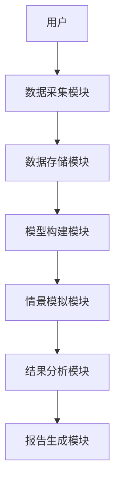
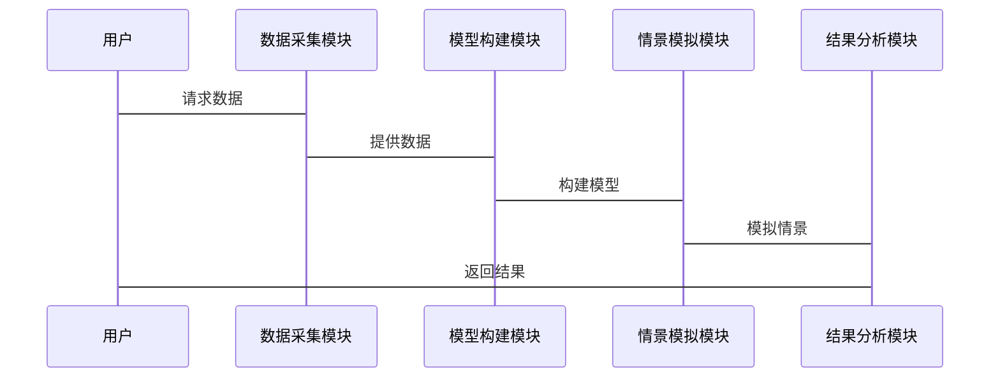

                 


# 投资组合压力测试：评估极端情景下的风险敞口

> 关键词：投资组合压力测试，风险敞口，极端情景，VaR，CVaR，风险管理

> 摘要：投资组合压力测试是一种用于评估投资组合在极端市场条件下的潜在损失的重要工具。本文将详细探讨压力测试的核心概念、方法论、系统架构设计以及实际应用案例。通过分析不同的压力测试方法，如历史模拟法、情景分析法和蒙特卡洛模拟法，本文将引导读者理解如何构建有效的压力测试框架，并通过具体案例展示如何在实际投资组合管理中应用这些方法。此外，本文还将探讨压力测试在金融风险管理中的重要性，以及如何通过压力测试结果优化投资组合配置，降低整体风险敞口。

---

## 第1章: 投资组合压力测试的背景与概念

### 1.1 什么是投资组合压力测试

#### 1.1.1 投资组合压力测试的定义

投资组合压力测试是一种评估投资组合在极端市场条件下的潜在损失的工具。它通过模拟市场中的极端情景，如市场崩盘、经济衰退或货币贬值等，来衡量投资组合在这些情景下的表现和风险敞口。

#### 1.1.2 压力测试的目的与意义

压力测试的主要目的是帮助投资者和机构了解其投资组合在极端情况下的潜在损失，从而更好地进行风险管理和资产配置。通过压力测试，投资者可以识别出投资组合中的薄弱环节，并采取相应的措施来降低风险。

#### 1.1.3 压力测试的分类与外延

压力测试可以分为以下几类：
- **历史模拟法**：基于历史市场数据来模拟极端情景。
- **情景分析法**：假设某些极端情景（如经济衰退、市场崩盘）并评估投资组合在这些情景下的表现。
- **蒙特卡洛模拟法**：通过随机模拟市场波动来评估投资组合的风险。

---

### 1.2 投资组合风险敞口的定义

#### 1.2.1 风险敞口的定义与分类

风险敞口是指投资组合在特定市场条件下的潜在损失。根据不同的市场因素，风险敞口可以分为以下几类：
- **市场风险敞口**：由于市场波动导致的投资组合损失。
- **信用风险敞口**：由于债券发行人违约导致的损失。
- **流动性风险敞口**：由于资产流动性不足导致的买卖价差或无法及时变现的损失。

#### 1.2.2 风险敞口的核心要素

风险敞口的核心要素包括：
- 投资组合的资产配置。
- 市场波动性。
- 资产之间的相关性。
- 市场极端情景的可能性。

#### 1.2.3 风险敞口与投资组合的关系

投资组合的风险敞口与其资产配置密切相关。通过调整资产配置，投资者可以降低某些特定风险敞口，从而优化整体风险收益比。

---

## 第2章: 投资组合风险分析基础

### 2.1 投资组合风险的类型

#### 2.1.1 市场风险

市场风险是指由于市场整体波动导致的投资组合损失。它包括股票市场风险、债券市场风险等。

#### 2.1.2 利率风险

利率风险是指由于利率变化导致债券价格波动的风险。

#### 2.1.3 汇率风险

汇率风险是指由于汇率波动导致外汇资产价值变化的风险。

#### 2.1.4 信用风险

信用风险是指债券发行人违约导致的损失风险。

#### 2.1.5 流动性风险

流动性风险是指由于资产流动性不足导致无法及时变现的风险。

---

### 2.2 风险度量方法

#### 2.2.1 方差与标准差

方差和标准差是衡量资产或投资组合收益波动性的指标。标准差越大，投资组合的风险越高。

$$ \text{方差} = \sigma^2 = \frac{1}{n}\sum_{i=1}^{n}(x_i - \mu)^2 $$

$$ \text{标准差} = \sigma = \sqrt{\frac{1}{n}\sum_{i=1}^{n}(x_i - \mu)^2} $$

#### 2.2.2 VaR（Value at Risk）

VaR是指在一定置信水平下，投资组合在正常市场条件下可能遭受的最大损失。例如，95%置信水平下的VaR意味着在95%的概率下，投资组合的最大损失不会超过VaR值。

$$ \text{VaR} = \text{quantile}(p) \times \text{标准差} $$

#### 2.2.3 CVaR（Conditional Value at Risk）

CVaR是指在VaR的基础上，计算在VaR水平以下的平均损失。CVaR通常用于更保守的风险度量。

$$ \text{CVaR} = \frac{1}{1 - p} \int_{p}^{1} \text{VaR}(x) dx $$

---

### 2.3 投资组合模型构建

#### 2.3.1 现代投资组合理论（MPT）

MPT由哈里·马科维茨提出，旨在通过优化资产配置来最大化收益并最小化风险。

$$ \text{优化目标：} \min \sigma^2 \quad \text{subject to} \quad \mathbb{E}[r] = \text{目标收益} $$

#### 2.3.2 风险平价投资组合

风险平价投资组合是指将投资组合的风险在不同资产类别之间平均分配。

#### 2.3.3 黑箱与白箱模型

- **黑箱模型**：不透明的模型，无法直接观察其内部结构。
- **白箱模型**：透明的模型，可以观察其内部结构和算法。

---

## 第3章: 压力测试的方法论

### 3.1 压力测试的主要方法

#### 3.1.1 历史模拟法

历史模拟法通过回顾历史市场数据，识别极端市场情景，并评估投资组合在这些情景下的表现。

#### 3.1.2 情景分析法

情景分析法假设某些极端市场情景（如经济衰退、市场崩盘），并评估投资组合在这些情景下的表现。

#### 3.1.3 蒙特卡洛模拟法

蒙特卡洛模拟法通过随机模拟市场波动，评估投资组合在不同情景下的潜在损失。

---

### 3.2 情景选择与设计

#### 3.2.1 系统性风险情景

系统性风险情景包括市场崩盘、经济衰退、全球金融危机等。

#### 3.2.2 非系统性风险情景

非系统性风险情景包括债券发行人违约、特定行业衰退等。

#### 3.2.3 自定义情景设计

根据具体需求，设计特定的极端情景，如高通胀、货币贬值等。

---

### 3.3 压力测试的实施步骤

#### 3.3.1 数据收集与准备

收集历史市场数据、资产回报数据、宏观经济指标等。

#### 3.3.2 模型选择与构建

选择适合的压力测试模型，并构建投资组合模型。

#### 3.3.3 情景模拟与测试

模拟极端市场情景，并评估投资组合在这些情景下的表现。

#### 3.3.4 结果分析与验证

分析测试结果，验证模型的有效性，并根据结果调整投资组合。

---

## 第4章: 投资组合压力测试的系统分析与架构设计

### 4.1 系统分析

#### 4.1.1 问题场景介绍

压力测试系统需要处理大量的市场数据和复杂的模型计算，对系统的性能和稳定性提出了较高要求。

#### 4.1.2 项目目标与范围

系统目标：实现高效、准确的压力测试功能。

系统范围：包括数据采集、模型构建、情景模拟、结果分析等功能。

#### 4.1.3 系统功能需求

- 数据采集模块：收集市场数据、资产回报数据等。
- 模型构建模块：构建投资组合模型。
- 情景模拟模块：模拟极端市场情景。
- 结果分析模块：分析测试结果并生成报告。

---

### 4.2 系统架构设计

#### 4.2.1 系统架构图



#### 4.2.2 数据流设计


#### 4.2.3 接口设计与交互



---

## 第5章: 投资组合压力测试的项目实战

### 5.1 环境安装

安装必要的软件和工具，如Python、NumPy、Pandas、Matplotlib等。

### 5.2 系统核心实现源代码

#### 5.2.1 数据采集模块

```python
import pandas as pd
import requests

def get_market_data(start_date, end_date):
    # 模拟从API获取市场数据
    url = f"https://api.example.com/market_data?start={start_date}&end={end_date}"
    response = requests.get(url)
    data = response.json()
    return pd.DataFrame(data)
```

#### 5.2.2 模型构建模块

```python
import numpy as np

def build_portfolio_model(returns, weights):
    # 计算投资组合的期望收益和风险
    expected_return = np.sum(returns * weights)
    covariance_matrix = np.cov(returns.T)
    portfolio_variance = weights.T.dot(covariance_matrix).dot(weights)
    return expected_return, np.sqrt(portfolio_variance)
```

#### 5.2.3 情景模拟模块

```python
import numpy as np

def simulate_scenario(returns, scenario):
    # 根据情景调整资产回报
    adjusted_returns = returns * (1 + scenario['return_shift'])
    return adjusted_returns
```

#### 5.2.4 结果分析模块

```python
import matplotlib.pyplot as plt

def analyze_results(test_results):
    plt.hist(test_results, bins=20)
    plt.xlabel('Loss')
    plt.ylabel('Frequency')
    plt.title('Scenario Loss Distribution')
    plt.show()
```

---

## 第6章: 投资组合压力测试的案例分析

### 6.1 案例背景

假设我们有一个包含股票、债券和商品的投资组合，我们需要评估其在市场崩盘情景下的表现。

### 6.2 案例分析

1. 数据采集：收集过去10年的市场数据。
2. 模型构建：构建投资组合模型，设定资产权重。
3. 情景模拟：模拟市场崩盘情景（如2008年金融危机）。
4. 结果分析：评估投资组合在该情景下的潜在损失。

### 6.3 案例结论

通过压力测试，我们发现投资组合在市场崩盘情景下的最大损失为X%，并根据测试结果调整了资产配置，以降低整体风险敞口。

---

## 第7章: 总结与展望

### 7.1 总结

投资组合压力测试是一种重要的金融风险管理工具。通过模拟极端市场情景，投资者可以更好地了解投资组合的风险敞口，并采取相应的措施来优化资产配置。

### 7.2 未来展望

随着人工智能和大数据技术的发展，压力测试的方法和工具将更加智能化和多样化。未来的研究方向包括引入机器学习算法，提高压力测试的准确性和效率。

---

## 作者：AI天才研究院/AI Genius Institute & 禅与计算机程序设计艺术 /Zen And The Art of Computer Programming

---

通过以上内容，我们系统地介绍了投资组合压力测试的核心概念、方法论、系统架构设计以及实际应用案例。希望读者能够通过本文深入了解压力测试的重要性，并能够在实际投资组合管理中灵活运用这些方法。

