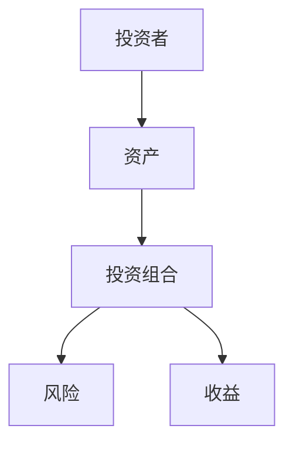
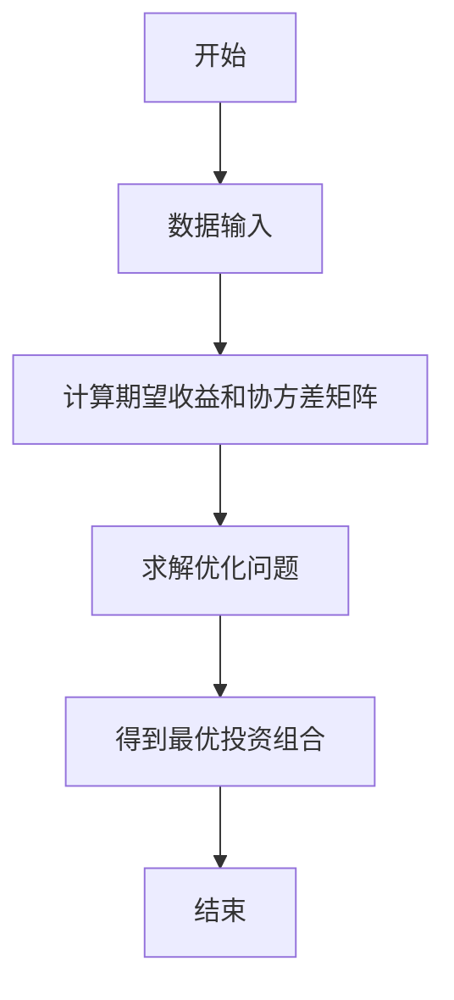

                 


# 投资组合管理

> 关键词：投资组合管理、资产配置、风险管理、现代投资组合理论、量化投资、系统设计

> 摘要：本文系统地探讨了投资组合管理的核心概念、理论基础、算法实现、系统设计、实战案例以及风险管理等方面的内容。通过结合理论与实践，深入分析了投资组合管理的关键要素，包括资产配置、风险管理、绩效评估等，并通过具体的投资策略和数学模型，展示了如何在实际中应用这些理论。文章还通过详细的Python代码实现和系统架构设计，帮助读者全面理解投资组合管理的实现过程和应用场景。

---

## 第一部分: 投资组合管理概述

### 第1章: 投资组合管理概述

#### 1.1 投资组合管理的基本概念
- **1.1.1 投资组合的定义**  
  投资组合是指将多种资产（如股票、债券、基金等）按照一定比例组合在一起，以实现特定投资目标的一种投资方式。  
  *关键点：投资组合的核心在于分散风险和优化收益。*

- **1.1.2 投资组合管理的目标**  
  - **收益最大化**：在风险可控的前提下，追求最大化的投资收益。  
  - **风险最小化**：通过资产配置和分散投资，降低投资组合的整体风险。  
  - **长期稳健增长**：通过科学的管理和调整，实现资产的长期稳健增值。  

- **1.1.3 投资组合管理的意义**  
  - 投资组合管理是投资者实现财务目标的重要工具。  
  - 通过科学的管理方法，投资者可以更好地应对市场波动和经济变化。  

---

#### 1.2 投资组合管理的历史与发展
- **1.2.1 投资组合管理的起源**  
  投资组合管理的概念可以追溯到古代的分散投资思想，但其系统化研究始于20世纪初。  

- **1.2.2 现代投资组合理论的提出**  
  1952年，马科维茨（Harry Markowitz）提出了现代投资组合理论（MPT），奠定了投资组合管理的理论基础。  

- **1.2.3 投资组合管理的发展与演变**  
  - 从传统的资产配置到量化投资的兴起，投资组合管理经历了从定性分析到定量分析的转变。  
  - 近年来，人工智能和大数据技术的应用进一步推动了投资组合管理的创新。  

---

#### 1.3 投资组合管理的核心要素
- **资产配置**：决定投资组合收益和风险的核心因素。  
- **风险管理**：通过分散投资和对冲策略降低投资组合的整体风险。  
- **绩效评估**：定期评估投资组合的收益和风险表现，优化投资策略。  

---

## 第二部分: 投资组合管理的核心概念与联系

### 第2章: 投资组合管理的核心概念与联系

#### 2.1 投资组合管理的理论基础
- **2.1.1 现代投资组合理论（MPT）**  
  - MPT的核心思想是通过资产配置优化投资组合的风险和收益。  
  - **数学公式**：$$\text{目标函数：} \quad \min \sigma^2$$  
    $$\text{约束条件：} \quad \sum w_i = 1, \quad \sum w_i r_i = \mu$$  

- **2.1.2 资本资产定价模型（CAPM）**  
  - CAPM用于衡量资产的预期收益与系统性风险的关系。  
  - **数学公式**：$$E(r_i) = r_f + \beta_i (E(r_m) - r_f)$$  

- **2.1.3 有效前沿**  
  - 有效前沿是所有可行投资组合中风险最低或收益最高的点的集合。  

---

#### 2.2 投资组合管理的核心概念对比
- **资产配置与投资组合优化**  
  - 资产配置是投资组合管理的起点，而投资组合优化是对资产配置的进一步优化。  

- **风险调整后的收益**  
  - 风险调整后的收益是指考虑风险后的实际收益，常用夏普比率衡量。  

- **绩效评估与风险调整后的收益**  
  - 绩效评估需要结合投资组合的风险和收益表现，而不仅仅是收益高低。  

---

#### 2.3 投资组合管理的ER实体关系图


---

## 第三部分: 投资组合管理的算法原理

### 第3章: 投资组合管理的算法原理

#### 3.1 现代投资组合理论的算法实现
- **3.1.1 均值-方差模型的数学公式**  
  - $$\text{目标函数：} \quad \min \sigma^2$$  
    $$\text{约束条件：} \quad \sum w_i = 1, \quad \sum w_i r_i = \mu$$  

- **3.1.2 资本资产定价模型的数学公式**  
  - $$E(r_i) = r_f + \beta_i (E(r_m) - r_f)$$  

- **3.1.3 算法实现**  
  - 使用Python优化库（如`scipy.optimize`）实现投资组合优化。  

```python
import numpy as np
from scipy.optimize import minimize

# 示例数据
mu = np.array([0.1, 0.2, 0.15])
sigma = np.array([[0.05, 0.02, 0.03],
                  [0.02, 0.10, 0.01],
                  [0.03, 0.01, 0.08]])

# 定义优化函数
def portfolio_optimization(weights, mu, sigma):
    return np.dot(weights.T, np.dot(sigma, weights))

# 约束条件
cons = ({'type': 'eq', 'fun': lambda x: np.sum(x) - 1})

# 优化问题
result = minimize(portfolio_optimization, [1/3, 1/3, 1/3], args=(mu, sigma), constraints=cons)

# 输出结果
print("最优权重：", result.x)
print("最优方差：", result.fun)
```

---

#### 3.2 投资组合优化的算法流程图


---

## 第四部分: 投资组合管理的系统设计

### 第4章: 投资组合管理系统设计

#### 4.1 投资组合管理系统的模块划分
- **输入模块**：接收资产数据和投资目标。  
- **计算模块**：计算资产的期望收益、协方差矩阵等。  
- **优化模块**：求解投资组合优化问题。  
- **输出模块**：输出最优投资组合和相关指标。  

---

#### 4.2 投资组合管理系统的架构设计


---

## 第五部分: 投资组合管理的实战与风险管理

### 第5章: 投资组合管理的实战

#### 5.1 量化投资策略
- **市场中性策略**：通过多空头寸对冲市场风险。  
- **多因子模型**：基于多个因子构建投资组合。  

---

#### 5.2 投资组合风险管理
- **风险识别**：识别投资组合的主要风险来源。  
- **风险量化**：使用夏普比率、最大回撤等指标衡量风险。  
- **压力测试**：模拟极端市场条件下的投资组合表现。  

---

## 第六部分: 投资组合管理的总结与展望

### 第6章: 投资组合管理的总结与展望

#### 6.1 投资组合管理的总结
- 投资组合管理是实现投资目标的重要工具。  
- 科学的资产配置和风险管理是投资成功的关键。  

---

#### 6.2 投资组合管理的未来展望
- **人工智能的应用**：利用机器学习优化投资组合管理。  
- **大数据分析**：通过大数据技术提升投资决策的科学性。  
- **智能投顾**：结合人工智能和投顾服务，提供个性化的投资组合管理。  

---

## 附录

### 附录A: 投资组合管理工具推荐
- **Python库**：`pandas`, `numpy`, `scipy.optimize`, `PyPortfolioOpt`  
- **数据分析平台**：`QuantInst`，`Backtrader`  

---

## 参考文献

---

作者：AI天才研究院/AI Genius Institute & 禅与计算机程序设计艺术 /Zen And The Art of Computer Programming

