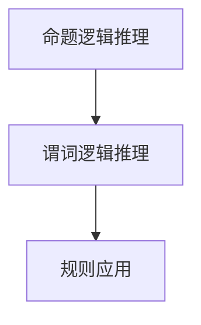
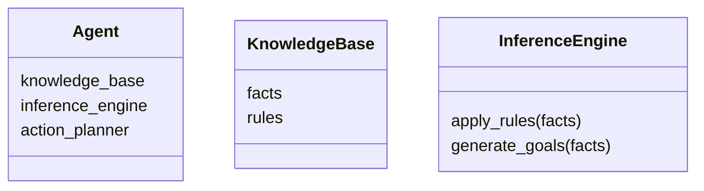

                 


# 提升AI Agent的推理能力：技巧与方法

**关键词**：AI Agent，推理能力，符号推理，概率推理，神经符号推理，系统架构，项目实战

**摘要**：本文详细探讨了提升AI Agent推理能力的关键技巧与方法。从核心概念、算法原理到系统架构设计，再到项目实战，系统性地分析了如何有效提升AI Agent的推理能力。文章结合理论与实践，通过具体案例分析，深入讲解了符号推理、概率推理和神经符号推理等主流算法的实现与优化技巧，并给出了实际应用中的注意事项和未来发展方向。

---

## 第一部分：AI Agent与推理能力概述

### 第1章：AI Agent的基本概念

#### 1.1 AI Agent的定义与分类
AI Agent（人工智能代理）是指能够感知环境、自主决策并执行任务的智能实体。根据功能和应用场景的不同，AI Agent可以分为以下几类：
- **简单反射型Agent**：基于预定义的规则直接响应输入。
- **基于模型的反射型Agent**：通过内部模型理解和推理环境状态。
- **目标驱动型Agent**：根据目标驱动行为，主动规划和执行任务。
- **实用驱动型Agent**：基于效用函数优化决策。

#### 1.2 推理能力的重要性
AI Agent的核心价值在于其推理能力，即通过输入信息生成合理输出的能力。推理能力直接影响AI Agent的智能水平和应用场景的广度。

#### 1.3 当前挑战与机遇
- **挑战**：复杂场景下的推理准确性、实时性与鲁棒性问题。
- **机遇**：多模态数据的融合、大模型的推理能力提升。

---

## 第二部分：推理能力的核心概念与联系

### 第2章：推理能力的核心原理

#### 2.1 推理能力的分类与对比
- **符号推理**：基于逻辑规则进行推理，适用于规则明确的场景。
- **概率推理**：基于概率分布进行推理，适用于不确定性场景。
- **神经推理**：基于深度学习模型进行推理，适用于复杂非结构化数据。

#### 2.2 核心概念对比表
| 推理方法 | 基础原理 | 优缺点 | 适用场景 |
|----------|----------|--------|----------|
| 符号推理 | 逻辑规则 | 精度高，规则明确 | 结构化数据 |
| 概率推理 | 概率分布 | 处理不确定性，但计算复杂 | 非确定性场景 |
| 神经推理 | 神经网络 | 处理复杂模式，但可解释性差 | 多模态数据 |

#### 2.3 ER实体关系图
```mermaid
er
actor(Agent, 推理规则, 知识库, 数据输入, 推理结果)
```

---

## 第三部分：推理能力的算法原理与数学模型

### 第3章：符号逻辑推理算法

#### 3.1 基于命题逻辑的推理
- **基本原理**：通过真值表和逻辑运算符（如与、或、非）进行推理。
- **数学模型**：$$ p \land q \rightarrow r $$
- **Python实现示例**：
  ```python
  def symbolic_inference(rules, fact):
      # rules: list of tuples (antecedent, consequent)
      # fact: list of facts
      inferred_facts = set()
      # 真值表检查
      for rule in rules:
          antecedent = rule[0]
          consequent = rule[1]
          if all(fact.contains(atom) for atom in antecedent):
              inferred_facts.add(consequent)
      return inferred_facts
  ```

#### 3.2 基于谓词逻辑的推理
- **基本原理**：通过谓词和量词（如∀，∃）进行推理。
- **数学模型**：$$ \forall x, P(x) \rightarrow Q(x) $$
- **流程图**：


---

## 第四部分：系统分析与架构设计

### 第4章：AI Agent推理系统的架构

#### 4.1 领域模型设计


#### 4.2 系统架构设计


---

## 第五部分：项目实战与优化

### 第5章：医疗诊断中的推理应用

#### 5.1 环境安装
```bash
pip install python-dotenv
pip install numpy
pip install pandas
```

#### 5.2 核心代码实现
```python
def medical_diagnosis(symptoms, disease_rules):
    # symptoms: list of symptoms
    # disease_rules: list of tuples (disease, symptom_set)
    diagnosed_diseases = []
    for disease, required_symptoms in disease_rules:
        if all(s in symptoms for s in required_symptoms):
            diagnosed_diseases.append(disease)
    return diagnosed_diseases
```

#### 5.3 案例分析
- 输入症状：发热、咳嗽、乏力
- 疾病规则：
  - 流感：发热、咳嗽
  - 疟疾：发热、乏力
  - 结果：诊断为流感和疟疾

---

## 第六部分：总结与展望

### 6.1 提升推理能力的关键点
- **数据质量**：高质量的数据是推理准确性的基础。
- **模型优化**：结合符号推理和概率推理的优势。
- **可解释性**：提升用户信任度。

### 6.2 实际应用中的注意事项
- 避免过拟合，确保模型的泛化能力。
- 定期更新知识库和推理规则。

### 6.3 未来发展方向
- **多模态推理**：结合文本、图像等多种数据源。
- **实时推理**：提升推理速度和响应时间。

---

**作者：AI天才研究院 & 禅与计算机程序设计艺术**

---

通过以上结构，您可以逐步深入理解AI Agent推理能力的提升方法，并在实际项目中应用这些技巧与方法。

