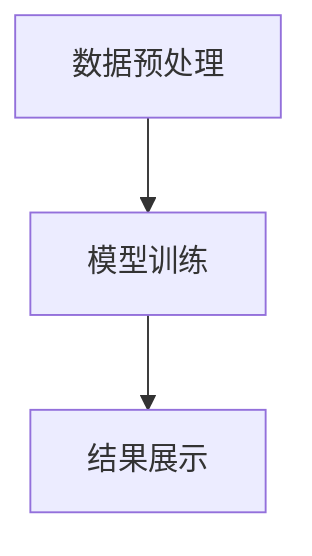

                 


# 收益率曲线分析：预测经济走向的工具

> 关键词：收益率曲线，经济预测，利率分析，时间序列，机器学习

> 摘要：本文详细探讨了收益率曲线在经济预测中的作用，分析了其形成机制，介绍了多种预测方法，并通过实际案例展示了如何利用这些方法进行经济走势预测。文章还提供了系统的架构设计和代码实现，帮助读者全面理解并应用收益率曲线分析。

---

## 第一部分：收益率曲线概述

### 第1章：收益率曲线的基本概念

#### 1.1 利息收益率的定义
收益率曲线是金融市场中的一种重要工具，用于描绘不同期限债券的收益率与到期时间之间的关系。它反映了市场对不同期限债券的定价预期，是研究经济走势的关键指标之一。

#### 1.2 收益率曲线的类型
收益率曲线主要有四种类型：
1. **上升曲线（Ascending Yield Curve）**：长端利率高于短端利率，表明市场预期未来利率将上升。
2. **下降曲线（Descending Yield Curve）**：长端利率低于短端利率，表明市场预期未来利率将下降。
3. **平缓曲线（Flat Yield Curve）**：不同期限的收益率差异不大，表明市场对未来的利率走势预期较为稳定。
4. **倒置曲线（Inverted Yield Curve）**：短期利率高于长期利率，通常被视为经济衰退的信号。

#### 1.3 收益率曲线的重要性
收益率曲线不仅是债券定价的基础，还反映了市场对宏观经济的预期。它可以帮助投资者预测未来的利率变化，从而制定更有效的投资策略。

### 第2章：收益率曲线的形成机制

#### 2.1 债券市场的基本原理
债券的收益率受多种因素影响，包括市场利率、通胀预期、信用风险等。收益率曲线的形成是这些因素综合作用的结果。

#### 2.2 宏观经济因素对收益率曲线的影响
- **利率政策**：中央银行的货币政策直接影响短期利率，进而影响整个收益率曲线的形状。
- **通胀预期**：市场对未来通胀的预期会影响长期债券的收益率。
- **经济增长**：经济前景影响市场对利率的预期，从而影响收益率曲线的走势。

#### 2.3 市场参与者的预期与行为
投资者的预期和行为也会影响收益率曲线的形成。例如，如果市场预期未来利率将上升，投资者可能会选择较长期限的债券，从而推高长期债券的收益率。

---

## 第二部分：收益率曲线的数学模型

### 第3章：收益率曲线的预测方法

#### 3.1 时间序列分析模型
时间序列分析是预测收益率曲线的重要方法。常用模型包括ARIMA（自回归积分滑动平均模型）和GARCH（广义自回归条件异方差模型）。

##### ARIMA模型的结构
ARIMA模型由三个参数组成：p（自回归阶数）、d（差分阶数）、q（移动平均阶数）。其数学表达式为：
$$
ARIMA(p, d, q) = y_t - \theta_1 y_{t-1} - \theta_2 y_{t-2} - \dots - \theta_q y_{t-q} = \epsilon_t + \phi_1 \epsilon_{t-1} + \dots + \phi_p \epsilon_{t-p}
$$

##### GARCH模型的应用
GARCH模型用于捕捉收益率的波动性，其公式为：
$$
\sigma_t^2 = a_0 + a_1 r_{t-1}^2 + a_2 \sigma_{t-1}^2
$$

#### 3.2 机器学习模型
机器学习在预测收益率曲线中也表现出色。常用算法包括支持向量回归（SVR）、随机森林和神经网络。

##### 支持向量回归模型
SVR通过构建支持向量回归器来预测未来的收益率曲线。其核心思想是找到一个超平面，使得预测值与实际值之间的误差最小。

##### 神经网络模型
神经网络可以通过多层感知机（MLP）结构来学习收益率曲线的复杂模式。模型结构通常包括输入层、隐藏层和输出层。

#### 3.3 组合模型的应用
将多种预测方法结合起来，可以提高预测的准确性。例如，结合时间序列模型和机器学习模型，利用各自的优点进行预测。

---

## 第三部分：系统架构与实现

### 第4章：系统架构设计

#### 4.1 系统需求分析
- **问题场景**：预测未来的收益率曲线，辅助投资决策。
- **项目目标**：构建一个基于历史数据和机器学习的预测系统。
- **功能需求**：数据采集、模型训练、预测输出。

#### 4.2 系统架构设计
系统架构包括数据预处理模块、模型训练模块和结果展示模块。数据预处理模块负责清洗和转换数据，模型训练模块使用机器学习算法进行训练，结果展示模块将预测结果以可视化形式呈现。

##### 系统架构图（Mermaid）


#### 4.3 系统实现
- **数据预处理**：使用Python的Pandas库进行数据清洗和特征工程。
- **模型训练**：采用Scikit-learn库中的时间序列模型和机器学习模型。
- **结果展示**：使用Matplotlib或Plotly进行可视化。

---

## 第四部分：项目实战与案例分析

### 第5章：项目实战

#### 5.1 环境安装
- 安装Python、Pandas、Scikit-learn、Matplotlib等库。

#### 5.2 系统核心实现
以下是基于ARIMA模型的收益率曲线预测代码示例：

```python
import pandas as pd
from statsmodels.tsa.arima.model import ARIMA

# 数据加载
data = pd.read_csv('bond_yields.csv')

# 模型训练
model = ARIMA(data['yield'], order=(5, 1, 0))
model_fit = model.fit()

# 预测
forecast = model_fit.forecast(steps=10)
print(forecast)
```

#### 5.3 实际案例分析
以历史数据为例，分析不同经济周期下的收益率曲线变化，验证模型的预测能力。

---

## 第五部分：总结与展望

### 第6章：总结与展望

#### 6.1 本章总结
本文详细探讨了收益率曲线的形成机制、预测方法和系统实现，展示了如何利用这些工具进行经济预测。

#### 6.2 未来展望
未来的研究可以结合更复杂的机器学习模型，如深度学习，进一步提高预测的准确性。此外，实时数据的处理和动态预测也是值得探索的方向。

---

## 作者信息

作者：AI天才研究院（AI Genius Institute） & 禅与计算机程序设计艺术（Zen And The Art of Computer Programming）

---

通过本文，读者可以全面了解收益率曲线的分析方法，并掌握如何利用这些工具进行经济预测。希望本文能为金融从业者和研究人员提供有价值的参考。

